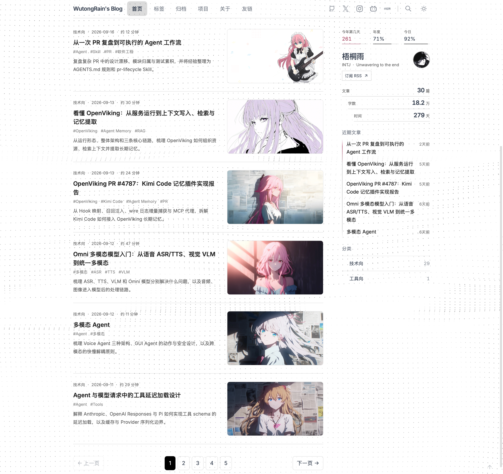
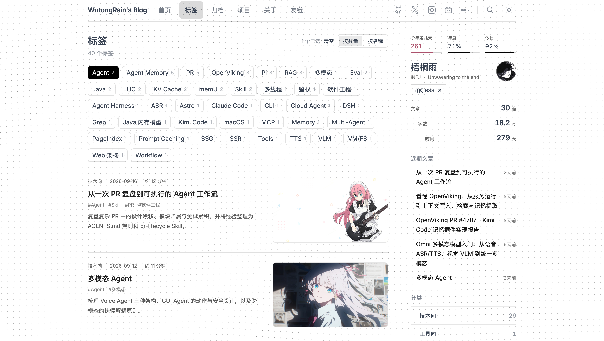
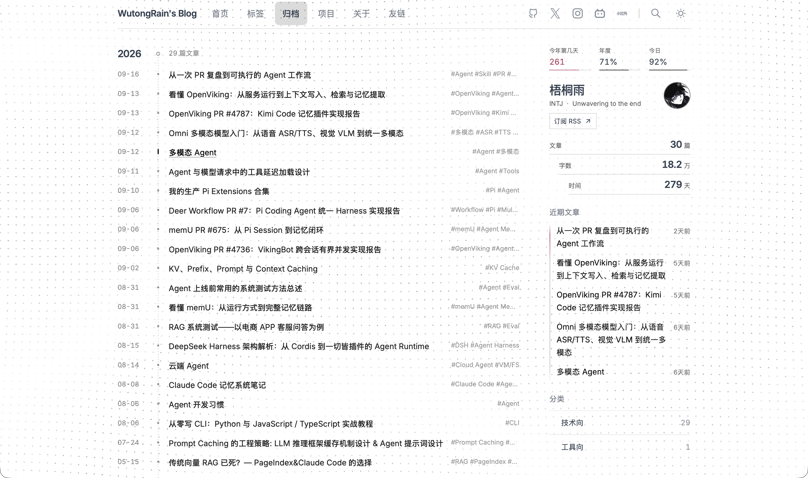
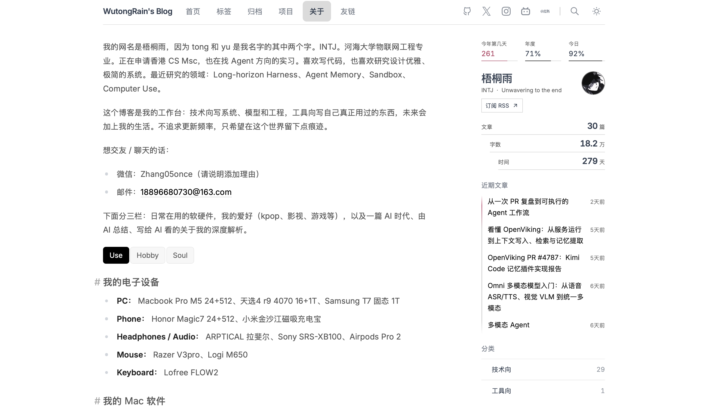
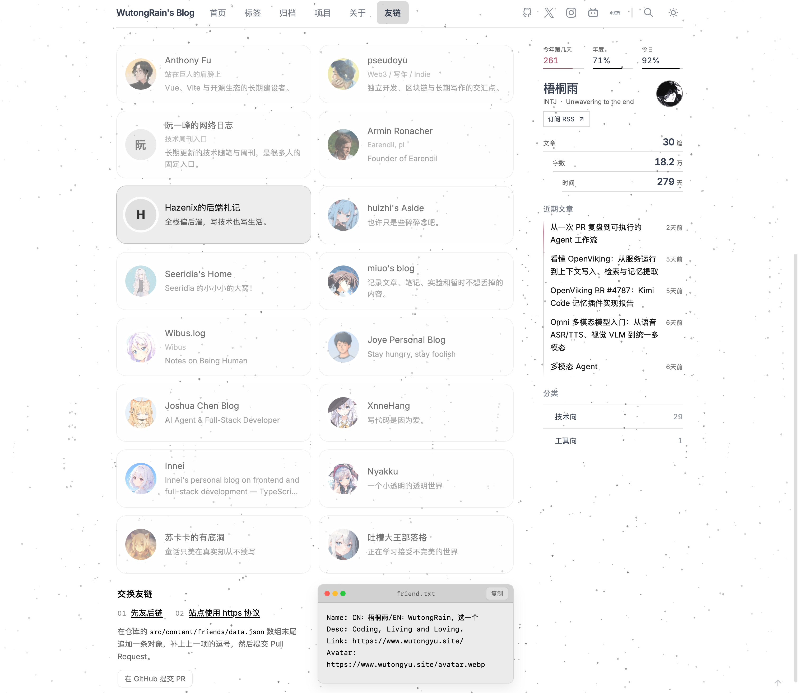

# YuBlog

[English](README_ENG.md) · [项目解析](docs/项目解析.md) · [SEO](docs/Canonical%20URL、Sitemap、RSS.md) · [Astro](docs/Astro.md)

[](https://astro.build)
[](https://www.typescriptlang.org)
[](https://unocss.dev)
[](https://pagefind.app)
[](LICENSE)

*梧桐雨* 的个人站点：Astro 5 静态生成，黑白主题，文章浏览为主。

线上地址：[https://www.wutongyu.site/](https://www.wutongyu.site/)

## 预览

### 首页



### 标签



### 归档



### 关于



### 友链



## 页面

| 路由 | 说明 |
| :--- | :--- |
| `/` | 首页。文章列表（分类、日期、阅读时间、标题、摘要、可选配图），六篇分页。右栏：名片、近期文章、分类。 |
| `/tags/` | 标签页。标签可按数量或名称排序；多选为 AND。未选标签时不显示列表。 |
| `/archives/` | 归档。按年份时间线列出全部文章。 |
| `/projects/` | 项目。按分类网格展示，数据来自 JSON。 |
| `/about/#use` | 关于。顶部介绍 + Use / Hobby / Soul 三个 Markdown 标签。无背景特效。 |
| `/friends/` | 友链。卡片列表 + 申请说明 + `friend.txt` 参考模板。 |
| `/blogs/[slug]/` | 文章详情。右侧 TOC，点击 TOC 可固定。 |
| `/blogs/` | 旧索引，跳转首页并保留查询串。 |
| `/rss.xml` | RSS。 |

顶栏：`WutongRain's Blog`、首页 / 标签 / 归档 / 项目 / 关于 / 友链，右侧 GitHub、X、Instagram、B 站、小红书、搜索、主题。当前页加粗。

首页、标签、归档、项目、关于、友链共用 `BlogIndexLayout` 和右栏。文章详情单独排版。

## 内容

| 路径 | 用途 |
| :--- | :--- |
| `src/content/blogs/**/*.{md,mdx}` | 文章。`title`、`pubDate` 必填；`category` 可选，支持任意非空字符串，未填写时默认为 `技术向`。配图用 `titleImage: /blog-title-images/...`。 |
| `src/content/about/*.md` | 关于页。`intro.md` 是顶部介绍（`tab: false`）；其余文件按 `title`、`order` 成为标签。 |
| `src/content/projects/data.json` | 项目卡片。 |
| `src/content/friends/data.json` | 友链卡片。 |
| `public/blog-title-images/` | 列表与标题块配图 |
| `public/blogs/<名>-img/` | 正文配图 |
| `public/about/<tab>/` | 关于页各栏配图 |
| `src/config.ts` | 站点信息、导航、社交、TOC / 搜索开关。 |

改各页文案和数据，按 `blog-content-publisher-skill/SKILL.md`（按页面分）。架构和 seam 见 `docs/项目解析.md`。

## 技术

- Astro 5 + TypeScript，Markdown / MDX Content Collections
- UnoCSS + `public/shell.css`（导航、右栏、归档、关于标签等，避免 ClientRouter 丢样式）
- Pagefind 只索引博客
- `astro-expressive-code` 代码块
- 明暗主题、ClientRouter 转场
- 背景：`dot` / `rose` / `snow`，按页配置；关于页关闭

## 本地运行

需要 Node.js `18.20.8` / `20.9+` / `22` / `24`，以及 `pnpm@12.4.1`。

```bash
pnpm install
pnpm dev
```

```bash
pnpm check                 # Astro 类型与内容检查
pnpm build                 # 生产构建（含 Pagefind）
pnpm preview
pnpm test:blog-browser     # 分页与 URL
pnpm test:blog-tags        # 标签 AND 筛选
pnpm test:blog-stats       # 名片统计
pnpm test:recent-post-date # 近期文章日期
pnpm test:progress-stats   # 年积日与进度
pnpm test:cjk-emphasis     # CJK 旁强调语法
pnpm lint
pnpm format
```

## 结构

```text
src/
  components/     导航、右栏、列表、归档、关于、友链、TOC
  content/        blogs / about / projects / friends
  layouts/        BaseLayout、BlogIndexLayout、StandardLayout
  pages/          路由
  styles/         正文与 Markdown
  utils/          列表、统计、筛选、路径
public/shell.css  跨页保留的壳层样式
docs/             项目解析（架构）、Astro 语法、SEO 教程
```

## 个人二次开发

欢迎 fork 之后改成自己的站，可以让 AI 阅读下文和文档进行改造。

1. Fork / clone，改 `src/config.ts` 的 `SITE`（网址、标题、描述、作者、语言）和 `UI`（导航文案、社交链接）。
2. 换内容，不要先动布局：
   - 文章：`src/content/blogs/`，正文图 `public/blogs/<名>-img/`，标题图 `public/blog-title-images/`
   - 关于：`src/content/about/`，图 `public/about/<栏>/`
   - 项目 / 友链：对应 `data.json`
3. 换头像：`public/avatar.webp`。友链申请模板里的站名和链接在 `FriendsApplyPanel.astro` 的 `friendInfo`，和 `SITE` 不是同一处。
4. 改版式、顶栏、右栏、归档线：先读 `docs/项目解析.md` 的权威表和 seam。壳层 CSS 只改 `public/shell.css`，不要只写在组件 `<style>` 里。
5. 新索引页要带右栏：套 `BlogIndexLayout`，不要复制侧栏。
6. 改完：`pnpm check`，需要时再 `pnpm build`。

字段契约以 `src/content/schema.ts` 为准。

## Skill 怎么用

仓库里是 `blog-content-publisher-skill/SKILL.md`。

- 放到 Agent 的 skills 目录
- 直接说要改哪一页即可，例如：发博客、改 Use、加友链、改顶栏社交。Agent 应先对表再动文件。
- 它会改 Markdown / JSON / `src/config.ts` 里的站点信息；用户没说发布就保持 `draft: true`；没说部署就不要 push。
- 改结构、CSS、分页算法时不要走这个 skill，用 `docs/项目解析.md`。

MIT
