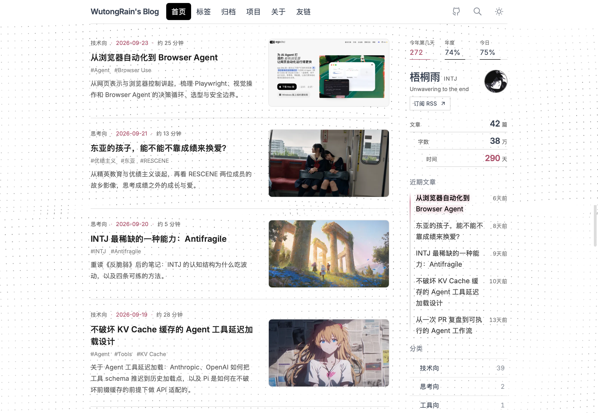
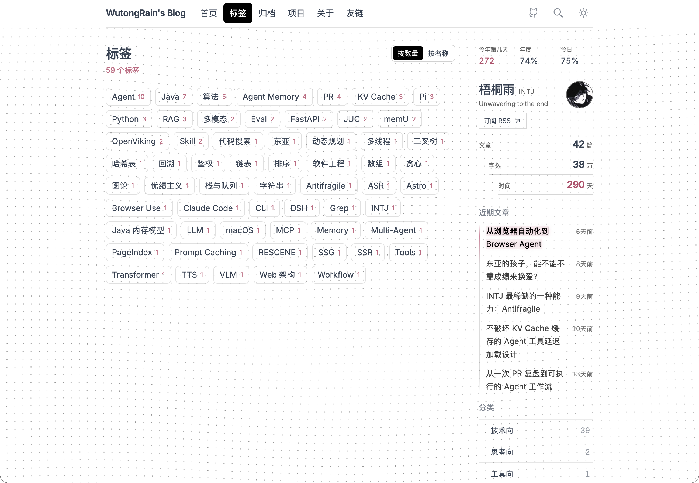
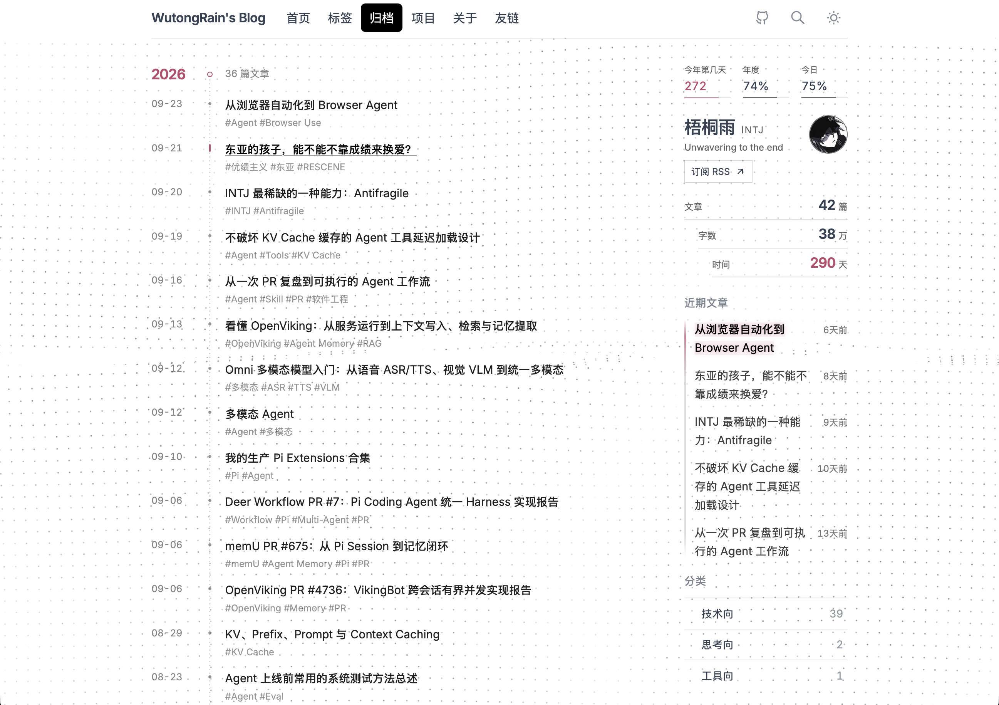
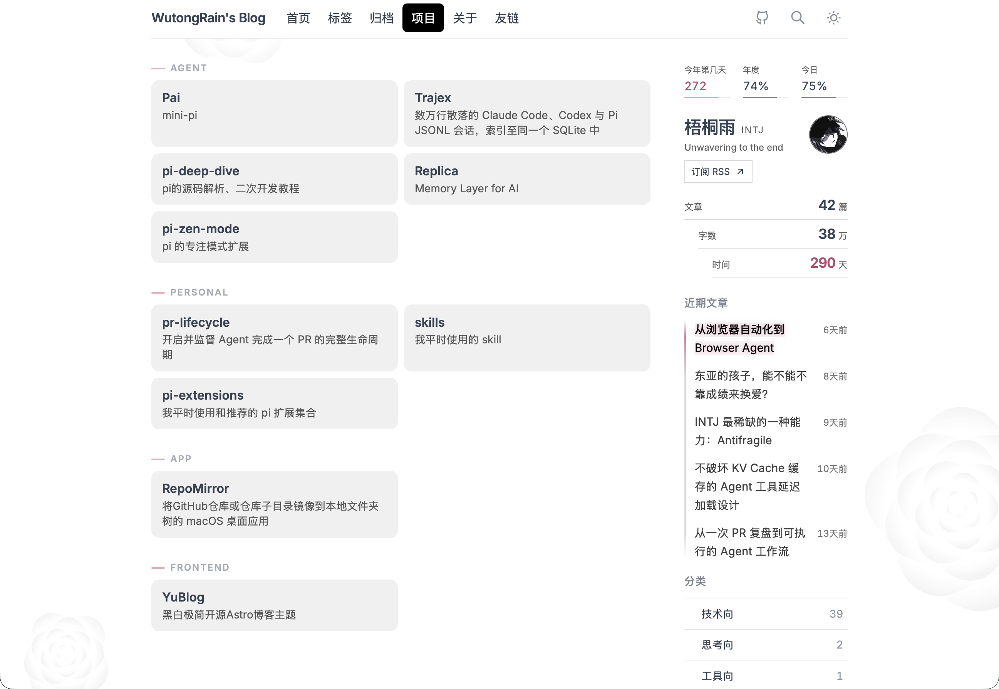
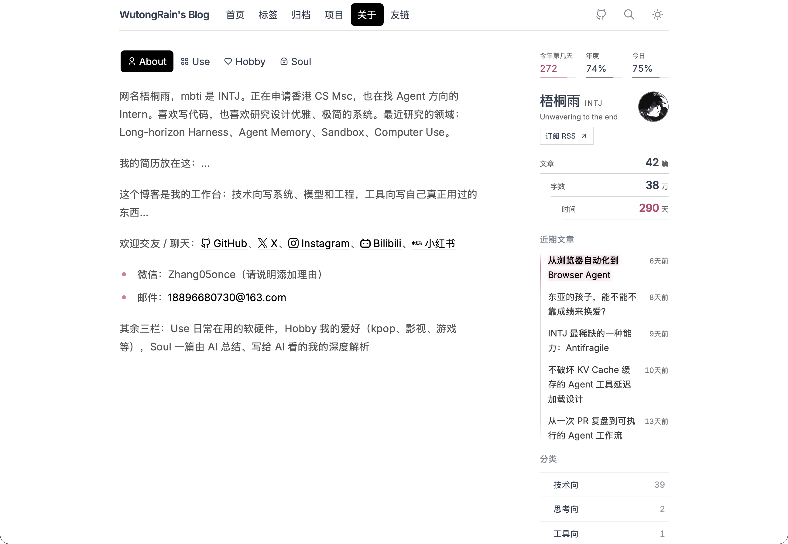

# YuBlog

[中文](README.md) · [Architecture](docs/项目解析.md) · [SEO](docs/Canonical%20URL、Sitemap、RSS.md) · [Astro](docs/Astro.md)

[](https://astro.build)
[](https://www.typescriptlang.org)
[](https://unocss.dev)
[](https://pagefind.app)
[](LICENSE)

*WutongRain*’s personal site: Astro 7, static, black-and-white, built around article browsing, tag classification, unified archiving, project display, personal profile and friend link information.

## Preview

### Home



### Tags



### Archives



### Projects



### About



## Pages

| Route | What it is |
| :--- | :--- |
| `/` | Home. Post list (category, date, reading time, title, summary, optional image), seven per page. Sidebar: profile, recent posts, categories. |
| `/tags/` | Tags. Sort by count or name. Multi-select is AND. No list until a tag is selected. |
| `/archives/` | Archive timeline grouped by year. |
| `/projects/` | Project grid from JSON. |
| `/about/` | About. About / Use / Hobby / Soul tabs, About selected by default. No background effect. |
| `/friends/` | Friend links, apply notes, and a `friend.txt` template. |
| `/blogs/[slug]/` | Post. Click the right TOC button to show or hide the outline. |
| `/rss.xml` | RSS. |

Nav: `WutongRain's Blog`, Home / Tags / Archive / Projects / About / Friends, then the GitHub repo link, search, and theme. The current page is bold. X, Instagram, Bilibili, Xiaohongshu, and the personal GitHub profile are on the About page.

Home, tags, archive, projects, about, and friends share `BlogIndexLayout` and the sidebar. Post pages use a separate layout.

## Content

| Path | Purpose |
| :--- | :--- |
| `src/content/blogs/**/*.{md,mdx}` | Posts. `title`, `pubDate`, and `category` are required; `category` is any non-empty string. Title images use `titleImage: ./_title-images/...`. |
| `src/content/about/*.md` | About. Each file becomes a tab via `title` and `order`; `about.md` is the default first tab. `tab: false` stays out of the tab row. |
| `src/content/projects/data.json` | Project cards. |
| `src/content/friends/data.json` | Friend-link cards. |
| `public/` | 站点级资源：`favicon`、`icon-*.png`、`avatar.webp`、`og/default.png`、`fonts/` |
| `src/content/blogs/_title-images/` | List and title-block images (shared by all posts) |
| `src/content/blogs/<name>-img/` | In-article images, referenced as `./<name>-img/file.png` |
| `src/content/about/<tab>/` | About-tab images |
| `src/config.ts` | Site, nav, navbar GitHub, TOC / search flags. Personal socials are on the default About tab. |

Edit page copy and data with `blog-content-publisher-skill/SKILL.md` (one page at a time). Architecture and seams: `docs/项目解析.md`.

## Stack

- Astro 7 + TypeScript, Markdown / MDX Content Collections (retaining the unified Remark / Rehype plugin pipeline)
- Content images go through Astro's image pipeline: relative paths plus a `|w` width marker, automatic WebP, `srcset`, dimensions and lazy loading; `public/` holds site-level assets only
- Article title font is subset to the glyphs actually used (7.65 MB → 73 KiB)
- Body font Inter and code font DM Mono are local Latin subsets in `public/fonts/`, not Google Fonts
- KaTeX CSS and fonts are bundled locally (no CDN) and shipped as woff2 only
- UnoCSS + `public/shell.css` (nav, sidebar, archive, about tabs, pagination — one owner for chrome styles)
- Pagefind indexes blogs only, and loads only when search is opened
- `astro-expressive-code`
- Light / dark theme, ClientRouter
- Backgrounds `dot` / `rose` / `snow` per page; about turns them off. The dot field batches strokes into 6 alpha buckets and widens spacing on large screens toward about 8000 points (edge padding can exceed that; it is not a hard cap). 1440×900 stays at 15px. Canvas backgrounds respect `prefers-reduced-motion` (shared gate in `src/utils/reduced-motion.js`)

## Run

Node.js `22.12+` (we recommend `24`, as used in CI), and `pnpm@12.6.0`.

```bash
pnpm install
pnpm dev
```

```bash
pnpm check                 # Astro type and content checks
pnpm build                 # production build (includes Pagefind)
pnpm test:built-pagination # check built pagination and the no-JS fallback
pnpm test:built-markdown   # check images, reading metadata, and Markdown plugins in the build
pnpm preview
pnpm test                  # all unit tests
pnpm test:blog-browser     # pagination and URLs
pnpm test:blog-sidebar     # sidebar lock threshold
pnpm test:blog-tags        # tag AND filtering
pnpm test:blog-stats       # profile stats
pnpm test:recent-post-date # recent-post dates
pnpm test:progress-stats   # day-of-year and progress
pnpm test:cjk-emphasis     # emphasis next to CJK punctuation
pnpm test:toc-active       # current-heading picker
pnpm test:css-ownership    # one owner per global selector
pnpm test:canvas-size      # canvas backing store & DPR cap
pnpm test:reduced-motion   # reduced-motion gate
pnpm lint
pnpm format
```

## Layout

```text
src/
  components/     nav, sidebar, lists, archive, about, friends, TOC
  content/        blogs / about / projects / friends
  layouts/        BaseLayout, BlogIndexLayout, StandardLayout
  pages/          routes
  styles/         prose and Markdown
  utils/          lists, stats, filters, paths
public/shell.css  one owner for chrome styles (nav, sidebar, archives, tabs)
docs/             architecture, Astro notes, SEO tutorial
```

## Forking / making it yours

Fork it and turn it into your own site. You can point an AI at this README and the docs.

1. Fork / clone, then edit `SITE` (URL, title, description, author, language) and `UI` (nav labels, navbar GitHub) in `src/config.ts`. Personal socials are in `src/content/about/about.md`.
2. Swap content before touching layout:
   - Posts: `src/content/blogs/`, body images `src/content/blogs/<name>-img/`, title images `src/content/blogs/_title-images/`
   - About: `src/content/about/`, images `src/content/about/<tab>/`
   - Projects / friends: the matching `data.json`

   Content images go through Astro's image pipeline (WebP, `srcset`, dimensions, lazy loading) and are referenced with relative paths — no more `public/` copies. Use the `|w480` alt suffix to cap a body image's width. See `docs/Astro图片管线指南.md` for the contract.
3. Avatar: `public/avatar.webp`. The friends apply template (`friendInfo` in `FriendsApplyPanel.astro`) is not the same as `SITE`.
4. Chrome (nav, sidebar, archive line): read the authority table and seams in `docs/项目解析.md`. Edit `public/shell.css` only — the same selector must not also live in a component `<style>`, which `test/css-ownership.test.mjs` fails on.
5. New index pages that need the sidebar should use `BlogIndexLayout`; do not copy the sidebar.
6. After changes: `pnpm check`, then `pnpm build` if needed.

Field contract: `src/content/schema.ts`.

## Using the content skill

The skill lives at `blog-content-publisher-skill/SKILL.md`.

- Put it in your agent’s skills directory.
- Say which page to change, e.g. new post, edit Use, add a friend link, change the navbar GitHub link, or edit About socials. The agent should match the page table first, then edit files.
- It edits Markdown / JSON / `SITE` and `UI` in `src/config.ts`. Keep `draft: true` unless you asked to publish. Do not push unless you asked to deploy.
- Do not use this skill for structure, CSS, or pagination logic — use `docs/项目解析.md`.

MIT
