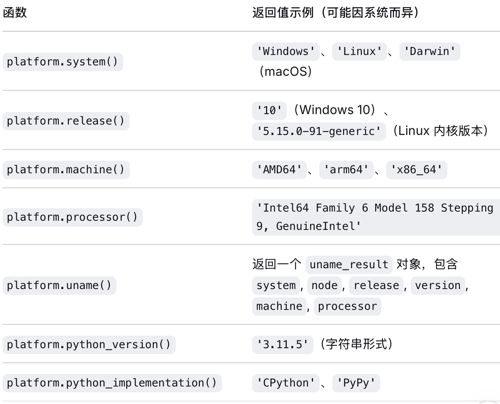
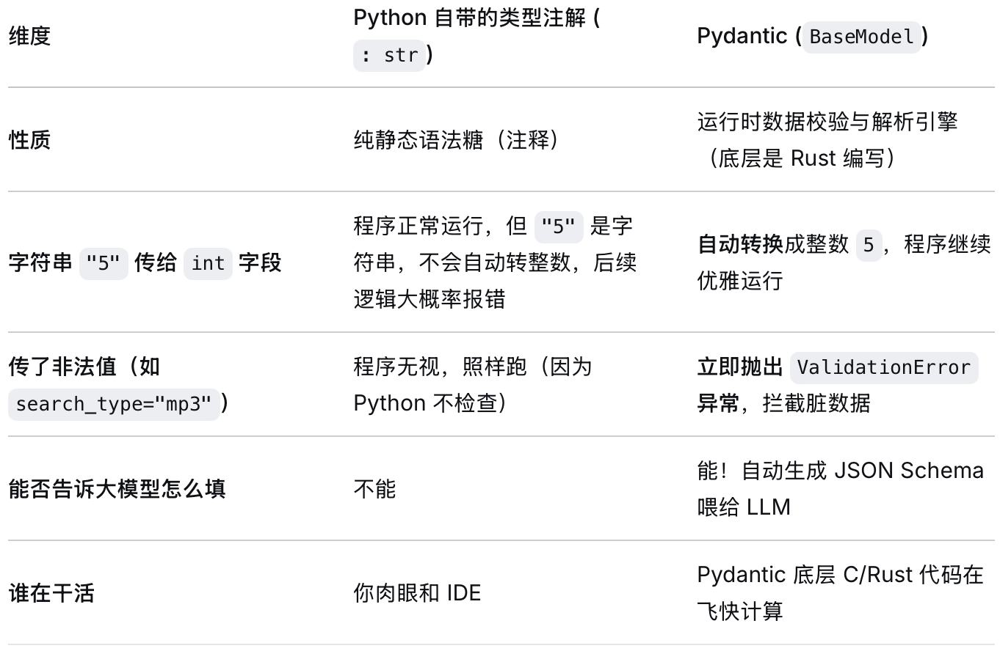
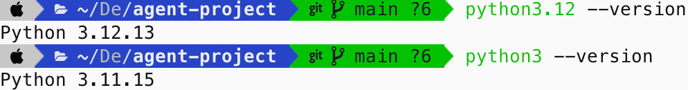
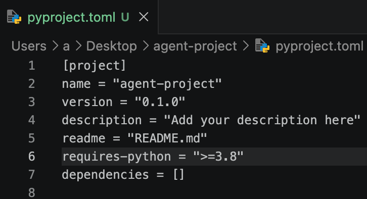

前八章整理语言与常用库，后五章沿着“建环境 → 组织项目 → 检查代码 → 构建发布 → 自动化”的顺序学习 Python 项目开发。示例使用 Python 3；含 `X | None` 的类型标注需要 Python 3.10+。

## 一、Python 的运行方式与语言特点

### 编译、解释与 Python 的运行过程

| 对比维度     | 编译型语言（如 C、C++、Go）          | 解释型语言（如 Python、JavaScript、Ruby） |
| :----------- | :----------------------------------- | :---------------------------------------- |
| **编译时机** | 运行前一次性编译成机器码             | 通常由运行时编译为中间表示并解释执行，也可能使用 JIT                       |
| **产物**     | 独立的可执行文件（.exe、二进制文件） | 源文件或中间表示（取决于实现，需运行时）            |
| **执行方式** | CPU 直接执行机器码                   | 运行时解释执行，或将热点代码编译为机器码                    |
| **跨平台**   | 需要针对不同平台分别编译             | 有兼容运行时且依赖、系统接口可用时，通常可跨平台          |
| **典型命令** | `gcc main.c -o main` → `./main`      | `python main.py`                          |

**以常见的 CPython 为例：源代码先编译成字节码，再由解释器执行。** 导入模块时，字节码可能缓存在 `__pycache__/*.pyc`；直接运行脚本并不意味着一定生成对应的 `.pyc` 文件。Java 则通常先由 `javac` 生成 `.class` 字节码，再由 JVM 解释或 JIT 编译执行。因此，“编译型/解释型”描述的是常见实现方式，不能把语言分成完全互斥的两类。

### 动态类型与 Java 对比

| 语言         | 本质                        | 类比                             |
| :----------- | :-------------------------- | :------------------------------- |
| **Java / C** | 变量有声明类型，赋值需符合类型规则 | “带类型的盒子”；Java 引用变量保存的是引用 |
| **Python**   | 名字 = **贴在对象上的标签** | 标签可以随时撕下来贴到别的对象上 |

| 维度           | Java                   | Python                     |
| :------------- | :--------------------- | :------------------------- |
| **类型检查**   | 编译期静态检查         | 运行时动态检查             |
| **IDE 支持**   | 静态类型信息较完整       | 类型注解能改善提示，动态行为仍难推断       |
| **重构安全**   | 编译器可发现许多类型与签名问题       | 需要类型检查、测试和 IDE 共同保障 |
| **运行时错误** | 部分类型错误可在编译期发现 | 未被静态检查或测试覆盖的问题可能在运行时暴露   |

**例子**：

```python
# Python：此未标注示例在运行时抛出类型错误；补充类型标注后可提前静态检查
def add(a, b):
    return a + b

result = add(1, "2")  # 运行时才会报错 TypeError!
```

```java
// Java：编译时就报错
static int add(int a, int b) { return a + b; }
int result = add(1, "2");  // 编译错误: 类型不匹配
```

### 大型项目中的工具与约束

| 维度         | Java                 | Python                 |
| :----------- | :------------------- | :--------------------- |
| **包管理**   | Maven/Gradle（成熟） | pip、uv、Poetry 等，职责与工作流需选定 |
| **依赖冲突** | 有版本锁定机制       | uv/Poetry 可锁定依赖；不锁定时更易发生漂移       |
| **重构工具** | IDE 强支撑           | 依赖类型标注与项目配置                 |
| **代码导航** | 跳转精准             | 动态调用可能影响静态导航   |
| **性能分析** | 成熟工具多           | 有 cProfile、tracemalloc 等工具                 |

## 二、为什么说 Python 又慢又快

### "慢"：GIL 的局限

常见的、启用 GIL 的 **CPython** 构建有 **GIL（全局解释器锁）**。下面的线程结论以这种构建为前提；Python 3.13 起另有可选的自由线程构建，扩展兼容性也会影响 GIL 是否启用，不能把限制推广到所有 Python 实现。参见 [Python 自由线程说明](https://docs.python.org/3/howto/free-threading-python.html)。

纯 Python 计算较慢还与解释执行、动态类型和对象操作成本有关；GIL 主要限制同一解释器中多个线程同时执行 Python 代码。

在这一前提下，同一个解释器内**同一时刻只能有一个线程执行 Python 字节码**。这意味着：**Python 的多线程，针对 CPU 密集型计算（纯 Python 代码），在多核上无法并行加速**。

但针对 I/O 密集型任务，多线程依然有效（虽然一次只有一个线程在跑 Python 代码，但可以让一个线程在等 I/O 时，另一个线程去执行）。

不过要注意，一些用 C 扩展写的底层库（比如 NumPy）可以在内部释放 GIL，实现真正的多核加速。

### "快"：异步 I/O

当任务是 I/O 密集型的时候（比如网络请求、数据库查询、文件读写等），性能瓶颈不是 CPU 计算，而是**等待外部响应**。一个请求发出后，当前任务可能主要在等待数据，CPU 可以用来推进其他任务。

#### 传统的做法：多线程

每个请求用一个线程，线程在等待 I/O 时虽然会被操作系统挂起，但线程的创建、切换、销毁都有不小的开销，成千上万个连接时性能会下降。

#### Python 的 asyncio：async / await

Python 的 `asyncio` 采用**单线程 + 事件循环**模型：

- 一个线程不断循环，执行就绪的任务
- 当任务遇到 I/O 操作（比如 `await asyncio.sleep(1)` 或等待 aiohttp 的响应体），若操作尚未完成，它会挂起并把控制权交回事件循环；已完成的 awaitable 不一定让出执行权
- 事件循环立刻把 CPU 交给其他就绪的任务

这样，**一个线程就能处理成千上万个并发的 I/O 任务**，把等待的碎片时间充分利用起来，几乎没有线程切换的开销。

示例：

```python
import asyncio
import time

async def io_task(name, delay):
    """模拟 I/O 操作（如网络请求、文件读取）"""
    print(f"[{time.strftime('%X')}] {name} 开始，将等待 {delay} 秒")
    await asyncio.sleep(delay)  # 模拟等待，主动让出控制权给事件循环
    print(f"[{time.strftime('%X')}] {name} 完成")
    return name

async def main():
    # 创建三个独立任务，它们将并发运行
    tasks = [
        io_task("任务A", 2),
        io_task("任务B", 1),
        io_task("任务C", 3)
    ]
    start = time.time()
    results = await asyncio.gather(*tasks)  # 收集所有任务的结果
    print(f"总耗时 {time.time()-start:.2f} 秒，结果：{results}")

# 启动事件循环，运行主协程
asyncio.run(main())
```

- **`asyncio.run`** = **启动** 异步世界
- **`asyncio.gather`** = 在事件循环中 **并发推进** 多个任务

**运行输出示例：**

```
[14:30:01] 任务A 开始，将等待 2 秒
[14:30:01] 任务B 开始，将等待 1 秒
[14:30:01] 任务C 开始，将等待 3 秒
[14:30:02] 任务B 完成
[14:30:03] 任务A 完成
[14:30:04] 任务C 完成
总耗时 3.00 秒，结果：['任务A', '任务B', '任务C']
```

1. **单线程事件循环**：`asyncio.run(main())` 启动后，事件循环在调用线程中持续运行。
2. **任务并发**：三个 `io_task` 几乎同时被调度，因为每个任务在执行 `await asyncio.sleep()`时都会立即让出 CPU。
3. **让出控制权**：这里 `await asyncio.sleep()` 会触发任务挂起，事件循环立刻切换到下一个就绪任务。
4. **耗时分析**：总耗时约为最慢任务的时间（3秒），而非三个任务耗时之和（6秒），充分体现了异步 I/O 的并发能力。

> Java 长期以来处理大量并发 I/O 任务的方案是 **非阻塞 NIO + 回调** 或 **响应式框架**（如 Netty）。这些方式虽然高效，但代码编写复杂，可读性差。
>
> **Java 19** 预览、**Java 21** 正式引入了 **虚拟线程（Virtual Threads）**（[JEP 444](https://openjdk.org/jeps/444)）。N 个虚拟线程运行在 M 个载体线程上（M 远小于 N），且多个虚拟线程可以真正同时执行，不受 CPython 的 GIL 限制——条件是它们运行在不同的载体线程上。
>
> - **虚拟线程**：一种轻量级的用户态线程，创建和切换成本极低，能轻松创建百万级别
> - 遇到 I/O 阻塞时，虚拟线程会自动让出，平台线程去执行其他虚拟线程
> - 开发体验上，可以用传统的同步风格写代码，底层自动用非阻塞方式调度

#### aiohttp

`aiohttp` **完全依赖** `asyncio` 提供的**事件循环（Event Loop）**和**协程调度（Coroutine Scheduling）**来管理网络 I/O 的并发。`aiohttp` 本身不负责“何时切换任务”，它负责 HTTP 协议处理与连接管理。真正的“等待网络响应时切出去干别的”这个能力，是 `asyncio` 提供的。

```py
import asyncio
import aiohttp

async def fetch_http():
    # aiohttp 利用 asyncio 的传输层（Transport）建立 TCP 连接
    async with aiohttp.ClientSession() as session:
        # 这一行 await 触发了 asyncio 的事件循环
        # 当网络数据包没回来时，asyncio 会让 CPU 去执行别的 Task
        async with session.get('https://httpbin.org/get') as resp:
            # 读取响应体（也是 I/O 操作，同样由 asyncio 调度）
            return await resp.text()

async def main():
    # 依然是用 asyncio 的 gather 并发调度 3 个 HTTP 请求
    results = await asyncio.gather(fetch_http(), fetch_http(), fetch_http())
    print(len(results))

asyncio.run(main())
```

> `asyncio` 提供事件循环、任务调度以及网络传输等能力；`aiohttp` 在其上实现 HTTP 客户端/服务端、连接池、Cookie、解压等功能。这里的示例使用 HTTP/1.1，不能把 aiohttp 描述为通用的 HTTP/2 实现，也不应把全部网络操作限定为直接调用 `loop.sock_recv()`。参见 [aiohttp 官方文档](https://docs.aiohttp.org/en/stable/)。

这里的“快”主要指重叠 I/O 等待后提高吞吐量；异步不会直接加速纯 Python 的 CPU 计算。普通文件读写仍可能阻塞事件循环，应使用合适的线程封装或异步库。下一章讨论如何选择线程、协程和进程。

## 三、并发与并行：线程、协程和进程

### 底层线程模型与选择

并发是多个任务在时间上交错推进，并行是多个任务在同一时刻执行。下表仍以启用 GIL 的 CPython 为前提，Java 两行指 Java 代码的执行能力。

| 语言/技术         | 线程模型                 | GIL  | 能否并行执行该语言的计算代码 |
| :---------------- | :----------------------- | :--- | :----------------------- |
| Python threading  | 1:1 内核线程             | 有   | 纯 Python 字节码不能；释放 GIL 的扩展可并行    |
| Python asyncio    | M:1（用户态任务→单线程） | 有   | ❌ 不能（单线程）         |
| Java 传统线程     | 1:1 内核线程             | 无   | ✅ 能                     |
| Java 21+ 虚拟线程 | M:N（虚拟线程→内核线程） | 无   | ✅ 能（且海量并发）       |

### I/O 密集任务：线程或协程

#### 多线程（`threading` / `ThreadPoolExecutor`）

- **调度方**：操作系统
- **原理**：线程执行 I/O 时释放 GIL → OS 可以挂起该线程，运行另一个就绪线程 → 实现 **并发**（不是并行，但 I/O 重叠）
- **适用场景**：
  - 少量到中等数量的连接（几十～几百）
  - 使用了阻塞式 I/O 库（如 `requests`、`psycopg2`）
- **代码风格**：同步，易写

```python
from concurrent.futures import ThreadPoolExecutor
import requests

def io_task(url):
    with requests.get(url, timeout=10) as response:
        return response.status_code

urls = ["https://example.com", "https://httpbin.org/get"]

with ThreadPoolExecutor(max_workers=5) as executor:
    results = list(executor.map(io_task, urls))
    print(results)
```

#### 协程与 `asyncio`

- **调度方**：事件循环 Event Loop（单线程）

- **原理**：协程通过 `await` 主动让出控制权 → 事件循环切换协程 → 协作式多任务

- **适用场景**：

  - 海量连接（成千上万）
  - 需要细粒度控制（如超时、取消、组合并发原语）
  - 库必须支持异步（如 `aiohttp`、`asyncpg`）

- **代码风格**：`async`/`await`，需要适应

- **注意**：`asyncio` 就是基于协程构建的 M:1 模型

> **协程（Coroutine）**：是一种比线程更轻量的并发执行单元，可以在运行时主动挂起和恢复，常用于处理 I/O 密集型任务。

### CPU 密集任务：多进程

`multiprocessing` 是 Python 标准库中的一个模块，用于创建和管理 **多个进程**，从而实现真正的并行计算。

- **原理**：创建独立进程，每个进程有自己的 Python 解释器和 GIL → 真正利用多核并行
- **调度方**：操作系统
- **适用场景**：数值计算、图像处理、模型训练
- **开销**：较大（内存复制、IPC 序列化）

```python
from multiprocessing import Process
import os

def task(name):
    print(f"进程 {name} 的 PID: {os.getpid()}")

if __name__ == "__main__":   # 多进程入口保护，跨平台使用时应保留
    p1 = Process(target=task, args=("A",))
    p2 = Process(target=task, args=("B",))
    p1.start()
    p2.start()
    p1.join()
    p2.join()
```

### 协程与任务调度

以下以 `io_work()`、`task_a()` 和 `task_b()` 代表协程函数；完整的 `io_work()` 与进程池组合见下一节。

`async` 关键字的**作用**：将一个普通函数声明为**协程函数**。调用协程函数不会立即执行，而是返回一个**协程对象**，需要由事件循环调度运行。

- `async def io_work():` → `io_work` 是一个协程函数，用于模拟 I/O 操作。
- `async def main():` → `main` 是程序的入口协程，负责编排任务。

`await` 关键字的**作用**：等待一个**可等待对象**（如协程、`asyncio.Task`、`asyncio.Future`）完成，在需要等待时**挂起当前协程**，让事件循环执行其他任务。只有当等待的对象完成后，当前协程才会恢复执行。

- `await asyncio.sleep(0.1)` → 挂起 `io_work` 协程 0.1 秒，期间事件循环可以运行其他就绪任务；CPU 工作由独立进程执行。
- `await asyncio.gather(...)` → 挂起 `main` 协程，等待 `gather` 中所有任务（包括 CPU 任务和 100 个 I/O 任务）全部完成，再继续执行后续代码。

- `await loop.run_in_executor(...)` → 等待进程池中 `cpu_heavy` 的执行结果（`run_in_executor` 返回一个 `asyncio.Future`）。

`asyncio.run()` 是**异步程序的入口点**。它会：

1. 创建新的事件循环。
2. 将传入的协程（如 `main()`）作为主任务运行。
3. 阻塞直到主协程完成。
4. 关闭事件循环并清理资源。

**事件循环**（Event Loop）是异步调度的核心：
它负责运行所有协程/任务，当某个协程/任务因 `await` 挂起时（比如 `io_work`），循环会切换到其他就绪的协程/任务（比如其他 I/O 任务；提交给 executor 的函数则在线程或进程中执行）。

但是要注意：**直接 `await` 一个协程，会在当前任务中等待它完成，不会自动创建一个独立任务。要让多个独立操作并发推进，可用 `gather` 或 `create_task` 先安排它们运行。先创建两个任务、再逐个 `await`，仍然可以并发。**

> `asyncio.gather()` 会把传入的协程**自动包装成任务**，并告诉事件循环：“请并发执行这些任务，等它们都完成后告诉我”。

* 按顺序执行：

  ```python
  async def main():
      await task_a()   # 先执行完 task_a 的所有循环
      await task_b()   # 等 task_a 彻底结束后才执行 task_b
  ```

* 可并发执行：

  ```python
  async def main():
      t1 = asyncio.create_task(task_a())
      t2 = asyncio.create_task(task_b())
      await t1
      await t2   # 或者 await asyncio.gather(t1, t2)
  
  async def main():
      await asyncio.gather(task_a(), task_b())
  ```

### 混合任务：少量 CPU 计算与大量 I/O

- `asyncio` 的事件循环提供了 **`loop.run_in_executor(executor, func, *args)`** 方法，它会把 `func`提交给一个 `concurrent.futures.Executor`（线程池或进程池）执行，并返回一个 **awaitable** 对象。
- 事件循环在等待这个 future 完成时，**会正常处理其他 I/O 协程**，因为 CPU 工作被移出了事件循环所在的线程。
- **默认 executor 是线程池**（`ThreadPoolExecutor`）。对于 CPU 密集型任务，应该显式传入 `ProcessPoolExecutor` 以绕过 GIL。

```python
import asyncio
from concurrent.futures import ProcessPoolExecutor

def cpu_heavy(n: int) -> int:
    # 模拟 CPU 密集型计算，例如大量数学运算
    total = 0
    for i in range(n):
        total += i ** 2
    return total

async def io_work():
    # 模拟大量 I/O 操作，比如网络请求、数据库查询
    await asyncio.sleep(0.1)
    return "io result"

async def main():
    # 创建进程池（建议复用，不要每次都创建）
    with ProcessPoolExecutor(max_workers=2) as pool:
        loop = asyncio.get_running_loop()

        # 同时启动 I/O 任务和 CPU 任务
        io_tasks = [io_work() for _ in range(100)]
        cpu_task = loop.run_in_executor(pool, cpu_heavy, 10_000_000)

        # 并发执行：I/O 任务会正常交错进行，不会因为 CPU 任务而阻塞
        results = await asyncio.gather(cpu_task, *io_tasks)

        cpu_result = results[0]
        print(f"CPU 结果: {cpu_result}")

if __name__ == "__main__":
    asyncio.run(main())
```

## 四、基本语法、函数与类

### 数据类型与类型转换

```python
v = "7"
int(v)      # 7
float(v)    # 7.0
bool(v)     # True：非空字符串为真，bool("False") 也为 True
str(v)      # "7"
temperature: str = str(7.5)
```

### 字符串与 f-string

> Python f-string 语法：直接在字符串前加f，用{}嵌入变量
>
> ```python
> value = 42
> print(f"{value} is in the set")
> ```
>
> Java 的写法：
>
> ```java
> int value = 42;
> System.out.printf("%d is in the set%n", value);
> ```

字符串的常用方法与 `join` 见第五章“字符串”。

### 条件分支：if、elif、else

```python
score = 70
if score >= 80:
    print("big")
elif score > 65:
    print("mid")
else:
    print("small")
```

### 循环遍历与 enumerate

```python
for num in [1, 2, 3, 4, 5]:
    print(num)
for i in range(3):
    print(i)
```

> `sum` 是内置函数，下面用自定义函数演示累加过程（不必在项目中覆盖内置 `sum`）：
>
> ```python
> def sum_example(iterable, start=0):
>       result = start
>       for element in iterable:
>           result += element
>       return result
> ```

`enumerate` 是 Python 的**内置函数**，用于在遍历可迭代对象（如列表、字符串等）时，**同时获取元素的索引和值**。它返回一个枚举对象（迭代器），每次产生一个 `(索引, 元素)` 的元组。

```python
fruits = ["apple", "banana", "cherry"]

for i, fruit in enumerate(fruits):
    print(i, fruit)
# 输出:
# 0 apple
# 1 banana
# 2 cherry
```

### 逻辑运算符

```python
x > 2 and y == 1
x > 3 or y < 5
not(x > 10 and y > 5)
```

### 异常处理：try、except、finally

```python
try:
    print(sum([1,2,3]))
except TypeError:
    print("Error")
finally:
    print("Done")
```

### 函数 Function

```python
def calculate_minutes(seconds: int) -> float:
    minutes: float = seconds / 60
    return minutes
```

#### lambda 表达式

```python
add_two = lambda x:  x+2
add_two(5)
```

#### `*` 和 `**` 的打包与解包

1、打包（Packing）— 用在函数**定义**时

把传入的参数收集到一个容器里：

```python
# *args：把多余的位置参数 → 打包成元组
def foo(*args):
    print(type(args), args)

foo(1, 2, 3)        # <class 'tuple'> (1, 2, 3)
foo("a", "b")       # <class 'tuple'> ('a', 'b')

# **kwargs：把多余的关键字参数 → 打包成字典
def bar(**kwargs):
    print(type(kwargs), kwargs)

bar(x=1, y=2)       # <class 'dict'> {'x': 1, 'y': 2}
bar(name="Tom")     # <class 'dict'> {'name': 'Tom'}
```

2、解包（Unpacking）— 用在函数**调用**时

把容器里的东西展开成独立的参数：

```python
# *元组 → 展开成位置参数
def add(a, b, c):
    return a + b + c

nums = (1, 2, 3)
add(*nums)           # 等同于 add(1, 2, 3) → 6

# **字典 → 展开成关键字参数
def greet(name, age):
    print(f"{name}, {age}岁")

info = {"name": "小明", "age": 20}
greet(**info)        # 等同于 greet(name="小明", age=20)
```

**定义函数时是“打包”，调用函数时是“解包”。**

速记表

|                                   | `*args`     | `**kwargs`  |
| --------------------------------- | ----------- | ----------- |
| **定义** `def f(*args, **kwargs)` | 打包 → 元组 | 打包 → 字典 |
| **调用** `f(*args, **kwargs)`     | 解包 ← 元组 | 解包 ← 字典 |

#### 装饰器

**装饰器利用「Python 中函数是一等公民」的特性，通过「接收一个函数、包装它、返回一个新函数」的机制，在不修改原函数代码的情况下为它增加额外行为。`@decorator` 语法糖本质上就是 `func = decorator(func)` 的简写。**

```python
# 1. 定义装饰器函数
def my_decorator(func):
    def wrapper():
        print("在原函数之前做点事")
        func()
        print("在原函数之后做点事")
    return wrapper

# 2. 定义原函数
def greet():
    print("你好")

# 3. 手动应用装饰器（这就是 @ 语法糖做的事）
greet = my_decorator(greet)

# 4. 调用
greet()
```

```
在原函数之前做点事
你好
在原函数之后做点事
```

原函数有参数时，`wrapper` 也要接收参数：

```python
from functools import wraps

def log_decorator(func):
    @wraps(func)  # 保留原函数的名称、文档等元信息
    def wrapper(*args, **kwargs):   # 接收任意参数
        print(f"调用 {func.__name__}，参数：{args}, {kwargs}")
        result = func(*args, **kwargs)
        print(f"返回值：{result}")
        return result
    return wrapper

@log_decorator
def add(a, b):
    return a + b

add(3, 5)
```

输出：

```
调用 add，参数：(3, 5), {}
返回值：8
```

装饰器不一定非要用函数，类也能做，只要实现了 `__call__` 方法。这里先保留完整例子，类与特殊方法将在下一节解释：

```python
class CountCalls:
    def __init__(self, func):
        self.func = func
        self.count = 0

    def __call__(self, *args, **kwargs):
        self.count += 1
        print(f"第 {self.count} 次调用")
        return self.func(*args, **kwargs)

@CountCalls
def hello():
    print("Hello")

hello()
hello()
```

```
第 1 次调用
Hello
第 2 次调用
Hello
```

### 类 Class

```python
class MyExampleClass:
    static_field = "static field"
    _static_field = "protected static field"
    __static_field = "private static field"

    def __init__(self, name):
        self.public_field = MyExampleClass.static_field + name
        self.protected_field = MyExampleClass._static_field
        self.__private_field = MyExampleClass.__static_field

    def public_method(self):
        return
    def _protected_method(self):
        return
    def __private_method(self):
        return

    @staticmethod
    def public_static_method(x: int, y: int) -> int:
        return x + y

if __name__ == "__main__":
    obj = MyExampleClass("hi")
    MyExampleClass.public_static_method(1,2)
```

#### 各字段的访问规则

| 字段             | 约定含义                   | 是否语法强制       | 在类内部访问 | 在类外部访问                   | 子类中访问                     |
| :--------------- | :------------------------- | ------------------ | :----------- | :----------------------------- | :----------------------------- |
| `static_field`   | 公开                       | ❌ 不强制           | ✅ 可以       | ✅ 可以                         | ✅ 可以                         |
| `_static_field`  | 受保护（提示不要外部使用） | ❌ 不强制，只是提示 | ✅ 可以       | ✅ 可以（但违反正统）           | ✅ 可以                         |
| `__static_field` | 私有（名称修饰）           | ✅ 语法会改变名称   | ✅ 可以       | ❌ 不可以（除非用修饰后的名字） | ❌ 不可以（除非用修饰后的名字） |

`__static_field` 这种**以双下划线开头、不以双下划线结尾**的命名，会触发 Python 的**名称修饰（name mangling）**机制。实际上，Python 在编译时把 `__static_field` 改名成了 `_MyExampleClass__static_field`。

#### 内置函数-特殊方法

内置函数是“门面”，特殊方法是“幕后”。当你调用 len()、str()、iter() 等内置函数时，Python 会自动去调用对象对应的 __len__、__str__、__iter__ 等特殊方法来完成实际操作。这种设计让你可以为自定义类赋予与内置类型相同的行为方式，从而实现统一的 Python 语言协议。

例如**容器协议**：

- 实现 `__len__` → 可以被 `len()` 调用
- 实现 `__getitem__` → 支持索引访问 `obj[key]` 和迭代

**可调用对象协议**：

- 实现 `__call__` → 对象可以像函数一样被调用 `obj()`

**数值协议**：

- 实现 `__add__`、`__sub__` 等 → 支持 `+`、`-` 等运算符

```python
class MyList:
    def __init__(self, items):
        self._items = items

    def __len__(self):
        print("调用了 __len__")
        return len(self._items)

    def __str__(self):
        print("调用了 __str__")
        return f"MyList({self._items})"

    def __getitem__(self, index):
        return self._items[index]

ml = MyList([1, 2, 3, 4, 5])

# 内置函数 len() 触发 __len__
print(len(ml))          # 输出：调用了 __len__ \n 5

# 内置函数 str() 触发 __str__
print(str(ml))          # 输出：调用了 __str__ \n MyList([1, 2, 3, 4, 5])

# 内置函数 print() 也会触发 __str__
print(ml)               # 同上

# 内置函数 iter() 触发 __iter__（这里没有定义，但 __getitem__ 可作为回退）
for item in ml:
    print(item, end=' ')  # 输出：1 2 3 4 5
```

`enumerate` 本质上只要求它的参数是一个**可迭代对象**（iterable）。可迭代对象可以通过以下两种方式之一实现：

- 实现 `__iter__()` 方法，返回一个迭代器；
- 或者实现 `__getitem__()` 方法，支持按整数索引取值（序列协议）。

#### 类的方法类型

Python 类中有**三种方法类型**：实例方法、类方法、静态方法。它们的区别在于**第一个参数是什么**以及**如何被调用**。

| 方法类型     | 第一个参数 | 装饰器          | 能访问什么                 | 如何调用                           |
| :----------- | :--------- | :-------------- | :------------------------- | :--------------------------------- |
| **实例方法** | `self`     | 无              | 实例属性、类属性、其他方法 | 必须通过实例调用，或通过类传入实例 |
| **类方法**   | `cls`      | `@classmethod`  | 类属性、其他类方法         | 可通过类或实例调用                 |
| **静态方法** | 无         | `@staticmethod` | 不自动接收 self/cls；可显式访问类与其他对象     | 可通过类或实例调用                 |

#### 数据类：`@dataclass`

`@dataclass` 是 Python 3.7+ 引入的一个装饰器（位于 `dataclasses` 模块中），用于**自动生成类中常见的特殊方法**，从而简化用来存储数据的类的编写。

没有 `@dataclass` 的时候

你需要手动写很多样板代码：

```python
class Point:
    def __init__(self, x: int, y: int):
        self.x = x
        self.y = y

    def __repr__(self):
        return f"Point(x={self.x}, y={self.y})"

    def __eq__(self, other):
        if not isinstance(other, Point):
            return False
        return self.x == other.x and self.y == other.y
```

使用 `@dataclass` 后：

```python
from dataclasses import dataclass

@dataclass
class Point:
    x: int
    y: int
```

就这一小段代码，Python 会自动为你生成：

- `__init__`（初始化方法）
- `__repr__`（可读的字符串表示）
- `__eq__`（相等比较）
- 可选地还可以自动生成 `__lt__`、`__le__`、`__gt__`、`__ge__`（通过 `order=True` 参数）

> field() 也是 dataclasses 包内的函数，可以给字段设置默认值、默认工厂、是否参与 __init__ 等额外配置。
>
> 对于可变默认值（如 list、dict），不能直接使用 `= []` 因为 dataclass 会拒绝这类默认值；应使用工厂为各实例创建独立对象。`default_factory` 是一个可调用对象（如 list、lambda），每次创建实例时调用它生成新的默认值。
>
> ```python
> tool_calls: list[ToolCall] = field(default_factory=list)
> ```
>
> 如果直接写：
>
> ```python
> tool_calls: list[ToolCall] = []   # dataclass 定义时会报 ValueError
> ```
>
> dataclass 会拒绝这个列表默认值，而不是让实例共享它。普通函数的可变默认参数、普通类的类属性、Pydantic 模型有不同规则，不能混为一谈。`field`、`frozen`、`order` 等选项见第七章 `dataclasses`。

#### 类方法：`@classmethod`

**`@classmethod`**：用于**定义类方法**，该方法的第一个参数是类本身（通常命名为 `cls`），而不是实例（`self`）。它作用于类中的某个方法。

```python
class Person:
    def __init__(self, name):
        self.name = name

    @classmethod
    def from_dict(cls, data):
        return cls(data["name"])  # cls 会随调用的类变化，适合替代构造方法

person = Person.from_dict({"name": "小明"})
print(person.name)  # 小明
```

#### 属性访问与校验：`@property`

`@property` 让方法可以像属性一样被访问（无需加括号 `()`），提高代码可读性。

- 可以配合 `@方法名.setter` 和 `@方法名.deleter` 实现对属性的赋值、删除等控制，同时保留对内部数据的验证或转换逻辑。

**示例：**

```python
class Circle:
    def __init__(self, radius):
        self.radius = radius  # 初始化也经过 setter 校验

    @property
    def radius(self):
        """只读属性"""
        return self._radius

    @radius.setter
    def radius(self, value):
        """可写属性，带有验证"""
        if value < 0:
            raise ValueError("半径不能为负")
        self._radius = value

    @property
    def area(self):
        """只读计算属性"""
        return 3.14 * self._radius ** 2

c = Circle(5)
print(c.radius)   # 5 —— 不需要写 c.radius()
c.radius = 10     # 使用 setter
print(c.area)     # 314.0 —— 像访问属性一样获得计算结果
```

#### 抽象类

**类必须继承 `ABC`**

`@abstractmethod` 是 Python 标准库 `abc`（Abstract Base Class，抽象基类）模块中的一个装饰器，用于**声明一个方法为抽象方法**。

```python
from abc import ABC, abstractmethod
class Shape(ABC):
    @abstractmethod
    def area(self):
        pass

    def description(self):    # 普通方法，子类直接继承
        return "这是一个形状"
```

#### 继承 Inheritance

```python
class Person:
    def __init__(self, name):
        self.name = name

    def print_info(self):
        print(self.name)

class Teacher(Person):
    def __init__(self, name, subject):
        super().__init__(name)
        self.subject = subject

Teacher("小明", "Python").print_info()  # 小明
```

## 五、数据结构与常用操作

### 字符串

f-string 的基础语法和 Java 对照见第四章；这里集中查阅字符串操作。

- .upper()
- .lower()
- .title()
- .strip()
- .count()
- .join()
- .startswith()
- .replace()
- .split()

```python
separator.join(iterable)
```

用于**将一个可迭代对象中的字符串元素以当前字符串为分隔符连接成一个新的字符串**。

示例：

```python
# 1. 空分隔符：直接拼接
parts = ["Hello", "World"]
s = "".join(parts)
print(s)  # HelloWorld
```

### 列表

```python
my_list = [1,2]

my_list.append(3) # add 现在是[1,2,3]

my_list.remove(2) # remove 现在是[1,3]

item = my_list[1] # get
del my_list[1] # 现在是[1]
```

```python
my_list = [1,2]
mapped_list = list(map(lambda x: x + 1, my_list)) # map 现在是[2,3]

my_list = [1, 2, 3, 4, 5]
filtered_list = list(filter(lambda x: x%2 != 0, my_list)) # filter 现在是[1, 3, 5]
```

#### 列表推导式

以下是项目中的片段：假设 `msg` 为字典，`self.tool_calls` 为工具调用对象列表，并已 `import json`。

> **列表推导式**：[表达式 for 变量 in 可迭代对象]
>
> ```python
> msg["tool_calls"] = [
>                 {
>                     "id": tc.id,
>                     "type": "function",
>                     "function": {
>                         "name": tc.name,
>                         "arguments": json.dumps(tc.arguments),
>                     },
>                 }
>                 for tc in self.tool_calls
> ]
> ```

#### map 与 filter

`map` 把函数作用于每个元素，`filter` 保留判断为真的元素；两者返回迭代器。下面用 `list(...)` 收集结果，分别得到 `[1, 4, 9]` 和 `[3, 4, 5]`。

```python
square = lambda x: x**2
numbers = [1, 2, 3]
result = map(square, numbers)
result_list = list(result)
```

```python
myFn = lambda x: x > 2
numbers = [1, 2, 3, 4, 5]
result = filter(myFn, numbers)
result_list = list(result)
```

#### 常用列表方法与排序

`list.sort()` 原地修改列表，返回 `None`；`sorted(iterable)` 返回新的排序列表，保留原列表。两者都支持 `key` 和 `reverse`。

- .append()
- .insert()
- .pop()
- .remove()
- .sort()
- .reverse()
- .copy()
- .index()

实际应用：按修改时间排序文件路径。路径对象和 `stat()` 见第七章 `pathlib`。

```python
from pathlib import Path

hits = [Path("README.md"), Path("missing.txt")]
hits.sort(key=lambda p: p.stat().st_mtime if p.exists() else float("-inf"), reverse=True)
```

**对 `hits` 列表中的文件路径按修改时间进行降序排序（新修改的在前），并将不存在的文件排到最后**。

逐步解析：

1. **`hits.sort(...)`**
   对列表 `hits` 进行原地排序。
2. **`key=lambda p: ...`**
   为每个元素 `p`（假设是路径对象，例如 `pathlib.Path`）计算一个用于比较的值。
3. **`p.stat().st_mtime if p.exists() else float("-inf")`**
   - 如果路径 `p` 存在，则获取其状态 `p.stat()`，并取出 `st_mtime` 属性（最后修改时间，是一个浮点数时间戳）。
   - 如果路径不存在，则返回负无穷 `float("-inf")`。
     这样做的目的是让不存在的文件获得一个小于任何正常时间戳的值（负无穷），确保它们排在所有存在文件的后面（因为后续降序排序中，值大的排在前面）。
4. **`reverse=True`**
   降序排序，即按 `key` 返回值从大到小排列。
   由于修改时间戳越大表示文件越新，因此 `reverse=True` 会让**最新修改的文件出现在列表开头**，最旧的文件在中间，不存在的文件（值为负无穷）在列表末尾。

注意：上述文件排序示例假设排序期间文件不被删除；`exists()` 与 `stat()` 之间仍可能发生文件变更，真实目录扫描应按需要处理 `FileNotFoundError`。

### 集合

集合用于去重与成员判断，元素必须可哈希；集合不支持索引，也不保证排序。空集合写 `set()`，空花括号 `{}` 是字典。

```python
# Create a set
my_set = {1, 2}
print(f"Initial set: {my_set}")  # Output: {1, 2}

# Get a value from a set - you cannot directly access elements by index
value = 1
if value in my_set:
    print(f"{value} is in the set")  # Output: 1 is in the set
else:
    print(f"{value} is not in the set")

# Add an item to a set
my_set.add(3)
print(f"Set after adding 3: {my_set}")  # Output: {1, 2, 3}

# Update an item in a set (remove 2 and add 4) - does not support updating
my_set.remove(2)
my_set.add(4)
print(f"Set after updating 2 to 4: {my_set}")  # Output: {1, 3, 4}

# Remove an item from a set，元素不存在抛出 KeyError 异常
my_set.remove(3)
print(f"Set after removing 3: {my_set}")  # Output: {1, 4}

# Discard an item (4) from a set，元素不存在什么都不做
my_set.discard(4)
print(f"Set after discarding 4: {my_set}")  # Output: {1}
```

```python
set1 = {'Jenny', 26, 'Parker', 'Parker', 10.5}  # use {}, not []
print(set1)  # prints {10.5, 26, 'Jenny', 'Parker'} # 自动去重，输出顺序不保证
```

### 字典

```python
# 1. Create a dictionary and assign 2 values [x: 1, y: 2] in one line
my_dict = {'x': 1, 'y': 2}

# 2. Add an item to a dictionary
my_dict['z'] = 3
# my_dict is now {'x': 1, 'y': 2, 'z': 3}

# 3. Get an item from a dictionary
value = my_dict['x']
# value is 1

# 4. Remove an item from a dictionary
del my_dict['y']
# my_dict is now {'x': 1, 'z': 3}

# 5. Get all the keys from a dictionary
keys = list(my_dict.keys())
# keys is ['x', 'z']

# 6. Get all the values from a dictionary
values = list(my_dict.values())
# values is [1, 3]

# 7. map
new_dict = {k: v + 1 for k, v in my_dict.items()} # 字典推导式
new_dict = dict(map(lambda item: (item[0], item[1] + 1), my_dict.items())) # Lambda map function on a dictionary
# new_dict is {'x': 2, 'z': 4}

# 8. Lambda filter function on a dictionary (return entries that are odd numbers)
filtered_dict = {k: v for k, v in my_dict.items() if v % 2 != 0}
# filtered_dict is {'x': 1, 'z': 3}
```

#### 字典常用方法

- .items()
- .keys()
- .values()
- .most_common()

`most_common()` 属于 `collections.Counter`，见第七章，并非普通字典方法。

### 常用内置函数速查

- print()
- type()
- str()
- int()
- float()
- input()
- round()
- sorted()
- len()
- range()
- list()
- min()
- max()
- sum()
- zip()
- bin()
- hex()
- set()
- bool()
- super()

## 六、上下文管理与资源清理

### 普通 `with` 语法（同步上下文管理器）

1、作用

`with` 语句用来管理**资源**，例如文件、网络连接、锁等，保证资源在使用后**自动释放**，即使发生异常也会正确清理。

2、基本用法

```python
with open("test.txt", "r") as f:
    content = f.read()
# 离开 with 块后，文件自动关闭
```

3、上下文管理器协议

一个对象如果想要被 `with` 管理，需要实现两个方法：

- `__enter__(self)`：进入时调用，返回值赋给 `as` 后面的变量。
- `__exit__(self, exc_type, exc_val, exc_tb)`：退出时调用（无论是否异常），负责清理资源。

**例子**：

```python
class ManagedFile:
    def __init__(self, filename):
        self.filename = filename

    def __enter__(self):
        self.file = open(self.filename, "r")
        return self.file

    def __exit__(self, exc_type, exc_val, exc_tb):
        self.file.close()
        if exc_type:
            print(f"发生异常: {exc_val}")
        return False   # 返回 False 会向外传播异常

with ManagedFile("test.txt") as f:
    print(f.read())
```

- 即使 `read()` 抛出异常，`__exit__` 仍会被调用，确保文件关闭。

### 异步上下文管理器（`async with`）

**为什么需要异步版本？**

有些资源的**打开和关闭操作本身就是异步的**（例如需要 `await` 的网络连接、数据库会话、锁），不能写在普通的 `__enter__`/`__exit__` 中（因为它们是同步方法）。
异步上下文管理器允许在 `__aenter__` 和 `__aexit__` 中使用 `await`。

基本语法：

```python
async with 异步上下文管理器 as 变量:
    # 在上下文中使用变量
    await 做一些事()
```

- 进入时自动调用 `__aenter__`（通常是一个异步操作，可能需要建立连接、分配资源），返回值赋给 `as` 后的变量。
- 退出时自动调用 `__aexit__`（通常是异步的清理操作，如关闭连接、释放锁），无论块内是否发生异常都会执行。

例子：使用 aiohttp.ClientSession

```python
import aiohttp
import asyncio

async def fetch():
    async with aiohttp.ClientSession() as session:   # 自动调用 session.__aenter__()
        async with session.get('https://example.com') as resp:  # 自动调用 resp.__aenter__()
            html = await resp.text()
            print(html)
    # 先退出内层 resp，再退出外层 session

asyncio.run(fetch())
```

这里 `ClientSession()` 就是一个异步上下文管理器：`__aenter__` 会返回 session 对象，`__aexit__` 会关闭 session 并清理连接。

### 结合 `AsyncExitStack.enter_async_context` 使用

`AsyncExitStack` 本身也是一个异步上下文管理器，它的特殊之处在于：你可以在 `async with` 块内**动态**地添加任意多个资源，这些资源都会在块退出时自动清理。

代码示例：

```python
import asyncio
from contextlib import AsyncExitStack, asynccontextmanager

@asynccontextmanager
async def open_connection(name):
    print(f"Opening {name}")
    await asyncio.sleep(0.1)   # 模拟异步连接
    conn = {"conn": name}
    try:
        yield conn
    finally:
        await close_connection(conn)

async def close_connection(conn):
    print(f"Closing {conn['conn']}")
    await asyncio.sleep(0.05)  # 模拟异步关闭

class MyAsyncResource:
    async def __aenter__(self):
        print("Entering MyAsyncResource")
        return self
    async def __aexit__(self, exc_type, exc_val, exc_tb):
        print("Exiting MyAsyncResource")
        # 可以处理异常，返回 True 表示异常已处理

async def main():
    async with AsyncExitStack() as stack:
        # 动态添加第一个资源
        conn1 = await stack.enter_async_context(open_connection("db1"))
        # 动态添加第二个资源
        conn2 = await stack.enter_async_context(open_connection("db2"))
        # 添加自定义的异步上下文管理器
        my_res = await stack.enter_async_context(MyAsyncResource())

        # 所有资源都准备好，可以同时使用
        print(f"Using {conn1} and {conn2} and {my_res}")
        # 假如你还需要同步资源，可以用 stack.enter_context(open_sync_file())

    # 离开 async with 块时，会按照 LIFO 顺序自动调用每个资源的 __aexit__
    # 输出: Exiting MyAsyncResource, Closing db2, Closing db1

asyncio.run(main())
```

**关键点**：

- `stack.enter_async_context(resource)` 会立即调用 `resource.__aenter__()`（并 `await`），然后返回 `__aenter__()` 的返回值。
- 同时，`AsyncExitStack` 把该资源的 `__aexit__` 方法压入栈中，以便退出时调用。
- 退出顺序是后进先出（LIFO），这保证依赖关系正确（比如先关闭依赖的子资源）。

`enter_async_context()` 接受异步上下文管理器，不能传入普通协程。这里 `@asynccontextmanager` 把含 `yield` 的异步生成器封装为上下文管理器：`yield` 前获取连接，`finally` 在正常退出或异常时释放。后续资源获取失败时，栈也会清理此前已进入的资源。参见 [contextlib 官方说明](https://docs.python.org/3/library/contextlib.html#contextlib.AsyncExitStack)。

## 七、Python 标准库

标准库随 Python 提供，无需另行安装。每节将操作速查与详细解释放在一起。代码中的文件与外部命令需要相应输入，速查代码不要求整节连续执行。

### math：数学函数

提供实数的取整、幂、对数、三角函数和组合计算。

```python
import math

# --- 常量和基本运算 ---
math.pi          # 3.141592653589793
math.e           # 2.718281828459045
math.tau         # 6.283185307179586 (2π)
math.inf         # 正无穷
math.nan         # 非数字

math.ceil(3.2)   # 4   — 向上取整
math.floor(3.9)  # 3   — 向下取整
math.trunc(-3.9) # -3  — 截断小数部分（向零取整）
math.fabs(-5)    # 5.0 — 绝对值（返回 float）

# --- 幂、对数、平方根 ---
math.sqrt(16)    # 4.0
math.pow(2, 10)  # 1024.0
math.exp(1)      # e^1 ≈ 2.718
math.log(100, 10)# log₁₀(100) = 2.0
math.log2(8)     # 3.0
math.log10(1000) # 3.0

# --- 三角函数（参数为弧度）---
math.sin(math.pi / 2)   # 1.0
math.cos(0)             # 1.0
math.tan(math.pi / 4)   # 1.0
math.degrees(math.pi)   # 180.0  — 弧度转角度
math.radians(180)       # 3.14159...   — 角度转弧度

# --- 组合数学 ---
math.comb(5, 2)    # 10  — C(5,2)
math.perm(5, 2)    # 20  — P(5,2)
math.factorial(5)  # 120
math.gcd(12, 18)   # 6   — 最大公约数
math.lcm(12, 18)   # 36  — 最小公倍数（3.9+）
```

### cmath：复数运算

处理复数的模、辐角、平方根与指数。

```python
import cmath

z = 1 + 2j
cmath.phase(z)      # 1.107... — 辐角（相位角）
cmath.polar(z)      # (2.236, 1.107) — (模, 辐角)
cmath.rect(2, cmath.pi/4)  # 约 (1.414+1.414j) — 极坐标转直角坐标
cmath.sqrt(-1)      # 1j — 复数平方根
cmath.exp(1j * cmath.pi)  # 约 (-1+0j)，浮点计算可能残留极小虚部 — 欧拉公式 e^(iπ) = -1
```

### random：随机数

用于随机数。安全令牌等场景应使用 `secrets`，不使用本节的伪随机生成器。

```python
import random

random.random()           # [0.0, 1.0) 的随机浮点数
random.uniform(10, 20)    # [10, 20] 的随机浮点数
random.randint(1, 100)    # [1, 100] 的随机整数
random.randrange(0, 100, 5)  # 从 [0, 100) 步长为 5 中随机挑一个

# --- 序列操作 ---
items = [1, 2, 3, 4, 5]
random.choice(items)           # 随机挑一个
random.choices(items, k=3)     # 随机挑 3 个（可重复）
random.sample(items, k=3)      # 随机挑 3 个（不重复）
random.shuffle(items)          # 原地打乱

# --- 可复现 ---
random.seed(42)  # 在随机操作前设置；同一实现/版本和调用顺序下用于复现
```

### time：时间戳和休眠

获取时间戳、暂停同步线程以及测量耗时。

```python
import time

t = time.time()           # 当前 Unix 时间戳（秒，浮点数）
time.sleep(1.5)           # 休眠 1.5 秒

# --- 性能计时 ---
start = time.perf_counter()
# ... 需要计时的操作 ...
elapsed = time.perf_counter() - start  # 高精度计时，不受系统时间调整影响

# --- 时间字符串 ---
time.ctime()              # 如 'Tue Jul 14 20:00:00 2026'
time.strftime("%Y-%m-%d %H:%M:%S")     # 格式化当前时间
time.strptime("2026-07-14", "%Y-%m-%d")# 解析时间字符串 → struct_time
```

### datetime：日期时间处理（比 time 模块更高层）

用于日期、时间差与时区计算，比时间戳接口更适合表达日历时间。

```python
from datetime import datetime, date, timedelta, timezone

# --- 基本操作 ---
now = datetime.now()                        # 当前本地时间
today = date.today()                        # 当前日期
dt = datetime(2026, 7, 14, 15, 30, 0)      # 手动构造

# --- 格式化与解析 ---
dt.strftime("%Y-%m-%d %H:%M:%S")            # 格式化输出
datetime.strptime("2026-07-14", "%Y-%m-%d") # 字符串解析

# --- timedelta：时间差 ---
delta = timedelta(days=7, hours=3)
future = now + delta                        # 7天3小时后
past = now - timedelta(weeks=2)             # 2周前
diff = future - now                         # timedelta(days=7, hours=3)

# --- 时区（Python 3.9+）---
import zoneinfo
tz_shanghai = zoneinfo.ZoneInfo("Asia/Shanghai")
tz_ny = zoneinfo.ZoneInfo("America/New_York")
now_cn = datetime.now(tz_shanghai)
now_us = datetime.now(tz_ny)

# --- Unix 时间戳转换 ---
ts = now.timestamp()                  # datetime → 时间戳
dt_from_ts = datetime.fromtimestamp(ts)  # 时间戳 → datetime
```

### collections：高级容器

补充计数器、默认值字典和双端队列等专门的数据结构。

```python
from collections import Counter, defaultdict, deque, OrderedDict, namedtuple

# --- Counter：计数器 ---
words = ["a", "b", "a", "c", "b", "a"]
c = Counter(words)
# Counter({'a': 3, 'b': 2, 'c': 1})
c.most_common(2)       # [('a', 3), ('b', 2)] — 出现最多的前2个
c["a"]                 # 3
c["z"]                 # 0 — 不存在的键返回 0，不抛 KeyError

# --- defaultdict：带默认值的字典 ---
dd = defaultdict(list)          # 访问不存在的 key 时自动创建空列表
dd["fruits"].append("apple")    # 不需要先判断 key 是否存在
dd = defaultdict(int)           # 默认值 0，天然适合计数
dd["count"] += 1

# --- deque：双端队列（两端插入删除 O(1)）---
dq = deque([1, 2, 3])
dq.append(4)         # 右边加 → [1, 2, 3, 4]
dq.appendleft(0)     # 左边加 → [0, 1, 2, 3, 4]
dq.pop()             # 4
dq.popleft()         # 0
dq.rotate(1)         # 循环右移 1 位

# --- namedtuple：带名字的元组 ---
Point = namedtuple("Point", ["x", "y"])
p = Point(10, 20)
p.x                   # 10 — 用属性访问
p.y                   # 20
p._replace(x=99)      # Point(x=99, y=20) — 返回新对象（不可变）

# --- OrderedDict：有序字典（3.7+ 普通 dict 也有序，但 OrderedDict 支持 reorder）---
od = OrderedDict([("a", 1), ("b", 2)])
od.move_to_end("a")   # 把 "a" 移到末尾
od.popitem(last=False)# ("b", 2) — 从开头弹出
```

### pathlib：面向对象的文件路径操作

用 Path 对象组合路径、遍历目录并读写文件。

```python
from pathlib import Path

# --- 路径构建与属性 ---
p = Path("/home/user/project/file.txt")
p.name          # "file.txt"
p.stem          # "file"
p.suffix        # ".txt"
p.parent        # Path("/home/user/project")
p.parts         # ("/", "home", "user", "project", "file.txt")
p.anchor        # "/"（Windows 上为 "C:\\"）

# --- 路径变换 ---
p.with_suffix(".md")              # Path("/home/user/project/file.md")
p.with_name("config.json")        # Path("/home/user/project/config.json")
p.with_stem("data")               # Path("/home/user/project/data.txt")
Path("~/data").expanduser()       # 展开 ~ 为用户主目录
Path("a/../b").resolve()          # 解析为绝对路径，消除 . 和 ..

# --- 文件读写（省去 open/close）---
content = Path("file.txt").read_text(encoding="utf-8")
Path("output.txt").write_text("Hello", encoding="utf-8")
binary = Path("img.png").read_bytes()
Path("copy.png").write_bytes(binary)

# --- 目录操作 ---
Path("a/b/c").mkdir(parents=True, exist_ok=True)  # 递归创建目录
list(Path(".").iterdir())             # 列出当前目录所有条目

# --- 文件查找 ---
list(Path("src").glob("*.py"))        # 匹配 src/ 下所有 .py
list(Path("src").rglob("*.py"))       # 递归匹配 src/ 及其子目录下所有 .py

# --- 判断与信息 ---
p.exists()        # 路径是否存在
p.is_file()       # 是否是文件
p.is_dir()        # 是否是目录
p.is_symlink()    # 是否是符号链接
p.stat()          # 文件元信息（大小、修改时间等）
```

`Path(file_path)`：创建一个 `Path` 对象，表示原始路径字符串（可能是相对路径、包含 `~` 的路径等）。

`.expanduser()`

- **作用**：将路径开头的 `~` 或 `~user` 替换为当前用户的主目录。

- **示例**：

  ```python
  from pathlib import Path
  Path("~/data/file.txt").expanduser()
  # Linux   → Path("/home/username/data/file.txt")
  # Windows → Path("C:\\Users\\username\\data\\file.txt")
  ```

`.resolve()`

- **作用**：将路径解析为**绝对路径**，并规范化：

  - 消除 `.` 和 `..`
  - 消除符号链接（追踪链接到最终目标）
  - 将相对路径转换为绝对路径（基于当前工作目录）

- **示例**：

  ```python
  Path("docs/../data/file.txt").resolve()
  # 假设当前目录为 /home/user/project
  # 结果 → /home/user/project/data/file.txt
  ```

**便捷读写方法**，省去手动 `open` 和 `close` 的步骤：

| 方法                | 作用                         | 参数                                   | 返回值                | 异常                   |
| :------------------ | :--------------------------- | :------------------------------------- | :-------------------- | :--------------------- |
| `Path.read_text()`  | 读取整个文本文件内容         | `encoding`（建议 `"utf-8"`）、`errors` | 字符串（`str`）       | `FileNotFoundError` 等 |
| `Path.write_text()` | 将字符串写入文件（覆盖写入） | `data`（字符串）、`encoding`、`errors` | 写入的字符数（`int`） | 目录不存在等           |

```python
# 传统方式
with open("file.txt", "r", encoding="utf-8") as f:
    data = f.read()

# Path 方式（更简洁）
data = Path("file.txt").read_text(encoding="utf-8")
```

| errors 策略          | 行为                                            |
| :------------------- | :---------------------------------------------- |
| `'strict'`（默认）   | 抛出 `UnicodeError` 异常                        |
| `'ignore'`           | 跳过无法编码/解码的字符（静默丢弃）             |
| `'replace'`          | 用替代字符替换（解码时用 �，编码时用 ?）        |
| `'backslashreplace'` | 用 Python 转义序列替换（如 `\xhh` 或 `\uhhhh`） |
| `'namereplace'`      | 用 `\N{...}` 替换（仅编码时）                   |

```
p.parent.mkdir(parents=True, exist_ok=True)
```

- **`p.parent`**：返回 `p` 的父目录（也是一个 `Path` 对象）。例如，`p = Path("/home/user/docs/file.txt")`，则 `p.parent` 为 `Path("/home/user/docs")`。
- **`.mkdir()`**：创建该父目录。

| 参数            | 含义                                                         |
| :-------------- | :----------------------------------------------------------- |
| `parents=True`  | 如果父目录的**父目录**也不存在，会**递归创建所有缺失的中间目录**。例如，若 `/home/user/docs` 完全不存在，`parents=True` 会依次创建 `/home`、`/home/user`、`/home/user/docs`。若设为 `False`（默认），则当父目录的父目录不存在时会抛出 `FileNotFoundError`。 |
| `exist_ok=True` | 如果目标目录**已经存在**，不会抛出 `FileExistsError`，而是静默忽略。若设为 `False`（默认），且目录已存在，则会报错。 |

`.rglob()`：用于**递归地获取当前目录及其所有子目录下匹配特定模式的文件路径**。

`Path` 对象的 `.parts` 属性返回一个元组，包含路径的各个组成部分。

* 例如：`Path("home/user/project/.git/config").parts` 结果为 `('home', 'user', 'project', '.git', 'config')`。

### platform：获取操作系统信息

查询当前操作系统、架构与解释器版本。

```python
import platform

platform.system()         # 'Darwin' | 'Linux' | 'Windows'
platform.release()        # 系统版本号，如 '24.0.0' (macOS Sequoia)
platform.machine()        # CPU 架构，如 'arm64' | 'x86_64'
platform.python_version() # Python 版本
platform.node()           # 主机名
```

用于**获取底层平台/操作系统的标识信息**。



### re：正则表达式

按模式搜索、提取、替换和拆分字符串。

```python
import re

# --- 核心函数 ---
re.search(r"\d+", "abc123def")        # 搜索第一个匹配，返回 Match 或 None
re.match(r"\d+", "123abc")            # 从字符串开头匹配
re.findall(r"\d+", "a1b2c3")         # 返回所有匹配的列表: ['1', '2', '3']
re.sub(r"\d+", "X", "a1b2")          # 替换: 'aXbX'
re.split(r"\s+", "a  b\tc")          # 按空白分割: ['a', 'b', 'c']

# --- Match 对象 ---
m = re.search(r"(\d{3})-(\d{4})", "Tel: 010-1234")
if m:
    m.group()     # "010-1234" — 完整匹配
    m.group(1)    # "010"      — 第一个捕获组
    m.group(2)    # "1234"     — 第二个捕获组
    m.start()     # 5          — 匹配起始位置

# --- precompile：循环中复用，跳过重复编译开销 ---
pattern = re.compile(r"\d+")           # 编译一次
pattern.findall("a1b2c3")              # 之后多次调用，复用模式

# --- 常用模式速查 ---
r"\d"        # Unicode 十进制数字；re.ASCII 下等同 [0-9]
r"\w"        # Unicode 字母数字及下划线；re.ASCII 下等同 [a-zA-Z0-9_]
r"\s"        # 空白字符
r"."         # 任意字符（除换行）
r"^Hello"    # 以 Hello 开头
r"end$"      # 以 end 结尾
r"a+"        # 一个或多个 a
r"a*"        # 零个或多个 a
r"a{2,4}"    # 2-4 个 a
r"[abc]"     # a、b 或 c
r"[^abc]"    # 非 a、b、c
r"(ab)+"     # 捕获组：一个或多个 "ab"
```

上面的 `re` 是**正则表达式**（Regular Expression）模块，匹配对象保存匹配内容和位置。没有匹配时返回 `None`，所以要先判断 `if m:` 再读取分组。

常用功能包括：

- `re.search()`：在字符串中搜索匹配项。
- `re.match()`：从字符串开头匹配。
- `re.findall()`：找到所有匹配项。
- `re.sub()`：替换匹配的子串。
- `re.compile()`：编译正则表达式以便重复使用。

> 正则表达式的匹配过程分为两个阶段：**编译** 与 **执行**。
>
> - **编译阶段**：引擎将正则表达式的字符串（如 `r'\d+'`）解析成一个内部结构，供正则引擎执行的表示。这一步需要遍历字符串、处理转义、构建状态转移表等，开销相对较大。
> - **执行阶段**：使用编译后的模式去扫描目标字符串，找出匹配位置。

#### 重复调用 `re.search()` 是否每次都编译？

当你调用 `re.search(r'\d+', text)` 时，Python 会复用近期模式的编译缓存；缓存未命中时才重新编译。因此，重复调用不意味着每次都编译。大量不同模式可能超出缓存容量，匹配本身的复杂度也会影响耗时。

#### 预先编译如何提速？

- 显式调用 `re.compile(r'\d+')` 将编译结果保存在一个 `Pattern` 对象中。
- 之后所有匹配操作都调用该对象的方法（如 `pattern.search(text)`），**直接使用已编译好的模式**，完全跳过编译和缓存查找过程。
- 因此，当同一正则表达式需要匹配**多个字符串**（例如循环中处理大量文本）时，显式编译便于复用，也可避免反复查找模块级缓存；但 `re` 已缓存近期模式，是否有明显性能收益需要测量。参见 [re 官方说明](https://docs.python.org/3/library/re.html#re.compile)。

### subprocess：执行系统命令

启动外部程序，获取退出码和输出，并按需处理超时与异常。

下方 `echo`、`false`、`ls`、`grep` 示例假设存在相应的 Unix 命令。跨平台调用 Python 子程序时可使用 `[sys.executable, "-c", "代码"]`。

```python
import subprocess

# --- run()：执行命令并等待完成（推荐方式）---
result = subprocess.run(
    ["echo", "Hello, World!"],
    capture_output=True,    # 捕获 stdout 和 stderr
    text=True,              # 返回字符串而非 bytes
    timeout=10,             # 超时秒数
    check=False,            # 退出码非 0 时不抛异常
)
result.returncode           # 0（成功）
result.stdout               # "Hello, World!\n"
result.stderr               # ""（空字符串）

# check=True → 退出码非 0 时抛 CalledProcessError
try:
    subprocess.run(["false"], check=True, capture_output=True)
except subprocess.CalledProcessError as e:
    print(f"命令失败: 退出码 {e.returncode}")

# --- 管道：把一个命令的输出传给另一个 ---
p1 = subprocess.Popen(["ls"], stdout=subprocess.PIPE, text=True)
p2 = subprocess.Popen(["grep", ".py"], stdin=p1.stdout,
                       stdout=subprocess.PIPE, text=True)
p1.stdout.close()
output = p2.communicate()[0]  # 获取最终输出
p1.wait()  # 等待并回收上游进程

# --- 对比 os.system（不推荐）---
# os.system("ls -la")           # 经 shell 执行；拼接不可信输入有风险，不便捕获输出
# subprocess.run(["ls", "-la"]) # 推荐
```

Python 标准库中用于**生成子进程**并与其交互的模块。它允许你执行系统命令、启动新程序、获取输出和返回值，是替代旧式 `os.system`、`os.spawn` 等函数的推荐方式。

返回值：`CompletedProcess` 对象，主要属性：

- `args`：执行时使用的参数（用于调试）
- `returncode`：命令的退出码（0 表示成功）
- `stdout`：捕获的标准输出（如果设置了 `capture_output` 或 `stdout=PIPE`）
- `stderr`：捕获的标准错误

### argparse：命令行参数解析

声明命令行参数、解析输入并自动生成帮助。

```python
import argparse

"""
argparse 三步走：
  1. 创建 ArgumentParser（空白表格）
  2. add_argument（定义字段：参数名、类型、帮助文本等）
  3. parse_args()（解析 sys.argv，按规则填值，返回 Namespace）
"""

parser = argparse.ArgumentParser(
    prog="myapp",
    description="一个示例命令行程序",
    epilog="更多信息请访问 https://example.com"
)

# 位置参数（必须）
parser.add_argument("input", help="输入文件路径")

# 可选参数
parser.add_argument("-m", "--model", type=str, default="gpt-4.1-mini",
                    help="模型名称")
parser.add_argument("-v", "--verbose", action="store_true",
                    help="启用详细输出")
parser.add_argument("--count", type=int, default=1,
                    choices=range(1, 11), help="执行次数 (1-10)")
parser.add_argument("--api-key", type=str,
                    default=None, help="API 密钥")

# 互斥组
group = parser.add_mutually_exclusive_group()
group.add_argument("--json", action="store_true", help="JSON 输出")
group.add_argument("--csv", action="store_true", help="CSV 输出")

# 解析
# args = parser.parse_args()  # 实际使用时取消注释
# print(args.model, args.count, args.verbose)
# 自动生成 --help 输出
```

Python 内置的命令行参数解析库，专门用来处理 corecoder -m gpt-4o --api-key sk-xxx 这类参数。

```python
# 第一步：创建空白解析器
import argparse

p = argparse.ArgumentParser(prog="corecoder", description="Minimal AI coding agent.")
#   → p = 空白表格

# 第二步：注册参数（此时不读用户输入，只是定义"有哪些参数"）
p.add_argument("-m", "--model", default="gpt-4o", help="Model name")
p.add_argument("--api-key", help="API key")
p.add_argument("-v", "--version", action="version", version="corecoder 1.0.0")
#   → p = 填好字段定义的表格

# 第三步：解析（此时才读 sys.argv，按表格规则填值）
args = p.parse_args()
#   → args = Namespace(model="deepseek-chat", api_key="sk-xxx", ...)
```

上面是精简注册示例。下面保留 CoreCoder 项目的完整 `corecoder --help` 输出记录，其中 `--base-url`、`--prompt`、`--resume` 等参数需要在完整 CLI 中另外注册：

```bash
usage: corecoder [-h] [-m MODEL]
[--base-url BASE_URL] [--api-key API_KEY]
                 [-p PROMPT] [-r ID] [-v]

Minimal AI coding agent. Works with any
OpenAI-compatible LLM.

options:
  -h, --help            show this help
  message and exit
  -m MODEL, --model MODEL
                        Model name
                        (default:
                        $CORECODER_MODEL
                        or gpt-4o)
  --base-url BASE_URL   API base URL
  (default: $OPENAI_BASE_URL)
  --api-key API_KEY     API key (default:
  $OPENAI_API_KEY)
  -p PROMPT, --prompt PROMPT
                        One-shot prompt
                        (non-interactive
                        mode)
  -r ID, --resume ID    Resume a saved
  session
  -v, --version         show program's
  version number and exit
```

### dataclasses：数据类（减少样板代码）

第四章说明为什么需要数据类及其基本定义；这里保留字段工厂、冻结和排序等选项速查。

用于自动生成数据类的初始化、表示和比较方法。

```python
from dataclasses import dataclass, field
from typing import List

@dataclass
class User:
    """一行声明，自动生成 __init__、__repr__、__eq__ 等方法。"""
    name: str
    age: int
    email: str = ""                     # 有默认值的放后面
    tags: List[str] = field(default_factory=list)  # 可变默认值必须用 default_factory

user = User(name="Alice", age=30)
print(user)          # User(name='Alice', age=30, email='', tags=[])
user == User("Alice", 30)  # True — 自动生成 __eq__

# --- 进阶选项 ---
@dataclass(frozen=True)   # 不可变（类似 namedtuple）
class Point:
    x: float
    y: float

@dataclass(order=True)    # 自动生成排序方法（<, <=, >, >=）
class Score:
    value: float

# --- field() 常用参数 ---
@dataclass
class Config:
    timeout: int = field(default=30, metadata={"unit": "seconds"})
    host: str = field(default="localhost")
    version: int = field(default=1, repr=False)  # 不在 __repr__ 中显示
```

### typing：类型提示

第四章使用了函数标注；这里集中查阅可选类型、泛型、回调签名与元数据。标注本身不执行运行时校验。

描述值与函数的类型，供编辑器、静态检查器和读取标注的框架使用。

```python
"""
Python 是动态类型语言，类型标注在运行时不做强制检查。
它的真正用途：IDE 智能提示 + mypy/pyright 静态分析 + 给人看的文档。
"""

from typing import (
    List, Dict, Tuple, Set, Optional, Union, Any,
    Callable, Literal, TypeVar, Annotated,
)

# --- 基础类型标注 ---
name: str = "Alice"
age: int = 25
items: list[str] = ["a", "b", "c"]      # Python 3.9+ 内置写法
config: dict[str, int] = {"a": 1}
coords: tuple[float, float] = (3.14, 2.71)

# --- 函数签名 ---
def greet(name: str, times: int = 1) -> str:
    return f"Hello, {name}! " * times

def process(items: List[str]) -> Dict[str, int]:
    return {item: len(item) for item in items}

# --- Optional / Union ---
def find_user(user_id: int) -> Optional[dict]:  # 同 dict | None
    if user_id == 0:
        return None
    return {"id": user_id}

def handle(value: Union[int, str]) -> str:       # 同 int | str
    return str(value)

# --- Callable：函数类型 ---
def apply(x: int, y: int, op: Callable[[int, int], int]) -> int:
    return op(x, y)

def add(a: int, b: int) -> int:
    return a + b

apply(5, 3, add)  # 8

# --- Literal：限定具体值 ---
def set_theme(mode: Literal["light", "dark"]) -> None:
    ...

# --- TypeVar：泛型 ---
T = TypeVar("T")

def first(items: list[T], default: T | None = None) -> T | None:
    return items[0] if items else default

first_num = first([1, 2, 3])       # 类型推断为 int | None
first_str = first(["a", "b"])      # 类型推断为 str | None

# --- Annotated：附加元数据（不被类型检查器使用）---
UserId = Annotated[int, "数据库主键，必须 > 0"]
FilePath = Annotated[str, "文件路径，必须是绝对路径"]
```

### sys：系统运行时接口

访问当前解释器的参数、搜索路径、标准流与环境信息。

```python
import sys

# --- 运行 Python 脚本时，从命令行传入的所有参数，打包成一个列表 ---
sys.argv
# python hello.py Alice Bob --verbose
# ['hello.py', 'Alice', 'Bob', '--verbose']
# sys.argv[0] = 'hello.py'

# --- 标准流 ---
sys.stdin.read()      # 读取所有标准输入
sys.stdout.write("输出到终端\n")   # 标准输出
sys.stderr.write("错误信息\n")     # 标准错误（可用 2> 单独重定向）

# --- Python 环境信息 ---
sys.version           # '3.12.0 (main, ...)'  — Python 版本字符串
sys.version_info      # sys.version_info(major=3, minor=12, micro=0)  — 可比较的元组
sys.platform          # 'darwin' | 'linux' | 'win32' — 操作系统标识
sys.executable        # Python 解释器的绝对路径
sys.prefix            # 当前 Python 环境目录（虚拟环境中指向 .venv）

# --- 模块路径 ---
sys.path              # 模块搜索路径列表（可以追加自定义路径）
sys.path.append("/path/to/my/modules")  # 动态添加导入路径

# --- 递归深度 ---
sys.getrecursionlimit()   # 获取当前递归最大深度（默认 1000）
sys.setrecursionlimit(2000)  # 设置递归最大深度

# --- 对象大小 ---
sys.getsizeof([1, 2, 3])   # 对象自身的浅层大小，不递归统计元素对象

# --- 退出程序 ---
# sys.exit(0)           # 正常退出
# sys.exit(1)           # 异常退出（退出码非 0）

# --- 常用：把 print 输出到 stderr ---
print("这行输出到 stderr，立即刷新", file=sys.stderr, flush=True)

# --- 常用：读取管道输入（cat file.txt | python script.py）---
# for line in sys.stdin:
#     print(line.strip())
```

### `json` 库：四个核心函数

| 函数         | 方向            | 输入                     | 输出                   | 作用                                   |
| :----------- | :-------------- | :----------------------- | :--------------------- | :------------------------------------- |
| `json.load`  | 文件 → Python   | 文件对象（.read() 支持） | Python 对象            | 从 JSON 文件读取并解析                 |
| `json.loads` | 字符串 → Python | JSON 格式的字符串        | Python 对象            | 将 JSON 字符串解析为 Python 对象       |
| `json.dump`  | Python → 文件   | Python 对象 + 文件对象   | `None`（直接写入文件） | 将 Python 对象序列化为 JSON 并写入文件 |
| `json.dumps` | Python → 字符串 | Python 对象              | JSON 字符串            | 将 Python 对象序列化为 JSON 字符串     |

注意：`json.dumps()` 只认 JSON 规范里定义的几种类型：`dict`、`list`、`str`、`int`、`float`、`bool`、`None`。默认不支持 `datetime`，会抛出 `TypeError`；需要先转为字符串，或提供 `default` 序列化函数。元组也可被编码成 JSON 数组。

### 标准库速查总表

```text
模块          用途                           一句话概括
────────────────────────────────────────────────────────────
 sys           系统运行时                     argv, path, stdin/out/err, exit, version
 math          数学函数                       sqrt, log, sin, comb, gcd 等
 cmath         复数运算                      复数的模、辐角、平方根
 random        随机数                        randint, choice, shuffle, seed
 time          底层时间                      time(), sleep(), perf_counter()
 datetime      高层日期时间                  datetime, timedelta, strftime, zoneinfo
 collections   高级容器                      Counter, defaultdict, deque, namedtuple
 pathlib       路径操作                      Path 对象，read_text/write_text, rglob
 platform      系统信息                      system(), machine(), python_version()
 re            正则表达式                    search, findall, sub, compile
 subprocess    执行系统命令                  run(["cmd", "arg"], capture_output=True)
 argparse      命令行参数解析                 ArgumentParser, add_argument, parse_args
 dataclasses   数据类                        @dataclass 自动生成 __init__/__repr__
 typing        类型提示                      List, Dict, Optional, Callable, Annotated
```

## 八、Python 第三方库

### [Rich](https://github.com/Textualize/rich) 库

用于在终端中渲染富文本和精美格式（颜色、表格、进度条、Markdown 等）。它比简单的 `print` 强大得多。

```python
from rich.console import Console
from rich.markdown import Markdown
from rich.syntax import Syntax
from rich.panel import Panel
from rich.table import Table

console = Console()

# 打印带颜色的信息
console.print("[bold green]✅ Agent 启动成功[/bold green]")
console.print("[yellow]⚠️ 注意：Token 消耗较多[/yellow]")
console.print("[red]❌ 工具调用失败[/red]")

# 展示代码
code = """
def hello_agent():
    return "Hello, World!"
"""
syntax = Syntax(code, "python", theme="monokai")
console.print(Panel(syntax, title="Agent 代码"))

# 展示 markdown
markdown_text = """
## Rich 库示例
- **Console**：核心输出
- **Markdown**：渲染 md
- **Panel**：添加边框
"""

md_render = Markdown(markdown_text)
panel = Panel(md_render, title="📄 Rich 说明", border_style="green")

# 展示表格
table = Table(title="工具列表")
table.add_column("工具名", style="cyan")
table.add_column("描述", style="green")
table.add_column("状态", style="yellow")

table.add_row("search", "搜索互联网", "✅ 可用")
table.add_row("calculator", "数学计算", "✅ 可用")
table.add_row("email", "发送邮件", "❌ 未配置")

console.print(table)
```

| 组件       | 作用               | 典型用法                    |
| :--------- | :----------------- | :-------------------------- |
| `Console`  | 控制台输出管理     | 打印彩色文本、日志、规则线  |
| `Markdown` | 渲染 Markdown 语法 | 显示 README、帮助信息       |
| `Panel`    | 给内容加装饰框     | 高亮提示、分组内容、UI 美化 |

### [Pydantic](https://docs.pydantic.dev/latest/) 库（V2）

在 Agent 开发中，Pydantic 用于定义字段约束、校验工具入参，以及序列化模型数据。它保证数据符合已声明的规则，不负责验证事实真伪。



第三方库示例需先安装对应依赖，例如 `uv add pydantic`；依赖管理详见第九章。

#### Agent 基础模型定义

在 Agent 中，我们通常用模型定义工具（Tools）的入参，或者定义链式输出的格式。

```python
from pydantic import BaseModel, Field, ConfigDict
from typing import Optional, List, Literal
from datetime import datetime

class ToolCallArgs(BaseModel):
    """Agent 工具调用的参数模型"""

    # 1. description 会进入 JSON Schema；由调用方将 Schema 传给 LLM
    query: str = Field(..., description="搜索关键词，尽可能具体")

    # 2. 使用 Literal 替代 pattern，更适合枚举（LLM 更懂文本）
    search_type: Literal["web", "news", "image"] = Field(
        default="web",
        description="搜索类型，默认为网页搜索"
    )

    # 3. 时间范围：用 Optional + 默认值
    time_range: Optional[int] = Field(
        default=7,
        description="搜索时间范围（单位：天），仅支持整数"
    )

    # 4. Pydantic V2 核心变更：用 model_config 替代 class Config
    model_config = ConfigDict(
        json_schema_extra={
            "example": {
                "query": "2026 AI 趋势",
                "search_type": "news",
                "time_range": 3
            }
        }
    )
```

```python
# 外部传入的数据：time_range 是字符串 "7"
data = {"query": "AI", "time_range": "7"}

# 方式1：用 __init__
args1 = ToolCallArgs(**data)
print(type(args1.time_range))  # <class 'int'> 自动把 "7" 转成了整数

# 方式2：用 model_validate（默认也是宽松）
args2 = ToolCallArgs.model_validate(data)
print(type(args2.time_range))  # <class 'int'> 同样自动转换了

# 方式3：开启 strict=True
from pydantic import ValidationError

try:
    args3 = ToolCallArgs.model_validate(data, strict=True)
except ValidationError as exc:
    print(exc.errors()[0]["type"])  # int_type：字符串不满足严格整数要求

print(args1.model_dump())  # 校验后的模型转为字典
```

- **用 `.model_dump()`**：对象**转字典**，你要把这个字典传给 Python 里的另一个函数、或者要插入到 MongoDB（MongoDB 接受字典）。

  默认情况下，datetime 对象在 .model_dump() 里还是 datetime 对象，但如果你要传给 json.dumps()，必须转字符串。

  ```python
  from datetime import datetime, timezone
  import json

  class Demo(BaseModel):
      dt: datetime

  obj = Demo(dt=datetime(2026, 7, 17, 10, 0, tzinfo=timezone.utc))

  # 默认：{'dt': datetime(2026, 7, 17, ...)}  -> 不能直接 json.dumps
  print(obj.model_dump(mode="json"))
  # 输出：{'dt': '2026-07-17T10:00:00Z'}  -> 自动转成 JSON 标准里允许的 ISO 8601 字符串，可直接 json.dumps
  json.dumps(obj.model_dump(mode="json"))
  ```

- **用 `.model_dump_json()`**：对象**转 JSON字符串**，你要把数据通过 HTTP 接口（如 FastAPI 的 `Response`）返回给前端，或者写入文件保存为 `.json` 格式。

#### Agent 输出解析（以 OpenAI SDK 为例）

支持结构化输出的模型/API 可以接收 JSON Schema，SDK 再将结果解析为 Pydantic 对象。以下使用 OpenAI Python SDK 的 `chat.completions.parse`；不同供应商的接口不能直接互换，还需处理拒绝、截断和解析失败。参见 [SDK 解析示例](https://github.com/openai/openai-python/blob/main/helpers.md)。

```python
from openai import OpenAI
from pydantic import BaseModel, Field
from typing import Literal, List

# 1. 定义 Agent 的最终输出结构
class WeatherReport(BaseModel):
    city: str = Field(description="城市中文名")
    temperature: int = Field(description="摄氏温度")
    condition: Literal["晴", "多云", "雨", "雪"] = Field(description="天气状况")
    suggestions: List[str] = Field(description="给用户的建议；没有建议时返回空列表")

# 2. 使用支持 chat.completions.parse 的 OpenAI Python SDK
client = OpenAI()

# parse 辅助方法接收 Pydantic 类并生成 Schema；普通 create 不能直接照搬此用法
completion = client.chat.completions.parse(
    model="gpt-4o-mini",
    messages=[
        {"role": "system", "content": "你是一个天气助手，提取关键信息"},
        {"role": "user", "content": "北京今天零下5度，大雪纷飞，建议穿羽绒服和防滑鞋"}
    ],
    response_format=WeatherReport,  # 直接传 Pydantic 类！
)

# 3. 直接拿到解析好的对象，不再是字典
message = completion.choices[0].message
if message.refusal:
    raise ValueError(f"模型拒绝回答：{message.refusal}")
report = message.parsed
if report is None:
    raise ValueError("没有得到可解析的天气报告")
print(report.city)       # 北京
print(report.suggestions) # ['穿羽绒服', '穿防滑鞋']
```

> **如果不用 OpenAI 原生 SDK**，你可以利用 `WeatherReport.model_json_schema()` 拿到字典传给 LLM，按该供应商的 API 格式传入 Schema，再用 `WeatherReport.model_validate_json(raw_json)` 校验返回的 JSON；校验失败会抛出异常。
>
> 注意：`.model_json_schema()` 是类方法，是问 Pydantic：“这个类长什么样？“；`.model_dump()` 是实例方法，是问 Pydantic：“这个对象里存了什么值？”。

#### Agent 中的深度嵌套与状态管理

复杂的 Agent 会有记忆（Memory）和规划（Plan）。Pydantic 的嵌套模型可以让状态极其清晰。

```python
from typing import List, Dict
from pydantic import BaseModel, Field

class Thought(BaseModel):
    """思维链步骤"""
    step_number: int
    content: str = Field(description="当前推理内容")
    confidence: float = Field(ge=0.0, le=1.0, description="置信度")

class ToolCallRecord(BaseModel):
    tool_name: str
    input_args: Dict[str, object]  # 任意字典
    output_summary: str = Field(max_length=100)

class AgentState(BaseModel):
    """Agent 的完整状态快照（可用于保存断点）"""
    user_goal: str
    current_iteration: int = 0
    max_iterations: int = Field(default=10, gt=0)

    # 历史记录
    history_thoughts: List[Thought] = Field(default_factory=list)
    history_calls: List[ToolCallRecord] = Field(default_factory=list)
```

`Field(default_factory=list)` 明确表达“每个实例都创建一个新列表”。三种情况需要分开：

- **普通函数默认参数**：`def f(items=[])` 的列表在定义时创建，后续调用会复用它；一般改为 `None` 后在函数内创建列表。
- **dataclass 字段**：直接用 `=[]` 会在类定义时报错，应使用 `dataclasses.field(default_factory=list)`。
- **Pydantic V2 字段**：对不可哈希的默认值（例如列表、字典），Pydantic 会在创建实例时深复制，所以不能说 `history_thoughts = []` 一定让所有实例共享列表。使用 `Field(default_factory=list)` 仍能清楚表达创建规则，也方便替换为自定义工厂。

参见 [Pydantic 可变默认值说明](https://docs.pydantic.dev/latest/concepts/fields/#mutable-default-values)。

序列化与反序列化（保存断点与恢复）

* 保存断点：当 Agent 执行到一半被中断，你可以调用 state.model_dump()（或 model_dump_json()）把模型中已记录的步骤、工具调用记录、中间数据序列化，再由文件或 Redis 客户端保存。
* 恢复断点：当系统重启，你用 AgentState.model_validate_json(saved_json) 把数据读回来，Pydantic 会按模型规则重新校验数据，但这不能证明数据未被篡改；Agent 还需要自己的任务调度与恢复逻辑，模型反序列化不会恢复正在执行的函数或网络连接。

#### 避坑指南 & 工业级小技巧

1、宽松类型转换不等于容忍非法 JSON

`strict=False` 允许规则范围内的类型转换，例如把 `"7"` 转为整数；它不会把带尾随逗号、注释的非法 JSON 自动修好。非法 JSON 或不满足字段约束仍会抛出 `ValidationError`。参见 [Pydantic JSON 校验](https://docs.pydantic.dev/latest/concepts/json/)。

```python
from pydantic import BaseModel, ValidationError

class Count(BaseModel):
    value: int

print(Count.model_validate_json('{"value": "7"}', strict=False).value)  # 7
try:
    Count.model_validate_json('{"value": 7,}', strict=False)
except ValidationError as exc:
    print(exc.errors()[0]["type"])  # json_invalid
```

2、使用 `computed_field`（计算字段）减少 Token 消耗

有些字段不需要传给 LLM（或不需要 LLM 生成），只在运行时计算：

```python
from pydantic import computed_field

class UserInfo(BaseModel):
    first_name: str
    last_name: str

    @computed_field
    @property
    def full_name(self) -> str:
        return f"{self.first_name} {self.last_name}"

# 当 model_dump() 时，full_name 会自动出现，但 LLM 生成时只传 first 和 last 即可。
```

### `prompt_toolkit` 库

```python
from prompt_toolkit import prompt as pt_prompt # 起别名，避免与项目里的同名变量或函数混淆；Python 内置的是 input()。
from prompt_toolkit.history import FileHistory
from prompt_toolkit.key_binding import KeyBindings
```

这三个都是 `prompt_toolkit` 库的功能，它是一个增强版的终端输入库。比 Python 内置的 `input()` 强大很多。

这些代码片段共同构成输入配置：先完成后两节的 `history` 与 `kb` 初始化，再调用下面的输入函数。

1、`pt_prompt` — 增强版输入函数

```python
user_input = pt_prompt(
    "You > ",                    # 提示符
    history=history,             # 支持上下箭头翻历史
    multiline=True,              # 支持多行输入
    key_bindings=kb,             # 自定义快捷键
    prompt_continuation="...  ", # 多行时的续行提示符
)
```

2、`FileHistory` — 持久化输入历史

```python
from prompt_toolkit.history import FileHistory
```

在代码中：

```python
import os

hist_path = os.path.expanduser("~/.corecoder_history")
history = FileHistory(hist_path)
```

**作用**：把你输入过的命令保存到磁盘文件 `~/.corecoder_history` 里。

这样下次启动 CoreCoder 时，按 **上箭头 ↑** 就能翻到之前输入过的内容，类似 shell 的历史记录：

```
You > 帮我修改 main.py        ← 第一次输入
You > 再加个错误处理           ← 第二次输入
You > ↑                        ← 按上箭头，回到"再加个错误处理"
You > ↑↑                       ← 再按，回到"帮我修改 main.py"
```

没有 `FileHistory` 的话，每次重启程序历史就丢了。

3、`KeyBindings` — 自定义快捷键

```python
from prompt_toolkit.key_binding import KeyBindings
```

在代码中：

```python
kb = KeyBindings()

@kb.add("enter")           # 按 Enter → 提交输入
def _submit(event):
    event.current_buffer.validate_and_handle()

@kb.add("escape", "enter") # 按 Esc+Enter → 插入换行
def _newline(event):
    event.current_buffer.insert_text("\n")
```

**作用**：定义键盘快捷键的行为。

默认的 `prompt_toolkit` 多行模式下，Enter 是换行而不是提交。这里通过 `KeyBindings` 把行为改成了：

- **Enter** → 提交（和普通 `input()` 一样）
- **Esc+Enter** → 换行（方便粘贴多行代码）

| 导入          | 干啥的                                     | 类比                       |
| ------------- | ------------------------------------------ | -------------------------- |
| `pt_prompt`   | 增强版 `input()`，支持历史、多行、高亮     | shell 的命令行输入         |
| `FileHistory` | 把输入历史存到磁盘，下次启动还能用         | shell 的 `~/.bash_history` |
| `KeyBindings` | 自定义快捷键（Enter 提交、Esc+Enter 换行） | IDE 的快捷键设置           |

### `python-dotenv` 库

```bash
pip install python-dotenv
```

1、最常用：`load_dotenv()` + `.env` 文件

```python
from dotenv import load_dotenv
import os

load_dotenv()                           # 默认通过 find_dotenv 查找 .env，通常从调用脚本位置向上查找
# load_dotenv("/path/to/.env")          # 也可以指定路径
# load_dotenv(override=True)            # .env 的值覆盖已有的环境变量

api_key = os.getenv("OPENAI_API_KEY")   # 读取
```

`.env` 文件格式很简单：

```
OPENAI_API_KEY=sk-xxxxxxxxxxxxxxxx
OPENAI_BASE_URL=https://api.openai.com/v1
DB_HOST=localhost
DB_PORT=5432
```

2、只读不注入：`dotenv_values()`

```python
from dotenv import dotenv_values

config = dotenv_values(".env")   # 返回 dict，不修改 os.environ
print(config["OPENAI_API_KEY"])  # 适合只需要临时读取的场景
```

3、查找文件：`find_dotenv()`

```python
from dotenv import find_dotenv, load_dotenv

path = find_dotenv()             # 自动向上级目录搜索 .env 文件
load_dotenv(path)                # 按找到的路径加载
```

4、程序化写入：`set_key()`

```python
from dotenv import set_key

set_key(".env", "NEW_VAR", "value123")  # 向 .env 文件写入/更新一个键
```

## 九、环境与依赖管理

项目开发先统一 Python 版本与依赖，再运行源码。`pyproject.toml` 记录约束，`uv.lock` 记录解析结果，`.venv` 是本机可重建的环境。

### 安装与更新 uv

推荐使用 Homebrew 安装：

```bash
brew install uv
```

或者使用官方安装脚本：

```bash
curl -LsSf https://astral.sh/uv/install.sh | sh
```

官方安装脚本会把 `uv` 的二进制文件下载到 `$HOME/.local/bin` 这个“私人仓库”里。

安装器通常会提示或配置 PATH；如果重开终端后仍找不到 `uv`，再检查 `~/.zshrc`，按需加入以下目录。

```text
nano ~/.zshrc
```

```text
export PATH="$HOME/.local/bin:$PATH"
```

更新时使用与安装方式对应的命令：

```bash
brew upgrade uv  # Homebrew 安装
# 或
uv self update   # 官方独立安装器安装
```

> **全局仓库：Python 解释器的“中心化存储”**
> 当你使用 `uv python install 3.12` 或 `uv python install 3.10` 时，`uv` 并不会把这些文件散落在你的各个项目里，也不会干扰你系统自带的 Python。
>
> **虚拟环境：只是“链接”吗？**
> 当你执行 `uv venv` 创建虚拟环境时，`uv` 会去上述的“全局仓库”里找到你指定的 Python 版本，并在你的项目目录（`.venv`）下创建环境。
>
> 关于“链接”这个动作，技术细节如下：
>
> **存储位置**：它会将下载的 Python 解释器（CPython）统一存放在一个特定的全局目录中（通常被称为“安装目录”）。
>
> * **macOS/Linux**: `~/.local/share/uv/python/`
> * **Windows**: `%APPDATA%\uv\python\`
>
> 实际位置可用 `uv python dir` 查询；配置与环境变量可能覆盖默认路径。参见 [uv 存储说明](https://docs.astral.sh/uv/reference/storage/)。
>
> **结构**：在这个目录下，你会看到类似 `cpython-3.12.13-macos-aarch64-none` 这样的文件夹，每个文件夹代表一个具体的 Python 版本。
>
> **核心解释器**：在 macOS 和 Linux 上，`.venv` 里的 `bin/python` 通常是一个**符号链接（Symbolic Link）**，直接指向全局仓库里的那个 Python 二进制文件。这意味着它不占用额外的磁盘空间来存储 Python 核心程序。
>
> **Windows 的情况**：虚拟环境中的解释器入口可能使用启动器或复制文件，具体由平台与创建工具决定；不要把隔离环境等同于完整复制一套 Python。
>
> **依赖包（site-packages）**：项目使用独立的 `site-packages` 与依赖集合，但磁盘文件可由 uv 从全局缓存复制、克隆或硬链接；环境隔离不等于所有文件都物理复制一份。

### 镜像源配置

**方式 A：全局配置（推荐，一劳永逸）**
在用户目录下创建 `uv` 配置文件，没有被项目级配置覆盖时，项目会使用这里配置的清华源。

- **macOS/Linux**: `~/.config/uv/uv.toml`
- **Windows**: `%APPDATA%\uv\uv.toml`

文件内容：

```toml
[[index]]
name = "tsinghua"
url = "https://pypi.tuna.tsinghua.edu.cn/simple"
default = true
```

**方式 B：项目级配置**
如果你只想让当前项目走镜像源，可以在项目根目录创建 `uv.toml`（注意不是 `pyproject.toml`）：

```toml
[[index]]
name = "tsinghua"
url = "https://pypi.tuna.tsinghua.edu.cn/simple"
default = true
```

如果写在 `pyproject.toml` 中，表名改为 `[[tool.uv.index]]`，其余字段相同。`default = true` 用该源替换默认 PyPI；语法见 [uv 包索引说明](https://docs.astral.sh/uv/concepts/indexes/)。

**方式 C：临时使用**

```text
uv pip install requests --default-index https://pypi.tuna.tsinghua.edu.cn/simple
```

### 管理 Python 版本

`uv` 内置了 `pyenv` 的功能，无需额外安装工具。

- **查看可用版本**：

```text
uv python list
```

- **安装特定版本**：

```text
uv python install 3.12      # 安装最新的 3.12
uv python install 3.11.6    # 安装指定小版本
uv python install pypy3.10  # 安装 PyPy
```



这张图记录的是当时本机的解释器分布，不能仅凭 `python3` / `python3.12` 的名字判断来源。可用 `command -v python3`、`uv python find 3.12` 或 `python3 -c "import sys; print(sys.executable)"` 核对。

### 管理虚拟环境

- **创建虚拟环境**：

```text
uv venv               # 使用锁定版本或系统默认
uv venv --python 3.12 # 指定版本创建
```

- **激活虚拟环境**：
  - **macOS / Linux**: `source .venv/bin/activate`
  - **Windows (PowerShell)**: `.venv\Scripts\activate`
- **退出虚拟环境**：

```text
deactivate
```

### 包管理：pip 兼容接口

如果你是从 `pip` 迁移过来的，可以使用这些相似的命令；`uv pip` 不是 pip 的完全兼容替代品。这组命令直接操作环境，不会替你维护项目的 `pyproject.toml` 与 `uv.lock`；项目依赖优先用下一节的 `uv add/remove`。

- **安装包**：

```text
uv pip install requests
uv pip install -r requirements.txt
```

- **升级/卸载**：

```text
uv pip install --upgrade requests
uv pip uninstall requests
```

- **查看/导出**：

```text
uv pip list
uv pip freeze > requirements.txt
```

### 项目初始化与依赖同步

#### 初始化项目与创建环境是两个阶段

```bash
uv init my-project
cd my-project
uv sync
uv run main.py
```

1. `uv init` 创建目录、`pyproject.toml`、示例入口及版本记录等项目文件；**此时不会创建 `.venv`，也不会安装项目依赖**。
2. 首次 `uv sync` 或 `uv run` 才会创建所需环境并同步依赖；需要时选择或下载满足要求的 Python，下载仍受网络与配置限制。
3. `uv run` 同步后在项目环境中运行命令，通常无需手动激活。

要指定版本，初始化时可以写：

```bash
uv init my-new-project --python 3.10
cd my-new-project
uv sync
```

普通应用项目与可安装的包也需区分：`uv init --package my-package` 会创建包含构建配置的包项目，适合后续注册 CLI 或构建发布。模板文件会随 uv 版本有所变化。参见 [uv 项目初始化](https://docs.astral.sh/uv/concepts/projects/init/)。

`uv venv` 用于显式创建环境，例如在非 uv 项目中使用 `uv pip`；uv 项目的环境缺失时也可以直接 `uv sync` 重建。

#### 为当前项目记录或修改 Python 版本

```text
uv python pin 3.11
```

> 执行后会生成 `.python-version` 文件，内容仅为 `3.11`。uv 将据此选择解释器，但仍须满足 `pyproject.toml` 的 `requires-python`；只写 `3.11` 固定的是次版本系列，并未固定补丁版本。

如果新版本与 `requires-python` 冲突，先确认代码和依赖确实支持目标版本，再一致地调整配置，而不是只改数字绕过约束：



再执行：

```text
uv sync
```

#### 添加与移除依赖

```text
uv add requests            # 添加生产依赖
uv add "requests>=2.31.0"  # 添加带版本限制的依赖
uv add --dev pytest        # 添加开发依赖
uv remove requests         # 移除依赖
```

#### 团队成员拉取项目后同步环境

在项目根目录运行：

```text
uv sync
```

会自动完成以下：

1. **自动检查 Python 版本**：它会读取你项目里的 `.python-version` 文件。
2. **准备解释器**：寻找满足版本约束的 Python；默认允许自动下载，离线环境或禁用下载时需预先准备。
3. **自动创建虚拟环境**：它会自动在当前目录创建一个 `.venv` 文件夹。
4. **同步选中的依赖**：安装基础依赖和默认依赖组（通常包含 `dev`），按平台标记选择相应包；extras 需要 `--extra 名称` 或 `--all-extras`，其他组可用 `--group 名称`。

> `uv sync` 默认也会检查并按需更新锁文件；CI 中用 `uv sync --locked` 要求锁文件已与配置一致，否则报错。`uv sync --no-dev` 排除 `dev` 组。extras 与依赖组的声明见第十章，行为依据 [uv 同步说明](https://docs.astral.sh/uv/concepts/projects/sync/)。

### 使用 uv run 运行项目

**神器功能**：无需手动激活虚拟环境，`uv` 会自动检测并运行。

- **运行脚本**：

```text
uv run main.py
```

- **运行命令**：

```text
uv run pytest
uv run python -c "import requests"
```

> **优势**：防止“忘记激活环境”导致的包找不到错误，CI/CD 脚本中极其好用。

### 传统 pip / venv 对照

```bash
python -m venv .venv # 创建虚拟环境：以模块方式运行 Python 自带的 venv 工具创建 .venv 文件夹
.venv\scripts\activate.ps1 # windows
source .venv/bin/activate # macos
pip install -r requirements.txt
deactivate
```

### 项目移动或改名后重建虚拟环境

虚拟环境可能含绝对路径，不宜直接搬用；以下删除步骤只针对可重建的 `.venv`，先确认没有把源码或数据存入其中。

- 先退出旧环境： deactivate （如果当前已激活）
- 删除旧虚拟环境目录： rm -rf .venv
- 重新创建虚拟环境： uv venv .venv
- 重新安装依赖： uv sync
- 再激活： source .venv/bin/activate

## 十、项目结构、模块导入与配置

### 项目目录怎样组织

下面保留原来的分层示例，便于观察 model、service、repository、controller 的职责。这是把 `src` **直接当包名**的旧布局；新项目更适合使用后面的 `src/包名/` 布局，小项目也不需要提前建齐所有层。

```text
pet_store/
├── src/
│ ├── __init__.py # Makes this directory a package
│ ├── __main__.py # Entry point of your application
│ ├── model/ # Contains data models
│ │ ├── __init__.py
│ │ ├── pet.py
│ │ ├── owner.py
│ ├── service/ # Contains business logic
│ │ ├── __init__.py
│ │ ├── pet_service.py
│ │ ├── owner_service.py
│ ├── repository/ # Contains data access layer
│ │ ├── __init__.py
│ │ ├── pet_repository.py
│ │ ├── owner_repository.py
│ ├── controller/ # Contains application controllers (or handlers)
│ │ ├── __init__.py
│ │ ├── pet_controller.py
│ │ ├── owner_controller.py
│ ├── util/ # Contains utility modules organized by topic
│ │ ├── __init__.py
│ │ ├── cats/
│ │ │ ├── __init__.py
│ │ │ ├── cat_helper.py
│ │ ├── dogs/
│ │ │ ├── __init__.py
│ │ │ ├── dog_helper.py
├── tests/
│ ├── __init__.py
│ ├── model/
│ │ ├── __init__.py
│ │ ├── test_pet.py
│ │ ├── test_owner.py
│ ├── service/
│ │ ├── __init__.py
│ │ ├── test_pet_service.py
│ │ ├── test_owner_service.py
│ ├── repository/
│ │ ├── __init__.py
│ │ ├── test_pet_repository.py
│ │ ├── test_owner_repository.py
│ ├── controller/
│ │ ├── __init__.py
│ │ ├── test_pet_controller.py
│ │ ├── test_owner_controller.py
│ ├── util/
│ │ ├── __init__.py
│ │ ├── cat/
│ │ │ ├── __init__.py
│ │ │ ├── test_cat_helper.py
│ │ ├── dog/
│ │ │ ├── __init__.py
│ │ │ ├── test_dog_helper.py
├── .venv/
│ ├── ... (virtual environment files)
├── .gitignore
├── README.md
├── requirements.txt # Lists project dependencies
├── setup.py # 旧项目使用的打包入口；下方现代布局使用 pyproject.toml
├── LICENSE
```

新建 uv 包项目可采用：

```text
pet-store/
├── pyproject.toml       # 项目元信息、依赖、构建与工具配置
├── uv.lock              # 依赖锁文件，应提交版本控制
├── .python-version      # 开发解释器版本记录
├── src/
│   └── pet_store/       # 真正的导入包名
│       ├── __init__.py
│       ├── __main__.py
│       ├── cli.py
│       └── service/     # 其他层按实际需要添加
│           └── __init__.py
└── tests/
    └── test_core.py
```

`pet-store` 是分发项目名，`pet_store` 是 Python 导入名，二者可以不同。安装该项目后使用 `import pet_store`；`src` 只是源码根目录。后文 CoreCoder 是另一份 CLI 实践示例，包名为 `corecoder`，不要把两个包名混用。

### 模块与包如何导入

以下导入过程对应上面的**旧布局**，假设它另外包含 `src/util/base_url.py`：

```text
用户执行：from src.util.base_url import value_util

第一步：sys.path 决定搜索范围
    ↓
搜索路径1：脚本所在目录；python -m / 交互模式通常为当前目录
搜索路径2：PYTHONPATH 目录
搜索路径3：标准库
搜索路径4：site-packages
    ↓
找到了 src/ 目录
    ↓
第二步：__init__.py 决定包行为
    ↓
src/ 目录下有 __init__.py → src 是包
src/util/ 目录下有 __init__.py → util 是包
    ↓
执行各层 __init__.py（可能有初始化代码）
    ↓
最终找到 base_url.py，从中取出 value_util
```

新布局改用 `from pet_store.service import ...`（这里的 `...` 表示具体名称）。包安装后可由导入机制找到；不要把手工修改 `sys.path` 当作常规安装步骤。模块首次导入后通常缓存在 `sys.modules`，普通重复导入不会再次执行全部顶层代码。

### `__init__.py` 做什么

`__init__.py` 的作用

- 标识常规包：存在 `__init__.py` 的目录可作为常规包；命名空间包可以没有此文件。
- 包初始化：首次导入时执行，避免放入昂贵操作或不必要的副作用。
- 暴露接口：可以导入并重导出常用对象；`__all__` 主要约束 `from package import *`，不是访问权限控制。

### `python -m` 与 `__main__.py`

这个是给 Python 的 -m 机制 用的：

```bash
python -m corecoder
```
当你这样运行时，Python 不看 [project.scripts] ，它只会去找：

```
corecoder/__main__.py
```
然后执行它。例如 `corecoder/__main__.py` 可以把工作交给同一个 CLI 函数：

```python
from .cli import main

if __name__ == "__main__":
    raise SystemExit(main())
```

这样 `python -m corecoder` 与安装后的 `corecoder` 命令都能调用 `corecoder.cli.main()`。前者依赖包可被当前解释器导入，后者依赖安装时生成的命令入口。

### `pyproject.toml` 的项目元信息

`[project]` 描述可分发项目；`[build-system]` 指定构建后端；`[tool.*]` 保存各开发工具的配置。完整构建配置见第十二章。下表“影响本地”指是否直接影响依赖选择或运行，描述字段也会参与本地构建与元数据校验。

| 字段              | 影响本地 | 作用                                        |
| ----------------- | -------- | ------------------------------------------- |
| `name`            | ✅        | 包名，`pip install`/`uv sync` 用此识别      |
| `version`         | ✅        | 版本号，决定安装哪个版本                    |
| `requires-python` | ✅        | **硬性约束**，Python 版本不满足则报错不安装 |
| `dependencies`    | ✅        | 安装时自动下载的依赖库                      |
| `description`     | ❌        | PyPI 搜索页的一句话简介                     |
| `readme`          | ❌        | PyPI 项目页面的长描述（渲染 README.md）     |
| `license`         | ❌        | 许可证声明                                  |
| `authors`         | ❌        | 作者信息                                    |
| `keywords`        | ❌        | 帮助 PyPI 搜索引擎匹配                      |
| `classifiers`     | ❌        | PyPI 分类标签                               |

`name`、`version`、`requires-python`、`dependencies` 影响安装解析；其余主要描述项目。例如 `readme` 指向的文件缺失仍可能导致构建失败，不能理解为本地构建完全不用这些字段。

---

### 基础依赖、开发依赖与可选依赖

三种依赖面向不同使用者。以下 TOML 片段应合并进已有配置，不能重复声明同名 `[project]` 表：

```toml
[project]
# name、version 等项目字段沿用已有配置
dependencies = ["openai", "rich", "prompt_toolkit", "python-dotenv"]

[dependency-groups]
dev = ["pytest>=7.0", "ruff", "mypy"]

[project.optional-dependencies]
litellm = ["litellm>=1.60.0,<2.0.0"]
```

| 类别 | 声明位置 | 用途与安装方式 |
| --- | --- | --- |
| 基础依赖 | `[project].dependencies` | 使用包必需；`pip install corecoder` 会安装 |
| 开发依赖组 | `[dependency-groups].dev` | 本地测试与检查；`uv add --dev pytest` 添加，`uv sync` 默认包含 `dev` |
| 可选依赖 extras | `[project.optional-dependencies]` | 给使用者按需启用功能；`pip install 'corecoder[litellm]'` 或 `uv sync --extra litellm` |

原笔记还曾使用下面的写法：

```toml
[project.optional-dependencies]
dev = ["pytest>=7.0"]
```

这声明的是名为 `dev` 的 **extra**，可以通过 `pip install 'corecoder[dev]'` 或 `uv sync --extra dev` 安装；它不等同于 `dev` 依赖组，也不会因为执行普通 `uv sync` 就自动安装。两段 extras 示例是不同选择；若同时采用，应合并进同一个表。

团队开发工具通常放在依赖组；需要向包使用者公开的附加功能放在 extras。锁文件会考虑这些声明以解析依赖，但“写进锁文件”和“本次安装”不是一回事。参见 [uv 依赖管理](https://docs.astral.sh/uv/concepts/projects/dependencies/)。

### `[project.scripts]` 怎样生成命令

```toml
[project.scripts]
corecoder = "corecoder.cli:main"
```

**作用**：注册命令行命令。

- 安装包后，安装工具在当前环境的脚本目录生成 `corecoder` 命令；激活虚拟环境或使用 `uv run` 才能方便地找到它
- 执行 `corecoder` 等价于调用 `corecoder/cli.py` 中的 `main()` 函数
- 本地 `pip install -e .` 后同样生效；`uv sync` 还要求项目可被构建并安装（例如由 `uv init --package` 创建），只有 `[project.scripts]` 而没有构建配置是不够的

---

包安装后，`corecoder` 命令会导入 `corecoder.cli` 并调用 `main()`。

```bash
# 首次：同步依赖并安装当前包项目
uv sync

# 运行
uv run corecoder

# 或者激活后直接跑
source .venv/bin/activate
corecoder
```

### 项目链接与版本信息

#### `[project.urls]`：项目链接

```toml
[project.urls]
Homepage = "https://github.com/wutongyuonce/CoreCoder"
Repository = "https://github.com/wutongyuonce/CoreCoder"
Issues = "https://github.com/wutongyuonce/CoreCoder/issues"
```

**作用**：纯展示用途，显示在 PyPI 项目页面的侧边栏。对本地运行没有影响。

---

#### `__init__.py` 中的 `__version__`

```python
__version__ = "1.0.0"
```

这是 CoreCoder 的版本展示约定；需要相应 CLI 和界面代码读取变量，并不是定义变量就自动获得功能。

**3 个实际用途**：

1. **`corecoder --version`**：CLI 的 `--version` 参数显示此版本号
2. **REPL 欢迎面板**：进入交互界面时顶部显示 `CoreCoder v1.0.0`
3. **程序化访问**：外部代码可通过 `from corecoder import __version__` 拿到版本号（如测试中断言校验）

#### 为什么 pyproject.toml 和 __init__.py 各有一份？

- `pyproject.toml` 的 `version` → 给 `pip`/`uv`/PyPI 看（安装和发布用）
- `__init__.py` 的 `__version__` → 给**代码运行时**看（`--version`、欢迎面板、测试断言）

> 如果两处都硬编码，需要手动保持同步；并不要求所有项目都保留两份。也可以在已安装包中用 `importlib.metadata.version("分发项目名")` 获取安装元数据版本，或配置构建后端读取单一版本来源。

## 十一、测试、代码检查与日常开发

### 测试

**pytest 是 Python 最流行的测试框架：安装后用 `test_*.py` 和 `test_*()` 命名，写 `assert` 断言**

```bash
# 安装 pytest
pip install pytest

# 或者用 uv，如果你在用 uv 管理项目
uv add --dev pytest
```

- **运行所有测试**:

  ```bash
  pytest
  uv run pytest
  ```

  `pytest` 会自动发现并执行 `tests` 目录下所有符合命名规则的测试文件。

  - 推荐用 `uv run`，不用记 `source .venv/bin/activate`

- **运行单个测试文件**:

  ```bash
  uv run pytest tests/test_core.py
  ```

- **运行特定的测试函数**:

  ```bash
  uv run pytest tests/test_core.py::test_function_name
  ```

- **图形化运行**: 右键点击 `tests` 文件夹或任意一个 `test_*.py` 文件，选择 `Run 'pytest in tests'`。

先写一个能失败的测试，例如 `tests/test_core.py`：

```python
from pet_store.core import calculate_minutes

def test_calculate_minutes_preserves_fraction():
    # 90 秒应得到 1.5 分钟，不能因整数除法丢掉余数
    assert calculate_minutes(90) == 1.5
```

此例需要把第四章的 `calculate_minutes` 放入 `src/pet_store/core.py`，并先安装包项目（例如 `uv sync`）。

### 代码检查：Ruff 与 Mypy

为了保证代码质量，`uv` 可以无缝集成各种静态检查工具。

- **添加工具**:

  ```bash
  # 以开发依赖的形式安装
  uv add --dev mypy ruff
  ```

  其中 `ruff` 是代码检查（Linter）和格式化工具，可替代 `Flake8` 等。

  Ruff 检查常见代码问题并负责格式化，Mypy 检查类型关系，pytest 验证业务行为，三者各有职责。这里使用 Ruff 格式化，因此不必同时引入 Black。

- **在 `pyproject.toml` 中配置工具**:
  可以在 `pyproject.toml` 中为这些工具添加配置项，保证团队配置统一。

  ```toml
  [tool.ruff]
  line-length = 88
  
  [tool.ruff.lint]
  select = ["E", "F", "W"]  # Lint 规则；格式化由 ruff format 负责
  
  [tool.mypy]
  python_version = "3.13"
  warn_return_any = true
  ```

- **运行检查**:

  ```bash
  uv run ruff check .          # 检查代码风格
  uv run ruff format .         # 格式化代码
  uv run mypy src/             # 进行静态类型检查
  ```

### 日常开发中何时运行

修改某个功能后先跑相关测试；提交前跑完整检查；CI 使用锁文件复现依赖并重复检查：

```bash
uv sync --locked
uv run ruff check .
uv run ruff format --check .  # 检查格式，不修改文件
uv run mypy src/
uv run pytest
```

需要修正格式时再运行 `uv run ruff format .`。Ruff 配置项依据 [官方配置文档](https://docs.astral.sh/ruff/configuration/)，`[tool.mypy].python_version` 应与项目支持的 Python 版本一致。

## 十二、构建、发布与安装验证

本章沿着“检查包配置 → 构建 → 安装验证 → 上传 → 再验证”的顺序操作。`uv build` / `uv publish` 与 `python -m build` / `twine` 是两套可选工具，不必都运行。

> **PyPI 是 Python 的官方包仓库。上传包时需要先开启 2FA 认证，然后生成 API Token。推荐把 token 配置到环境变量（`TWINE_USERNAME=__token__` 和 `TWINE_PASSWORD=你的token`）中，这样 `twine upload` 时无需手动输入密码。**

### 1、注册账号并获取 API 令牌

在上传包之前，你首先需要拥有发布包的“钥匙”。

1. **注册 PyPI 账号**：前往 [PyPI 官方网站](https://pypi.org/) 注册一个账号。
2. **获取 API 令牌**：这是上传时使用的密码，比直接用登录密码更安全。登录 PyPI 后，进入账户设置页面，找到 “**API tokens**” 部分，创建一个新的 API 令牌，并**务必将其保存下来**。

> **💡 小贴士**：如果你是初次尝试，强烈建议先使用 **TestPyPI**（一个用于测试的独立 PyPI 站点）进行练习。它的流程和 PyPI 完全一致，可以用来验证你的包配置是否正确，避免在正式环境中反复尝试造成问题。

### 2、整理项目结构并配置 `pyproject.toml`

在打包之前，确保你的项目结构清晰，并配置好描述你包的“身份证”（元数据）。

- **标准的项目结构**，通常长这个样子：

  ```
  your_package_project/
  ├── your_package/          # 包含你所有核心代码的文件夹
  │   ├── __init__.py        # 将此文件夹标识为一个 Python 包
  │   ├── module1.py         # 你的功能模块
  │   └── ...
  ├── README.md              # 包的详细说明文档（推荐）
  ├── LICENSE                # 许可证文件（如 MIT， Apache 2.0）
  └── pyproject.toml         # 核心配置文件，替代传统的 setup.py
  ```

  在 `pyproject.toml` 文件中，你需要指定构建后端、包名称、版本、作者、许可证和依赖等核心信息。

  ```toml
  [build-system]
  requires = ["hatchling>=1.27"]   # 构建后端，也可以选用 setuptools 或 flit
  build-backend = "hatchling.build"
  
  [project]
  name = "your-package-name"      # 包名，必须在 PyPI 唯一
  version = "0.1.0"               # 遵循 Python 包版本规范（PEP 440）
  authors = [
      {name = "Your Name", email = "your.email@example.com"},
  ]
  description = "A short description"
  readme = "README.md"
  requires-python = ">=3.10"
  license = "MIT"
  dependencies = [
      "requests >= 2.25.0",
  ]
  
  [project.urls]
  Homepage = "https://github.com/your-username/your-package"
  Repository = "https://github.com/your-username/your-package.git"
  
  [tool.hatch.build.targets.wheel]
  packages = ["your_package"]  # 明确分发项目名与源码包目录的对应关系
  ```

  > **注意**：
  >
  > - 分发名在 PyPI 中需可用；可含字母、数字、点、连字符和下划线，首尾为字母或数字，比较时会规范化。
  > - 可以删除或撤回（yank）发布，但已分发的副本不会自动收回，已使用的文件名不能重新上传覆盖。
  > - 修复已发布内容时使用新版本，不要尝试覆盖旧文件。

### 3、构建分发包（生成 `dist/` 目录）

构建的目的是生成两个标准文件：

- **源码分发**（`.tar.gz` 源代码分发包）
- **Wheel 分发**（`.whl` 二进制分发包）

构建后端负责决定打包哪些文件，`uv build` / `python -m build` 是调用后端的构建前端。上例显式配置 `your_package`，若采用第十章的 src 布局则改成实际的 `src/包名`。参见 [Python 打包教程](https://packaging.python.org/en/latest/tutorials/packaging-projects/)。

（1）**使用传统 `build` 工具（通用）**

```bash
# 安装 build
pip install --upgrade build

# 在项目根目录（pyproject.toml 所在目录）执行
python -m build
```

成功后会在项目根目录下生成 `dist/` 文件夹。

（2）**使用 `uv build`（现代，推荐）**

`uv` 是一个极速的 Python 包和项目管理工具，可以替代 `build` + `twine`。

```bash
# 确保已安装 uv（https://docs.astral.sh/uv/）
# 在项目根目录执行
uv build
```

#### 上传前在干净环境验证构建产物

不要只在源码目录中 `import` 成功就认为包完整：当前目录可能掩盖漏打包问题。下面以此教程的 `your-package-name` 为例，将 wheel 的实际绝对路径替换进去：

```bash
uv venv /tmp/python-package-check
uv pip install --python /tmp/python-package-check/bin/python /absolute/path/to/dist/your_package_name-0.1.0-py3-none-any.whl
cd /tmp
/tmp/python-package-check/bin/python -c "import your_package; print(your_package.__file__)"
```

以上使用 macOS/Linux 路径；Windows 使用相应环境目录下的 `Scripts/python.exe`。若包声明了 CLI，还要从这个环境运行命令及 `python -m 包名`，验证两个入口。检查完返回项目根目录再上传。

### 4、上传到 PyPI

构建完成后，就可以将 `dist/` 文件夹下的文件上传到 PyPI 了。

（1）**使用 `twine`（传统，稳定）**

```bash
# 安装 twine
pip install twine

# 设置 API 令牌（推荐使用环境变量）
export TWINE_USERNAME="__token__"
export TWINE_PASSWORD="pypi-你的实际token值"

# 上传
twine upload dist/*
```

如果你没有设置环境变量，命令执行后会提示输入用户名和密码，此时用户名输入 `__token__`，密码粘贴你的令牌。

（2）**使用 `uv publish`（一键发布）**

```bash
# 设置令牌环境变量
export UV_PUBLISH_TOKEN="pypi-你的实际token值"

# 一键上传 dist/ 下的所有包
uv publish
```

`uv publish` 会自动读取 `dist/` 目录，无需额外安装 `twine`。

> **注意**：如果使用 TestPyPI，需要额外指定仓库 URL：
>
> ```bash
> # twine 方式
> twine upload --repository-url https://test.pypi.org/legacy/ dist/*
>
> # uv 方式
> uv publish --publish-url https://test.pypi.org/legacy/
> ```

### 5、验证安装

上传成功后，可以稍等几分钟让 PyPI 处理一下。之后你就可以验证，你的包已经可以被全世界安装了：

```bash
python -m pip install your-package-name==0.1.0
```

如果上传到了 TestPyPI，需指定源：

```bash
python -m pip install --index-url https://test.pypi.org/simple/ your-package-name==0.1.0
```

安装验证应使用新的测试环境，并核对导入路径与版本，而不是沿用本地 editable 安装。TestPyPI 可能缺少依赖：可先从正式 PyPI 安装已知依赖，再用 TestPyPI 配合 `--no-deps` 安装自己的测试包。TestPyPI 需要单独的账号/令牌。
