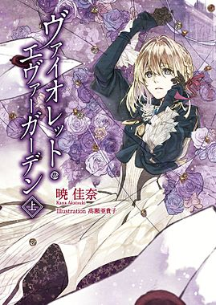
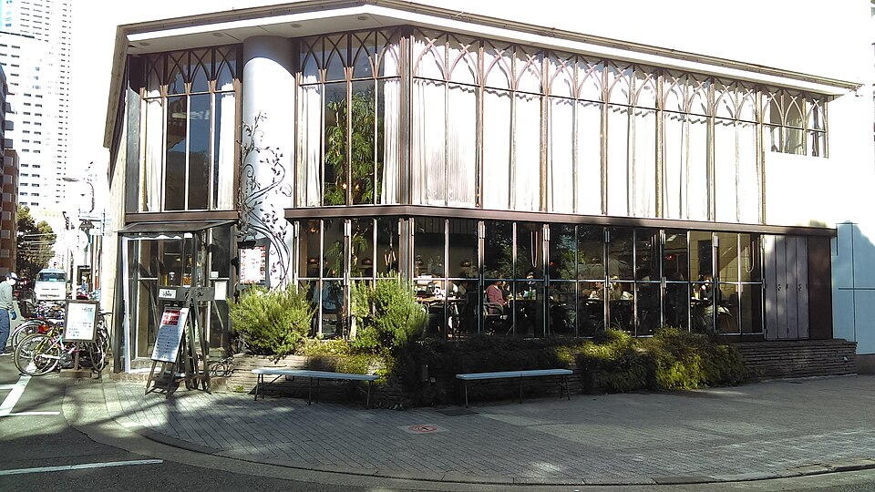

这篇把本站支持的 Markdown 自定义样式集中放在一页。先看书影游的双列卡片、竖版横滑栏和方形陈列架，再看图片网格、相册与图文绕排，最后是提示框、徽章、链接、数学公式和代码块。

相册、网格和绕排保留图片原比例。竖版卡片统一使用 `2:3` 封面，方形卡片统一使用 `1:1` 封面；超出的边缘会裁切，点击仍可查看完整原图。

每种样式后都有对应的完整 Markdown 代码块。普通图悬浮时在原边框内轻微放大，点击查看大图；大图再点一次即可收回，也可用 Esc、遮罩或关闭按钮退出。浅色模式大图是灰白背景，深色模式保留暗色背景。

**宽度怎么选：** `columns` 管等宽列数，`widths` 管每列分配，`|w` 管图片本身的显示上限及 Astro 图片资源。网格最多二／三列；`widths` 只接受两个或三个正数 `px` / `fr` 值，不支持 `%`、`auto`、`calc()` 或任意 CSS。相册 `layout="scroll"` 不接受列数或列宽参数。600px 及以下，网格和绕排恢复上下排列。

## 书影游卡片：一行两张

这是原来的横向卡片：封面在左，标题、可选评分和介绍在右，类别在右上角。连续卡片自动排成双列网格，窄屏改为一列；长介绍在卡片内滚动，纵向滑块仅在滚动时短暂显示，不需要拆成多个卡片。评分可省略，只填写作者自己的分数。

:::card{title="凡人修仙传" href="https://zh.wikipedia.org/wiki/凡人修仙传" score="5" label="国漫"}


陪韩立修仙。
:::

:::card{title="牧神记" href="https://zh.moegirl.org.cn/牧神记" score="4.5" label="国漫"}


陪秦牧斗神。
:::

```md
:::card{title="凡人修仙传" href="https://zh.wikipedia.org/wiki/凡人修仙传" score="5" label="国漫"}


陪韩立修仙。
:::

:::card{title="牧神记" href="https://zh.moegirl.org.cn/牧神记" score="4.5" label="国漫"}


陪秦牧斗神。
:::
```

## 竖版卡片栏

封面在上，标题和灰色小字在下。连续的 `layout="portrait"` 卡片自动组成一条横滑栏，桌面版心大约显示四张半，窄屏保留后续卡片的露出。可以用触控板横滚、拖动底部滚动条，或聚焦卡片栏后按左右方向键查看后面的条目；点击封面查看大图，点击标题前往对应作品的 Wiki，而非本站拾趣分类。

`meta` 是自由填写的小字，可写作者、制作方、分类、年份或状态，也可省略。标题自然换行；小字最多显示两行高度，超出后在自己的区域上下滚动，也可聚焦小字用方向键滚动。小字区纵向滑块默认隐藏，实际滚动时短暂显示，停止后自动隐藏，不影响底部横向滚动条。横向栏没有底框，直接嵌入页面背景，底部保留滚动条。中间插入标题、段落或普通横卡就会另起一组。竖卡必须有标题和一张独立 Markdown 封面；这里只展示三部分，不接受 `score`、`label` 或介绍正文，误写会报错而不会隐藏内容。

:::card{layout="portrait" title="夏日重现" meta="日漫" href="https://zh.wikipedia.org/wiki/夏日重現"}

:::

:::card{layout="portrait" title="葬送的芙莉莲" meta="准备看" href="https://zh.wikipedia.org/wiki/葬送的芙莉莲"}

:::

:::card{layout="portrait" title="冰菓" meta="日漫" href="https://zh.wikipedia.org/wiki/冰菓"}

:::

:::card{layout="portrait" title="紫罗兰永恒花园" meta="日漫" href="https://zh.wikipedia.org/wiki/紫罗兰永恒花园"}

:::

:::card{layout="portrait" title="你的名字" meta="动画电影" href="https://zh.wikipedia.org/wiki/你的名字。"}

:::

:::card{layout="portrait" title="进击的巨人" meta="准备看。小字也能放介绍、备注和状态；超过两行高度后，可以在这块区域上下滚动读完，卡片栏的高度不会被长文字撑开。" href="https://zh.wikipedia.org/wiki/進擊的巨人"}

:::

```md
:::card{layout="portrait" title="夏日重现" meta="日漫" href="https://zh.wikipedia.org/wiki/夏日重現"}

:::

:::card{layout="portrait" title="葬送的芙莉莲" meta="准备看" href="https://zh.wikipedia.org/wiki/葬送的芙莉莲"}

:::

:::card{layout="portrait" title="冰菓" meta="日漫" href="https://zh.wikipedia.org/wiki/冰菓"}

:::

:::card{layout="portrait" title="紫罗兰永恒花园" meta="日漫" href="https://zh.wikipedia.org/wiki/紫罗兰永恒花园"}

:::

:::card{layout="portrait" title="你的名字" meta="动画电影" href="https://zh.wikipedia.org/wiki/你的名字。"}

:::

:::card{layout="portrait" title="进击的巨人" meta="准备看。小字也能放介绍、备注和状态；超过两行高度后，可以在这块区域上下滚动读完，卡片栏的高度不会被长文字撑开。" href="https://zh.wikipedia.org/wiki/進擊的巨人"}

:::
```

## 方形卡片栏

专辑封面通常是正方形，所以方卡按 `1:1` 裁切，不要求源图本身恰好是正方形。桌面版心大约显示五张半。需要自动滚动时，这一排每张都写 `scroll="auto"`；条目要比容器更宽才会动，桌面下竖卡通常多于四张、方卡多于五张。滚动头尾相接，左右淡出。按下或键盘聚焦时暂停，方便点封面和标题；鼠标只是停在上面时继续滚动。减少动态效果或没有脚本时，它退回普通横滑，不淡出边缘。

:::card{layout="square" scroll="auto" title="夏日重现" meta="日漫" href="https://zh.wikipedia.org/wiki/夏日重現"}

:::

:::card{layout="square" scroll="auto" title="葬送的芙莉莲" meta="准备看" href="https://zh.wikipedia.org/wiki/葬送的芙莉莲"}

:::

:::card{layout="square" scroll="auto" title="冰菓" meta="日漫" href="https://zh.wikipedia.org/wiki/冰菓"}

:::

:::card{layout="square" scroll="auto" title="紫罗兰永恒花园" meta="日漫" href="https://zh.wikipedia.org/wiki/紫罗兰永恒花园"}

:::

:::card{layout="square" scroll="auto" title="你的名字" meta="动画电影" href="https://zh.wikipedia.org/wiki/你的名字。"}

:::

:::card{layout="square" scroll="auto" title="进击的巨人" meta="日漫" href="https://zh.wikipedia.org/wiki/進擊的巨人"}

:::

```md
:::card{layout="square" scroll="auto" title="夏日重现" meta="日漫" href="https://zh.wikipedia.org/wiki/夏日重現"}

:::

:::card{layout="square" scroll="auto" title="葬送的芙莉莲" meta="准备看" href="https://zh.wikipedia.org/wiki/葬送的芙莉莲"}

:::

:::card{layout="square" scroll="auto" title="冰菓" meta="日漫" href="https://zh.wikipedia.org/wiki/冰菓"}

:::

:::card{layout="square" scroll="auto" title="紫罗兰永恒花园" meta="日漫" href="https://zh.wikipedia.org/wiki/紫罗兰永恒花园"}

:::

:::card{layout="square" scroll="auto" title="你的名字" meta="动画电影" href="https://zh.wikipedia.org/wiki/你的名字。"}

:::

:::card{layout="square" scroll="auto" title="进击的巨人" meta="日漫" href="https://zh.wikipedia.org/wiki/進擊的巨人"}

:::
```

## 横向滑动相册

这组相册只放两张横图。右侧白色圆形按钮切到第二张，随后左侧按钮可以返回；首尾不循环。图片底部的两个小点分别对应两张照片，深色点表示当前位置，也可以直接点选。鼠标横滚、触控滑动和相册聚焦后的左右方向键都可用，没有自动播放。与等宽网格不同，相册一次展示一张主图，并露出相邻图片的一小部分，图片不会被挤成两列。相册只有一张图时没有可翻页的内容，不会生成箭头和页码。

:::gallery{layout="scroll"}


:::

```md
:::gallery{layout="scroll"}


:::
```

## 两张竖图等宽并排

`columns="2"` 把可用列宽等分，间距由布局统一留出。两张竖图的原始比例相同，适合这种对称并排；省略属性写 `:::gallery` 也是默认两列。

:::gallery{layout="grid" columns="2"}


:::

```md
:::gallery{layout="grid" columns="2"}


:::
```

## 两张横图等宽并排

同样的两列写法也能放横图。横图会更矮，不会为了填满方形格子而裁掉画面；比例不同的照片允许底边不齐。

:::gallery{layout="grid" columns="2"}


:::

```md
:::gallery{layout="grid" columns="2"}


:::
```

## 三张竖图等宽并排

三张竖图用 `columns="3"`。没有 masonry 或自动重排，始终保持 Markdown 的源顺序；手机上恢复为单列。

:::gallery{layout="grid" columns="3"}


:::

```md
:::gallery{layout="grid" columns="3"}


:::
```

## 按比例分配：左一份，右两份

可以控制占据的比例。`widths="1fr 2fr"` 表示扣除间距后，第一列占 1/3、第二列占 2/3。这里把竖图放窄列、横图放宽列。想左右等宽用 `1fr 1fr`；想左宽右窄用 `2fr 1fr`。`fr` 是剩余空间的份数，不是源图片缩放倍数。

:::gallery{layout="grid" widths="1fr 2fr"}


:::

```md
:::gallery{layout="grid" widths="1fr 2fr"}


:::
```

## 按比例分配：左三份，右两份

`widths="3fr 2fr"` 对应大约 60% / 40% 的可用列宽；写 `7fr 3fr` 就是 70% / 30%。不用直接写百分比，这样列间距也不会额外撑出正文。图仍完整显示，不保证底边对齐。

:::gallery{layout="grid" widths="3fr 2fr"}


:::

```md
:::gallery{layout="grid" widths="3fr 2fr"}


:::
```

## 第一列 240px，第二列占剩余

这就是“第一张占指定宽度，第二张占剩下”的写法：`widths="240px 1fr"`。这里的 240px 是第一列的目标宽度，而非原始文件宽度；容器不足时可以收窄。不要把固定列设得大于正文可用空间，避免把弹性列挤得过窄。手机上仍是单列。

:::gallery{layout="grid" widths="240px 1fr"}


:::

```md
:::gallery{layout="grid" widths="240px 1fr"}


:::
```

## 第二列 200px，第一列占剩余

调换轨道顺序，就能固定右侧的列宽：`widths="1fr 200px"`。适合左侧横图为主、右侧竖图为辅。

:::gallery{layout="grid" widths="1fr 200px"}


:::

```md
:::gallery{layout="grid" widths="1fr 200px"}


:::
```

## 三列不同比例

`widths` 也可以写三个值。下面是 1:2:1；没有写 `columns` 时，从 `widths` 的数量得出列数。如同时写 `columns="3"`，就必须恰好给出三个宽度值。

:::gallery{layout="grid" widths="1fr 2fr 1fr"}


:::

```md
:::gallery{layout="grid" widths="1fr 2fr 1fr"}


:::
```

## 只限制图片本身，不改列宽

`|w` 和 `widths` 是两回事。下面仍是等宽两列，但第一张图只显示到 160px，第二张到 260px，各自在自己的列内居中。**第一张小图空出来的位置不会自动让给第二列。** 若要让出列宽，应使用上面的 `widths`。`|w` 还参与 Astro 的资源生成；`widths` 只管排版，也可以把两者结合。

:::gallery{layout="grid" columns="2"}


:::

```md
:::gallery{layout="grid" columns="2"}


:::
```

## 图片在右，文字绕排

`figure` 适合一张图配连续文字，不是固定高度双栏。第一段只放一张图，后面写正常 Markdown 段落。

:::figure{side="right"}


图片放在右侧，正文从左侧开始阅读。这里用竖图展示较长的绕排区域：画面保持完整，没有为了对齐文字而裁成方形。显示宽度通过图片说明里的 `|w200` 限制，不改变源文件；点击后仍能查看同源的原尺寸大图。

文字超过照片底部以后，会自然恢复完整行宽，而不是继续待在一个狭窄的左侧栏中。可以沿着这几段往下读，观察文字如何先跟着照片边缘换行，再回到正常的正文宽度。这些段落仅用于排版演示，不是照片中人物的身份介绍或个人经历。

手机上图片会排在文字之前，不再压缩每行可读的字数。实际写文章时，选左侧还是右侧取决于阅读顺序，不必为了变化交替使用。若只有一句说明，直接用独立图片通常更简单；有连续几段解释时，绕排才适合。

这段补充说明用来展示越过照片底部的效果。绕排不会要求正文必须和图片等高，也不需要用空行填满。后续段落继续按普通 Markdown 排版，图片组外的下一节不受浮动影响。
:::

```md
:::figure{side="right"}


图片放在右侧，正文从左侧开始阅读。这里用竖图展示较长的绕排区域：画面保持完整，没有为了对齐文字而裁成方形。显示宽度通过图片说明里的 `|w200` 限制，不改变源文件；点击后仍能查看同源的原尺寸大图。

文字超过照片底部以后，会自然恢复完整行宽，而不是继续待在一个狭窄的左侧栏中。可以沿着这几段往下读，观察文字如何先跟着照片边缘换行，再回到正常的正文宽度。这些段落仅用于排版演示，不是照片中人物的身份介绍或个人经历。

手机上图片会排在文字之前，不再压缩每行可读的字数。实际写文章时，选左侧还是右侧取决于阅读顺序，不必为了变化交替使用。若只有一句说明，直接用独立图片通常更简单；有连续几段解释时，绕排才适合。

这段补充说明用来展示越过照片底部的效果。绕排不会要求正文必须和图片等高，也不需要用空行填满。后续段落继续按普通 Markdown 排版，图片组外的下一节不受浮动影响。
:::
```

## 图片在左，文字绕排

左侧用 `side="left"`，其他结构相同；不写 `side` 默认是右侧。

:::figure{side="left"}


这一组把横图放在左侧，文字从右侧开始。由于横图更矮，正文较快就会回到整行，方便与上一组竖图比较。图片不裁切、不强制拉伸；这里的文字只说明布局，不增加照片之外的信息。

当段落超过照片底部之后，文字使用完整正文宽度。左右绕排只是同一结构的方向选择，不会把正文锁在固定双栏中；切换到窄屏时，两者都会变成图片在前、文字在后。
:::

```md
:::figure{side="left"}


这一组把横图放在左侧，文字从右侧开始。由于横图更矮，正文较快就会回到整行，方便与上一组竖图比较。图片不裁切、不强制拉伸；这里的文字只说明布局，不增加照片之外的信息。

当段落超过照片底部之后，文字使用完整正文宽度。左右绕排只是同一结构的方向选择，不会把正文锁在固定双栏中；切换到窄屏时，两者都会变成图片在前、文字在后。
:::
```

## 普通单图，指定显示宽度

单张图不用布局指令。`|w330` 把正文显示宽度限制到 330px；可以聚焦图片按 Enter / 空格打开大图，也可以直接点图。


```md

```


## 提示框

适合补充说明、建议和注意事项。框的颜色、图标和标题由类型决定。

> [!NOTE]
> 普通说明：所有卡片和图片布局都能在 Markdown 中直接编写。

> [!TIP]
> 使用建议：图片与文章放在一起，用相对路径引用。

> [!IMPORTANT]
> 重要信息：评分只填写作者给出的数值。

> [!WARNING]
> 注意事项：竖卡封面统一裁切，完整图片仍可通过大图查看。

> [!CAUTION]
> 边界提醒：不要把第二张图片或嵌入媒体塞进卡片介绍。

```md
> [!NOTE]
> 普通说明。

> [!TIP]
> 使用建议。

> [!IMPORTANT]
> 重要信息。

> [!WARNING]
> 注意事项。

> [!CAUTION]
> 边界提醒。
```

## 徽章与链接

预设徽章：:badge-n :badge-a :badge-v。自由文字：:badge[可选信息]。

仓库链接：:link[YuBlog]{id=wutongyuonce/YuBlog}。普通链接：[本站拾趣](/interests/)，外部链接：[Astro](https://astro.build/)。外链会按全站配置显示跳转提示，徽章和链接都可以放在普通段落里。

```md
:badge-n :badge-a :badge-v :badge[可选信息]

:link[YuBlog]{id=wutongyuonce/YuBlog}
[本站拾趣](/interests/)
[Astro](https://astro.build/)
```

## 图片说明与图片链接

`:::image-figure` 可给单张图片加说明文字；普通 Markdown 图片链接则点击跳转，独立的大图入口只在键盘焦点时出现。

:::image-figure[街边横图，保留原始比例]

:::

[](/interests/)

```md
:::image-figure[街边横图，保留原始比例]

:::

[](/interests/)
```

## 数学公式

行内公式 $a^2+b^2=c^2$ 跟随段落，独立公式另起一行：

$$
\sum_{k=1}^{n} k = \frac{n(n+1)}{2}
$$

```md
行内公式 $a^2+b^2=c^2$。

$$
\sum_{k=1}^{n} k = \frac{n(n+1)}{2}
$$
```

## 代码块：行号、高亮与折叠

代码围栏使用 Expressive Code，支持文件名、复制、行号、高亮和折叠。下面第 2–4 行默认折叠，点击即可展开，第 6 行高亮。

```js title="example.js" showLineNumbers collapse={2-4} {6}
function total(values) {
  return values.reduce((sum, value) => {
    return sum + value
  }, 0)
}
console.log(total([1, 2, 3]))
```

````md
```js title="example.js" showLineNumbers collapse={2-4} {6}
function total(values) {
  return values.reduce((sum, value) => {
    return sum + value
  }, 0)
}
console.log(total([1, 2, 3]))
```
````

## 折叠内容与横滚表格

正文支持原生 HTML。`details` 用于可展开的补充内容，表格宽于版心时会在自己的容器内横滚。

<details>
<summary>展开查看写作说明</summary>
<p>普通正文、卡片、图片和提示框共用同一条渲染管线；展开与收起不会改变原文内容。</p>
</details>

| 样式 | 使用语法 | 适合放的内容 | 窄屏表现 |
| --- | --- | --- | --- |
| 横向卡片 | `:::card{title="…"}` | 封面、评分和短评 | 自动单列 |
| 竖版卡片栏 | `:::card{layout="portrait" title="…" meta="…"}` | 封面、标题和自由小字 | 保留单行横滚 |
| 方形卡片栏 | `:::card{layout="square" scroll="auto" title="…" meta="…"}` | 1:1 封面；条目超出一屏才循环 | 不够宽时退回横滑 |
| 图片网格 | `:::gallery{columns="2"}` | 并排对照的图片 | 自动单列 |
| 横向相册 | `:::gallery{layout="scroll"}` | 连续浏览多张图片 | 主图与后续露出 |

```html
<details>
<summary>展开查看写作说明</summary>
<p>这里写补充内容。</p>
</details>
```

## 视频嵌入的写法

视频指令也由现有管线支持。下面用 B 站视频实际展示嵌入效果；把 `id` 换成视频的 BV 号即可。

::video-bilibili{id=BV1r2a86NEPF .no-scale}

[在 B 站打开视频](https://www.bilibili.com/video/BV1r2a86NEPF/)

```md
::video-bilibili{id=BV1r2a86NEPF .no-scale}

[在 B 站打开视频](https://www.bilibili.com/video/BV1r2a86NEPF/)

::video-youtube{#gxBkghlglTg .no-scale}
```

本地视频和音频使用原生 `<video>`／`<audio>`，资源与 Markdown 放在一起；不同于图片，它们通过媒体镜像层获得站内地址。完整资源规则见项目图片管线指南。

```html
<video controls src="./demo.mp4"></video>
<audio controls src="./demo.mp3"></audio>
```
