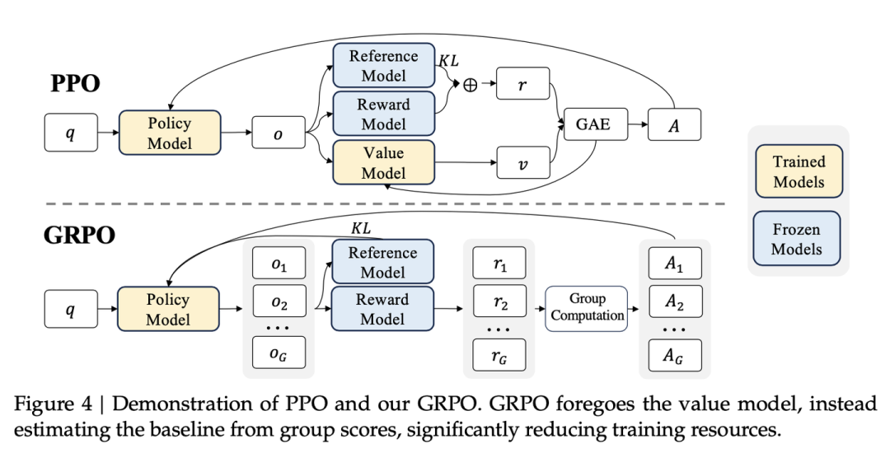

## 一、先分清预训练和后训练

大模型训练通常分两个大阶段。

**预训练**：用海量文本让模型学会预测下一个词。这个阶段模型学到语言知识、世界知识、基本推理潜能，但还不太会按人的要求回答问题。

**后训练**：在预训练之后进行的一系列训练。目的是让模型会遵循指令、符合人类偏好、能推理、能按特定格式输出。后训练会改变模型参数，所以训练前后的模型可以看成两个不同的模型。

## 二、后训练主流范式

后训练不是只有一种方法，主流可以分成三类。

**1. SFT：监督微调**
用“问题 + 标准回答”的数据训练模型。告诉模型应该怎么回答、用什么格式、什么风格。这是后训练的基础。

**2. 偏好优化**
用“回答 A 比回答 B 好”这样的偏好数据训练模型。常见方法有 DPO、IPO、KTO、ORPO、SimPO 等。DPO 全称直接偏好优化，它不需要单独训练奖励模型，直接用成对偏好数据调整模型。

**3. 强化学习**
让模型自己生成回答，然后根据奖励信号调整模型参数。模型生成得好的回答会被强化，生成得差的会被抑制。PPO、GRPO 都属于强化学习算法。

另外还有 RLHF 和 RLVR 这两个概念。
**RLHF**：基于人类反馈的强化学习，是一个训练框架。传统 RLHF 会先收集人类偏好数据，训练奖励模型，再用强化学习算法优化模型。PPO 是传统 RLHF 最常用的算法。
**RLVR**：可验证奖励强化学习，是奖励来源的一种设置，后面会详细讲。

## 三、SFT 是什么

SFT 全称监督微调。做法是准备大量高质量的“问题-标准回答”数据，让模型学习生成这些标准回答。

SFT 主要教三件事：
- 回答的格式，比如先写什么、后写什么。
- 回答的风格，比如礼貌、简洁、详细。
- 基本的指令遵循能力，比如用户要求翻译就翻译，要求总结就总结。

SFT 的数据量通常比预训练小很多，但质量要求高。SFT 之后，模型已经能比较正常地和人对话，但推理能力、复杂问题解决能力还不一定强。

## 四、强化学习在后训练里做什么

强化学习的基本循环是：
1. 给模型一个问题。
2. 模型生成一个或多个回答。
3. 用某种方式给回答打分，这个分数叫奖励。
4. 根据奖励调整模型，让高分回答以后更容易出现，低分回答更不容易出现。

强化学习的关键概念：
- **策略模型**：就是要训练的那个生成回答的模型。
- **采样**：让模型生成回答的过程。
- **奖励**：对回答的评分。
- **优势**：表示这次回答比某个基线好多少。优势为正就强化，为负就抑制。
- **on-policy**：数据由当前策略模型生成，用完就丢掉，下一轮重新生成。

强化学习能让模型探索训练数据之外的新策略。推理能力，尤其是长思维链，主要是在这个阶段被激发和强化的。

## 五、PPO 详解

PPO 是一种强化学习算法，传统 RLHF 最常用它。

PPO 训练时通常涉及四个模型：

1. **策略模型**：要训练的模型，负责生成回答。
2. **奖励模型**：预先训练好，冻结不动。输入是“问题 + 完整回答”，输出一个最终分数，表示这个回答好不好。
3. **价值模型**：也要训练。输入是“问题 + 已经生成到一半的内容”，输出一个预测分数，表示从当前位置继续写下去，最终大概能得多少分。
4. **参考模型**：策略模型的旧副本，冻结不动。用来限制新模型不要变化太大，防止跑偏。

PPO 的流程：

1. 给策略模型一个问题，让它生成一个完整回答。
2. 回答写完后，奖励模型给最终分数 R。
3. 在生成每一步，价值模型预测一个分数 V，表示“从这里继续，预计最终能得多少分”。
4. 计算优势：**优势 = 实际最终得分 R − 价值模型预测的 V**。
5. 根据优势更新策略模型：正优势的回答，增加生成它的概率；负优势的，降低。
6. 更新价值模型，让它预测得越来越准。
7. 这一轮数据用完就丢掉，下一轮用更新后的策略模型重新生成。

为什么 PPO 需要价值模型？
因为最终奖励只有一个，只在回答结束时给。模型在生成过程中不知道每一步好坏。价值模型提供一个动态基线，帮助判断“这次得了 80 分，到底算好还是算差”。如果这道题本来能得 90 分，80 分就是负优势；如果本来只能得 60 分，80 分就是正优势。价值模型可以降低训练方差，让更新更稳定。

PPO 的缺点：
- 要同时训练策略模型和价值模型两个大模型，显存占用大。
- 价值模型很难训准，因为最终奖励只有一个，却要预测每个位置的价值。
- 超参数敏感，训练复杂。

## 六、GRPO 详解

GRPO 全称 Group Relative Policy Optimization，中文叫群体相对策略优化。它是对 PPO 的简化，核心是去掉价值模型。

GRPO 的做法：

1. 对同一个问题，一次生成多个回答，比如 8 个。
2. 用奖励模型或规则给每个回答打分。
3. 算这一组分数的平均值和标准差。
4. 每个回答的优势是：**优势 = (该回答得分 − 组内平均分) ÷ 组内标准差**。
5. 高于平均分的回答获得正优势，低于平均分的获得负优势。
6. 只更新策略模型，不需要价值模型。

GRPO 的好处：
- 不需要价值模型，省掉一个和策略模型差不多大的模型，显存和算力开销大幅降低。
- 训练更稳定，因为组内平均分直接当基线，绕开了价值模型预测不准的问题。
- 特别适合奖励明确的任务，比如数学题答案对错、代码测试通过与否。

GRPO 的代价：
- 同一个问题要生成多个回答，计算量增加。
- 奖励最好能明确比较，如果奖励很模糊，组内比较效果会下降。

GRPO 的变体有 DAPO、GSPO、Dr.GRPO 等，都是对 GRPO 的改进。

## 七、RLVR 是什么，和 GRPO 什么关系

RLVR 全称 Reinforcement Learning with Verifiable Rewards，中文叫可验证奖励强化学习。

它的核心是：奖励不是人打分，也不是奖励模型打分，而是程序或规则自动验证。例如：
- 数学题：最终答案和标准答案一致，给 1 分，否则 0 分。
- 代码题：跑单元测试，通过给分，不通过不给分。
- 格式要求：思考过程必须放在指定标记里，不符合扣分。

RLVR 不是优化算法，而是一种奖励设置，说的是“奖励从哪来”。

GRPO 是一种优化算法，说的是“怎么用奖励去更新模型”。

两者关系：可以用 GRPO 来做 RLVR，也可以用 PPO 来做 RLVR。但 GRPO 特别适合 RLVR，因为可验证奖励通常对错分明，适合组内比较。DeepSeek-R1 就是用 GRPO 在 RLVR 数据上训练出来的。

## 八、思维链是怎么来的，如何区分思考和输出

**思维链**是模型在给出最终答案前，先输出一段推理过程。比如先分析问题、列步骤、自我检查，最后再给答案。

思维链不是单独用标注数据“教”出来的。预训练模型本身已经具备微弱的推理潜能。GRPO 通过结果奖励，把这种潜能激发和放大。模型会发现：多想几步、自我验证、回头检查，确实更容易答对，于是这些行为被保留下来。

DeepSeek-R1-Zero 是一个重要例子。它完全没有用思维链 SFT 数据，纯靠 GRPO 训练，模型自己涌现出了长思维链、自我反思、检查错误等行为。

正式版 DeepSeek-R1 加了少量 SFT 冷启动，目的是提升思维链的可读性和语言一致性，而不是从无到有创造推理能力。

**如何区分思考和输出？**

模型生成时，本身输出的是一段连续文本。区分思考和输出，靠的是训练和解析。

1. **SFT 冷启动教格式**  
   用少量高质量数据做初步微调。这些数据里，思考过程放在 `<think>` 和 `</think>` 标记内，最终答案放在标记外。模型学会：要思考时先生成 `<think>`，思考完生成 `</think>`，再输出最终答案。

2. **GRPO 加格式奖励**  
   在强化学习阶段，加一个格式奖励。检查模型是否正确使用了 `<think>` 和 `</think>` 标记。格式正确给奖励，格式错误不给或惩罚。GRPO 的组内比较会强化格式正确的回答，确保格式稳定。

3. **服务端解析**  
   模型服务端收到模型原始输出后，解析 `<think>` 标记。把标记内的内容放入 `reasoning_content` 字段，把最终答案放入 `content` 字段。DeepSeek V3.1 及后续版本就是这样做的。托管 API 返回的 `content` 里不包含 `<think>` 标签，思考过程单独放在 `reasoning_content`。

## 九、SFT 冷启动 + GRPO 如何配合，GRPO 如何提升思考

SFT 冷启动和 GRPO 是配合关系。

**SFT 冷启动**：
- 教模型基本格式，比如用 `<think>` 标记思考过程。
- 教模型基本节奏，先思考再回答。
- 提升输出可读性和语言一致性。

**GRPO**：
- 在 SFT 教好的格式基础上，用结果奖励提升推理质量。
- 同一问题生成多个答案，答对的被强化，答错的被抑制。
- 模型慢慢摸索出更有效的思考策略，比如多检查、换思路、自我验证。

所以，格式之外，GRPO 的核心作用就是让模型思考得更好。它不是直接给思考过程的每一步打分，而是通过最终答案对不对，间接强化整个思考过程。最终答案正确，整个思考过程被强化；最终答案错误，整个思考过程被抑制。

GRPO 提升思考效果是任务导向的。在数学、代码这种有明确对错的任务上效果最明显。如果奖励设计不好，也可能出现思考越来越长但实际没变聪明的情况。

## 十、总结

- **后训练**：预训练之后的训练，让模型会遵循指令、符合偏好、会推理。
- **SFT**：监督微调，用标准回答教格式和基本能力。
- **偏好优化**：用成对偏好数据教模型哪种回答更好，如 DPO。
- **强化学习**：用奖励调整模型，PPO 和 GRPO 是两种算法。
- **PPO**：需要奖励模型和价值模型，价值模型提供动态基线，显存大，训练复杂。
- **GRPO**：一次生成多个答案，用组内平均分当基线，去掉价值模型，省显存，更稳定，适合可验证奖励。
- **RLVR**：可验证奖励强化学习，奖励来自程序或规则自动验证。GRPO 常和 RLVR 搭配。
- **思维链**：不是单独标注训练出来的，是 GRPO 通过结果奖励激发和强化出来的。
- **区分思考和输出**：SFT 冷启动教 `<think>` 格式，GRPO 加格式奖励稳定格式，服务端解析成 `reasoning_content` 和 `content`。
- **GRPO 提升思考**：通过最终答案对错，间接强化有效的思考过程，让模型学会多检查、自我验证、换思路。
