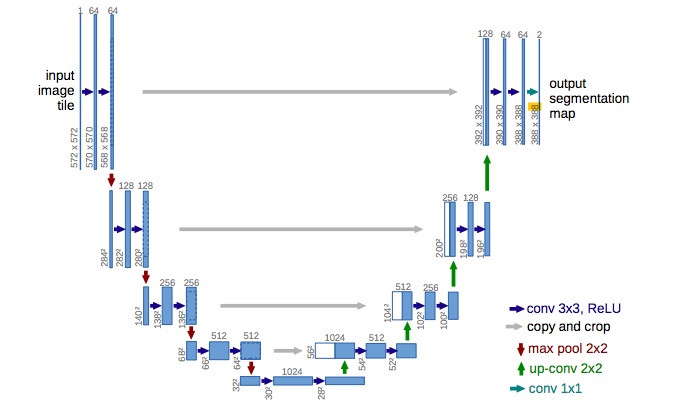
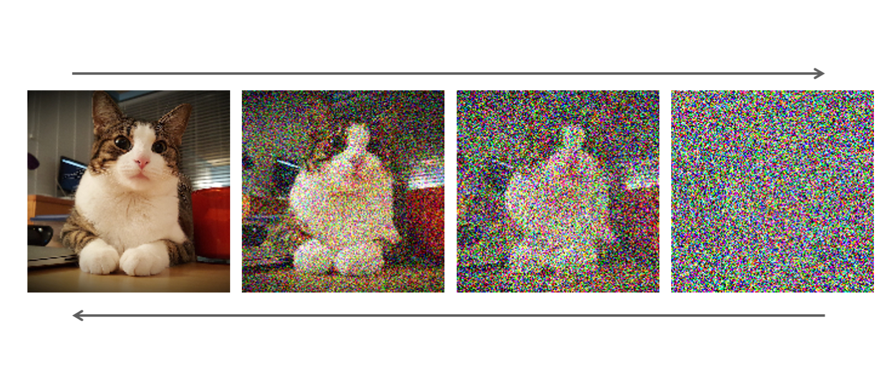
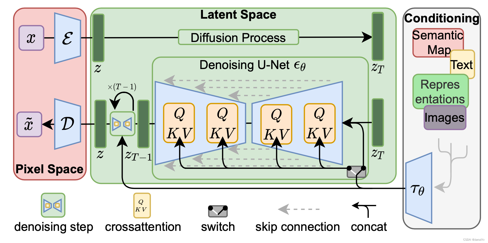
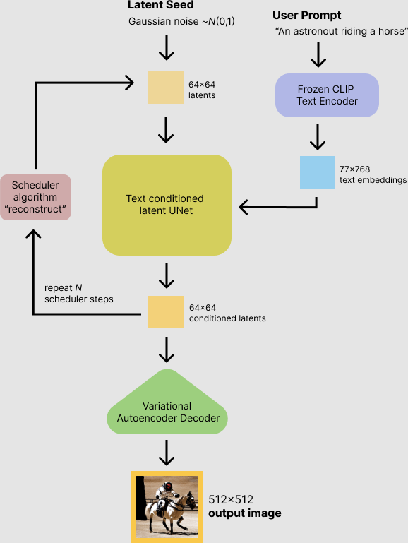

假设你想给文章配一张图：**一只卡通柴犬坐在草地上，暖色夕阳。**输入这句话，点击生成，系统就会根据描述生成一种合理的画面。

提示词没有指定柴犬的姿势、夕阳的位置，更没有逐个指定像素。Stable Diffusion 从大量图片及其描述中学习视觉规律，再根据新提示生成图片。同一句话可以产生不同结果，并不存在唯一的标准答案。

它从随机噪声开始，反复更新一份中间表示，最后将其转换成图片。下面以 **SD 1.5 生成512×512图片**为例，沿着一次文生图任务解释这个过程。

## 先让文字成为生成过程能使用的信息

绘图网络不能直接用字符串计算。系统先把提示词切分成模型识别的文字单元，称为词元，再交给文字编码器，得到一组表示文字含义的数字，即 **text embedding（文本嵌入）**。

这里使用 **CLIP 的文字编码器**。CLIP 通过图文配对训练，让匹配的图片与描述在表示上更接近、不匹配的更远，因此它的文字表示包含与视觉内容有关的信息。经典文生图流程只需要它的文字编码部分，不必同时给 CLIP 输入图片。

复用这套能力后，绘图网络可以专注于根据条件生成画面。**CLIP 提供“要画什么”的条件，不负责生成像素。**

## 准备起点：为什么不是一张空白图片

经典文生图从随机高斯噪声开始。改变随机种子会改变起点，通常也会改变最终画面。为什么这种起点能生成图片，要到后面的训练过程里找答案。

先解决计算成本的问题：如果每一步都处理完整的高分辨率像素图，生成会很昂贵。Stable Diffusion 改为处理较小的数字表示，称为 **latent（潜在表示）**。它保留视觉信息，但不是一张缩小的 RGB 图片，不能直接显示。

图片与 latent 之间的转换由 **VAE（变分自编码器）**完成：编码器将图片变成 latent，解码器再将 latent 转回图片。训练时，真实图片先编码再解码，模型调整参数，使重建结果尽量接近原图。这种压缩会损失部分细节，并非无损压缩。

因此，生成时直接创建符合 latent 尺寸的随机噪声，在这个较小的空间中完成多步计算，最后才解码。它不同于“先生成低分辨率图片，再用超分辨率模型放大”。

潜空间扩散原论文用两种“压缩”描述这项分工：

- **感知压缩**：自动编码器减少表示大小，尽量保留影响观感的信息。训练不仅比较像素，还使用感知损失等目标；感知损失比较图像特征，使重建结果在视觉上接近原图。
- **语义压缩**：生成模型学习内容、布局及其规律，例如怎样生成符合“柴犬坐在草地上”的 latent。这里不是再次把 latent 编码成更小的数组。

这种分工减少了扩散模型处理像素级细微变化的负担，但不意味着“VAE 只管纹理、扩散只管物体”：扩散仍要学习细节，VAE 的压缩质量也会影响成图。在本文的流程中，文字条件进入扩散网络，不参与 VAE 编码。

## 让随机噪声逐步变成符合描述的画面

此时，系统有了文本条件和随机 latent。接下来使用 **UNet**，根据当前含噪状态、时间步和文本条件计算噪声预测。时间步说明当前所处的噪声阶段；输出是与输入尺寸相同的噪声估计，不是完成的图片。

### 输入到底是什么：通道、高度、宽度

灰度图可以表示为一个二维数组，每个元素是一个像素的亮度。RGB 彩色图包含红、绿、蓝三组这样的数组，每组称为一个**通道**。下文统一按 `通道数×高度×宽度` 写尺寸，省略同时处理多张图片的批次维度。

SD 1.5 生成512×512图片时，latent 是 **`4×64×64`**：4个通道，每个通道是64行、64列。它们没有固定的红绿蓝含义。进入 UNet 后，这些数据会被转换成中间**特征图**，供后续层组合信息；也不能将某个特征通道固定理解成“边缘”或“毛发”。

UNet 先减小特征图的空间尺寸，结合更大范围的信息，再增加尺寸、利用此前保留的特征，最终输出 `4×64×64` 的噪声预测。



这张图是早期图像分割 UNet，只用于说明下采样、上采样和两条路径之间的连接。图中的尺寸与输出类别数不是 SD 1.5 的配置。

下面每一步先说明真实尺寸，再用同一个单通道小算例演示计算。小算例使用4×4数据和3×3卷积核，不是把真实输入先转换成了这种尺寸。**这些操作属于 UNet 的一次预测；第三、第四步会在不同分辨率上交替进行。**

### 第一步：保持64×64的位置数量，把每个位置的4个数转换成320个新特征

这一步不放大，也不缩小。网络结合每个位置附近、4个通道的数据，用不同的权重计算出320个新值，供后续层使用。输出仍是中间特征。

```text
输入：4×64×64
    ↓ 3×3卷积，步长1，四周填充1
输出：320×64×64
```

**卷积**的基本计算是：取一个局部区域，将数据与对应权重相乘，再求和，通常还要加上一个可学习的数，称为偏置。3×3权重矩阵称为**卷积核**，表示每次使用一个通道中附近3行、3列的数据，而不是把输入变成3×3。

先看单通道算例。输入记为 X，权重记为 K，偏置设为0：

```text
输入 X：                 卷积核 K：
 1   2   3   4           1  0  0
 5   6   7   8           0  1  0
 9  10  11  12           0  0  1
13  14  15  16
```

要让边缘位置也能使用完整的3×3区域，先在四周各补一行或一列零，这叫**填充（padding）**：

```text
0   0   0   0   0  0
0   1   2   3   4  0
0   5   6   7   8  0
0   9  10  11  12  0
0  13  14  15  16  0
0   0   0   0   0  0
```

计算输出第1行、第1列时，取以原输入数值1为中心的区域：

```text
0  0  0
0  1  2
0  5  6

与 K 对应乘加：0×1 + 1×1 + 6×1 = 7
其余权重为0，对结果没有贡献。
```

下一个区域以原输入数值2为中心，结果是 `0 + 2 + 7 = 9`。区域中心每次沿行或列移动多少个位置，叫**步长（stride）**。步长为1时，原输入的16个位置都会作为计算中心，得到新的特征图 F：

```text
F（4×4）：
 7   9  11   4
15  18  21  11
23  30  33  19
13  23  25  27
```

这里高度和宽度不变，变化的是各位置的数值。同一组权重用于所有位置；真实网络的权重由训练得到，本例只是便于手算。

**多个输入通道怎样得到一个输出通道？**普通卷积会对每个输入通道的同位置区域分别乘加，将所有通道的贡献相加，再加偏置，得到一个输出值。例如，真实第一层计算输出第10行、第12列时，会分别读取4个输入通道的第9到11行、第11到13列。如果它们的乘加结果是7、14、21、28，偏置为0，输出值就是70。

对所有64×64位置重复计算，得到一个输出通道；换用另一组权重，得到另一个输出通道。第一层设定输出320个通道，所以有320组权重：

```text
每组：4个输入通道 × 3×3权重 = 36个权重
整层：320组 × 36 = 11520个权重，另有320个偏置
权重形状：320×4×3×3
          输出通道×输入通道×核高度×核宽度
```

每个输出通道有一个偏置，该通道所有位置共用。由此可以分清两种设置：

- **输出通道数**决定使用多少组权重，每组计算一个输出通道。这个数量由网络结构设定，训练只调整权重的数值。
- **核尺寸、步长和填充**决定读取的局部范围及输出的空间尺寸。3×3卷积、步长1、填充1可以保持高度和宽度，与输出几个通道无关。

因此，增加、减少或保持通道数，都可以使用同一种普通卷积规则。`4→320` 是320组权重各读取4个输入通道；`960→320` 则是320组权重各读取960个输入通道。不同层有各自的权重。320代表这一层选定的特征数量，不是320种物体，也不是更高的图片分辨率。

### 第二步：减少空间位置，再计算更丰富的特征

这一步减少需要处理的位置，让后续层通过多层计算结合更大范围的信息。第一次**下采样**把每个通道从64×64变成32×32，仍有320个通道；之后的卷积处理再增加到640个通道。空间变小与通道变多是两个不同的操作。

| 操作 | 输入 | 输出 |
| --- | --- | --- |
| 第一次下采样 | `320×64×64` | `320×32×32` |
| 在32×32上计算特征 | `320×32×32` | `640×32×32` |
| 第二次下采样 | `640×32×32` | `640×16×16` |
| 在16×16上计算特征 | `640×16×16` | `1280×16×16` |
| 第三次下采样 | `1280×16×16` | `1280×8×8` |
| 最深层继续计算 | `1280×8×8` | `1280×8×8` |

这些下采样卷积保持通道数，但每个输出通道仍会综合所有输入通道的信息，并非各通道独立处理。

回到小算例，将刚得到的 F 交给下一层，仍使用 K、填充1，但将步长改成2。各层实际有不同的权重，这里取相同数值只是为了手算。

计算中心从每个位置变为第 `(1,1)`、`(1,3)`、`(3,1)`、`(3,3)` 个位置：

```text
中心(1,1)：0 + 7 + 18 = 25
中心(1,3)：0 + 11 + 11 = 22
中心(3,1)：0 + 23 + 23 = 46
中心(3,3)：18 + 33 + 27 = 78

G（2×2）：
25  22
46  78
```

F 的每个值已结合 X 中的多个位置，G 又结合了多个 F 的值。后续层继续使用 G，就能间接参考 X 中更大的区域；这个范围称为**感受野**。下采样得到的是中间特征，不是一张缩小的柴犬图片。

较少的空间位置有助于控制计算成本，但会损失精细的位置信息，所以网络会暂存较早层的输出。SD 1.5 保存的特征包括：

| 空间尺寸 | 保留特征的通道数 |
| --- | --- |
| 64×64 | 320 |
| 32×32 | 320或640，来自不同层 |
| 16×16 | 640或1280，来自不同层 |
| 8×8 | 1280 |

同一尺寸可以保留多份特征，后面按预先定义的连接使用。小算例中也保留 F，供第四步使用。

### 第三步：增加空间位置，为每个输入位置分别计算预测

最深层只有8×8个位置，最终却要为输入的64×64位置分别预测，所以必须逐步增加高度和宽度，这叫**上采样**。它增加位置数量，不负责将通道数变回4，也不能直接恢复此前的数据。

实际主路径如下。图中列的是各阶段处理后的尺寸，拼接时临时增加的通道数放在第四步解释：

```text
最深层与8×8保留特征结合并处理后：1280×8×8
    ↓ 上采样
1280×16×16
    ↓ 与16×16保留特征结合，再计算
1280×16×16
    ↓ 上采样
1280×32×32
    ↓ 与32×32保留特征结合，再计算
640×32×32
    ↓ 上采样
640×64×64
    ↓ 与64×64保留特征结合，再计算
320×64×64
```

三次上采样均保持通道数，高度和宽度加倍。通道从1280变640、从640变320，发生在结合保留特征后的处理阶段。**上采样与第四步交替进行，最深的8×8阶段也会先结合保留特征，再进行第一次上采样。**

SD 1.x 的常见上采样实现先做最近邻插值：放大两倍时，将每个值复制到对应的2×2区域。小算例把 G 变成 U：

```text
G（2×2）：               U（4×4）：
25  22                  25  25  22  22
46  78                  25  25  22  22
                        46  46  78  78
                        46  46  78  78
```

随后使用保持尺寸的卷积计算新特征。仍以 K、步长1、填充1演示，结果为 H，左上角是 `0 + 25 + 25 = 50`：

```text
H（4×4）：
50   47   44   22
71  128  125   44
92  149  181  100
46   92  124  156
```

尺寸回到了4×4，数值却没有回到 F。插值增加位置，卷积重新计算特征；它们不是下采样的精确逆操作，结果也不一定更平滑。

### 第四步：同时读取当前和保留的特征，计算这一阶段需要的新特征

这一步同时使用当前特征与较早层保留的特征：前者包含经过更多层组合的信息，后者保留较精细的局部和位置线索。这种连接称为**跳跃连接（skip connection）**。两份特征高度、宽度相同，先沿通道维度拼接，再由卷积计算新特征。

保留特征来自第二步中的对应层，不是每次都使用最初的320通道，也不是原始4通道 latent。以下是两个阶段的第一次跳跃连接：

| 阶段 | 当前特征 | 保留特征 | 拼接后的卷积输入 | 卷积输出 |
| --- | --- | --- | --- | --- |
| 32×32 | `1280×32×32` | `640×32×32` | `1920×32×32` | `640×32×32` |
| 64×64 | `640×64×64` | `320×64×64` | `960×64×64` | `320×64×64` |

所以“1280变640”是整个阶段的主路径变化，实际卷积先读取拼接后的1920个通道。它与第一步的 `4→320` 使用相同规则，只是输入数量与输出数量不同。

以 `960→320` 为例，每组权重对960个输入通道的3×3区域分别乘加，将贡献汇总成一个输出值；对所有位置重复计算，再用320组权重生成320个输出通道。权重形状是 **`320×960×3×3`**。如果某位置从当前640通道得到的贡献合计为12，从保留320通道得到的贡献合计为5，偏置为0，新输出值就是17。

**通道减少是重新计算的结果，不是删除其中640个通道。**新的320通道特征也不是原来的保留特征。一个阶段内还会重复拼接，例如第一次得到320通道后，再与另一份320通道拼成640通道，由下一层卷积计算出320通道。“回到自己的通道数”指的是得到这一阶段设定的输出数量。

对应到小算例，F 与 H 各有一个通道，拼接后有两个：

```text
F：1×4×4 + H：1×4×4
    ↓ 沿通道维度拼接
2×4×4
    ↓ 下一层卷积，设定输出1个通道
1×4×4
```

拼接保留两个独立通道，不将数值直接相加，也不覆盖其中一份。左上角分别是 F 的7和 H 的50。若下一层3×3卷积中，处理 F 的中心权重为2，处理 H 的中心权重为0.5，其余权重及偏置为0，则新值是：

```text
7×2 + 50×0.5 = 14 + 25 = 39
```

对所有位置重复计算，便得到一个4×4的新通道。这个例子只使用中心权重来说明跨通道组合，实际卷积通常也会利用周围位置。

至此，小算例沿同一条路径完成了 `X（4×4）→ F（4×4）→ G（2×2）→ H（4×4）→ 拼接与卷积`。这些权重未经训练，只演示数据怎样流动，不能真的预测噪声。

### 时间步与文字条件怎样参与这些计算

上面的特征计算还要使用时间步与文本条件。时间步先编码成向量，再转换成各层需要的形式，注入特征；不是把时间步整数直接加到每个输入值上，也不增加一个图像通道。

卷积处理局部邻域，**注意力**则通过计算权重、加权组合特征，直接利用远处信息或文字条件：

- **自注意力**让图像特征中的一个位置参考其他位置，不受单次卷积局部范围的限制，有助于协调不同区域的内容。
- **交叉注意力**让图像特征参考文本特征。各位置计算对不同词元的权重，组合相应信息，使“柴犬”“草地”“夕阳”影响生成。位置与词元的对应关系不是人为固定的。

这些模块在下采样路径、中间部分和上采样路径的若干阶段参与计算，通常保持所在阶段的空间尺寸和输出通道数。文本条件因此能影响每一个去噪时间步，而不是只在开头使用。

### 第五步：把320个中间特征转换成4个通道的噪声预测

空间尺寸回到64×64后，每个位置仍有320个特征值。最后的输出卷积将其组合成4个预测值：**`320×64×64 → 4×64×64`**，高度和宽度不变。

输出的每个通道、每个位置都对应输入 latent，采样器才能据此更新它。只有此时才得到完整的噪声预测，中间的特征图不要求与输入同尺寸。

### 从一次预测到最终图片

一次 UNet 计算只完成一个时间步的预测。接下来，**采样器或调度器**根据当前 latent、预测结果和噪声阶段计算新的 latent，再交给同一个 UNet：

```text
当前 latent + 时间步 + 文本条件
    ↓ UNet 预测噪声
采样器计算新的 latent
    ↓ 进入下一时间步
再次调用 UNet
```

**UNet 负责预测，采样器负责更新。**更新不是直接减掉全部预测噪声；不同采样方法有各自的规则，有些步骤还会加入随机噪声。分开这两项职责后，可以不重新训练网络，改用不同采样方法，在速度和效果之间取舍。

生成通常从大结构逐渐形成轮廓、颜色和纹理，但各步没有固定的绘画分工，也不保证后面能修好错误构图。循环结束后，VAE 解码器将最终 latent 转成像素图片。纯文生图不使用 VAE 编码器；编码器用于训练时处理真实图片，以及图生图等需要输入图片的任务。

## 模型怎么学会从噪声生成图片

随机噪声里没有藏着一张柴犬照片。模型之所以能生成图片，是因为训练时学习了不同噪声程度下，图片规律和文字条件怎样影响噪声预测。

训练样本由真实图片和描述组成。图片先经 VAE 编码为干净 latent，再完成一次练习：

1. 随机选择噪声程度，生成一份高斯噪声。
2. 按该程度混合干净 latent 与噪声，得到含噪输入。
3. 将含噪 latent、时间步和文本条件交给 UNet，预测噪声。
4. 用预测与真实噪声差值的平方均值，也就是均方误差，更新参数。

**噪声由程序生成，标签已知，不需要人工标注。**UNet 看不到作为答案的干净 latent，只能使用含噪输入与条件。同一张图片可以配上不同噪声，构造许多训练样本。

当噪声足够多时，不同图片的含噪结果都接近高斯噪声。这给生成提供了容易构造的统一起点：从随机噪声出发，反复使用训练中学到的预测能力，按反向过程形成新样本。高噪声时，预测更多依赖视觉规律和文字条件；噪声较少时，当前状态已提供更多结构。



图中从左到右是加噪，从右到左表示反向生成方向。它用像素图说明概念；Stable Diffusion 实际在 latent 上计算，纯文生图也不会从噪声中找回这张猫的原图。

这种定义加噪过程、学习反向生成过程的基础方法称为 **DDPM（去噪扩散概率模型）**。原始 DDPM 不要求文字条件或 latent；Stable Diffusion 将这一类扩散思路与文本条件、潜在表示结合起来。

噪声预测的好处是监督目标容易构造，并能用于计算反向更新。多步生成不要求一次决定全部细节，代价是多次网络调用。这不是唯一可行的方法：其他模型可以一步生成，扩散模型也可以预测干净数据或其他等价量，不能说噪声预测永远更好。

训练的时间步数量也不等于生成必须执行的步数。经典 DDPM 常用1000个时间步，更高效的采样方法可以使用少得多的步骤；增加步数会增加计算量，但不保证效果一直变好。

### 模型文件保存什么，生成时又计算什么

模型文件保存的是**参数**，包括卷积权重和偏置、注意力变换权重、时间步编码网络权重等。训练根据误差调整它们，生成时通常固定不变，同一个 UNet 在各时间步重复使用这套参数。

**特征图是当次计算的结果**，随 latent、提示词和时间步变化，不是模型参数。跳跃连接需要的特征暂时保留，供后续层使用。

## 如果不想让柴犬戴墨镜，怎样影响生成

只把“不要戴墨镜”写进正向提示词，不一定有效。文字编码器和生成网络不是严格执行语言逻辑的规则系统。经典 Stable Diffusion 可以用**负向提示词**列出希望减少的内容，例如正向描述柴犬场景，负向写“墨镜”。

在常见的**无分类器引导（CFG）**中，系统对同一个当前 latent 分别得到正向条件与基准条件下的预测，再放大二者的差异。基准通常是空文本条件；有负向提示词时，以负向条件替代，使生成倾向于正向描述、远离负向描述。

调整发生在每一步预测之后、采样更新之前，不是最后从图片上擦掉墨镜。引导强度控制条件的影响，过高可能损害画面质量。负向提示词只影响生成倾向，不能保证某种内容绝不出现。

## 总结

可以这样解释这次任务：

> 提示词先编码成文字条件，系统再创建随机 latent。UNet 根据当前状态、时间步和文字条件预测噪声，采样器利用预测反复更新 latent，最后由 VAE 解码成图片。文字编码器负责表达条件，VAE 降低多步计算的数据规模，UNet 提供学到的预测，采样器决定怎样推进生成。训练通过给真实图片的 latent 加噪，让网络学会这套预测能力。



这张通用潜空间扩散图可以分三部分阅读：

- 左边是像素空间：\(x\) 是输入图像，\(\tilde{x}\) 是解码结果，\(\mathcal{E}\)、\(\mathcal{D}\) 是编码器和解码器。
- 中间是潜空间：\(z\) 是干净表示，\(z_T\) 是末端高噪声状态，UNet \(\epsilon_\theta\) 提供噪声预测。
- 右边是条件：\(\tau_\theta\) 将文本等输入编码为特征，通过交叉注意力影响 UNet。不同条件不必使用同一个编码器。

训练从真实图像构造含噪样本；纯文生图不需要输入图像，而是从随机 latent 出发，多步更新后解码。



这张流程图的 `conditioned latents` 标注不够准确：**UNet 直接输出噪声预测，调度器更新后的最终 latent 才交给 VAE**。图中的64×64也省略了4个通道。

本文说明的是经典架构。**从噪声逐步生成图像仍是主流路线之一，但 UNet + CLIP + VAE 不是唯一组合。**SD 3 / 3.5 使用多模态扩散 Transformer（MMDiT）和 Rectified Flow（整流流）；FLUX.1 也采用 Rectified Flow Transformer，学习噪声与数据之间路径上的变化方向和速度，即速度场，而非照搬本文的噪声预测流程。

理解新模型时，分别看清：数据在哪个空间生成、条件怎样进入网络、网络预测什么，以及系统怎样利用预测更新状态。

## 参考资料

- [原视频：Stable Diffusion 是如何画画的](https://www.bilibili.com/video/BV12xeK6EEYb)
- [Stable Diffusion 原理详解](https://jarod.blog.csdn.net/article/details/129280836)
- [潜空间扩散原论文：表示空间、计算成本与文本条件](https://arxiv.org/abs/2112.10752)
- [DDPM 原论文：加噪训练与反向生成](https://arxiv.org/abs/2006.11239)
- [OpenAI CLIP：图文配对训练与文字编码](https://github.com/openai/CLIP)
- [Diffusers 官方文档：经典 Stable Diffusion 文生图流程](https://huggingface.co/docs/diffusers/en/api/pipelines/stable_diffusion/text2img)
- [Diffusers 当前实现：预测、条件引导、采样更新与解码](https://github.com/huggingface/diffusers/blob/main/src/diffusers/pipelines/stable_diffusion/pipeline_stable_diffusion.py)
- [PyTorch Conv2d：多通道卷积、权重形状与输出尺寸](https://docs.pytorch.org/docs/stable/generated/torch.nn.Conv2d.html)
- [SD 1.5 UNet 配置：输入输出通道与各阶段通道数](https://huggingface.co/stable-diffusion-v1-5/stable-diffusion-v1-5/blob/main/unet/config.json)
- [Diffusers 上采样实现：最近邻插值与卷积](https://github.com/huggingface/diffusers/blob/main/src/diffusers/models/upsampling.py)
- [Diffusers UNet 实现：跳跃连接与通道拼接](https://github.com/huggingface/diffusers/blob/main/src/diffusers/models/unets/unet_2d_blocks.py)
- [Stable Diffusion 3：MMDiT 与 Rectified Flow](https://stability.ai/news-updates/stable-diffusion-3-research-paper)
- [Stable Diffusion 3.5 Large 官方模型卡](https://huggingface.co/stabilityai/stable-diffusion-3.5-large)
- [FLUX.1 官方模型卡](https://huggingface.co/black-forest-labs/FLUX.1-dev)
