[【跳转到下一篇：算法 2（哈希表、字符串、双指针总结、栈与队列）】](/blogs/算法笔记/算法-2哈希表字符串双指针总结栈与队列/)

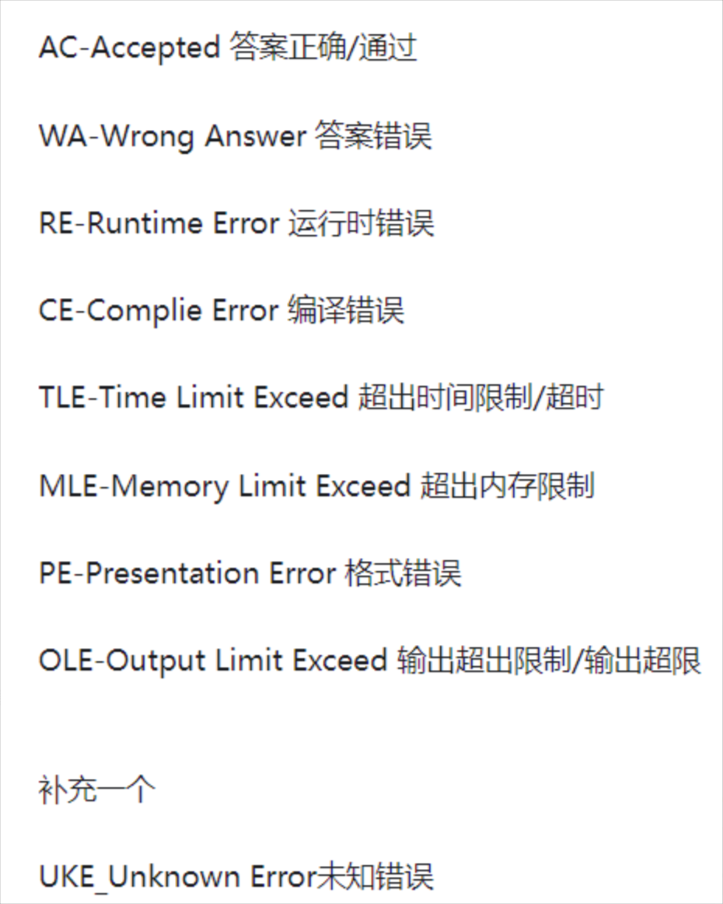

## 一、数组

### 理论基础

**数组是存放在连续内存空间上的相同类型数据的集合。**

- **数组下标都是从0开始的。**数组可以方便的通过下标索引的方式获取到下标对应的数据。
- **数组内存空间的地址是连续的。**所以我们在删除或者增添元素的时候，就要移动其他元素的地址。

*数组的元素本质上是不能删的，只能覆盖。*

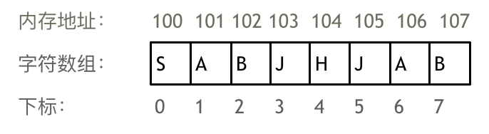

**那么二维数组在内存的空间地址是连续的么？**

* 不同编程语言的内存管理是不一样的，以C++为例，在C++中二维数组是连续分布的

* **Java的二维数组在内存中不是连续地址空间，而是由几条连续的地址空间组成**

  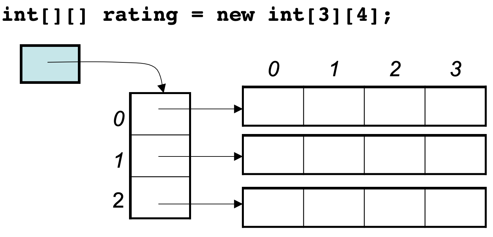

> 只有在 C++、Java、Golang 这类语言中才提供了创建静态数组的方式，实际软件开发中很少用到，写算法题也没必要用，一般直接用动态数组。
>
> 静态数组的增删查改操作的时间复杂度是：
>
> - 增：
>   - 在末尾追加元素：O(1)
>   - 在中间（非末尾）插入元素：O(N)
> - 删：
>   - 删除末尾元素：O(1)
>   - 删除中间（非末尾）元素：O(N)
> - 查：给定指定索引，查询索引对应的元素的值，时间复杂度 O(1)
> - 改：给定指定索引，修改索引对应的元素的值，时间复杂度 O(1)
>
> 动态数组也无法解决静态数组在中间增删元素效率差的问题

#### Java动态数组ArrayList的使用

1、增 (Add)

| 方法                       | 功能                     | 复杂度    | 说明                         |
| :------------------------- | :----------------------- | :-------- | :--------------------------- |
| **`add(E e)`**             | 在末尾添加元素           | 均摊 O(1) | 容量不足时会自动扩容 (1.5倍) |
| **`add(int index, E e)`**  | 在指定位置插入元素       | O(N)      | 后续元素需整体后移           |
| **`addAll(Collection c)`** | 批量添加集合中的所有元素 | O(M)      | M为传入集合大小              |

2、删 (Remove)

| 方法                    | 功能                     | 复杂度 | 说明                                  |
| :---------------------- | :----------------------- | :----- | :------------------------------------ |
| **`remove(int index)`** | 删除指定索引处的元素     | O(N)   | 后续元素前移。**注意重载**            |
| **`remove(Object o)`**  | 删除第一个等于该值的元素 | O(N)   | 依赖 `equals()` 方法                  |
| **`clear()`**           | 清空列表所有元素         | O(N)   | 实际上是将内部数组引用置空并重置 size |

**`ArrayList.remove()` 的重载陷阱**：

- `remove(int index)`：按索引删除

- `remove(Object o)`：按对象值删除

- **坑**：如果你传一个 `int` 字面量，Java 优先匹配 `remove(int)`

  ```java
  List<Integer> list = new ArrayList<>(Arrays.asList(1, 2, 3));
  list.remove(1); 
  // 结果：删除了索引为 1 的元素 (即数字 2)，列表变为 [1, 3]
  // 如果你想删除数字 1，必须装箱：
  list.remove(Integer.valueOf(1)); 
  ```

3、改 (Update)

| 方法                      | 功能               | 复杂度 | 说明               |
| :------------------------ | :----------------- | :----- | :----------------- |
| **`set(int index, E e)`** | 替换指定位置的元素 | O(1)   | 返回被替换的旧元素 |

4、查 (Get/Search)

| 方法                     | 功能                     | 复杂度 | 说明                 |
| :----------------------- | :----------------------- | :----- | :------------------- |
| **`get(int index)`**     | 获取指定索引的元素       | O(1)   | 随机访问，最快       |
| **`contains(Object o)`** | 判断是否包含某元素       | O(N)   | 线性遍历             |
| **`indexOf(Object o)`**  | 返回元素第一次出现的索引 | O(N)   | 找不到返回 -1        |
| **`size()`**             | 返回元素个数             | O(1)   | 直接返回内部计数器   |
| **`isEmpty()`**          | 判断是否为空             | O(1)   | 等价于 `size() == 0` |

5、其他实用方法

| 方法                    | 功能                                                 |
| :---------------------- | :--------------------------------------------------- |
| **`toArray()`**         | 将 List 转为 Object 数组 `Object[]`                  |
| **`toArray(T[] a)`**    | 将 List 转为指定类型的数组（推荐用法）               |
| **`subList(from, to)`** | 返回指定范围的视图（左闭右开），修改视图会影响原列表 |
| **`iterator()`**        | 获取迭代器，用于安全遍历删除                         |

`toArray(new int[0][])`：长度写 `0` 是最标准的写法（参考《阿里巴巴Java开发手册》），JVM 会根据集合的实际大小重新分配内存

#### Java原生数组

> **创建多维数组时，第一维（最左边）的长度是必须的，后面的维度可以为空**

```java
int[] res = new int[2];
// 数组的长度是 2
// - 第一个元素的下标是 0 (res[0])
// - 第二个元素的下标是 1 (res[1])
```

##### 遍历

- **`for (int i = 0; i < nums1.length; i++)`**
  - **含义**：`i` 代表数组的**下标/索引**（Index）
  - **过程**：`i` 从 0 开始递增，你需要通过 `nums1[i]` 来访问具体的值
  - **适用场景**：你需要知道当前元素的位置、需要倒序遍历、需要同时遍历多个数组，或者需要**修改**数组中的值

- 增强型for循环语法：**`for (int i : nums1)`**
  - **含义**：`i` 代表数组中的**具体数值**（Element Value）
  - **过程**：循环自动从数组第一个元素开始，依次将值赋给 `i`，直到最后一个元素
  - **适用场景**：你只需要读取或使用数组里的值，不需要知道它在下标几的位置，也不需要修改数组本身

    除了数组，还可以用于实现了 `Iterable` 接口的集合（如 `List`, `Set`, `ArrayList` 等）

    ```java
    List<String> list = Arrays.asList("A", "B", "C");
    for (String s : list) {
        System.out.println(s);
    }
    ```


* `foreach()` 方法

  ```java
  List<String> list = Arrays.asList("A", "B", "C");
  // 传入一个 Lambda 表达式
  list.forEach(s -> System.out.println(s));
  // 或者使用方法引用
  list.forEach(System.out::println);
  ```

##### Arrays工具类的使用

| 方法签名                       | 功能描述                                     | 时间复杂度 | 注意事项                                       |
| ------------------------------ | -------------------------------------------- | ---------- | ---------------------------------------------- |
| `toString(array)`              | 将数组转换为可读的字符串格式 `[e1, e2, ...]` | O(N)       | 打印数组必用，否则默认输出内存地址             |
| `sort(array)`                  | 对数组进行升序排序                           | O(NlogN)   | 原生类型用双轴快排，对象用归并/TimSort         |
| `sort(array, from, to)`        | 对数组指定范围 `[from, to)` 进行排序         | O(NlogN)   | 左闭右开区间                                   |
| `binarySearch(array, key)`     | 二分查找元素，返回索引；若不存在返回负数     | O(logN)    | 必须先排序，否则结果未定义                     |
| `fill(array, value)`           | 将数组所有元素赋值为指定值                   | O(N)       | 常用于初始化                                   |
| `copyOf(array, newLength)`     | 复制数组，可改变长度（截断或扩容）           | O(N)       | 返回新数组，原数组不变                         |
| `copyOfRange(array, from, to)` | 复制数组指定范围                             | O(N)       | 左闭右开 `[from, to)`                          |
| `equals(array1, array2)`       | 判断两个数组内容是否完全相同                 | O(N)       | 比较长度和每个元素值                           |
| `asList(T... a)`               | 重要：将数组转为固定大小的 `List` 视图       | O(1)       | 返回的 List 不能 add/remove，但可 `set` 修改值 |

```java
int[] nums = {5, 2, 9, 1, 5, 6};

// 1. 排序
Arrays.sort(nums); // [1, 2, 5, 5, 6, 9]

// 2. 查找 (必须先排序)
int index = Arrays.binarySearch(nums, 5); // 返回 2 或 3 (任意一个匹配项)

// 3. 转字符串打印
System.out.println(Arrays.toString(nums)); // 输出: [1, 2, 5, 5, 6, 9]

// 4. 填充
Arrays.fill(nums, 0); // [0, 0, 0, 0, 0, 0]

// 5. 数组转 List 
// 注意陷阱，它返回的不是 java.util.ArrayList，而是 Arrays 类内部的一个私有静态类 ArrayList，如果需要可变的 List，请包裹一层
Integer[] boxed = {1, 2, 3};
List<Integer> list = Arrays.asList(boxed); 
// list.set(0, 99); // OK: [99, 2, 3]
// list.add(4);     // 报错: UnsupportedOperationException (固定大小)
```

**注意区分 `Arrays.asList()` 和 `List.of()`**

`List.of()` 是 Java 9 引入的一个非常实用的**静态工厂方法**，主要用于快速创建一个**不可变列表**

```java
// 1. 基本用法
List<String> fruits = List.of("Apple", "Banana", "Orange");
System.out.println(fruits); // 输出: [Apple, Banana, Orange]

// 2. 尝试修改会报错
// fruits.add("Grape"); // 运行时抛出 UnsupportedOperationException

// 3. 传入 null 会报错
// List<String> listWithNull = List.of("Apple", null); // 运行时抛出 NullPointerException

// 4. 典型应用场景：定义常量列表
public static final List<String> DAYS_OF_WEEK = List.of("Mon", "Tue", "Wed", "Thu", "Fri");
```

#### 数组、集合与字符串的逻辑大小

> **逻辑大小**
>
> - **数组 (`length`)**：数组在 Java 中是语言层面的基础结构，其长度在创建时确定且不可变。为了追求极致的性能访问速度，JDK 设计者将其作为一个直接的内存字段暴露出来，避免方法调用的开销。
> - **集合 (`size()`)**：集合是类库的一部分（`java.util`），其内部实现复杂多样（如链表需要遍历计数或维护计数器，哈希表需要计算 entry 数量）。将其设计为方法可以封装内部实现逻辑，且允许动态计算。
>   - `HashMap` 的 `size()` 方法**返回此映射中包含的键 - 值映射关系的数量**，`HashSet` 类似
> - **字符串 (`length()`)**：`String` 是一个标准的类对象，遵循面向对象的设计规范，所以使用方法来获取其状态。

> Java 集合框架（特别是 `ArrayList`、`HashMap` 等基于数组实现的集合）中 **逻辑大小（Size）** 和 **物理容量（Capacity）** 的核心区别。
>
> - **`size()`**：返回的是**逻辑大小**，即当前集合里实际存了多少个有效元素。删除元素后，这个值会立即减 1。
> - **容量（Capacity）**：指的是底层数组（或哈希表桶）**实际分配的内存空间大小**。删除元素通常**不会**缩小这个容量。
>
> ```java
> // 场景 A: 指定初始容量为 10，然后手动添加 5 个元素
>         List<String> listA = new ArrayList<>(10); 
>         listA.add("A");
>         listA.add("B");
>         listA.add("C");
>         listA.add("D");
>         listA.add("E");
>         
>         System.out.println("List A Size: " + listA.size()); // 输出: 5
>         // 注意：ArrayList 没有公开的 getCapacity() 方法，但底层数组长度仍为 10
> 
>         // 场景 B: 直接通过包含 5 个元素的集合初始化，但预设容量为 10 (如果这样写)
>         // 实际上 new ArrayList<>(Collection) 通常会根据传入集合的大小来设定初始容量，
>         // 但如果你强制先 new ArrayList<>(10) 再 addAll(5个元素)，结果同上。
>         
>         List<String> source = Arrays.asList("1", "2", "3", "4", "5");
>         List<String> listB = new ArrayList<>(10); // 显式指定容量 10
>         listB.addAll(source); // 加入 5 个元素
>         
>         System.out.println("List B Size: " + listB.size()); // 输出: 5
> ```

#### *动态数组实现


先定义一个新的类型：

```java
public class ArrayList<E> {   //泛型E，因为表中要存的具体数据类型待定
    int capacity = 10;   //当前顺序表的容量
  	int size = 0;   //当前已经存放的元素数量
    private Object[] array = new Object[capacity];   //底层存放数据的数组
}
```

首先尝试实现插入方法：

```java
public void add(E element, int index){   //插入方法需要支持在指定下标位置插入
    for (int i = size; i > index; i--)   //从后往前，一个一个搬运元素
        array[i] = array[i - 1];
    array[index] = element;   //腾出位置之后，直接插入元素放到对应位置上
    size++;   //插入完成之后，记得将size自增
}
```

只不过这样并不完美，因为插入操作并不是在任何位置都支持插入，只能是 [0, size] 范围内。所以需要在插入之前进行判断：

```java
public void add(E element, int index){
    if(index < 0 || index > size)    //插入之前先判断插入位置是否合法
        throw new IndexOutOfBoundsException("插入位置非法，合法的插入位置为：0 ~ "+size);
    for (int i = size; i > index; i--)
        array[i] = array[i - 1];
    array[index] = element;
    size++;
}
```

只不过依然不够完美，如果顺序表装满了咋办？所以在插入元素之前，需要进行判断，如果已经装满了，那么需要先扩容之后才能继续插入新的元素：

```java
public void add(E element, int index){
    if(index < 0 || index > size)
        throw new IndexOutOfBoundsException("插入位置非法，合法的插入位置为：0 ~ "+size);
    if(capacity == size) {
        int newCapacity = capacity + (capacity >> 1);   //扩容规则就按照原本容量的1.5倍来吧
        Object[] newArray = new Object[newCapacity];    //创建一个新的数组来存放更多的元素
        System.arraycopy(array, 0, newArray, 0, size);   //使用arraycopy快速拷贝原数组内容到新的数组
        array = newArray;   //更换为新的数组
      	capacity = newCapacity;   //容量变成扩容之后的
    }
    for (int i = size; i > index; i--)
        array[i] = array[i - 1];
    array[index] = element;
    size++;
}
```

重写一下`toString`方法打印当前存放的元素：

```java
public String toString() {
    StringBuilder builder = new StringBuilder();
    for (int i = 0; i < size; i++) builder.append(array[i]).append(" ");
    return builder.toString();
}
```

可以看到，底层数组会自动扩容，便于使用：

```java
public static void main(String[] args) {
    ArrayList<Integer> list = new ArrayList<>();
    for (int i = 0; i < 20; i++)
        list.add(i, i);
    System.out.println(list);
}
```

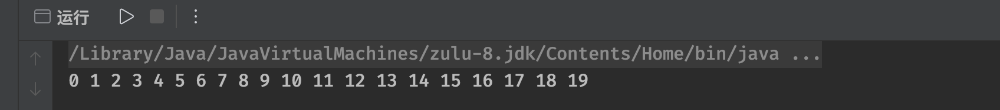

接着来看删除操作，其实操作差不多，只需要将后面的覆盖到前面就可以：

```java
@SuppressWarnings("unchecked")   //屏蔽未经检查警告
public E remove(int index){   //删除对应位置上的元素，注意需要返回被删除的元素
    E e = (E) array[index];   //因为存放的是Object类型，这里需要强制类型转换为E
    for (int i = index; i < size; i++)   //从前往后，挨个往前搬一位
        array[i] = array[i + 1];
    size--;    //删完记得将size--
    return e;
}
```

同样的，需要对删除的合法范围进行判断：


```java
@SuppressWarnings("unchecked")
public E remove(int index){
    if(index < 0 || index > size - 1)
        throw new IndexOutOfBoundsException("删除位置非法，合法的插入位置为：0 ~ "+(size - 1));
    E e = (E) array[index];
    for (int i = index; i < size; i++)
        array[i] = array[i + 1];
    size--;
    return e;
}
```

因为删除不需要考虑容量的问题，所以说删除操作就编写完成了。

当然，还得支持获取指定下标位置上的元素，直接从数组中拿就行：

```java
@SuppressWarnings("unchecked")
public E get(int index){
    if(index < 0 || index > size - 1)   //在插入之前同样要进行范围检查
        throw new IndexOutOfBoundsException("非法的位置，合法的位置为：0 ~ "+(size - 1));
    return (E) array[index];   //直接返回就完事
}

public int size(){   //获取当前存放的元素数量
    return size;
}
```

完整动态数组Java实现

```java
import java.util.Arrays;
import java.util.Iterator;
import java.util.NoSuchElementException;

public class MyArrayList<E> {
    // 真正存储数据的底层数组
    private E[] data;
    // 记录当前元素个数
    private int size;
    // 默认初始容量
    private static final int INIT_CAP = 1;

    public MyArrayList() {
        this(INIT_CAP);
    }

    public MyArrayList(int initCapacity) {
        data = (E[]) new Object[initCapacity];
        size = 0;
    }

    // 增
    public void addLast(E e) {
        int cap = data.length;
        // 看 data 数组容量够不够
        if (size == cap) {
            resize(2 * cap);
        }
        // 在尾部插入元素
        data[size] = e;
        size++;
    }

    public void add(int index, E e) {
        // 检查索引越界
        checkPositionIndex(index);

        int cap = data.length;
        // 看 data 数组容量够不够
        if (size == cap) {
            resize(2 * cap);
        }

        // 搬移数据 data[index..] -> data[index+1..]
        // 给新元素腾出位置
        for (int i = size - 1; i >= index; i--) {
            data[i + 1] = data[i];
        }

        // 插入新元素
        data[index] = e;

        size++;
    }

    public void addFirst(E e) {
        add(0, e);
    }

    // 删
    public E removeLast() {
        if (size == 0) {
            throw new NoSuchElementException();
        }
        int cap = data.length;
        // 可以缩容，节约空间
        if (size == cap / 4) {
            resize(cap / 2);
        }

        E deletedVal = data[size - 1];
        // 删除最后一个元素
        // 必须给最后一个元素置为 null，否则会内存泄漏
        data[size - 1] = null;
        size--;

        return deletedVal;
    }

    public E remove(int index) {
        // 检查索引越界
        checkElementIndex(index);

        int cap = data.length;
        // 可以缩容，节约空间
        if (size == cap / 4) {
            resize(cap / 2);
        }

        E deletedVal = data[index];

        // 搬移数据 data[index+1..] -> data[index..]
        for (int i = index + 1; i < size; i++) {
            data[i - 1] = data[i];
        }

        data[size - 1] = null;
        size--;

        return deletedVal;
    }

    public E removeFirst() {
        return remove(0);
    }

    // 查
    public E get(int index) {
        // 检查索引越界
        checkElementIndex(index);

        return data[index];
    }

    // 改
    public E set(int index, E element) {
        // 检查索引越界
        checkElementIndex(index);
        // 修改数据
        E oldVal = data[index];
        data[index] = element;
        return oldVal;
    }

    // 工具方法
    public int size() {
        return size;
    }

    public boolean isEmpty() {
        return size == 0;
    }

    // 将 data 的容量改为 newCap
    private void resize(int newCap) {
        E[] temp = (E[]) new Object[newCap];

        for (int i = 0; i < size; i++) {
            temp[i] = data[i];
        }

        data = temp;
    }

    private boolean isElementIndex(int index) {
        return index >= 0 && index < size;
    }

    private boolean isPositionIndex(int index) {
        return index >= 0 && index <= size;
    }

    
    // 检查 index 索引位置是否可以存在元素
    private void checkElementIndex(int index) {
        if (!isElementIndex(index))
            throw new IndexOutOfBoundsException("Index: " + index + ", Size: " + size);
    }

    
    // 检查 index 索引位置是否可以添加元素
    private void checkPositionIndex(int index) {
        if (!isPositionIndex(index))
            throw new IndexOutOfBoundsException("Index: " + index + ", Size: " + size);
    }

    private void display() {
        System.out.println("size = " + size + " cap = " + data.length);
        System.out.println(Arrays.toString(data));
    }


    public static void main(String[] args) {
        // 初始容量设置为 3
        MyArrayList<Integer> arr = new MyArrayList<>(3);

        // 添加 5 个元素
        for (int i = 1; i <= 5; i++) {
            arr.addLast(i);
        }

        arr.remove(3);
        arr.add(1, 9);
        arr.addFirst(100);
        int val = arr.removeLast();

        for (int i = 0; i < arr.size(); i++) {
            System.out.println(arr.get(i));
        }
    }

}
```

> for 循环复制数组数据可以改用Java的 native 方法 `System.arraycopy`，效率更高。

### 二分查找

1、704 无重复元素的有序数组查找 target 下标，不存在返回 -1

2、74 无重复元素的有序二维矩阵转化为数组查找 target 存在返回 true，不存在返回 false

3、35 无重复元素的有序数组查找 target 下标，不存在返回**插入位置 left**

* while 循环条件：**有明确的 target 值，均为 `left <= right`**

* while 循环内的 if 条件：**根据 target，均为 `nums[mid] > 或 < 或 == target`**

4、34 可能有重复元素的有序数组查找 target 下标，不存在返回**插入位置 left**

* while 循环条件：**有明确的 target 值，不变**
* while 循环内的 if 条件：**根据 target，⚠️注意数组可能有重复元素**，因此把 if 条件 `nums[mid] == target` 与 `nums[mid] > target` 合并，即 `nums[mid] >= target` 时 `right = mid - 1`

5、153 无重复元素的旋转排序数组找最小值下标

* while 循环条件：**没有一个明确的 target 值，改为 `left<right`**，因为当 `left == right` 时就找到了答案，不需要再进入循环用 target 判断是不是要找的答案
* while 循环内的 if 条件：**根据旋转排序数组的性质，与最右侧元素比较**
  * `nums[mid] > nums[nums.length - 1])` 时 `left = mid + 1`
  * `nums[mid] <= nums[nums.length - 1])` 时 `right = mid`

6、33 无重复元素的旋转排序数组查找 target 下标，不存在返回 -1

* while 循环条件：**有明确的target值，不变**

* while 循环内的 if 条件：**根据 target 和旋转排序数组的性质（与最右侧元素比较）分类讨论**

  * mid 在右侧有序段 `if (x <= last)`

    * target 也在右侧有序段，且在 mid 右边

      `if (target <= last && target > x)` 时 `left = mid + 1;`

    * target 也在右侧有序段，且在 mid 左边；或者 target 在左侧有序段，还是在 mid 左边
      `else right = mid - 1;`

  * mid 在左侧有序段 `else`

    * target 也在左侧有序段，且在 mid 左边
      `if (target > last && target < x)` 时 `right = mid - 1;`
    * target 也在左侧有序段，且在 mid 右边；或者 target 在右侧有序段，还是在 mid 右边
      `else left = mid + 1;`

#### [704二分查找](https://leetcode.cn/problems/binary-search/)

> 给定一个 n 个元素有序的（升序）整型数组 nums 和一个目标值 target，写一个函数搜索 nums 中的 target，如果目标值存在返回下标，否则返回 -1。
>
> 示例 1：
>
> ```text
>输入: nums = [-1,0,3,5,9,12], target = 9     
> 输出: 4       
> 解释: 9 出现在 nums 中并且下标为 4     
> ```
> 
> 示例 2：
>
> ```text
>输入: nums = [-1,0,3,5,9,12], target = 2     
> 输出: -1        
> 解释: 2 不存在 nums 中因此返回 -1        
> ```
> 
> 提示：
>
> - 你可以假设 nums 中的所有元素是不重复的。
>- n 将在 [1, 10000]之间。
> - nums 的每个元素都将在 [-9999, 9999]之间。

**这道题目的前提是数组为有序数组**，同时题目还强调**数组中无重复元素**，因为一旦有重复元素，使用二分查找法返回的元素下标可能不是唯一的

> **两个关键易错点：**
>
> 1、**while循环不变量**是left<=right（左闭右闭）还是lefft<right（左闭右开）
>
> 2、**根据区间的定义确定新的搜索区间**，right=middle-1（左闭右闭）还是middle（左闭右开），left始终=middle+1

法一、定义区间为**左闭右闭 [left,right]**

```c
left=0, right=nums.length-1;
while(left<=right){//left=right还是合法区间，所以要包含=的情况
    middle=(left+right)/2;//这样写可能导致整数溢出，应该按照下面的写法
    if(nums[middle]>target)
        right=middle-1;//左闭右闭，下一次搜索的区间包含right所在位置数值，而我们已经确定middle不是target，所以可以right可以进一步缩减至target-1
    else if(nums[middle]<target)
        left=middle+1;
    else
        return middle;
}
return -1
```

> `middle = left + ((right - left) >> 1)`
>
> * 在二进制运算中，将一个数右移 1 位（`>> 1`）等价于**除以 2 并向下取整**。
>
> * 为什么不直接写 `middle = (left + right) / 2`或者 `middle = (left + right) >> 1`？
>
>   **原因：整数溢出（Integer Overflow）。**
>
>   在编程语言（如 C, C++, Java, C#）中，整数类型（如 `int`）是有最大值的。如果 `left` 和 `right` 都是很大的数，直接相加会超出最大值。

```java
public int search(int[] nums, int target) {
    // 避免当 target 小于nums[0]或大于nums[nums.length - 1]时多次循环运算
    if (target < nums[0] || target > nums[nums.length - 1]) {
        return -1;
    }
    int left = 0, right = nums.length - 1;
    while (left <= right) {
        int middle = left + ((right - left) >> 1);
        if (nums[middle] > target) {
            return middle-1;
        }
        else if (nums[middle] < target) {
            left = middle + 1;
        }
        else { // nums[middle] = target
            return middle;
        }
    }
    // 未找到目标值
    return -1;
}
```

法二、定义区间为**左闭右开 [left,right)**

```c
left=0, right=num.length;
while(left<right){//left=right不是合法区间，所以不包含=的情况
    middle=(left+right)/2;
    if(num[middle]>target)
        right=middle;//左闭右开，下一次搜索的区间不包含right所在位置数值，而我们已经确定middle不是target，所以right可以设置为middle
    else if(num[middle]<target)
        left=middle+1;
    else
        return middle;
}
return -1
```

```java
public int search(int[] nums, int target) {
    int left = 0, right = nums.length;
    while (left < right) {
        int mid = left + ((right - left) >> 1);
        if (nums[mid] == target) {
            return mid;
        }
        else if (nums[mid] < target) {
            left = mid + 1;
        }
        else { // nums[mid] > target
            right = mid;
        }
    }
    // 未找到目标值
    return -1;
}
```

#### 【🔥中】[74搜索二维矩阵](https://leetcode.cn/problems/search-a-2d-matrix/)

> 给你一个满足下述两条属性的 `m x n` 整数矩阵：
>
> - 每行中的整数从左到右按非严格递增顺序排列。
> - 每行的第一个整数大于前一行的最后一个整数。
>
> 给你一个整数 `target` ，如果 `target` 在矩阵中，返回 `true` ；否则，返回 `false` 。

由于矩阵的每一行是递增的，且每行的第一个数大于前一行的最后一个数，如果把矩阵每一行拼在一起，我们可以得到一个递增数组，由此可以用二分查找判断 *target* 是否在 *matrix* 中

代码实现时，并不需要真的拼成一个长为 *mn* 的数组 *a*，而是将 *a*[*i*] 转换成矩阵中的行号和列号

一般的，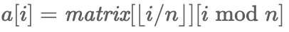

```java
// 左闭右闭
public boolean searchMatrix(int[][] matrix, int target) {
    int m = matrix.length;
    int n = matrix[0].length;
    int left = 0;
    int right = m * n - 1;
    while (left <= right) {
        int mid = left + (right-left)/2;
        int x = matrix[mid / n][mid % n];
        if (x == target) {
            return true;
        }
        else if (x < target) {
            left = mid+1;
        } else {
            right = mid-1;
        }
    }
    return false;
}
```

#### 【🔥简】[35搜索插入位置](https://leetcode.cn/problems/search-insert-position/)

> 给定一个排序数组和一个目标值，在数组中找到目标值，并返回其索引。如果目标值不存在于数组中，返回它将会被按顺序插入的位置。
>
> 请必须使用时间复杂度为 `O(log n)` 的算法。

如果 while 循环没有返回 return middle，说明最后一定是 left>right 从而跳出循环的，分析一下变化过程：

* **开始时 left(比如3)<right(4)**：nums[left]<target<nums[right]=nums[left+1]

  此时 mid=left，由于 nums[mid]=nums[left]<target，所以 left=mid+1=left+1=right

* **中期 left(4)=right(4)**：target<nums[left]=nums[right]

  此时 mid=left=right，由于nums[mid]>target，所以 right=mid-1=left-1

* **最后 right(3)<left(4)**：nums[right]=nums[left-1]<target<nums[left]

所以 target 插入位置应该是 left

```java
// 左闭右闭
public int searchInsert(int[] nums, int target) {
    int left = 0;
    int right = nums.length - 1;
    while (left <= right) {
        int mid = left + (right - left) / 2;
        if (nums[mid] == target) {
            return mid;
        } else if (nums[mid] > target) {
            right = mid - 1;
        } else {
            left = mid + 1;
        }
    }
    // 未找到目标值
    return left;
}
```

#### 【🔥中】[34在排序数组中查找元素的第一个和最后一个位置](https://leetcode.cn/problems/find-first-and-last-position-of-element-in-sorted-array/)

> 给你一个按照非递减顺序排列的整数数组 `nums`，即 nums[i] <= nums[i + 1]，和一个目标值 `target`。请你找出给定目标值在数组中的开始位置和结束位置。
>
> 如果数组中不存在目标值 `target`，返回 `[-1, -1]`。
>
> 你必须设计并实现时间复杂度为 `O(log n)` 的算法解决此问题。
>
> **示例 1：**
>
> ```
> 输入：nums = [5,7,7,8,8,10], target = 8
> 输出：[3,4]
> ```
>
> **示例 2：**
>
> ```
> 输入：nums = [5,7,7,8,8,10], target = 6
> 输出：[-1,-1]
> ```

**lowerBound 返回最小的满足 nums[i] >= target 的下标 i**

> ⚠️注意：与35搜索插入位置不同的是本题中**数组可能有重复元素**

* 在普通的二分查找中，如果 `nums[mid] == target`，我们通常直接 `return mid`，但在寻找**第一个**满足 `>= target` 的位置时，即使 `nums[mid] == target`，它**可能不是第一个**（左边可能还有相同的值）。因此，策略是：

  - 如果 `nums[mid] >= target`：说明 `mid` 是一个**候选答案**，但我们要找更靠左的，所以**不能排除 `mid` 左边的区域**，但 `mid` 本身有可能是答案，所以把右边界收缩到 `mid - 1`，把 `mid` 留在“可能是答案”的备选区外，但通过 `right = mid - 1` 让下一轮循环去检查 `mid` 的左边；

  - 如果 `nums[mid] < target`：说明 `mid` 以及 `mid` 左边的所有数都太小了，绝对不可能是答案，所以直接把左边界收缩到 `mid + 1`


* **正确答案是如何最终被找回来的呢？——通过循环结束时的 `left` 指针**

  算法不断地把“疑似答案”的 `mid` 踢出区间，向左压缩，直到撞墙（遇到 `< target` 的数或边界）。然后左边界不断收缩指导 `left`停在了**最左边**那个满足条件的位置（不一定是曾经踢出的 mid）

```java
class Solution {
    public int[] searchRange(int[] nums, int target) {
        int start = lowerBound(nums, target);
        // 数组为空或者所有数都<target或所有数都>target
        if (start == nums.length || nums[start] != target) {
            return new int[]{-1, -1}; // nums 中没有 target
        }
        // 如果 start 存在，那么 end 必定存在
        int end = lowerBound(nums, target + 1) - 1;
        return new int[]{start, end};
    }
		// 左闭右闭
    private int lowerBound(int[] nums, int target) {
        int left = 0;
        int right = nums.length - 1;
        while (left <= right) {
            int mid = left + (right - left) / 2;
            if (nums[mid] >= target) {
                right = mid - 1; 
            } else {
                left = mid + 1; 
            }
        }
        return left;
    }
}
```

> ⚠️注意：`start == nums.length || nums[start] != target`
>
> * 如果数组为空或者所有数都 <target，则 lowerBound 返回 nums.length；如果数组所有数都 >target，则返回 0
> 
>* 但是不能用 lowerBound 是否返回0来判断是否返回 [-1,-1]，因为可能 nums[0]=target，所以应该用返回值所在位置的元素是否等于 target

#### 【🔥中】[153寻找旋转排序数组中的最小值](https://leetcode.cn/problems/find-minimum-in-rotated-sorted-array/)

> 已知一个长度为 `n` 的数组，预先按照升序排列，经由 `1` 到 `n` 次 **旋转** 后，得到输入数组。例如，原数组 `nums = [0,1,2,4,5,6,7]` 在变化后可能得到：
>
> - 若旋转 `4` 次，则可以得到 `[4,5,6,7,0,1,2]`
> - 若旋转 `7` 次，则可以得到 `[0,1,2,4,5,6,7]`
>
> 注意，数组 `[a[0], a[1], a[2], ..., a[n-1]]` **旋转一次** 的结果为数组 `[a[n-1], a[0], a[1], a[2], ..., a[n-2]]` 。
>
> 给你一个元素值 **互不相同** 的数组 `nums` ，它原来是一个升序排列的数组，并按上述情形进行了多次旋转。请你找出并返回数组中的 **最小元素** 。
>
> 你必须设计一个时间复杂度为 `O(log n)` 的算法解决此问题。

**旋转排序数组的性质：**

设 x=nums[mid] 是现在二分取到的数，将 x 与最后一个数 nums[n−1] 比大小，就可以判断 x 和数组最小值的位置关系

* **如果 x>nums[n−1]**，那么可知：

  * nums 一定被分成左右两个递增段，第一段的所有元素均大于第二段的所有元素

  * x 在第一段，最小值是第二段的第一个元素
  * 所以 x 一定在最小值的左边

* **如果 x≤nums[n−1]**，那么可知：x 在第二段，此时 x 在最小值右边；或者 nums 就是递增数组，此时只有一段，x 要么是最小值要么在最小值右边

由此，可以不断地缩小数组最小值所在位置的范围，二分找到数组最小值

```java
// 左闭右闭
public int findMin(int[] nums) {
    int left = 0;
    int right = nums.length - 1; 
    //【⚠️注意】当 left == right 时，我们就找到了答案，不需要再进入循环，所以 while 循环条件是 left<right
    while (left < right) {
        int mid = (left + right) >>> 1;
        // 【核心逻辑】与最右侧元素比较
        if (nums[mid] > nums[nums.length - 1]) {
            left = mid + 1;
        } else {
            right = mid;
        }
    }
    // 循环结束时 left == right，即为最小值下标
    return nums[right];
}
```

#### 【🔥中】[33搜索旋转排序数组](https://leetcode.cn/problems/search-in-rotated-sorted-array/)

> 整数数组 `nums` 按升序排列，数组中的值 **互不相同** 。
>
> 在传递给函数之前，`nums` 在预先未知的某个下标 `k`（`0 <= k < nums.length`）上进行了 **向左旋转**，使数组变为 `[nums[k], nums[k+1], ..., nums[n-1], nums[0], nums[1], ..., nums[k-1]]`（下标 **从 0 开始**计数）。例如， `[0,1,2,4,5,6,7]` 下标 `3` 上向左旋转后可能变为 `[4,5,6,7,0,1,2]` 。
>
> 给你 **旋转后** 的数组 `nums` 和一个整数 `target` ，如果 `nums` 中存在这个目标值 `target` ，则返回它的下标，否则返回 `-1` 。
>
> 你必须设计一个时间复杂度为 `O(log n)` 的算法解决此问题。

**法一、两次二分（153+704）**

**1、首先 [153](https://leetcode.cn/problems/find-minimum-in-rotated-sorted-array/solution/by-endlesscheng-owgd/) 找到 nums 的最小值的下标 i**

**2、判断 target 在哪一段有序区间后 [704](https://leetcode.cn/problems/binary-search/) 二分查找**

*根据旋转排序数组的定义，下标在 [0,i−1] 中的元素都比下标在 [i,n−1] 中的元素大（注意题目保证 nums 没有重复元素）。特别地，如果 i=0，那么 nums 就是严格递增数组，没有发生旋转*

根据这一性质，分类讨论：

* **如果 target>nums[n−1]**，那么 target 只可能在子数组 **[0,i−1]** 中。由于子数组 [0,i−1] 是递增的，我们可以在 [0,i−1] 中二分查找 target
* **如果 target≤nums[n−1]**，那么 target 只可能在子数组 **[i,n−1]** 中。由于子数组 [i,n−1] 是递增的，我们可以在 [i,n−1] 中二分查找 target

注意上述讨论兼容 i=0 的情况：

* 如果 target>nums[n−1]，由于 nums 是递增的，所以 target 比 nums 中的每个数都要大，所以 nums 不存在 target。顺带一提，此时代码二分查找中的 nums[right] == target 相当于 nums[0] == target，这一定是 false

* 如果 *target*≤*nums*[*n*−1]，那么在 [*i*,*n*−1] 中二分也就是在 [0,*n*−1] 中二分

```java
// 全部用左闭右闭
class Solution {
    public int search(int[] nums, int target) {
        // 1. 找到旋转点（最小值的下标）
        int i = findMin(nums);
        // 2. 判断 target 在哪一段有序区间
        // (1) target 只可能在第一段 [0, i-1]
        if (target > nums[nums.length - 1]) {
            return search(nums, 0, i - 1, target); // 注意：如果 i 为 0，说明数组未旋转或旋转了一圈，此时右边界为 -1，区间无效
        } else { // (2) target 只可能在第二段 [i, n-1]
            return search(nums, i, nums.length - 1, target);
        }
    }


    // 二分寻找旋转排序数组中最小值的下标（153）
    private int findMin(int[] nums) {
        int left = 0;
        int right = nums.length - 1;
        while (left < right) { 
            int mid = left + (right - left) / 2;
            if (nums[mid] > nums[nums.length - 1]) {
                left = mid + 1;
            } else {
                right = mid;
            }
        }
        return left;
    }

    // 二分查找（704）
    private int search(int[] nums, int left, int right, int target) {
        // 边界检查：如果区间本身就不合法（例如左 > 右），直接返回 -1
        if (left > right) return -1;
        while (left <= right) {
            int mid = left + (right - left) / 2;
            if (nums[mid] == target) {
                return mid;
            } else if(nums[mid] < target) {
                left = mid + 1;
            } else{
                right = mid - 1; 
            }
        }
        return -1;
    }
}
```

**法二、一次二分**

设 x=nums[mid] 是二分取到的数，把 x 和 target 与 nums[n−1] 比大小，可以知道这两个数在哪一段

分类讨论：

* 如果 x 和 target 在不同的递增段：
  * 如果 target 在第一段，x 在第二段，说明 target 在 x 的左边
  * 如果 x 在第一段，target 在第二段，说明 target 在 x 的右边
* 如果 x 和 target 在相同的递增段：
  * 和 lowerBound 函数一样，比较 x 和 target 的大小即可

```java
class Solution {
    public int search(int[] nums, int target) {
        int n = nums.length;
        int last = nums[n - 1]; // 参照物：最后一个元素
        int left = 0;
        int right = n - 1;
        while (left <= right) { // 闭区间不为空
            int mid = left + (right - left) / 2;
            int x = nums[mid];
            if (x == target) {
                return mid;
            }
            // 1、mid 在右侧有序段
            if (x <= last) { 
                // target 也在右侧有序段，且在 mid 右边
                if (target <= last && target > x) left = mid + 1;
                // target 也在右侧有序段，且在 mid 左边；或者 target 在左侧有序段，还是在 mid 左边
                else right = mid - 1;
            } else { // 2、mid 在左侧有序段
                // target 也在左侧有序段，且在 mid 左边
                if (target > last && target < x) right = mid - 1;
                // target 也在左侧有序段，且在 mid 右边；或者 target 在右侧有序段，还是在 mid 右边
                else left = mid + 1;
            }
        }
        return -1;
    }
}
```

### 数组双指针

#### [27移除元素](https://leetcode.cn/problems/remove-element/)（快慢双指针）<a id="27"></a>

> 给你一个数组 nums 和一个值 val，你需要 原地 移除所有数值等于 val 的元素，并返回移除后数组的新长度。
>
> 不要使用额外的数组空间，你必须仅使用 O(1) 额外空间并**原地**修改输入数组。
>
> 元素的顺序可以改变。你不需要考虑数组中超出新长度后面的元素。
>
> 示例 1: 给定 nums = [3,2,2,3], val = 3, 函数应该返回新的长度 2, 并且 nums 中的前两个元素均为 2。 你不需要考虑数组中超出新长度后面的元素。
>
> 示例 2: 给定 nums = [0,1,2,2,3,0,4,2], val = 2, 函数应该返回新的长度 5, 并且 nums 中的前五个元素为 0, 1, 3, 0, 4。
>
> **你不需要考虑数组中超出新长度后面的元素。**

法一、暴力解法：两层for循环，对原数组进行修改，一个for循环遍历数组元素，第二个for循环更新数组

```java
class Solution {
    public int removeElement(int[] nums, int val) {
        int size=nums.length; //数组只能覆盖元素，不能删除元素，因此数组的大小nums.length始终不变，为了后面的循环不再考虑尾部空出的元素，因此对用size作为循环的限制，并在每次覆盖一个元素后使size-1
        for(int i=0;i<size;i++){
            if(nums[i]==val){
                for(int j=i+1;j<size;j++){
                    nums[j-1]=nums[j];
                }
                i--; //因为下标i以后的数值都向前移动了一位，所以i也向前移动一位
                size--;
            }
        }
        return size;
    }
}
```

相当于

```java
while (list.contains(Integer.valueOf(2))) {
    list.remove(Integer.valueOf(2));
}
```

- 时间复杂度：O(n^2^)
- 空间复杂度：O(1)

法二、**双指针法**（快慢指针法）：**通过同向的一个快指针和一个慢指针在一个for循环内创建新数组**

**关键：快慢指针的定义**

- **快指针负责控制for循环遍历旧数组**：指向旧数组的每个元素下标，从而寻找新数组元素
- **慢指针负责创建新数组**：指向新数组下一个元素的下标

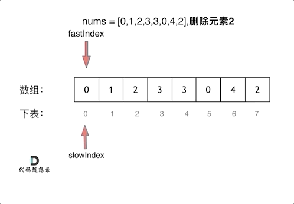

```java
class Solution {
    public int removeElement(int[] nums, int val) {
        int slowIndex = 0; //慢指针
        for (int fastIndex = 0; fastIndex < nums.length; fastIndex++) { //快指针
            if (nums[fastIndex] != val) {
                nums[slowIndex++] = nums[fastIndex]; //这里用slowIndex++简化了代码
            }
        }
        return slowIndex;
    }
}
```

#### 【🔥简】[283移动零](https://leetcode.cn/problems/move-zeroes/)（快慢双指针）<a id="283"></a>

> 给定一个数组 `nums`，编写一个函数将所有 `0` 移动到数组的末尾，同时保持非零元素的相对顺序。
>
> **请注意** ，必须在不复制数组的情况下原地对数组进行操作。

创建两个指针 i 和 j，第一次遍历的时候指针 j 用来记录当前有多少 非0元素。即遍历的时候每遇到一个非0元素就将其往数组左边挪，第一次遍历完后，j 指针的下标就指向了最后一个非0元素下标

第二次遍历的时候，起始位置就从 `j` 开始到结束，将剩下的这段区域内的元素全部置为 `0`

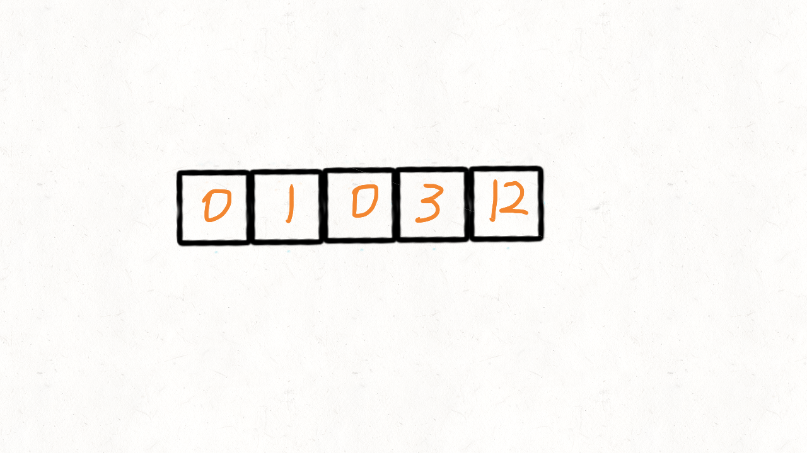

```java
class Solution {
	public void moveZeroes(int[] nums) {
		if(nums==null) {
			return;
		}
		//第一次遍历的时候，j指针记录非0的个数，只要是非0的统统都赋给nums[j]
		int j = 0;
		for(int i=0;i<nums.length;i++) {
			if(nums[i]!=0) {
				nums[j++] = nums[i];
			}
		}
		//非0元素统计完了，剩下的都是0了
		//所以第二次遍历把末尾的元素都赋为0即可
		for(int i=j;i<nums.length;i++) {
			nums[i] = 0;
		}
	}
}	
```

#### [977有序数组的平方](https://leetcode.cn/problems/squares-of-a-sorted-array/)（相向双指针）<a id="977"></a>

> 给你一个按非递减顺序排序的整数数组 nums，返回每个数字的平方 组成的新数组，要求也按非递减顺序排序。
>
> 示例 1：
>
> - 输入：nums = [-4,-1,0,3,10]
> - 输出：[0,1,9,16,100]
> - 解释：平方后，数组变为 [16,1,0,9,100]，排序后，数组变为 [0,1,9,16,100]
>
> 示例 2：
>
> - 输入：nums = [-7,-3,2,3,11]
> - 输出：[4,9,9,49,121]

法一、直接排序

```java
class Solution {
    public int[] sortedSquares(int[] nums) {
        int[] ans = new int[nums.length];
        for (int i = 0; i < nums.length; ++i) {
            ans[i] = nums[i] * nums[i];
        }
        Arrays.sort(ans);
        return ans;
    }
}
```

法二、双指针法

数组平方的最大值就在数组的两端，不是最左边就是最右边，不可能是中间。

i指向起始位置，j指向终止位置，k指向新数组的下标

定义一个新数组result，和A数组一样的大小，让k指向result数组终止位置。

* 如果 `A[i] * A[i] < A[j] * A[j]` 那么 `result[k--] = A[j] * A[j];`

* 如果 `A[i] * A[i] >= A[j] * A[j]` 那么 `result[k--] = A[i] * A[i];`

如动画所示：

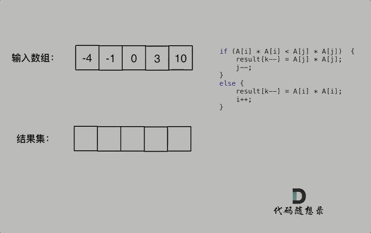

```java
class Solution {
    public int[] sortedSquares(int[] nums) {
        int i=0, j=nums.length-1;
        int[] result=new int[nums.length];
        int k=result.length-1;
        while(i<=j){
            if(nums[i]*nums[i]<nums[j]*nums[j]){
                result[k--]=nums[j]*nums[j];
                j--;
            }else{
                result[k--]=nums[i]*nums[i];
                i++;
            }
        } 
        return result;
    }
}
```

时间复杂度为O(n)，相对于暴力排序的解法O(n + nlog n)还是提升不少的

#### 【🔥中】[11盛最多水的容器](https://leetcode.cn/problems/container-with-most-water/description/?envType=study-plan-v2&envId=top-100-liked)（相向双指针）<a id="11"></a>

> 给定一个长度为 `n` 的整数数组 `height` 。有 `n` 条垂线，第 `i` 条线的两个端点是 `(i, 0)` 和 `(i, height[i])` 。
>
> 找出其中的两条线，使得它们与 `x` 轴共同构成的容器可以容纳最多的水。
>
> 返回容器可以储存的最大水量。

设两指针 i , j ，指向的水槽板高度分别为 h[i] , h[j] ，此状态下水槽面积为 S(i,j) 。由于可容纳水的高度由两板中的 短板 决定，因此可得如下 面积公式 ：

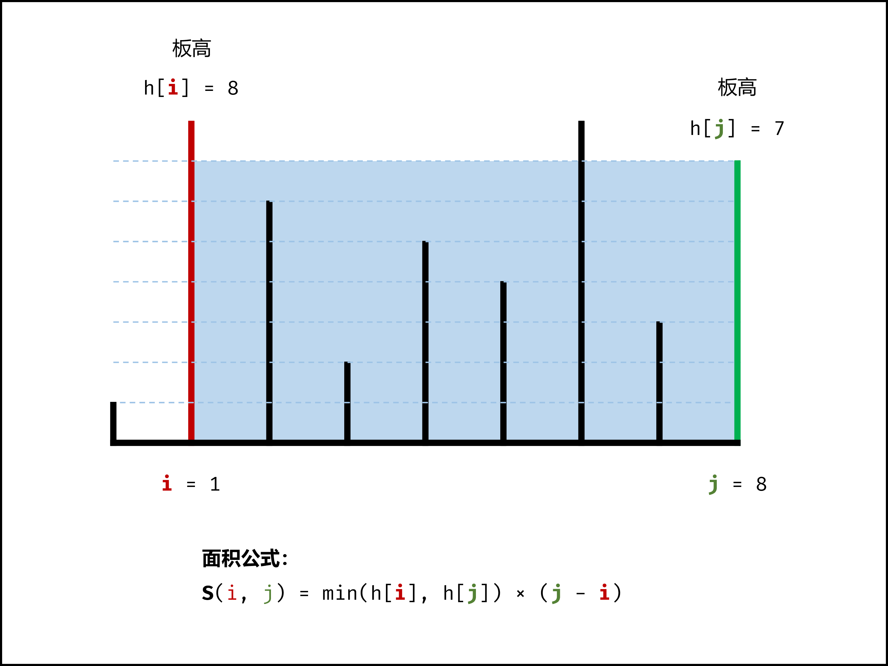

每次移动木板都只有三种情况，比原短板短；比原短板长；与原短板相等

* 若向内移动长板，如果新的木板比原短板短，则新短板更短；如果与原短板相等或者比原短板长，则新短板不变。再加上底边宽度变短，因此面积一定变小
* 若向内移动短板，新的木板可能比原短板长，则新短板变长，因此面积可能增大

算法流程：

1. 初始化：双指针 i , j 分列水槽左右两端；

2. 循环收窄：每轮先更新面积最大值，再找到短板，将短板向内移动一格，直到两指针相遇时跳出

   *注意：如果在循环外先算好初始面积，更新面积就可以放在移动指针后面*

3. 返回值：返回面积最大值 res

```java
class Solution {
    public int maxArea(int[] height) {
        int i = 0, j = height.length - 1, res = 0;
        while(i < j) {
            res = height[i] < height[j] ? 
                Math.max(res, (j - i) * height[i++]): // i是短板
                Math.max(res, (j - i) * height[j--]);  // j是短板
        }
        return res;
    }
}

// 	相当于
class Solution {
    public int maxArea(int[] height) {
        int i = 0;
        int j = height.length - 1;
        int res = 0;
        while (i < j) {
            res = Math.max(res, Math.min(height[i], height[j]) * (j - i));
            if (height[i] < height[j]) {
                i++; // 左边短，左指针右移
            } else {
                j--; // 右边短（或相等），右指针左移
            }
        }  
        return res;
    }
}
```

#### 【🔥中】[75颜色分类](https://leetcode.cn/problems/sort-colors/)（同向双指针维护边界）<a id="75"></a>

> 给定一个包含红色、白色和蓝色、共 `n` 个元素的数组 `nums` ，**[原地](https://baike.baidu.com/item/原地算法)** 对它们进行排序，使得相同颜色的元素相邻，并按照红色、白色、蓝色顺序排列。
>
> 我们使用整数 `0`、 `1` 和 `2` 分别表示红色、白色和蓝色。
>
> 必须在不使用库内置的 sort 函数的情况下解决这个问题。

**法一：单指针两次遍历**

可以考虑对数组进行两次遍历。在第一次遍历中，我们将数组中所有的 0 交换到数组的头部。在第二次遍历中，我们将数组中所有的 1 交换到头部的 0 之后。此时所有的 2 都出现在数组的尾部，这样就完成了排序

具体地，我们使用一个指针 ptr 表示「头部」的范围，ptr 中存储了一个整数，表示数组 nums 从位置 0 到位置 ptr−1 都属于「头部」。ptr 的初始值为 0，表示还没有数处于「头部」

在第一次遍历中，我们从左向右遍历整个数组，如果找到了 0，那么就需要将 0 与「头部」位置的元素进行交换，并将「头部」向后扩充一个位置。在遍历结束之后，所有的 0 都被交换到「头部」的范围，并且「头部」只包含 0

在第二次遍历中，我们从「头部」开始，从左向右遍历整个数组，如果找到了 1，那么就需要将 1 与「头部」位置的元素进行交换，并将「头部」向后扩充一个位置。在遍历结束之后，所有的 1 都被交换到「头部」的范围，并且都在 0 之后，此时 2 只出现在「头部」之外的位置，因此排序完成

```java
public void sortColors(int[] nums) {
    int n = nums.length;
    int ptr = 0;
    for (int i = 0; i < n; ++i) {
        if (nums[i] == 0) {
            int temp = nums[i];
            nums[i] = nums[ptr];
            nums[ptr] = temp;
            ++ptr;
        }
    }
    for (int i = ptr; i < n; ++i) {
        if (nums[i] == 1) {
            int temp = nums[i];
            nums[i] = nums[ptr];
            nums[ptr] = temp;
            ++ptr;
        }
    }
}
```

**法二、双指针一次遍历**

用指针p0来交换0，p1来交换1，初始值都为0

当我们从左向右遍历整个数组时：

* 如果找到1，nums[i] 与 nums[p1] 交换，p1向右移动

* 如果找到0，nums[i] 与 nums[p0] 交换，如果 p0<p1，那么 nums[p0] 一定是1，nums[p1] 一定是移过去的1序列的下一个元素，也就是把p1之前交换回来的1又交换出去了，又由于 nums[p1] 一定是移过去的1序列的下一个元素，因此需要再将 nums[i] 与 nums[p1] 交换，把丢失的1放到1序列的末端，最后 p0、p1 均向右移动

举例：

1. 202110 p0=p1=i=0：nums[i]=2，向右移动i

2. 202110 p0=p1=0，i=1：nums[i]=0，p0=p1，交换nums[i]和nums[p0]，向右移动p0、p1、i
3. 022110 p0=p1=1，i=2：nums[i]=2，向右移动i
4. 022110 p0=p1=1，i=3：nums[i]=1，交换nums[i]和nums[p1]，向右移动p1、i
5. 012210 p0=1，p1=2，i=4：nums[i]=1，交换nums[i]和nums[p1]，向右移动p1、i
6. 011220 p0=1，p1=3，i=5：nums[i]=0，p0<p1，交换nums[i]和nums[p0]变成001221，再交换nums[i]和nums[p1]，变成001122

```java
public void sortColors(int[] nums) {
    int n = nums.length;
    int p0 = 0, p1 = 0;
    for (int i = 0; i < n; ++i) {
        if (nums[i] == 1) {
            int temp = nums[i];
            nums[i] = nums[p1];
            nums[p1] = temp;
            ++p1;
        } else if (nums[i] == 0) {
            int temp = nums[i];
            nums[i] = nums[p0];
            nums[p0] = temp;
            if (p0 < p1) {
                temp = nums[i];
                nums[i] = nums[p1];
                nums[p1] = temp;
            }
            ++p0;
            ++p1;
        }
    }
}
```

### 矩阵相关

#### 【🔥中】[73矩阵置零](https://leetcode.cn/problems/set-matrix-zeroes/description/)

遍历矩阵，用首行/列保存汇总信息；二次遍历，矩阵置零；首行/列特殊处理

> 给定一个 `m * n` 的矩阵，如果一个元素为 **0** ，则将其所在行和列的所有元素都设为 **0** 。请使用 **[原地](http://baike.baidu.com/item/原地算法)** 算法（空间复杂度 O(1)）。
>
> 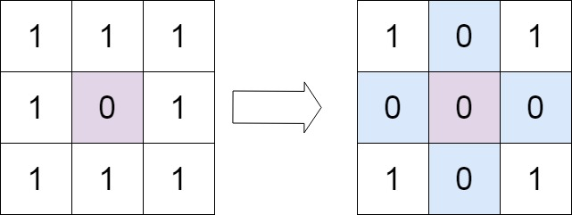
>
> ```
> 输入：matrix = [[1,1,1],[1,0,1],[1,1,1]]
> 输出：[[1,0,1],[0,0,0],[1,0,1]]
> ```

**规则**：对于 matrix[i] [j]，如果 i 行有 0，或者 j 列有 0，那么把 matrix[i] [j] 变成 0，否则 matrix[i] [j] 不变（仍然为 1）

> 问：能不能在发现 matrix[i][j]=0 时，直接把 i 行 j 列全变成 0？
>
> 答：这样做是错误的。如示例 1，如果直接全变成 0，那么继续遍历，发现 matrix[1] [2]=0，我们会误以为 matrix[1] [2] 一开始就是 0，然后把 2 列（最右边那一列）全变成 0

方法一：使用额外数组（遍历两次）

* 用一个长为 m 的布尔数组 rowHasZero 记录每一行是否包含 0
* 用一个长为 n 的布尔数组 colHasZero 记录每一列是否包含 0

遍历 matrix[i] [j]，如果值为 0，那么置 rowHasZero[i]=colHasZero[j]=true

然后，再次遍历 matrix。对于 matrix[i] [j]，如果 rowHasZero[i]=true 或者 colHasZero[j]=true，说明 i 行有 0，或者 j 列有 0，把 matrix[i] [j] 变成 0

```java
public void setZeroes(int[][] matrix) {
    int m = matrix.length;
    int n = matrix[0].length;
    boolean[] rowHasZero = new boolean[m]; // 行是否包含 0
    boolean[] colHasZero = new boolean[n]; // 列是否包含 0
    for (int i = 0; i < m; i++) {
        for (int j = 0; j < n; j++) {
            if (matrix[i][j] == 0) {
                rowHasZero[i] = colHasZero[j] = true;
            }
        }
    }
    for (int i = 0; i < m; i++) {
        for (int j = 0; j < n; j++) {
            if (rowHasZero[i] || colHasZero[j]) { // i 行或 j 列有 0
                matrix[i][j] = 0; // 题目要求原地修改，无返回值
            }
        }
    }
}
```

- 时间复杂度：O(mn)
- 空间复杂度：O(m+n)

方法二：不使用额外数组（第一行/列的特殊处理+两次遍历）

回想一下 Excel 表格，通常用第一行和第一列保存汇总信息

对于本题，能否把数据保存到 matrix 的第一行和第一列中呢？

* 用第一列的 matrix[i] [0] 代替 rowHasZero[i]

* 用第一行的 matrix[0] [j] 代替 colHasZero[j]

遍历matrix，如果matrix[i] [j]=0，那么置 matrix[i] [0]=matrix[0] [j]=0

然后，再次遍历 matrix。对于 matrix[i] [j]，如果 matrix[i] [0]=0 或者 matrix[0] [j]=0，说明 i 行有 0 或者 j 列有 0，把 matrix[i] [j] 变成 0

⚠️注意：如果第一行全为 1，第一列包含 0（或者反过来），我们会置 matrix[0] [0]=0。修改后，根据定义，我们会误认为第一行和第一列都包含 0，最终会把第一行和第一列都变成 0。如何修复这个 bug？

解决办法：在一开始，额外用两个布尔变量分别记录第一行是否包含 0，第一列是否包含 0。最后，如果第一行在一开始就包含 0，那么把第一行全变成 0；如果第一列在一开始就包含 0，那么把第一列全变成 0

既然最后会单独修改第一行和第一列，那么在修改 matrix[i] [j] 时，可以先跳过第一行和第一列，最后再修改

```java
public void setZeroes(int[][] matrix) {
    int m = matrix.length;
    int n = matrix[0].length;
    // 记录第一行是否包含 0
    boolean firstRowHasZero = false; 
    for (int x : matrix[0]) {
        if (x == 0) {
            firstRowHasZero = true;
            break;
        }
    }
    // 记录第一列是否包含 0
    boolean firstColHasZero = false; 
    for (int i = 0; i < m; i++) {
        if (matrix[i][0] == 0) {
            firstColHasZero = true;
            break;
        }
    }
    // 用第一列 matrix[i][0] 保存 rowHasZero[i]
    // 用第一行 matrix[0][j] 保存 colHasZero[j]
    for (int i = 1; i < m; i++) { // 无需遍历第一行，如果 matrix[0][j] 本身是 0，那么相当于 colHasZero[j] 已经是 true
        for (int j = 1; j < n; j++) { // 无需遍历第一列，如果 matrix[i][0] 本身是 0，那么相当于 rowHasZero[i] 已经是 true
            if (matrix[i][j] == 0) {
                matrix[i][0] = 0; // 相当于 rowHasZero[i] = true
                matrix[0][j] = 0; // 相当于 colHasZero[j] = true
            }
        }
    }
    for (int i = 1; i < m; i++) { // 跳过第一行，留到最后修改
        for (int j = 1; j < n; j++) { // 跳过第一列，留到最后修改
            if (matrix[i][0] == 0 || matrix[0][j] == 0) { // i 行或 j 列有 0
                matrix[i][j] = 0;
            }
        }
    }
    // 如果第一列一开始就包含 0，那么把第一列全变成 0
    if (firstColHasZero) {
        for (int[] row : matrix) {
            row[0] = 0;
        }
    }
    // 如果第一行一开始就包含 0，那么把第一行全变成 0
    if (firstRowHasZero) {
        Arrays.fill(matrix[0], 0);
    }
}
```

#### 【🔥中】[54螺旋矩阵](https://leetcode.cn/problems/spiral-matrix/description/)

定义方向数组和方向下标，遇到已访问（即已标记）的元素或者边界方向下标加一（向右转90度）

> 给你一个 `m` 行 `n` 列的矩阵 `matrix` ，请按照 **顺时针螺旋顺序** ，返回矩阵中的所有元素。
>
> 
>
> ```
> 输入：matrix = [[1,2,3],[4,5,6],[7,8,9]]
> 输出：[1,2,3,6,9,8,7,4,5]
> ```

根据题意，我们从左上角 (0,0) 出发，按照「右下左上」的顺序前进：

* 首先向右走，如果到达矩阵边界，则向右转90度，前进方向变为向下；
* 然后向下走，如果到达矩阵边界，则向右转90度，前进方向变为向左；
* 然后向左走，如果到达矩阵边界，则向右转90度，前进方向变为向上；
* 然后向上走，先从 7 走到 4，然后从 4 准备向上走，但上面的 1 是一个已经访问过的数字，那么向右转90度，前进方向变为向右
* 重复上述过程，直到答案的长度为 mn

标记法：

1. 对于已经访问过的数字，可将其标记为 ∞ 或者空，从而避免重复访问
2. 用一个长为 4 的方向数组 DIRS=[(0,1),(1,0),(0,−1),(−1,0)] 分别表示右下左上 4 个方向。同时用一个下标 di 表示当前方向，初始值为 0，表示一开始向右
3. 每次移动，相当于把行号增加 DIRS[di] [0]，把列号增加 DIRS[di] [1]
4. 向右转90度，相当于把 di 增加 1，但在 di=3 时要回到 di=0。两种情况合二为一，di 的更新就是 (di+1)mod4

```java
class Solution {
    private static final int[][] DIRS = {{0, 1}, {1, 0}, {0, -1}, {-1, 0}}; // 右下左上

    public List<Integer> spiralOrder(int[][] matrix) {
        int m = matrix.length;
        int n = matrix[0].length;
        List<Integer> res = new ArrayList<>(m * n); // 预分配空间
        int i = 0;
        int j = 0;
        int di = 0;
        for (int k = 0; k < m * n; k++) { // 一共走 mn 步
            res.add(matrix[i][j]);
            matrix[i][j] = Integer.MAX_VALUE; // 标记，表示已经访问过
            int x = i + DIRS[di][0];
            int y = j + DIRS[di][1]; // 下一步的位置
            // 如果 (x, y) 出界或者已经访问过
            if (x < 0 || x >= m || y < 0 || y >= n || matrix[x][y] == Integer.MAX_VALUE) di = (di + 1) % 4; // 右转 90°
            i += DIRS[di][0];
            j += DIRS[di][1]; // 走一步
        }
        return res;
    }
}
```

#### 【🔥中】[48旋转图像](https://leetcode.cn/problems/rotate-image/description/)

两次翻转（对角转置+行翻转）等于一次旋转

> 给定一个 *n* × *n* 的二维矩阵 `matrix` 表示一个图像。请你将图像顺时针旋转 90 度。
>
> 你必须在**[ 原地](https://baike.baidu.com/item/原地算法)** 旋转图像，这意味着你需要直接修改输入的二维矩阵。**请不要** 使用另一个矩阵来旋转图像。
>
> 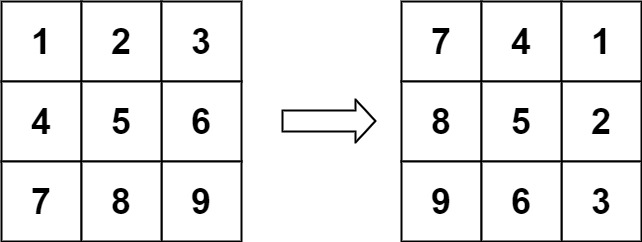
>
> ```
> 输入：matrix = [[1,2,3],[4,5,6],[7,8,9]]
> 输出：[[7,4,1],[8,5,2],[9,6,3]]
> ```

顺时针旋转90度后，位于 (i,j) 的元素去哪了？

竖着看：

* 第一列的元素去到第一行
* 第二列的元素去到第二行
* ……
* 第 j 列的元素去到第 j 行

横着看：

* 第一行的元素去到最后一列
* 第二行的元素去到倒数第二列
* ……
* 第 i 行的元素去到第 n−1−i 列（i 从 0 开始）

所以位于 i 行 j 列的元素，去到 j 行 n−1−i 列，即 **(i,j)→(j,n−1−i)**

**两次翻转等于一次旋转**：(*i*,*j*)→(*j*,*n*−1−*i*) 可以通过两次翻转操作得到

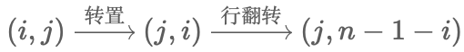

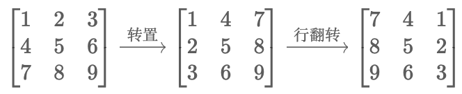

1. **转置**：把矩阵按照主对角线翻转，位于 (*i*,*j*) 的元素去到 (*j*,*i*)

   实现：把主对角线下面的元素 *matrix*[i] [j] 和（关于主对角线）对称位置的元素 *matrix*[j] [i] 交换

2. **行翻转**：把每一行翻转，位于 (*j*,*i*) 的元素去到 (*j*,*n*−1−*i*)

   实现：遍历每一行 row=matrix[i]，把左半边的元素 row[j] 和（关于垂直中轴）对称位置的元素 row[n−1−j] 交换


```java
public void rotate(int[][] matrix) {
    int n = matrix.length;
    // 第一步：转置
    for (int i = 0; i < n; i++) {
        for (int j = 0; j < i; j++) { // 遍历对角线下方元素
            int tmp = matrix[i][j];
            matrix[i][j] = matrix[j][i];
            matrix[j][i] = tmp;
        }
    }
    // 第二步：行翻转
    for (int[] row : matrix) {
        for (int j = 0; j < n / 2; j++) { // 遍历左半元素
            int tmp = row[j];
            row[j] = row[n - 1 - j];
            row[n - 1 - j] = tmp;
        }
    }
}
```

#### 【🔥中】[240搜索二维矩阵II](https://leetcode.cn/problems/search-a-2d-matrix-ii/description/)

> 编写一个高效的算法来搜索 `m * n` 矩阵 `matrix` 中的一个目标值 `target` 。该矩阵具有以下特性：
>
> - 每行的元素从左到右升序排列。
> - 每列的元素从上到下升序排列。
>
> 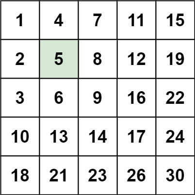
>
> ```
> 输入：matrix = [[1,4,7,11,15],[2,5,8,12,19],[3,6,9,16,22],[10,13,14,17,24],[18,21,23,26,30]], target = 5
> 输出：true
> ```

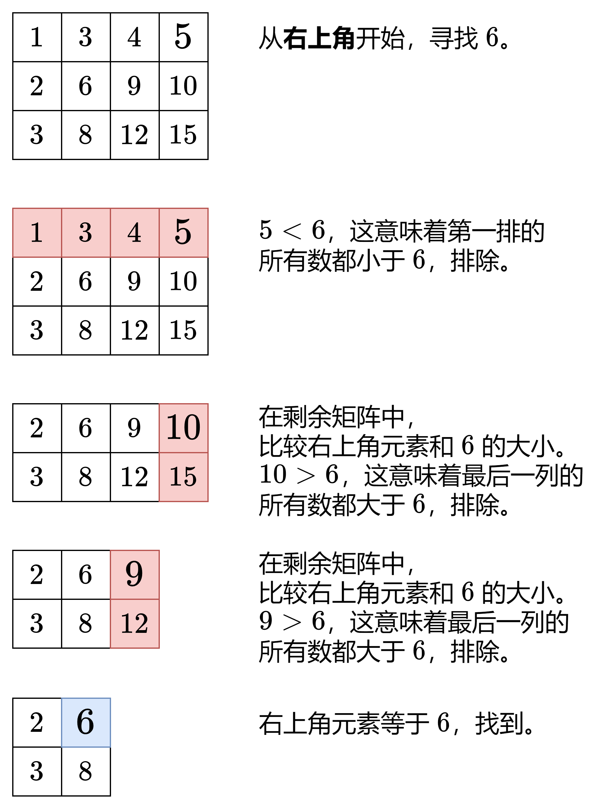

*注：也可以从矩阵左下角开始，方法类似*

总结：利用 matrix 行列有序的性质，我们可以用 O(1) 的时间获取 O(m) 或 O(n) 的信息。相比之下，O(mn) 的暴力查找（一个一个地找），每次花费 O(1) 的时间，只获取了 O(1) 的信息

```java
public boolean searchMatrix(int[][] matrix, int target) {
    int i = 0;
    int j = matrix[0].length - 1; // 从右上角开始
    while (i < matrix.length && j >= 0) { // 还有剩余元素
        if (matrix[i][j] == target) return true; // 找到 target
        if (matrix[i][j] < target) i++; // 这一行剩余元素全部小于 target，排除
        else j--; // 这一列剩余元素全部大于 target，排除
    }
    return false;
}
```

### 其他

#### 【🔥中】[189轮转数组](https://leetcode.cn/problems/rotate-array/description/)（三次反转）

> 给定一个整数数组 `nums`，将数组中的元素向右轮转 `k` 个位置，其中 `k` 是非负数。
>
> ```
> 输入: nums = [1,2,3,4,5,6,7], k = 3
> 输出: [5,6,7,1,2,3,4]
> 解释:
> 向右轮转 1 步: [7,1,2,3,4,5,6]
> 向右轮转 2 步: [6,7,1,2,3,4,5]
> 向右轮转 3 步: [5,6,7,1,2,3,4]
> ```

**思路：**

示例中，我们要把 [1,2,3,4,5,6,7] 变成 [5,6,7,1,2,3,4]

把 [5,6,7,1,2,3,4] 视作 [5,6,7]+[1,2,3,4]，首先要保证 [5,6,7] 在 [1,2,3,4] 前面，这可以通过反转 [1,2,3,4,5,6,7] 得到

反转后数组变成 [7,6,5,4,3,2,1]，即 [7,6,5]+[4,3,2,1]，对比最终目标，只需把 [7,6,5] 反转，把 [4,3,2,1] 反转，就得到了 [5,6,7,1,2,3,4]

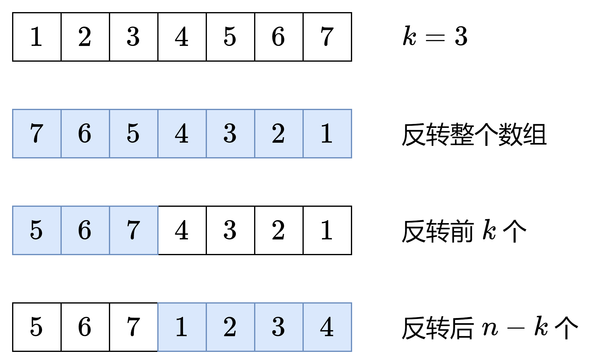

*在反转的过程中，每个子数组都被反转了两次，顺序保持不变，比如 [1,2,3,4]->[4,3,2,1]->[1,2,3,4]*

**算法：**

这里假设 0≤k<n，对于 k≥n 的情况，可以转换成 0≤k<n 的情况

设 nums=A+B，其中 A 是 nums 的前 n−k 个数，B 是后 k 个数。在上例中，A=[1,2,3,4]，B=[5,6,7]

题目要求把 A+B 变成 B+A，这可以用三次反转实现：

* 把 nums=A+B 反转，我们得到了 rev(B)+rev(A)。在上例中，rev(B)+rev(A)=[7,6,5]+[4,3,2,1]
* 单独反转 rev(B)，因为一个数组反转两次是不变的，所以 rev(rev(B))=B，我们得到了 B
* 单独反转 rev(A)，得到 rev(rev(A))=A

现在数组变成 B+A。在上例中，B+A=[5,6,7]+[1,2,3,4]，正是我们想要的结果

```java
public void rotate(int[] nums, int k) {
    int n = nums.length;
    k %= n; // 轮转 k 次等于轮转 k % n 次
    reverse(nums, 0, n - 1);
    reverse(nums, 0, k - 1);
    reverse(nums, k, n - 1);
}
private void reverse(int[] nums, int i, int j) {
    while (i < j) {
        int temp = nums[i];
        nums[i++] = nums[j];
        nums[j--] = temp;
    }
}
```

## 二、链表

### 理论基础

链表是一种通过指针串联在一起的线性结构，每一个节点由两部分组成，一个是数据域一个是指针域（存放指向下一个节点的指针），最后一个节点的指针域指向null（空指针的意思）。

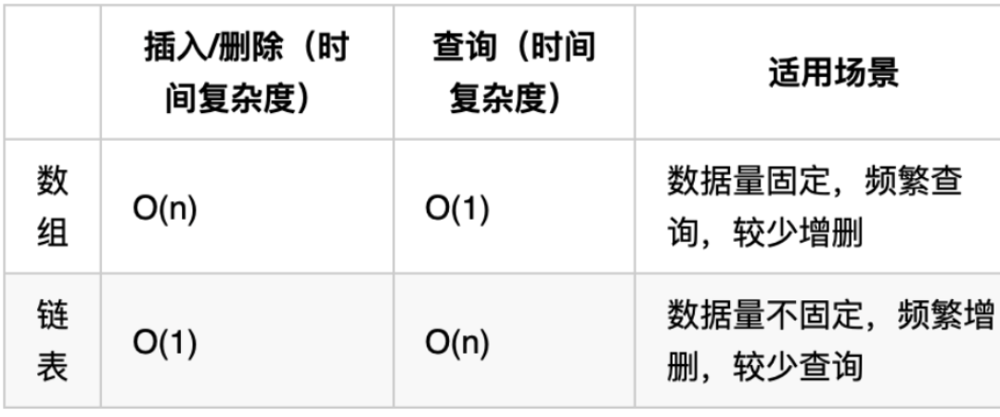

* 链表的好处是可以提高内存的利用效率，节点要用的时候就能接上，不用的时候拆掉就行了，不需要考虑扩缩容和数据搬移的问题，理论上讲，链表是没有容量限制的

* 数组最大的优势是支持通过索引快速访问元素，而链表就不支持，必须按顺序找

  > **注意不能直接用head遍历，要将head赋值给操作指针cur！！**

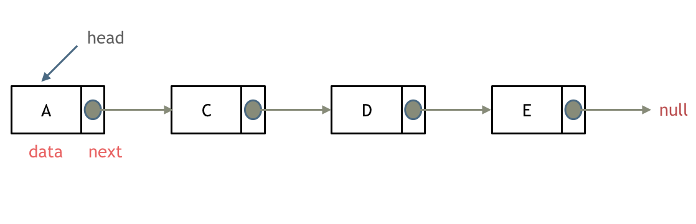

#### 链表的类型

* 单链表中的指针域只能指向节点的下一个节点

* 双链表每一个节点有两个指针域，一个指向下一个节点，一个指向上一个节点，因此其既可以向前查询也可以向后查询

  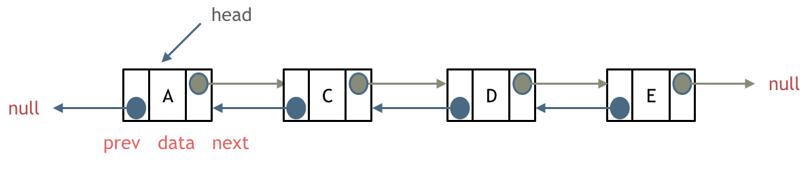

* 循环链表可以用来解决约瑟夫环问题

  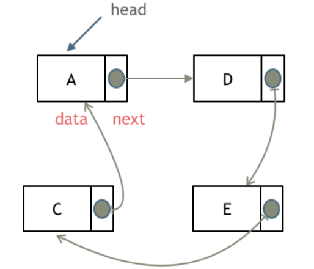

#### 链表节点的定义（重要！！）

* 刷过力扣的读者肯定对单链表非常熟悉，**力扣上的单链表节点定义**如下：

  ```java
  class Node {
      int val;
      Node next;
      Node(int x) { val = x; }
  }
  ```

  通过自己定义构造函数初始化节点：

  ```java
  Node* head = new Node(5);
  ```

  使用默认构造函数初始化节点：

  ```java
  Node* head = new Node();
  head->val = 5;
  ```

  如果不定义构造函数使用默认构造函数的话，在初始化的时候就不能直接给变量赋值！

* 在实际的编程语言中使用的链表节点会稍微复杂一点：

  ```java
  class Node<E> {
      E val;
      Node<E> next, pre;
      Node(E val){this.val = val;}
      // Node(Node<E> pre, E val, Node<E> next) {
          // this.val = val;
          // this.next = next;
          // this.pre = pre;
      // }
  }
  ```

有了 `pre` 前驱指针，链表支持双向遍历，但由于要多维护一个指针，增删查改时会稍微复杂一些。

### [203移除链表元素](https://leetcode.cn/problems/remove-linked-list-elements/description/)（虚拟头节点）

> 删除链表中等于给定值 val 的所有节点。
>
> 示例 1： 输入：head = [1,2,6,3,4,5,6], val = 6 输出：[1,2,3,4,5]
>
> 示例 2： 输入：head = [], val = 1 输出：[]
>
> 示例 3： 输入：head = [7,7,7,7], val = 7 输出：[]

法一、直接使用原来的链表来进行删除操作

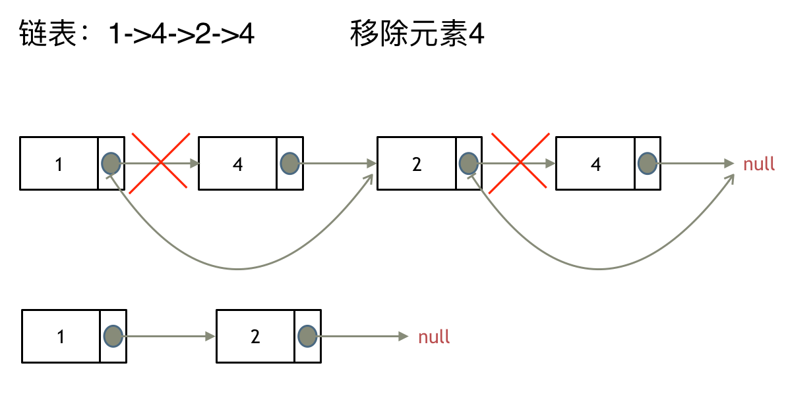

**关键：删除头节点和遍历后续节点时的while循环条件**，注意这里不用if，因为是要遍历每个对应值的元素，if条件只用于后续节点值的判断

* 头节点删除循环条件：`head!=null && head.val==val`

  * 这里的 `head!=null` 条件必须存在，不然 `head.val` 会抛出空指针异常

  * 头节点值为val

* 将起点指针head赋值给操作指针cur，用cur来遍历后续节点，这是为了保留并返回原始的链表头节点

  后续节点遍历条件：`cur!=null && cur.next!=null`

  * `cur!=null` 是为了防止删除头节点后只剩null，此时访问 `null.next` 会抛出空指针 NullPointerException
  * `cur.next!=null` 判断是否到了最后一个节点

```java
/**
 * 时间复杂度 O(n)
 * 空间复杂度 O(1)
 * @param head
 * @param val
 * @return
 */
public Node removeElements(Node head, int val) {
    // 删除头节点的情况，如果前几个节点都符合删除条件，则按序一个个删除，直到head不用被删除
    while(head!=null && head.val==val) {
        head = head.next;
    }
    // 遍历后续节点
    Node cur = head;
    while(cur!=null && cur.next !=null) {
        if(cur.next.val == val){
            cur.next = cur.next.next;
        } else {
            cur = cur.next;
        }
    }
    return head;
}
```

> 会抛出空指针NPE的场景：**你试图在一个值为 `null` 的引用上执行操作**。

法二、**设置一个虚拟头结点在进行删除操作**

目的是**用统一的逻辑来移除链表的节点**，不需要单独对头节点进行操作

> 一般涉及到增删改操作，用虚拟头结点都会方便很多，如果只能查的话，用不用虚拟头结点都差不多。 

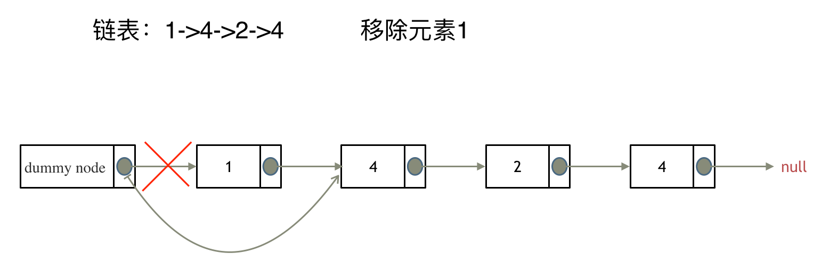

**关键：**

* 设置虚拟头节点 `dummy.next = head`

* 将起点指针head赋值给操作指针cur，用cur来遍历后续节点

  后续节点遍历条件：`cur.next != null`

* 最后return头结点时应该返回 `dummyHead->next`，这才是新的头结点

```java
/**
 * 时间复杂度 O(n)
 * 空间复杂度 O(1)
 */
public Node removeElements(Node head, int val) {
    // 设置一个虚拟的头结点
    Node dummy = new Node();
    dummy.next = head;

    Node cur = dummy;
    while (cur.next != null) {
        if (cur.next.val == val) {
            cur.next = cur.next.next;
        } else {
            cur = cur.next;        
        }
    }
    return dummy.next;
}

```

### [707设计链表](https://leetcode.cn/problems/design-linked-list/)

> 在链表类中实现这些功能：
>
> - get(index)：**获取链表中下标为 `index` 的节点的值**。如果下标无效，则返回 `-1` 。
> - addAtHead(val)：**将一个值为 `val` 的节点插入到链表中第一个元素之前**。
> - addAtTail(val)：**将一个值为 `val` 的节点加到链表的末尾**。
> - addAtIndex(index,val)：**将一个值为 `val` 的节点插入到链表中下标为 `index` 的节点之前**。如果 index 等于链表的长度，则该节点将附加到链表的末尾。如果 index 大于链表长度，则不会插入节点。如果index等于0，则在头部插入节点。
> - deleteAtIndex(index)：如果下标index有效，则**删除链表中下标为index的节点**。
>
> 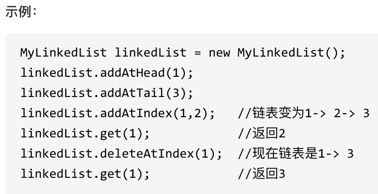

**链表操作的两种方式：**这里采用方式2

1. 直接使用原来的链表来进行操作
2. 设置一个虚拟头（尾）结点在进行操作

*注意：虚拟节点是内部实现，对外不可见*

#### 单链表

**一、int 单链表**

**关键：**

1、单链表的**定义**：单链表节点、size元素个数、head虚拟头节点

单链表的**初始化**：两个值

* size=0; **不算虚拟头节点**

* head=new Node(0);

2、原链表的**下标index从0开始（不算虚拟头节点）**，所以在链表最前面插入节点等价于 `addAtIndex(0, val);`，在最后面插入节点等价于 `addAtIndex(size, val);`

单链表长这样：

```
虚拟头节点head->真正头节点（index=0）->...->...->真正尾节点（index=size-1）
```

3、增删操作都需要**用cur得到下标index-1位置的节点**，也就是新增节点位置或删除节点位置的前一个节点

* 增F节点

  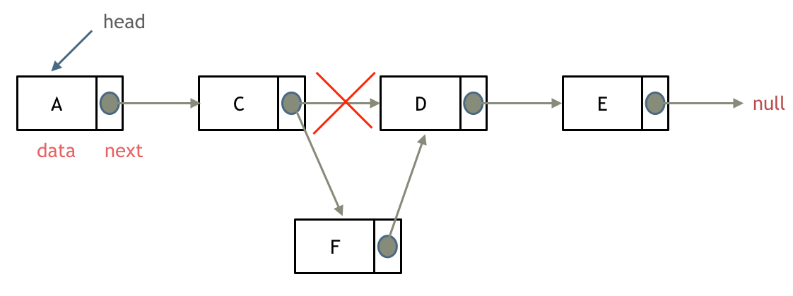

* 删D节点

  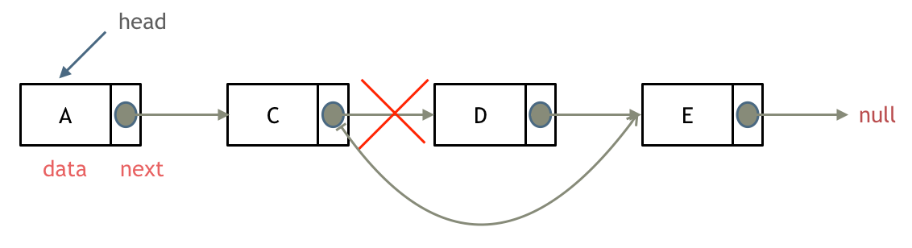

  只要将D节点的前一个C节点的next指针指向E节点就可以了。

  在C++里还需要手动释放这个D节点，释放这块内存。其他语言例如Java、Python有自己的内存回收机制，不用手动释放。

5、增删操作后记得**更新size元素个数**

6、**下标非法的两种情况：**

* get查询操作和deleteAtIndex删操作下标无效的情况是：`index<0 || index>=size`

* addAtIndex增操作下标无效的情况是：`index<0|| index>size`


7、**for循环的两种情况：**

* `i<=index`  get查询操作需要得到下标为index的节点
* `i<index`  addAtIndex增操作和deleteAtIndex删操作需要得到**链表中下标为index-1的节点**

```java
class MyLinkedList {
    private static class Node {
        int val;
        Node next;
        Node(int val) {
            this.val=val;
        }
    }
    //size存储链表元素的个数
    private int size;
    //注意这里记录的是虚拟头结点
    private Node head;

    //初始化链表
    public MyLinkedList() {
        this.size = 0;
        this.head = new Node(0);
    }

    //获取链表中下标为 index 的节点的值。如果下标无效，则返回 -1 
    public int get(int index) {
        //如果index非法，返回-1
        if (index < 0 || index >= size) {
            return -1;
        }
        Node cur = head;
        for (int i = 0; i <= index; i++) {
            cur = cur.next;
        }
        return cur.val;
    }

    public void addAtHead(int val) {
        Node newNode = new Node(val);
        newNode.next = head.next;
        head.next = newNode;
        size++;
        //等价于 addAtIndex(0, val);
    }

    
    public void addAtTail(int val) {
        Node newNode = new Node(val);
        Node cur = head;
        while (cur.next != null) {
            cur = cur.next;
        }
        cur.next = newNode;
        size++;
        //等价于 addAtIndex(size, val);
    }

    //将一个值为 val 的节点插入到链表中下标为 index 的节点之前
    //如果 index 为0，那么新插入的节点为链表的新头节点（不算上虚拟头节点）
    //如果 index 等于链表的长度，则说明是新插入的节点为链表的尾结点
    //如果 index 小于0或大于链表的长度，则返回空
    public void addAtIndex(int index, int val) {
        if (index < 0 || index > size) {
            return;
        }

        //找到下标为index-1的节点，即要插入节点的前一个节点
        Node pre = head;
        for (int i = 0; i < index; i++) {
            pre = pre.next;
        }
        Node newNode = new Node(val);
        newNode.next = pre.next;
        pre.next = newNode;
        size++;
    }

    public void deleteAtIndex(int index) {
        if (index < 0 || index >= size) {
            return;
        }
        
        //因为有虚拟头节点，所以不用对index=0的情况进行特殊处理
        Node pre = head;
        for (int i = 0; i < index ; i++) {
            pre = pre.next;
        }
        pre.next = pre.next.next;
        size--;
    }
}
```

**二、范型单链表以及改进**

**关键：**

1、int单链表和范型单链表的节点初始化写法不同：

* `new Node(0)`  int链表，初始化链表时创建节点应传入0
* `new Node<>(null)`  范型链表，则应传入null

这是因为，`int` 是 Java 的基本数据类型，它不是对象，不能存储 `null`，`null` 只能赋值给引用类型

2、对于单链表来说，**持有尾部节点的引用**也有优化效果，初始化时 `tail=head`，**后续add、remove方法需要考虑tail的更新**

3、方法返回值不同，下标非法时return的值也不同

| 方法返回类型                    | 推荐方案 A (返回值)              | 推荐方案 B (返回值)                      | ❌ 绝对禁止                   | 何时抛异常？                                      |
| ------------------------------- | -------------------------------- | ---------------------------------------- | ---------------------------- | ------------------------------------------------- |
| `void`                          | (无返回值)                       | (无返回值)                               | 返回任何值                   | 必须抛异常 (因为无法通过返回值传达错误)           |
| `int` / `long`                  | `-1` (经典惯例)                  | 其他特殊码 (如 `0`, `Integer.MIN_VALUE`) | 返回 `-2` (除非文档明确定义) | 当“-1”也是合法业务数据时 (例如：温度可以是 -1 度) |
| `boolean`                       | `false`                          | -                                        | 返回 `-1` 或 `null`          | 当 `false` 既是“失败”又是“正常业务结果”导致歧义时 |
| 引用类型 (String, List, Object) | `null` (最常用)                  | `Optional.empty()` (Java 8+, 最安全)     | 返回 `-1` 或 magic number    | 当 `null` 会导致调用者空指针异常且无法处理时      |
| 泛型 `<T>`                      | `null`                           | `Optional<T>` (需修改签名)               | 返回 `-1` 或硬编码值         | 当调用者无法处理 null 时                          |
| 集合类型 (List, Set, Map)       | 空集合 `Collections.emptyList()` | `null` (较旧风格)                        | 返回 `-1`                    | 极少，通常返回空集合更符合“零对象”模式            |

4、**`printLinkedList(Node<?> head)`** 参数类型为 `Node<?>`，是因为 `Node` 是静态的，它的 `T` 和外部类的 `E` 在静态方法里没关系了，用 `?` 可以兼容任何类型的节点

```java
class MyLinkedList<E> {
    // Node 是一个自带泛型的静态类
    private static class Node<T> {
        E val;
        Node<E> next;

        Node(E val) {
            this.val = val;
            this.next = null;
        }
    }

    private Node<E> head;
    // 实际的尾部节点引用
    private Node<E> tail;
    private int size;

    public MyLinkedList() {
        this.head = new Node<>(null);
        this.tail = head;
        this.size = 0;
    }
    
    public E get(int index) {
        if(index<0 || index>=size)
            return null;
        Node<E> cur = head;
        for (int i = 0; i <= index; i++) {
            cur = cur.next;
        }
        return cur.val;
    }

    public void addFirst(E e) {
        Node<E> newNode = new Node<>(e);
        newNode.next = head.next;
        head.next = newNode;
        // 需要更新tail的情况
        if (size == 0) {
            tail = newNode;
        }
        size++;
    }

    public void addLast(E e) {
        Node<E> newNode = new Node<>(e);
        tail.next = newNode;
        tail = newNode;
        size++;
    }

    public void add(int index, E val) {
        if(index<0 || index>size) 
            return;

        Node<E> pre = head;
        for (int i = 0; i < index; i++) {
            pre = pre.next;
        }
        Node<E> newNode = new Node<>(val);
        newNode.next = pre.next;
        pre.next = newNode;

        // 如果在末尾添加，需要更新tail
        if (pre == tail) tail = newNode;
        size++;
    }

    public E remove(int index) {
        if(index < 0 || index >= size)
            return null;

        Node<E> pre = head;
        for (int i = 0; i < index; i++) {
            pre = pre.next;
        }
        Node<E> nodeToRemove = pre.next;
        pre.next = nodeToRemove.next;
        
        // 如果删除的是最后一个元素，需要更新tail
        if (index == size - 1) tail = pre;
        size--;
        return nodeToRemove.val;
    }

    public E set(int index, E val) {
        if(index < 0 || index >= size)
            return null;
        
        Node<E> cur = head;
        for(int i=0 ; i<=index ; i++){
            cur = cur.next;
        }
        E oldVal = cur.val;
        cur.val = val;
        return oldVal;
    }
    
    // 打印链表 (用于输出结果)
    public static void printLinkedList(Node<?> head) {
        Node<?> cur = head.next; // 跳过 dummy head
        while (cur != null) {
            System.out.print(cur.val);
            if (cur.next != null) System.out.print(" "); // 或者 "->"
            cur = cur.next;
        }
        System.out.println();
    }

    public static void main(String[] args) {
        MyLinkedList<Integer> list = new MyLinkedList<>();
        list.addFirst(1);
        list.addFirst(2);
        list.addLast(3);
        list.addLast(4);
        list.add(2, 5);
        printLinkedList(list.head);

        System.out.println(list.remove(1));
        printLinkedList(list.head);
        System.out.println(list.get(1)); // 3
    }
}
```

#### 双链表

**关键：**

1、双链表的**定义**：双链表节点、size元素数量、head虚拟头节点和tail虚拟尾节点

双链表的**初始化**：三个值+两个关系

* size=0; **不算虚拟头节点和虚拟尾节点**
* head=new Node(0);
* tail=new Node(0);
* head.next = tail;
* tail.pre = head;

2、双链表长这样（虚拟头尾节点）：

```
虚拟头节点dummyHead <-> 真正头节点（index=0）<-> ... <-> 真正尾节点（index=size-1） <-> 虚拟尾节点dummyTail
```

```java
//int双链表
class MyLinkedList {  
    class Node{
        int val;
        Node next, pre;
        Node(int val){
            this.val = val;
        }
    }

    //记录链表中元素的数量
    private int size;
    //记录链表的虚拟头结点和尾结点
    private Node head, tail;
    
    public MyLinkedList() {
        //初始化操作
        this.size = 0;
        this.head = new Node(0);
        this.tail = new Node(0);
        //这一步非常关键，否则在加入头结点的操作中会出现null.next的错误！！！
        this.head.next = tail;
        this.tail.pre = head;
    }
    
    public int get(int index) {
        //判断index是否有效
        if(index < 0 || index >= size){
            return -1;
        }
        Node cur = head;
        //判断是哪一边遍历时间更短
        if(index >= size / 2){
            //tail开始
            cur = tail;
            for(int i = 0; i < size - index; i++){
                cur = cur.pre;
            }
        }else{
            for(int i = 0; i <= index; i++){
                cur = cur.next; 
            }
        }
        return cur.val;
    }
    
    public void addAtHead(int val) {
        //等价于在第0个元素前添加
        addAtIndex(0, val);
    }
    
    public void addAtTail(int val) {
        //等价于在最后一个元素(null)前添加
        addAtIndex(size, val);
    }
    
    public void addAtIndex(int index, int val) {
        //判断index是否有效
        if(index < 0 || index > size){
            return;
        }

        //找到前驱
        Node pre = head;
        for(int i = 0; i < index; i++){
            pre = pre.next;
        }
        //新建结点
        Node newNode = new Node(val);
        newNode.next = pre.next;
        pre.next.pre = newNode;
        newNode.pre = pre;
        pre.next = newNode;
        size++;
        
    }
    
    public void deleteAtIndex(int index) {
        //判断index是否有效
        if(index < 0 || index >= size){
            return;
        }

        //删除操作
        Node pre = head;
        for(int i = 0; i < index; i++){
            pre = pre.next;
        }
        pre.next.next.pre = pre;
        pre.next = pre.next.next;
        size--;
    }
}

/**
 * Your MyLinkedList object will be instantiated and called as such:
 * MyLinkedList obj = new MyLinkedList();
 * int param_1 = obj.get(index);
 * obj.addAtHead(val);
 * obj.addAtTail(val);
 * obj.addAtIndex(index,val);
 * obj.deleteAtIndex(index);
 */
```

### 链表反转

| 题目            | 核心思想 | 主要方法             | 特点                              |
| --------------- | -------- | -------------------- | --------------------------------- |
| 206. 反转链表   | 整体反转 | 迭代 (三指针) / 递归 | 基础题，两种方法都是典范          |
| 92. 反转链表 II | 区间反转 | 迭代 (多指针)        | 考察指针定位和连接，是 206 的应用 |
| 25. K个一组反转 | 分组反转 | 迭代 (多指针)        | 逻辑最复杂，是 92 的循环和泛化    |
| 24. 两两交换    | 成对反转 | 迭代 / 递归          | K=2 的特例，两种方法都很简洁      |

#### 【🔥简】[206反转链表](https://leetcode.cn/problems/reverse-linked-list/description/)（多指针迭代法/递归法）<a id="206"></a>

> 给你单链表的头节点 `head` ，请你反转链表，并返回反转后的链表。
>
> 1->2->3->4->5->NULL   5->4->3->2->1->NULL

| 特性       | 迭代法 (Iteration)                         | 递归法 (Recursion)                          |
| ---------- | ------------------------------------------ | ------------------------------------------- |
| 实现方式   | 循环 (`for`, `while`)                      | 函数自我调用                                |
| 空间复杂度 | O(1)（通常只需几个变量）                   | O(N)（需要栈空间存储每一层调用）            |
| 性能       | 通常更快，无函数调用开销                   | 较慢，有入栈出栈开销，可能栈溢出            |
| 适用场景   | 对性能要求高、数据量大、状态转移明显的场景 | 树/图遍历、分治算法、逻辑结构天然递归的问题 |

* 递归：子问题是原问题的**规模缩小版**，并且**子问题需要把计算结果返回给上一级**
* 迭代：原问题的逻辑可以看作**一系列状态的流转，或者需要根据当前状态动态决定下一步做什么，直到满足某个条件**，子问题是原问题的其中一个步骤，且**不需要**保留中间每一层的状态来最后合并结果
  - **例子**：模拟一个物理过程，每一步都依赖上一步的复杂状态变化，但没有明显的规模缩减规律

法一、**多指针迭代法**

如果再定义一个新的链表来实现链表元素的反转，这是对内存空间的浪费

其实只需要改变链表的next指针的指向，直接将链表反转 ，而不用重新定义一个新的链表，如图所示：

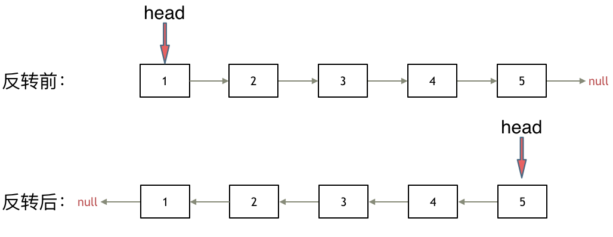

在反转链表中，**迭代**体现为：在每一次循环中，我们**不需要关心**链表后面还有多少个节点，也**不需要关心**前面已经反转了多少个节点的具体细节。我们只关心**当前这一步**如何把 `curr` 挂到 `pre` 上，然后更新这两个指针

- **初始状态**：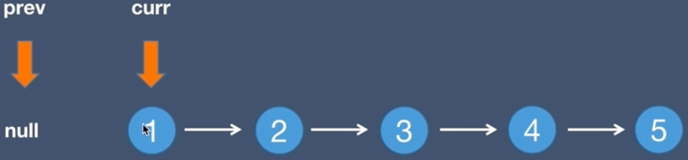

  - `pre` = null (已反转部分为空)
  - `curr` = head (待反转部分是整个链表)

- **第 1 次迭代**：

  - 操作：用temp/next保留节点2，再把 `curr` (节点1) 的箭头指向 `pre` (null)

    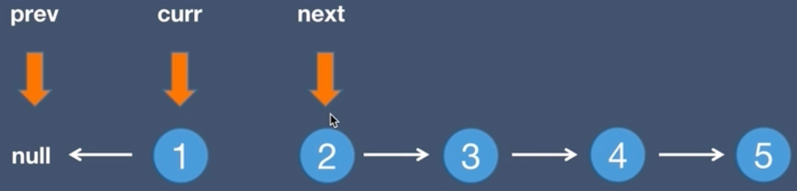

  - 状态更新：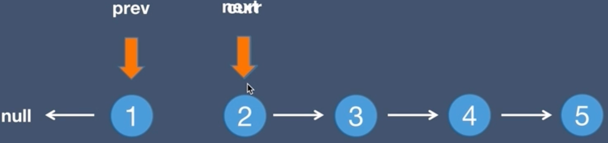

    - 先移新的 `pre` = 节点1 (已反转部分变成了 [1])
    - 再移新的 `curr` = 节点2 (待反转部分变成了 [2->3->...])

    *注意：顺序不能变，否则移完curr，pre没法移动*

- **第 2 次迭代**：

  - 操作：用temp/next保留节点3，再把 `curr` (节点2) 的箭头指向 `pre` (节点1)

    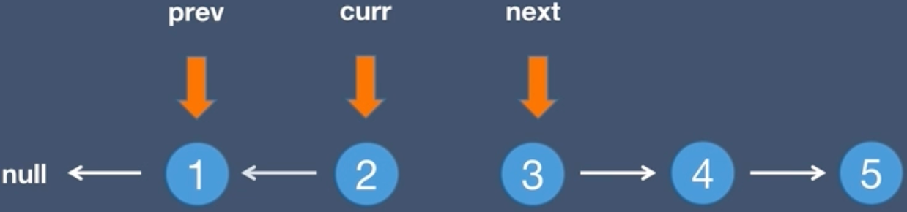

  - 状态更新：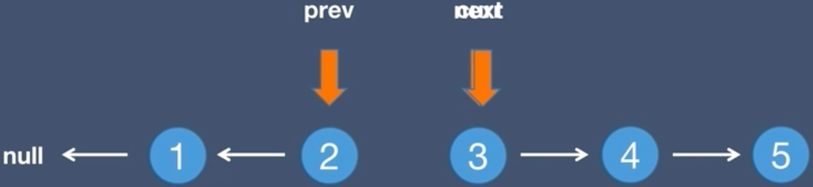

    - 新的 `pre` = 节点2 (已反转部分变成了 [2->1])
    - 新的 `curr` = 节点3 (待反转部分变成了 [3->4->...])

- **...**

- **终止条件**：当 `curr` 变成 null 时，说明没有待处理的节点了，迭代结束。此时 `pre` 就是新链表的头

  *注意不是变成最后一个节点，因为每次循环结束时的curr代表着待反转部分的头节点*

```java
// 多指针迭代法
public Node reverseList(Node head) {
    Node pre = null;
    Node cur = head;
    Node temp = null;
    while (cur != null) {
        temp = cur.next;// 保存下一个节点
        cur.next = pre;
        pre = cur;
        cur = temp;
    }
    return pre;
}
```

- 时间复杂度：O(n)
- 空间复杂度：O(1)

法二、**递归法**

> **f(n) = 基准情况 -> 递操作 -> f(n−1) -> 归操作**，*-> 代表的是“顺序执行”*
>
> **由于子问题的规模比原问题小，不断“递”下去，总会有个尽头，即递归的边界条件 ( base case )，直接返回它的答案，再不断“归”回去**

- **递归调用语句**体现了**从当前问题到子问题之间的逻辑递推关系**
- 递归调用语句**之前**的代码 = **递**（层层深入，压栈过程）
- 递归调用语句**之后**的代码 = **归**（层层返回，出栈过程）
- **基准情况（Base Case）：**它是**“递”的终点**，也是**“归”的起点**（它返回的结果开启了回溯之路）
  * 通常基准判断写在递归调用**之前**。如果基准判断写在递归调用**之后**，可能会导致无限递归（栈溢出），因为程序永远没机会在“递”的过程中停下来，也就无法进入“归”

> 递归是**用空间换逻辑简洁性**
>
> - 每一次调用，系统都要在**栈（Stack）**上开辟新的内存空间来保存当前状态（局部变量、返回地址）
> - 递归深度 ≈ 栈空间消耗量。调用语句执行得越深，占用的内存空间越大

（1）**尾递归（Tail Recursion）：**如果递归调用是函数体内的**最后一条语句**（即调用后面没有任何代码），那么就只有“递”，没有实质性的“归”处理逻辑（或者说“归”的过程只是单纯地返回，不执行额外操作）。这种方法**在递的时候就完成了节点next指针的反转**

```java
// 尾递归
public Node reverseList(Node head) {
    return reverse(null, head);
}

private Node reverse(Node pre, Node cur) {
    if (cur == null) return pre;
    Node temp = null;
    temp = cur.next;// 先保存下一个节点
    cur.next = pre;// 反转
    // 更新pre、cur位置
    // pre = cur;
    // cur = temp;
    return reverse(cur, temp);
}
```

| 步骤 | 阶段 | 当前状态 `(pre, cur)` | 执行代码块                                            | 动作解读                                                     |
| ---- | ---- | --------------------- | ----------------------------------------------------- | ------------------------------------------------------------ |
| 1    | 递   | `(null, 1)`           | 跳过 `if`，执行 `cur.next=null`，调用 `reverse(1, 2)` | 反转 1 的指针，深入下一层                                    |
| 2    | 递   | `(1, 2)`              | 跳过 `if`，执行 `cur.next=1`，调用 `reverse(2, null)` | 反转 2 的指针，深入下一层                                    |
| 3    | 停   | `(2, null)`           | 命中 `if (cur == null)`                               | 递到了尽头！ 此时链表已变为 `null <- 1 <- 2` (pre指向2) 直接返回 `pre` (即节点2) |
| 4    | 归   | (回到步骤2)           | 接收返回值，直接 `return`                             | 只是把节点2传上去，没做任何事                                |
| 5    | 归   | (回到步骤1)           | 接收返回值，直接 `return`                             | 只是把节点2传上去，没做任何事                                |
| 6    | 结束 | (回到主函数)          | 得到最终结果                                          | 返回新头节点 2                                               |

- 时间复杂度：O(n)，要递归处理链表的每个节点
- 空间复杂度：O(n)，递归调用了 n 层栈空间

（2）非尾递归，在归的时候才进行节点next指针的反转

```java
// 非尾递归，"归"的阶段有实际工作要做
public Node reverseList(Node head) {
    // 【基准情况】
    if (head == null || head.next == null) return head;
    // 【递】：先不管自己，让后面的人去反转
    Node newHead = reverseList(head.next);
    // 【归】：等后面的人反完了，我再把自己的指针改过来
    head.next.next = head; 
    head.next = null;
    return newHead;
}
```

> 1、它与前面的尾递归的重要区别是**尾递归需要用temp保留下一个节点从而调用递归语句**
>
> 2、尾递归代码之所以不能直接变成单方法，是因为它试图在**“向下递归”**时完成工作，这需要携带 `pre` 状态，而单方法签名无法提供；而你提供的参考写法之所以能单方法实现，是因为它将工作推迟到了**“向上回溯”**时，巧妙地利用 `head.next` 找到了所需的状态，从而省去了额外参数

法三、使用虚拟头结点，通过头插法实现链表的反转

1. 创建一个虚拟头节点 `dummy`
2. 遍历原链表，每次取出一个节点，将其插入到 `dummy` 之后（即新链表的头部）
3. 最终 `dummy.next` 就是反转后的链表头节点

“双指针迭代法”其实本质上就是一种不需要 dummy 节点的“原地头插”变体。

```java
// 迭代方法：增加虚头结点，使用头插法实现链表翻转
public static Node reverseList1(Node head) {
    // 创建虚头结点
    Node dumpyHead = new Node(-1);
    dumpyHead.next = null;
    // 遍历所有节点
    Node cur = head;
    while(cur != null){
        Node temp = cur.next;
        // 头插法
        cur.next = dumpyHead.next;
        dumpyHead.next = cur;
        cur = temp;
    }
    return dumpyHead.next;
}
```

法四、使用栈

需要一个栈来存储所有 N 个节点的引用，空间复杂度是O(n)

- 首先将所有的结点入栈
- 然后创建一个虚拟头结点，让cur指向虚拟头结点。然后开始循环出栈，每出来一个元素，就把它加入到以虚拟头结点为头结点的链表当中，最后返回即可。

```java
public Node reverseList(Node head) {
    // 如果链表为空，则返回空
    if (head == null) return null;
    // 如果链表中只有只有一个元素，则直接返回
    if (head.next == null) return head;
    
    // 创建栈 每一个结点都入栈
    Stack<Node> stack = new Stack<>();
    Node cur = head;
    while (cur != null) {
        stack.push(cur);
        cur = cur.next;
    }
    
    // 创建一个虚拟头结点
    Node pHead = new Node(0);
    cur = pHead;
    while (!stack.isEmpty()) {
        Node node = stack.pop();
        cur.next = node;
        cur = cur.next;
    }
    // 最后一个元素的next要赋值为空
    cur.next = null;
    return pHead.next;
}
```

*注意：当整个出栈循环结束以后，cur正好指向原来链表的第一个结点，而此时结点1中的next指向的是结点2，因此最后还需要 `cur.next = null`*

#### [中 92反转链表 II](https://leetcode.cn/problems/reverse-linked-list-ii/solution/you-xie-cuo-liao-yi-ge-shi-pin-jiang-tou-teqq/)（多指针迭代法）

> 给你单链表的头指针 `head` 和两个整数 `left` 和 `right` ，其中 `left <= right` 。请你反转从位置 `left` 到位置 `right` 的链表节点，返回 **反转后的链表** 。

1. 先遍历链表得到pre和right，从而得到left和succ；
2. 切割出需要反转的链表，用206的方法反转；
3. 接回原链表

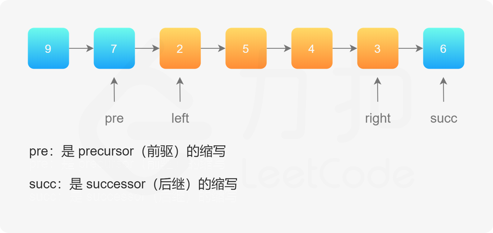

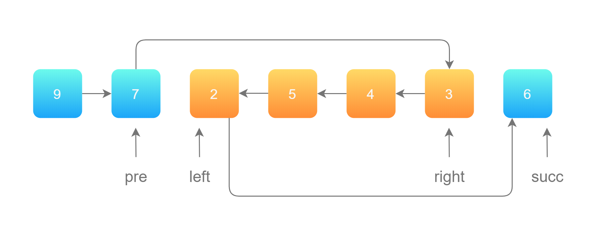

```java
public ListNode reverseBetween(ListNode head, int left, int right) {
    // 如果链表为空或链表中只有只有一个元素或反转范围非法，则返回原head
    if (head == null || head.next == null || left >= right) return head;
    // left可能为1，此时pre没有可以指向的节点，因此定义虚拟头节点来避免复杂的分类讨论
    ListNode dummyHead = new ListNode(0);
    dummyHead.next = head;

    ListNode pre = dummyHead;
    // 第 1 步：从虚拟头节点走 left - 1 步，来到 left 节点的前一个节点
    // 建议写在 for 循环里，语义清晰
    for (int i = 0; i < left - 1; i++) {
        pre = pre.next;
    }

    // 第 2 步：从 pre 再走 right - left + 1 步，来到 right 节点
    ListNode rightNode = pre;
    for (int i = 0; i < right - left + 1; i++) {
        rightNode = rightNode.next;
    }

    // 第 3 步：切断出一个子链表（截取链表）
    ListNode leftNode = pre.next;
    ListNode curr = rightNode.next;

    // 注意：切断链接
    pre.next = null;
    rightNode.next = null;

    // 第 4 步：同第 206 题，反转链表的子区间
    reverseLinkedList(null, leftNode);

    // 第 5 步：接回到原来的链表中
    pre.next = rightNode;
    leftNode.next = curr;
    return dummyHead.next;
}
// 双指针迭代法
private void reverseLinkedList(ListNode pre, ListNode cur) {
    if(cur == null) return;
    ListNode tmp = cur.next;
    cur.next = pre;
    pre = cur;
    cur = tmp;
}
```

#### 【🔥难】[25 K个一组翻转链表](https://leetcode.cn/problems/reverse-nodes-in-k-group/solution/you-xie-cuo-liao-yi-ge-shi-pin-jiang-tou-plfs/)（多指针迭代法）

> 给你链表的头节点 `head` ，每 `k` 个节点一组进行翻转，请你返回修改后的链表。
>
> `k` 是一个正整数，它的值小于或等于链表的长度。如果节点总数不是 `k` 的整数倍，那么请将最后剩余的节点保持原有顺序。
>
> 你不能只是单纯的改变节点内部的值，而是需要实际进行节点交换。

```java
public ListNode reverseKGroup(ListNode head, int k) {
    // 统计节点个数
    int n = 0;
    for (ListNode cur = head; cur != null; cur = cur.next) {
        n++;
    }

    ListNode dummy = new ListNode(0, head);
    ListNode p0 = dummy; // 保存每次k个一组处理也就是反转后小循环的最后一个节点
    ListNode pre = null;
    ListNode cur = head;

    // k个一组处理
    for (; n >= k; n -= k) {
        for (int i = 0; i < k; i++) { // 同上，双指针迭代法
            ListNode tmp = cur.next;
            cur.next = pre;
            pre = cur;
            cur = tmp;
        }

        //【关键难点，迭代操作】
        ListNode tmp = p0.next;
        p0.next.next = cur;
        p0.next = pre;
        p0 = tmp;
    }
    return dummy.next;
}
```

重点在**每次k个一组处理结束后的迭代操作**（看注释）：

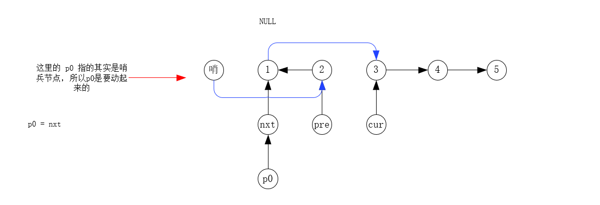

```java
ListNode tmp = p0.next; // 1、用 tmp 保存本次小循环反转后最后一个节点
// p0.next 是本次小循环原第一个节点，即本次小循环反转后最后一个节点
p0.next.next = cur; // 2、对应上方的蓝线操作
// cur 是下一个小循环原第一个节点，这里把本次小循环反转后最后一个节点（p0.next）与下一个小循环连接
p0.next = pre; // 3、对应下方的蓝线操作
// pre 是本次小循环反转后第一个节点，这里是把上一个循环反转后的最后一个点（p0）与其进行连接
p0 = tmp; // 4、p0 保存本次循环反转后最后一个点，p0.next就是下次小循环反转后最后一个节点
```

#### 【🔥中】[24两两交换链表中的节点](https://leetcode.cn/problems/swap-nodes-in-pairs/description/)（多指针迭代法）

> 给你一个链表，两两交换其中相邻的节点，并返回交换后链表的头节点。你必须在不修改节点内部的值的情况下完成本题（即，只能进行节点交换）。
>
> 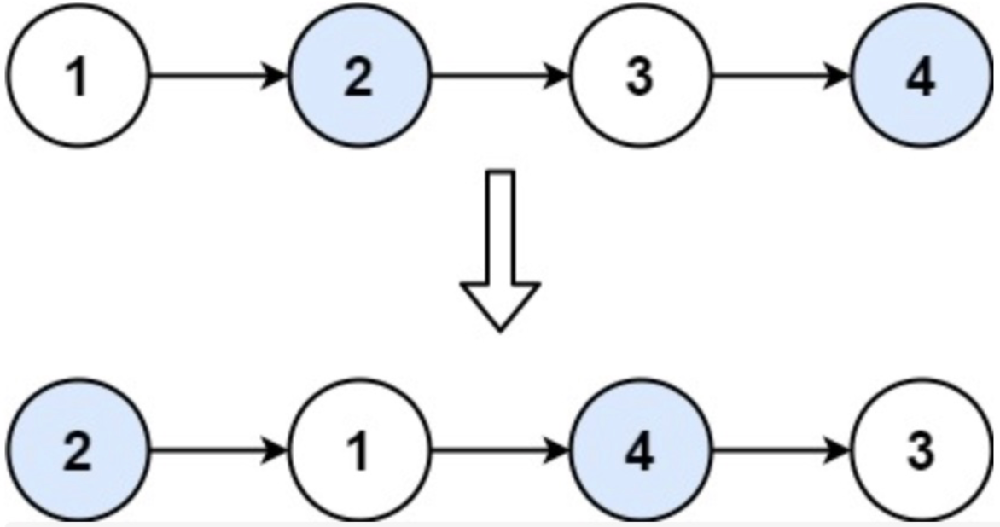

**关键：**

* 引入一个虚拟头结点 (`dumyhead`) 简化边界条件的处理（特别是当需要交换的是头两个节点时）

* while循环条件：`cur.next != null && cur.next.next != null`，直到链表末尾不足两个节点为止
* 在循环中维护三个临时指针 (`next1`, `next2`, `next3`) 来重新链接节点，完成两两交换
  * 步骤1：cur指向next2
  * 步骤2：next2指向next1
  * 步骤3：next1指向next3
* 移动 `cur` 指针到next1，继续下一轮

```java
class Solution {
  public ListNode swapPairs(ListNode head) {
        ListNode dumyhead = new ListNode(0); // 设置一个虚拟头结点
        dumyhead.next = head; // 将虚拟头结点指向head，这样方便后面做删除操作
        ListNode cur = dumyhead;
        ListNode next3; // 临时节点，保存两个节点后面的节点
        ListNode next1; // 临时节点，保存两个节点之中的第一个节点
        ListNode next2; // 临时节点，保存两个节点之中的第二个节点
        while (cur.next != null && cur.next.next != null) {
            next3 = cur.next.next.next;
            next2 = cur.next.next;
            next1 = cur.next;
            
            cur.next = next2;       // 步骤1
            next2.next = next1; // 步骤2
            next1.next = next3;      // 步骤3
            cur = next1; // cur移动，准备下一轮交换
        }
        return dumyhead.next;  
    }
}
```

如果步骤2和步骤3调换，则不需要next3临时节点

```java
cur.next = next2; // 步骤1
next1.next = next2.next;// 步骤3
next2.next = next1;// 步骤2
```

### 链表双指针

#### 快慢双指针

##### [简 876链表的中间节点](https://leetcode.cn/problems/middle-of-the-linked-list/description/)（快慢双指针迭代法）<a id="876"></a>

> 给你单链表的头结点 `head` ，请你找出并返回链表的中间结点。
>
> 如果有两个中间结点，则返回第二个中间结点。

```java
class Solution {
    public ListNode middleNode(ListNode head) {
        ListNode fast = head;
        ListNode slow = head;
        while(fast!=null && fast.next!=null){
            fast = fast.next.next;
            slow = slow.next;
        }
        return slow;
    }
}
```

##### 【🔥简】[234回文链表](https://leetcode.cn/problems/palindrome-linked-list/description/)（876链表的中间节点+206反转链表）

> 给你一个单链表的头节点 `head` ，请你判断该链表是否为回文链表。如果是，返回 `true` ；否则，返回 `false` 。
>
> **进阶：**你能否用 `O(n)` 时间复杂度和 `O(1)` 空间复杂度解决此题？

**法一、数组+双指针**

1. 复制链表值到数组列表中
2. 使用双指针法判断是否为回文

```java
class Solution {
    public boolean isPalindrome(ListNode head) {
        List<Integer> vals = new ArrayList<Integer>();

        // 将链表的值复制到数组中
        ListNode currentNode = head;
        while (currentNode != null) {
            vals.add(currentNode.val);
            currentNode = currentNode.next;
        }

        // 使用双指针判断是否回文
        int front = 0;
        int back = vals.size() - 1;
        while (front < back) {
            if (!vals.get(front).equals(vals.get(back))) {
                return false;
            }
            front++;
            back--;
        }
        return true;
    }
}
```

* 时间复杂度：O(n)，其中 n 指的是链表的元素个数

  * 第一步： 遍历链表并将值复制到数组中，O(n)

  * 第二步：双指针判断是否为回文，执行了 O(n/2) 次的判断，即 O(n)

* 空间复杂度：O(n)，使用了一个数组列表存放链表的元素值

**法二、876链表的中间节点（快慢指针）+206反转链表（多指针迭代法）**

1. **找链表的中间节点（876）**，即前半部分链表的尾节点

   - 如果链表有奇数个节点，找正中间的节点

     

   - 如果链表有偶数个节点，找正中间右边的节点

     

2. **反转中间节点到末尾的后半部分链表（206）**

   如上图，反转后得到链表 6→5→4，其头节点 6 记作 head~2~，这样我们就能从 head~2~ 开始，依次访问原链表的最后一个节点、倒数第二个节点、倒数第三个节点……

3. **判断是否回文**

   同时遍历 head 和 head~2~ 这两个链表，每次循环判断 head.val 是否等于 head~2~.val，若不相等，则返回 false。循环直到 head~2~  链表遍历结束。如果循环中没有返回 false，则跳出循环返回 true


```java
public boolean isPalindrome(ListNode head) {
    ListNode mid = middleNode(head);
    ListNode head2 = reverseList(mid);
    while (head2 != null) {
        // 不是回文链表
        if (head.val != head2.val) return false;
        head = head.next;
        head2 = head2.next;
    }
    return true;
}

// 876. 链表的中间结点
private ListNode middleNode(ListNode head) {
    ListNode slow = head;
    ListNode fast = head;
    while (fast != null && fast.next != null) {
        slow = slow.next;
        fast = fast.next.next;
    }
    return slow;
}

// 206. 反转链表
private ListNode reverseList(ListNode head) {
    ListNode pre = null;
    ListNode cur = head;
    while (cur != null) {
        ListNode tmp = cur.next;
        cur.next = pre;
        pre = cur;
        cur = tmp;
    }
    return pre;
}
```

- 时间复杂度：O(n)
- 空间复杂度：O(1)。我们只会修改原本链表中节点的指向，而在堆栈上的堆栈帧不超过 *O*(1)

##### 【🔥简】[141环形链表](https://leetcode.cn/problems/linked-list-cycle/?envType=study-plan-v2&envId=top-100-liked)（快慢双指针迭代法）<a id="141"></a>

> 给你一个链表的头节点 `head` ，判断链表中是否有环。
>
> 如果链表中有某个节点，可以通过连续跟踪 `next` 指针再次到达，则链表中存在环。 为了表示给定链表中的环，
>
> *如果链表中存在环* ，则返回 `true` 。 否则，返回 `false` 。

```java
public boolean hasCycle(ListNode head) {
    if (head == null || head.next == null) return false;
    ListNode slow = head;
    ListNode fast = head.next;
    while (slow != fast) {
        if (fast == null || fast.next == null) return false;
        slow = slow.next;
        fast = fast.next.next;
    }
    return true;
}
```

##### 【🔥中】[142环形链表II](https://leetcode.cn/problems/linked-list-cycle-ii/)（快慢双指针+相向双指针迭代法）<a id="142"></a>

> 给定一个链表的头节点  `head` ，返回链表开始入环的第一个节点。 *如果链表无环，则返回 `null`。*
>
> 如果链表中有某个节点，可以通过连续跟踪 `next` 指针再次到达，则链表中存在环。

**关键：**

1、**判断链表是否有环**：分别定义 fast 和 slow 指针，从头结点出发，fast指针每次移动两个节点，slow指针每次移动一个节点，如果 fast 和 slow指针在途中相遇，说明这个链表有环

*注意：快慢指针一定会在圆里相遇，“有原就会相遇”，可以用相对速度是1来理解*

2、**如果有环，如何找环入口**：

（1）假设从头结点到环形入口节点的节点数为x， 环形入口节点到fast指针与slow指针相遇节点节点数为y，从相遇节点再到环形入口节点节点数为z。


那么相遇时：

* slow指针走过的节点数为: `x+y`
* fast指针走过的节点数：`x+y+n(y+z)`，n为fast指针在环内走了n圈才遇到slow指针，（y+z）为一圈内节点的个数A

> 为什么**slow的步数是 `x+y` 而不是 `x+y+若干环的长度` 呢？**
>
> * 把三个环展开，这里有四个入口，入口的前后代表着不同进入环的时间，fast先从入口1进环，slow再从入口2（或者3、4，但是不影响相对距离，所以用2代替）
>
> * slow从入口2走完一圈到入口3，此时fast是它路程的两倍，因此到达入口3和4之间，在这过程中，fast和slow必定在入口2和3的这段路程中相遇
>
> 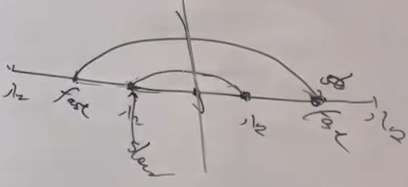

（2）公式推导

* 因为fast指针是一步走两个节点，slow指针一步走一个节点，所以 fast指针走过的节点数 = slow指针走过的节点数 * 2：

  ```
  (x+y)*2 = x+y+n(y+z)
  ```

  得到：`x+y = n(y+z)`

* 找环形的入口要求的是x：`x = n (y + z) - y` ,

* 再从n(y+z)中提出一个(y+z)来，整理公式之后为如下公式：**`x = (n-1)(y+z)+z`**

  *注意这里n一定是大于等于1的，因为fast指针至少要多走一圈才能相遇slow指针*

（3）这个公式说明什么呢？

* 当n=1，就是fast指针在环形里转了一圈之后遇到slow指针，公式化解为 `x = z`

  这就意味着，**从头结点出发一个指针，从相遇节点也出发一个指针，这两个指针每次只走一个节点，那么当这两个指针相遇的时候就是环形入口的节点**

  也就是在相遇节点处定义一个指针index1，在头结点处定一个指针index2，让index1和index2同时移动，每次移动一个节点，那么他们相遇的地方就是环形入口的节点

  动画如下：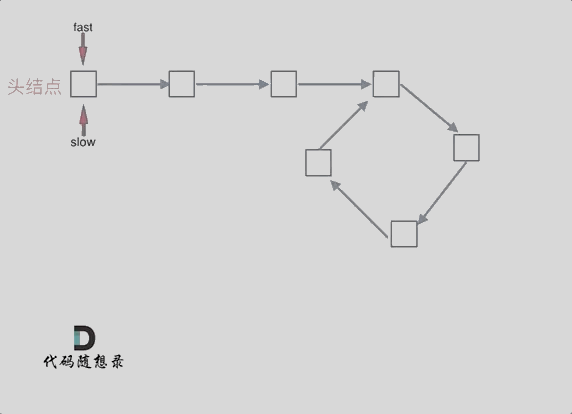

* 如果n大于1，就是fast指针在环形转n圈之后才遇到slow指针

  其实这种情况和n为1的时候效果是一样的，一样可以通过这个方法找到环形的入口节点，只不过index1指针在环里多转了(n-1)圈，然后再遇到index2，相遇点依然是环形的入口节点

```java
public class Solution {
    public ListNode detectCycle(ListNode head) {
        ListNode slow = head;
        ListNode fast = head;
        while (fast != null && fast.next != null) {// 保证fast.next和fast.next.next不会抛出空指针
            slow = slow.next;
            fast = fast.next.next;
            if (slow == fast) {// 有环
                ListNode index1 = fast;
                ListNode index2 = head;
                // 两个指针，从头结点和相遇结点，各走一步，直到相遇，相遇点即为环入口
                while (index1 != index2) {
                    index1 = index1.next;
                    index2 = index2.next;
                }
                return index1;
            }
        }
        return null;
    }
}
```

##### 【🔥中】[287寻找重复数](https://leetcode.cn/problems/find-the-duplicate-number/)（同142）<a id="287"></a>

> 给定一个包含 `n + 1` 个整数的数组 `nums` ，其数字都在 `[1, n]` 范围内（包括 `1` 和 `n`），可知至少存在一个重复的整数。
>
> 假设 `nums` 只有 **一个重复的整数** ，返回 **这个重复的数** 。
>
> 你设计的解决方案必须 **不修改** 数组 `nums` 且只用常量级 `O(1)`的额外空间。

想象有一个 n+1 个节点的图，节点编号从 0 到 n

对 i=0,1,2,…,n，**连一条从 i 到 nums[i] 的有向边**，可以得到一个有向图

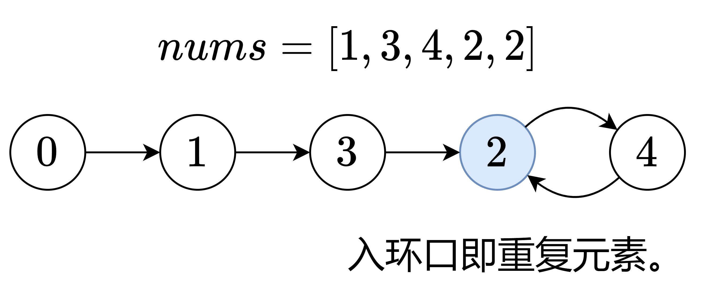

每个节点的入度，就是这个节点在 nums 中的出现次数。重复元素的入度大于 1。上图中的节点 2 的入度为 2，所以 2 是重复元素

如何找到入度大于 1 的节点？

在每个节点的出度都是 1 的情况下，n+1 个点 n+1 条边的有向图，又叫**内向基环森林**，每个连通块都恰好有一个环

由于 nums[i]≥1，所以节点 0 的入度是 0，不在环上。从节点 0 出发，进入基环，基环的入环口，就是入度大于 1 的节点

| **142. 环形链表 II**     | **287. 寻找重复数** |
| ------------------------ | ------------------- |
| 链表节点 *node*          | *i*                 |
| 下一个节点 *node*.*next* | *nums*[*i*]         |
| 头节点 *head*            | 0                   |
| 入环口                   | 重复元素            |

* 在链表中，我们的移动方式是从节点 node 移动到下一个节点 node.next
* 在数组中，我们的移动方式是从节点 i 移动到节点 nums[i]。由于数组长度是 n+1，而 nums[i]<n+1，所以不会下标越界

```java
// 代码逻辑同 142. 环形链表 II
public int findDuplicate(int[] nums) {
    int slow = 0; // 0 一定不在环上，适合作为起点
    int fast = 0;
    while (true) {
        slow = nums[slow]; // 等价于 slow = slow.next
        fast = nums[nums[fast]]; // 等价于 fast = fast.next.next
        if (fast == slow) break; // 快慢指针移动到同一个节点
    }
    int head = 0; // 再用一个指针，从起点出发
    while (slow != head) {
        slow = nums[slow];
        head = nums[head];
    }
    return slow; // 入环口即重复元素
}
```

#### 【🔥中】[19删除链表的倒数第N个节点](https://leetcode.cn/problems/remove-nth-node-from-end-of-list/description/)（前后双指针迭代法）<a id="19"></a>

> 给你一个链表，删除链表的倒数第 `n` 个结点，并且返回链表的头结点。（1 <= n <= 链表节点数目）

注意：要删除第N个节点，那么我们遍历的指针一定要指向第N个节点的前一个节点

**分为如下几步：**

- 设定虚拟头结点

- 定义fast指针和slow指针，初始值为虚拟头结点，如图：

  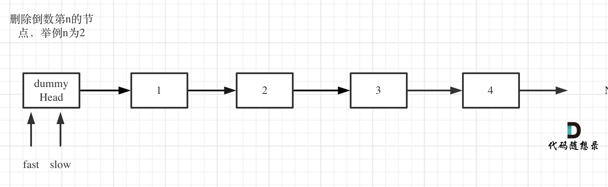

- fast首先走n + 1步，为什么是n+1呢，这是为了让 slowIndex 最终停在“待删除节点”的“前一个节点”，方便做删除操作，如图：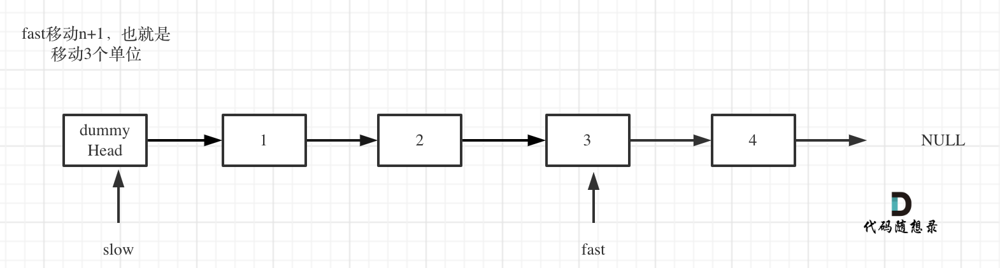

- fast和slow同时移动，直到fast指向末尾，此时 slowIndex 和 fastIndex 之间的距离应该是 n + 1，如图：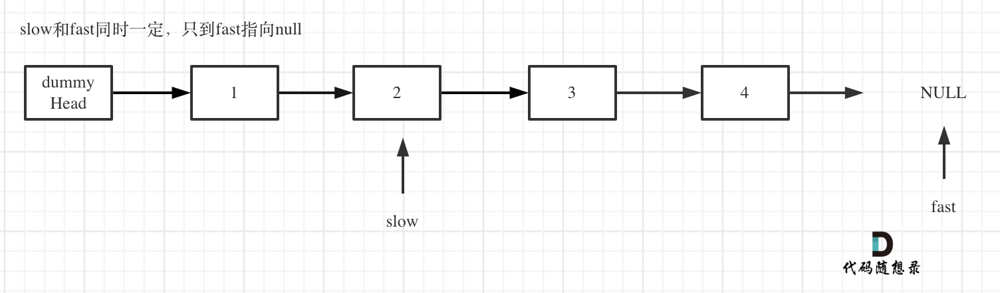 

- 删除slow指向的下一个节点，如图：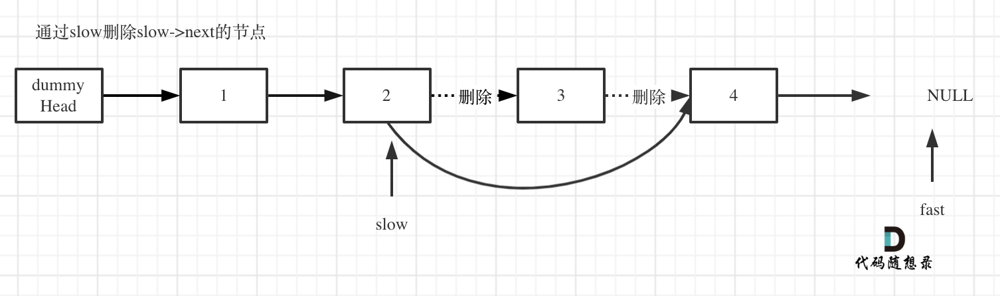

```java
public ListNode removeNthFromEnd(ListNode head, int n) {
    // 新建一个虚拟头节点指向head
    ListNode dummyHead = new ListNode(0);
    dummyHead.next = head;
    // 快慢指针指向虚拟头节点
    ListNode fastIndex = dummyHead;
    ListNode slowIndex = dummyHead;
    // 使快慢指针相差 n 个结点，距离 n+1
    for (int i = 0; i <= n; i++) {
        fastIndex = fastIndex.next;
    }
    while (fastIndex != null) {
        fastIndex = fastIndex.next;
        slowIndex = slowIndex.next;
    }
    // 此时 slowIndex 的位置就是待删除元素的前一个位置
    slowIndex.next = slowIndex.next.next;
    return dummyHead.next;
}
```

- 时间复杂度: O(n)
- 空间复杂度: O(1)

#### 【🔥简】[160相交链表](https://leetcode.cn/problems/intersection-of-two-linked-lists-lcci/description/)（独立双指针迭代拼接链表法）<a id="160"></a>

> 给你两个单链表的头节点 `headA` 和 `headB` ，请你找出并返回两个单链表相交的起始节点。如果两个链表没有交点，返回 `null` 。
>
> 图示两个链表在节点 `c1` 开始相交**：**
>
> [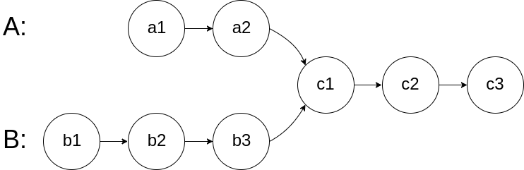](https://assets.leetcode.cn/aliyun-lc-upload/uploads/2018/12/14/160_statement.png)
>
> 题目数据 **保证** 整个链式结构中不存在环。
>
> **注意**，函数返回结果后，链表必须 **保持其原始结构** 。
>
> 数值相同，不代表指针相同。

**核心思路：消除长度差，实现同步比对**

法一、**长度对齐法**，移动长链表指针使双指针对齐后，长链表与短链表末尾也对齐

* 看如下两个链表，curA指向链表A的头结点，curB指向链表B的头结点：

  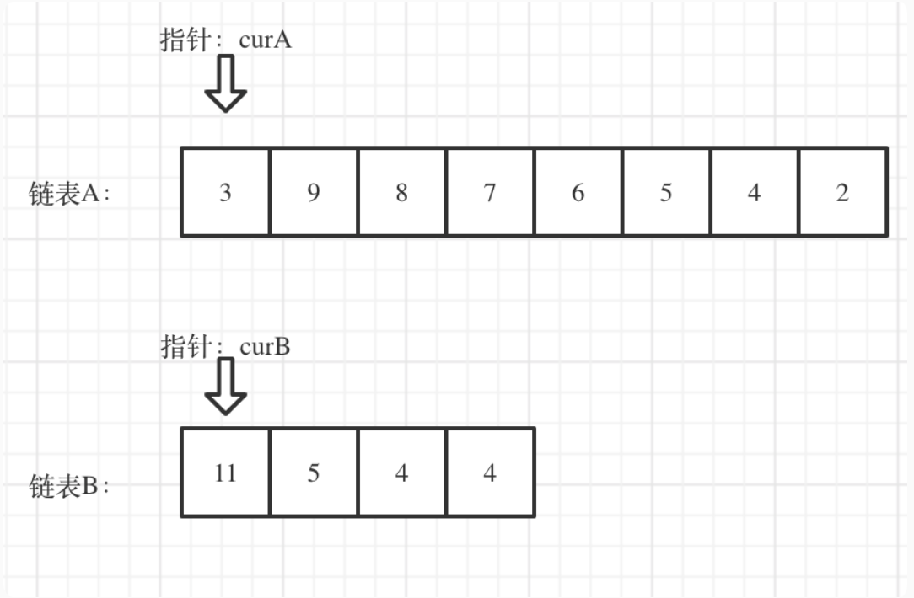

* 求出两个链表的长度，并求出两个链表长度的差值，然后让curA移动到和curB末尾对齐的位置，如图：

  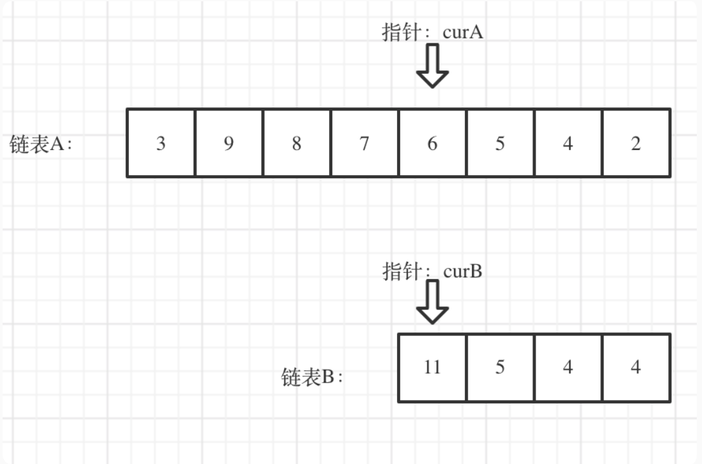

* 比较curA和curB是否相同，如果不相同，同时向后移动curA和curB，如果curA == curB，则找到交点。否则循环退出返回空指针。

```java
public ListNode getIntersectionNode(ListNode headA, ListNode headB) {
    ListNode curA = headA;
    ListNode curB = headB;
    int lenA = 0, lenB = 0;
    while (curA != null) { // 求链表A的长度
        lenA++;
        curA = curA.next;
    }
    while (curB != null) { // 求链表B的长度
        lenB++;
        curB = curB.next;
    }
    curA = headA;
    curB = headB;
    // 让curA为最长链表的头，lenA为其长度
    if (lenB > lenA) {
        //1. swap (lenA, lenB);
        int tmpLen = lenA;
        lenA = lenB;
        lenB = tmpLen;
        //2. swap (curA, curB);
        ListNode tmpNode = curA;
        curA = curB;
        curB = tmpNode;
    }
    // 求长度差
    int gap = lenA - lenB;
    // 让curA和curB在同一起点上（末尾位置对齐）
    while (gap-- > 0) curA = curA.next;
    // 遍历curA 和 curB，遇到相同则直接返回
    while (curA != null) {
        if (curA == curB) return curA;
        curA = curA.next;
        curB = curB.next;
    }
    return null;
}
```

法二、**双指针循环法/拼接链表法**，将两个链表头节点作为双指针，可以理解为**将长短链表拼接为两种长度相同的链表，并且交点对齐**

* A -> `a1 a2 c1 c2 c3 null`

* B -> `b1 b2 b3 c1 c2 c3 null`

* 链表A+链表B=链表C1 -> `a1 a2 c1 c2 c3 null b1 b2 b3 c1 c2 c3 null`

* 链表B+链表A=链表C2 -> `b1 b2 b3 c1 c2 c3 null a1 a2 c1 c2 c3 null`

```java
public ListNode getIntersectionNode(ListNode headA, ListNode headB) {
      // p1 指向 A 链表头结点，p2 指向 B 链表头结点
      ListNode p1 = headA, p2 = headB;
      while (p1 != p2) {
          // p1 走一步，如果走到 A 链表末尾，转到 B 链表
          if (p1 == null) p1 = headB;
          else p1 = p1.next;
          // p2 走一步，如果走到 B 链表末尾，转到 A 链表
          if (p2 == null) p2 = headA;
          else p2 = p2.next;
    }
    return p1;
}
```

- 时间复杂度：O(n + m)
- 空间复杂度：O(1)

#### 【🔥简】[21合并两个有序链表](https://leetcode.cn/problems/merge-two-sorted-lists/)（独立双指针迭代法）<a id="21"></a>

> 将两个升序链表合并为一个新的 **升序** 链表并返回。新链表是通过拼接给定的两个链表的所有节点组成的。 

根据题目描述， 链表 l1, l2 是递增的，因此容易想到使用双指针 l1 和 l2 遍历两链表，根据 l1.val 和 l2.val 的大小关系确定节点添加顺序，两节点指针交替前进，直至遍历完毕

由于初始状态合并链表中无节点，因此初始化一个虚拟头节点 dum，将各节点添加至 dum 之后

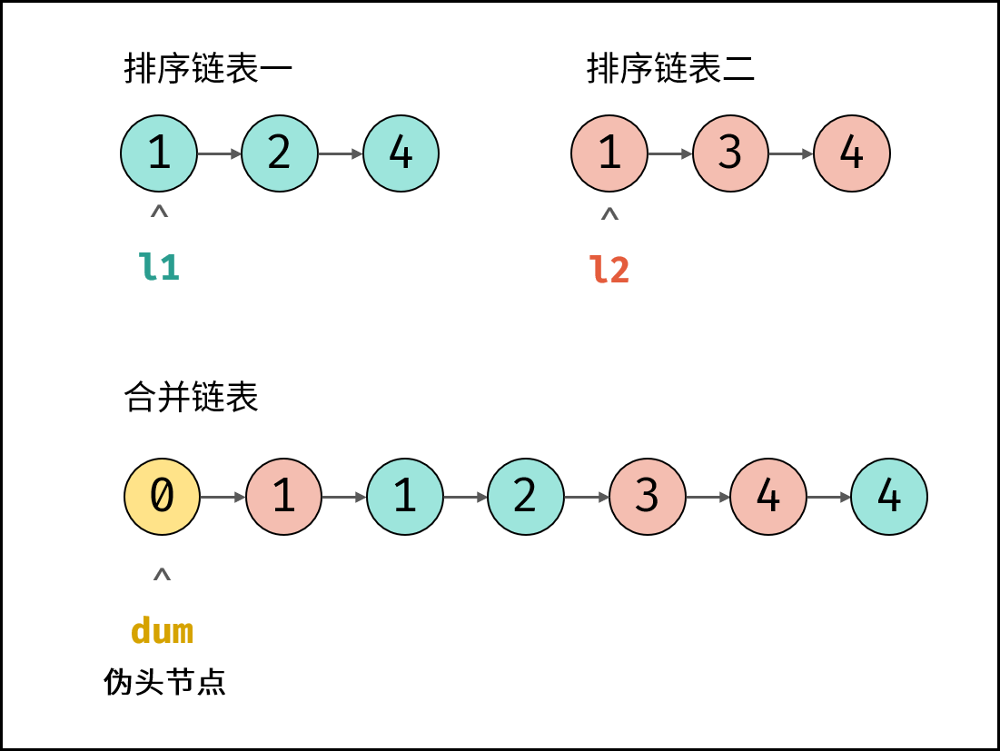

算法流程：

1. **初始化**： 伪头节点 dum，节点 cur 指向 dum
2. **循环合并**： 当 l1 或 l2 为空时跳出
   * 当 l1.val<l2.val 时：cur 的后继节点指定为 l1，并 l1 向前走一步
   * 当 l1.val≥l2.val 时：cur 的后继节点指定为 l2，并 l2 向前走一步
   * 节点 cur 向前走一步，即 cur=cur.next

3. **合并剩余尾部**： 跳出时有两种情况，即 l1 为空或 l2 为空
   * 若 l1 != null，将 l1 添加至节点 cur 之后
   * 否则将 l2 添加至节点 cur 之后

4. **返回值**：合并链表在伪头节点 dum 之后，因此返回 dum.next

```java
public ListNode mergeTwoLists(ListNode list1, ListNode list2) {
    // 创建哑节点（哨兵节点），用于简化边界情况处理
    // cur 指针用于追踪合并后链表的尾部
    ListNode dum = new ListNode(0), cur = dum;
    // 当两个链表都未遍历完时，循环比较
    while (list1 != null && list2 != null) {
        // 比较两个链表当前节点的值，将较小的节点接入结果链表
        if (list1.val < list2.val) {
            cur.next = list1; // 接入 list1
            list1 = list1.next; // list1 指针后移
        }
        else {
            cur.next = list2; // 接入 list2
            list2 = list2.next; // list2 指针后移
        }
        cur = cur.next; // 结果链表的指针后移
    }
    // 循环结束后，将剩余非空的链表直接接入结果链表尾部
    cur.next = list1 != null ? list1 : list2;
    // 返回哑节点的下一个节点，即合并后的真实头节点
    return dum.next;
}
```

* 时间复杂度 O(M+N) ：M,N 分别为链表 l1, l2 的长度，合并操作需遍历两链表

* 空间复杂度 O(1) ：节点引用 dum , cur 使用常数大小的额外空间

#### 【🔥中】[2两数相加](https://leetcode.cn/problems/add-two-numbers/)（独立双指针递归法）<a id="2"></a>

> 给你两个 **非空** 的链表，表示两个非负的整数。它们每位数字都是按照 **逆序** 的方式存储的，并且每个节点只能存储 **一位** 数字。
>
> 请你将两个数相加，并以相同形式返回一个表示和的链表。
>
> 你可以假设除了数字 0 之外，这两个数都不会以 0 开头。
>
> 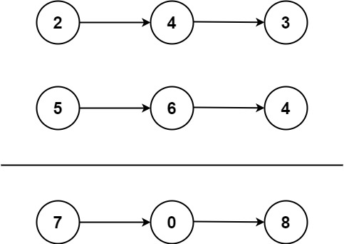
>
> ```
> 输入：l1 = [2,4,3], l2 = [5,6,4]
> 输出：[7,0,8]
> 解释：342 + 465 = 807
> ```

题目解释：链表的第一个节点，存的是数字的个位，第二个节点存十位，第三个节点存百位。然后把两个链表相加，输出的第三个链表就是相加后的值

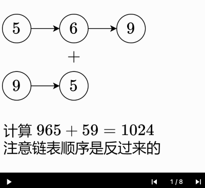

把虚线内要计算的内容，可以理解为一个和原问题相似的，规模更小的子问题，所以适合用**递归**解决

```java
public ListNode addTwoNumbers(ListNode l1, ListNode l2) {
    return addTwo(l1, l2, 0);
}

// l1 和 l2 为当前遍历的节点，carry 为进位
private ListNode addTwo(ListNode l1, ListNode l2, int carry) {
    // 递归边界
    if (l1 == null && l2 == null && carry == 0) return null;
    if (l1 != null) {
        carry += l1.val; // 累加进位与节点值
        l1 = l1.next;
    }
    if (l2 != null) {
        carry += l2.val;
        l2 = l2.next;
    }
    ListNode nextNode = addTwo(l1, l2, carry/10);
    // s 除以 10 的余数为当前节点值，商为进位
    return new ListNode(carry % 10, nextNode);
}
```

### 其他

#### 【🔥中】[138随机链表的复制](https://leetcode.cn/problems/copy-list-with-random-pointer/description/)

> 给你一个长度为 `n` 的链表，每个节点包含一个额外增加的随机指针 `random`，该指针可以指向链表中的任何节点或空节点。
>
> 构造这个链表的 **[深拷贝](https://baike.baidu.com/item/深拷贝/22785317?fr=aladdin)**。 深拷贝应该正好由 `n` 个 **全新** 节点组成，其中每个新节点的值都设为其对应的原节点的值。新节点的 `next` 指针和 `random`指针也都应指向复制链表中的新节点，并使原链表和复制链表中的这些指针能够表示相同的链表状态。**复制链表中的指针都不应指向原链表中的节点** 。
>
> 返回复制链表的头节点。
>
> 用一个由 `n` 个节点组成的链表来表示输入/输出中的链表。每个节点用一个 `[val, random_index]` 表示：
>
> - `val`：一个表示 `Node.val` 的整数。
> - `random_index`：随机指针指向的节点索引（范围从 `0` 到 `n-1`）；如果不指向任何节点，则为 `null` 。
>
> 你的代码 **只** 接受原链表的头节点 `head` 作为传入参数。
>
> 
>
> ```
> 输入：head = [[7,null],[13,0],[11,4],[10,2],[1,0]]
> 输出：[[7,null],[13,0],[11,4],[10,2],[1,0]]
> ```

**思路：**

如果没有 random 指针，只需在遍历链表的同时，依次复制每个节点（创建新节点并复制 val），添加在新链表的末尾

有 random 指针，问题就变得复杂了，我们需要知道 random 指向的那个节点，在新链表中是哪个节点

所以必须记录原链表节点到新链表节点的映射（map）。这样可以通过原链表 random 指向的节点，知道新链表的 random 应该指向哪个节点。我们可以把新链表和旧链表「混在一起」

例如链表 1→2→3，依次复制每个节点（创建新节点并复制 val 和 next），把新节点直接插到原节点的后面，形成一个交错链表：

1→1′→2→2′→3→3′

然后遍历这个交错链表，假如节点 1 的 random 指向节点 3，那么就把节点 1′ 的 random 指向节点 3 的下一个节点 3′，这样就完成了对 random 指针的复制

最后，从交错链表中分离出 1′→2′→3′，即为深拷贝后的链表

**⚠️注意**：不能只删除节点 1,2,3，因为题目要求原链表的 next 不能修改

```java
public Node copyRandomList(Node head) {
    // 1、复制每个节点，把新节点直接插到原节点的后面
    for (Node cur = head; cur != null; cur = cur.next.next) cur.next = new Node(cur.val, cur.next);
    // 2、遍历交错链表中的原链表节点
    for (Node cur = head; cur != null; cur = cur.next.next) {
        // 要复制的 random 是 cur.random 的下一个节点
        if (cur.random != null) cur.next.random = cur.random.next;
    }
    // 3、把交错链表分离成两个链表：遍历交错链表，将新链表节点加到虚拟头节点 dummyHead 后，恢复原节点的next
    Node dummy = new Node(0);
    Node dummyHead = dummy;
    for (Node cur = head; cur != null; cur = cur.next, dummyHead = dummyHead.next) {
        Node copy = cur.next; // 新节点
        dummyHead.next = copy; // 把新节点插在 tail 的后面，构建新的链表
        cur.next = copy.next; // 恢复原节点的 next
    }
    return dummy.next;
}
```
