[【跳转到上一篇：算法 1（数组、链表）】](/blogs/算法笔记/算法-1数组链表/)

[【跳转到下一篇：算法 3（二叉树、图论、回溯算法）】](/blogs/算法笔记/算法-3二叉树图论回溯算法/)

## 三、哈希表/散列表Hash table

### 理论基础

哈希表可以理解为一个加强版的数组

* 数组可以通过索引在 O(1) 的时间复杂度内查找到对应元素，索引是一个非负整数

* 哈希表则可以通过**哈希hash函数**将 `key` 转化成数组里面的索引，从而在 O(1) 的时间复杂度内查找到这个 `key` 对应的 `value`，`key` 的类型可以是数字、字符串等多种类型
	* **key是唯一的不可重复，value可以重复**

> **只有哈希函数（ 关键 ）的复杂度是 O(1)，且合理解决哈希冲突问题，才能保证哈希表增删查改的复杂度是 O(1)**

> **什么时候使用哈希法：快速判断一个元素是否出现集合里**

注意：哈希表和 Map（键值映射）不是同一个东西，哈希表的增删改查复杂度是O(1)，Map键值对则不一定

Java中Map接口本身只定义了键值映射的一系列操作，`HashMap` 的 `get, put, remove` 方法的复杂度都是O(1)，但如果换成其他的实现类，比如底层用二叉树结构实现的 `TreeMap`，这些方法的复杂度就变成O(logN)了

| 语言   | 哈希映射类型名称 | 类型性质 | 默认是否有序  | 对应的集合 (Set)                |
| ------ | ---------------- | -------- | ------------- | ------------------------------- |
| Python | `dict`           | 内置类型 | 是 (插入顺序) | `set`                           |
| Java   | `HashMap`        | 标准库类 | 否 (无序)     | `HashSet`                       |
| Go     | `map`            | 内置类型 | 否 (随机顺序) | 无 (常用 `map[T]struct{}` 模拟) |

> “默认是否有序”不是指数据在内存数组里的物理下标是连续或排序的（它们永远是分散的），是指当你写代码遍历它时，**输出的结果序列**是否符合你的预期（通常是插入顺序）。Python在哈希表之外，额外维护了一个**辅助结构**（通常是链表或索引数组），专门用来记录**插入的先后顺序**，因此能保证遍历时有序

| 类名            | 底层实现 (JDK 8+)    | 有序性                   | 特点                                                         |
| --------------- | -------------------- | ------------------------ | ------------------------------------------------------------ |
| `HashMap`       | 数组 + 链表 + 红黑树 | 无序                     | 默认初始容量 16，负载因子 0.75。当链表长度 > 8 且数组长度 > 64 时，链表转为红黑树（优化冲突）。允许 Key 和 Value 为 `null` |
| `LinkedHashMap` | `HashMap` + 双向链表 | 插入顺序 或 访问顺序有序 | 继承自 `HashMap`。通过链表维护顺序，适合做 LRU 缓存          |

| 类名            | 底层实现             | 有序性       | 特点                                                         |
| --------------- | -------------------- | ------------ | ------------------------------------------------------------ |
| `HashSet`       | `HashMap` (哈希表)   | 无序         | 查询/增删效率 O(1)，最常用                                   |
| `LinkedHashSet` | `HashMap` + 双向链表 | 插入顺序有序 | 在 `HashSet` 基础上维护了插入顺序，效率略低于 `HashSet` 但高于 `TreeSet` |

`TreeMap` 和 `TreeSet` 的核心特点是**基于红黑树实现自动排序**，但因此牺牲了部分性能 **O(log n)**（相比哈希表），且对 `null` 值支持非常严格

- 只要快、不关心顺序 -> 选 **HashMap/HashSet**
- 要快、且要按**插入顺序**遍历 -> 选 **LinkedHashMap/LinkedHashSet**
- 要**自动排序**、或需要**范围查找**（如查分数段、时间段）-> 选 **TreeMap/TreeSet**（记得处理 null 值）

#### 三种哈希结构选择及其常用操作

> **范围小用数组，范围大用哈希；只要键用 Set，要值就用 Map**

| 特性     | 数组 (Array)          | 集合 (Set)           | 映射 (Map)           |
| ------ | ------------------- | ------------------ | ------------------ |
| 存储内容   | 仅值 (隐含下标为 Key)      | 仅 Key              | Key + Value        |
| 适用数据范围 | 小范围、连续整数/字符         | 大范围、分散、任意类型        | 大范围、分散、任意类型        |
| 空间复杂度  | *O*(Range) (取决于最大值) | *O*(*N*) (取决于元素个数) | *O*(*N*) (取决于元素个数) |
| 主要用途   | 计数、简单标记、桶排序         | 判重、存在性检查           | 关联查询、通用计数、索引映射     |
| 性能     | 极致快                 | 有哈希开销              | 有哈希开销              |
| 典型题目   | 有效的字母异位词            | 快乐数、存在重复元素         | 两数之和(返下标)、分组字符串    |

##### 计数数组/频率数组

**Key** 下标直接对应**数据本身的整数值**（或者经过简单偏移后的值），**Value** 通常就是该数字出现的**次数（频次）**，或者是某种**状态标记**（如 0/1 表示是否存在）

适合题目条件：**数值小、范围连续、空间敏感**

- **数据特征**：数据是整数（或可映射为整数，如字符 'a'-'z'），且**数值范围很小**
- **优势**：**速度最快**，没有哈希函数计算开销，没有哈希冲突处理，直接通过下标访问 O(1)

**典型场景**：

- 统计字符串中每个字符出现的次数（范围 'a'~'z'，长度 26）
- 判断两个数组是否包含相同的元素（元素范围 0-1000）
- 桶排序、计数排序

```java
// 场景：统计小写字母频次
int[] count = new int[26]; // 空间极小
for (char c : s.toCharArray()) {
    count[c - 'a']++; // 直接映射，无哈希函数
}
```

##### HashSet

**`HashSet` 只存储键（Key），不存储值（Value）**。它底层其实是利用 `HashMap`实现的，将你存入的元素作为 Key，而 Value 则是一个固定的静态对象（`PRESENT`）

**适合题目条件：数值跨度大、只需判重、不关心对应值**

- **数据特征**：
	- 数值范围**非常大**或**极度分散**
	- 数据类型不是整数（如字符串、自定义对象）
	- 如果用数组，会导致内存溢出（MLE）或极大浪费。
- **需求**：你只关心 **“某个元素是否存在”** 或者 **“去重”**，不需要知道它对应的其他信息
- **优势**：
	- 空间复杂度只与**元素个数 N** 有关，与数值大小无关 O(N)

**典型场景**：

- 两数之和（Two Sum）：遍历数组，查询 `target - current` 是否在之前的数字中出现过
- 判断数组中是否有重复元素
- 求两个数组的交集（去重后）
- 滑动窗口中维护不重复的字符集合

```java
import java.util.HashSet;
import java.util.Set;
import java.util.Iterator;

public class HashSetDemo {
    public static void main(String[] args) {
        /* 1. 初始化哈希集合 */
        // 注意：泛型只填一个类型，即元素的类型
        Set<Integer> set = new HashSet<>();

        /* 2. 添加操作 (对应 HashMap 的 put) */
        // 在集合中添加元素
        // 返回值 boolean: 如果元素原本不存在则添加成功返回 true，如果已存在则返回 false
        set.add(12836); 
        set.add(15937);
        set.add(16750);
        set.add(13276);
        set.add(10583);

        /* 3. 查询操作 (对应 HashMap 的 get/containsKey) */
        // HashSet 没有 get(key) 方法，因为存了 key 也就等于存了 value（它俩是一样的）
        // 只能判断元素是否存在
        boolean exists = set.contains(15937); 
        System.out.println("15937 是否存在: " + exists);

        /* 4. 删除操作 (对应 HashMap 的 remove) */
        // 删除指定元素
        // 返回值 boolean: 删除成功返回 true，元素不存在返回 false
        set.remove(10583);

        /* 5. 遍历操作 */
        // 方式 A: 增强 for 循环 (最常用，直接遍历元素)
        System.out.println("--- 增强 for 循环 ---");
        for (int num : set) {
            System.out.println(num);
        }

        // 方式 B: 迭代器 Iterator
        System.out.println("--- 迭代器 ---");
        Iterator<Integer> it = set.iterator();
        while(it.hasNext()){
            System.out.println(it.next());
        }
        
        // 方式 C: forEach (Java 8+)
        System.out.println("--- forEach ---");
        set.forEach(System.out::println);
        
        // 注意：HashSet 没有 keySet(), values(), entrySet() 这种区分键值的遍历，
        // 因为它本质上就是一个全是 Key 的集合。
        // 但如果你非要转成 Map 看底层，可以强转，但通常不需要。
    }
}
```

##### Map

**适合题目条件：键值对映射、需要获取关联信息、统计频次（通用）**

- **数据特征**：同 Set，适用于数值跨度大、类型复杂的情况
- **需求**：你需要不仅要知道“Key 是否存在”，还要知道“Key 对应的 Value 是什么”，例如通过 ID 查姓名，通过字符查出现次数
- **优势**：
  - 既能做 Set 的事（`containsKey`），又能做关联查询（`get`）
  - 是解决“统计频次”最通用的方法（当范围不确定时）。

**典型场景**：

- 统计字符串中每个字符出现的次数（如果字符集不确定，比如 Unicode 所有字符，用 Map 比数组安全）
- 两数之和（需要返回索引）：Key 是数值，Value 是该数值的**下标**
- 分组聚合：将具有相同特征的项归类（Key 是特征，Value 是列表）。
- 缓存系统、字典查询

1、初始化、查询操作、添加键值对和删除键值对等

```java
/* 初始化哈希表 */
Map<Integer, String> map = new HashMap<>();

/* 添加操作 */
// 在哈希表中添加键值对 (key, value)
map.put(12836, "小哈");
map.put(15937, "小啰");
map.put(16750, "小算");
map.put(13276, "小法");
map.put(10583, "小鸭");

/* 查询操作 */
boolean bool = map.containsKey(12836);
String name = map.get(15937);
String name = map.getOrDefault(10000,"无");

/* 删除操作 */
// 在哈希表中删除键值对 (key, value)
map.remove(10583);
```

一般用 `map.getOrDefault(x , 0)` 来避免get返回null后的可能空指针操作，比如null与基本数据类型相加 

2、哈希表有三种常用的遍历方式：遍历键值对 `map.entrySet()`、遍历键 `map.keySet()` 和遍历值 `map.values()`

* Java 设计了一个内部接口 `Map.Entry` 把这K和V**打包**成一个对象

  ```java
  // 位于 java.util.Map 接口内部
  interface Entry<K, V> {
      K getKey();
      V getValue();
      V setValue(V value);
  }
  ```

* `Node` 类是 `HashMap` 底层真正存放数据的地方，实现了 `Map.Entry` 接口

```java
/* 遍历哈希表 */
// 遍历键值对 key->value
for (Map.Entry <Integer, String> kv: map.entrySet()) {
    System.out.println(kv.getKey() + " -> " + kv.getValue());
}
// 单独遍历键 key
for (int key: map.keySet()) {
    System.out.println(key);
}
// 单独遍历值 value
for (String val: map.values()) {
    System.out.println(val);
}
```

| 特性           | `put` 方法                                                   | `add` 方法                                                   |
| -------------- | ------------------------------------------------------------ | ------------------------------------------------------------ |
| **所属接口**   | `java.util.Map`                                              | `java.util.Collection` (继承自 `Set`, `List`)                |
| **典型实现类** | `HashMap`, `TreeMap`, `LinkedHashMap`                        | `HashSet`, `ArrayList`, `LinkedList`                         |
| **参数数量**   | **2个** (Key, Value)                                         | **1个** (Element)                                            |
| **核心语义**   | "把这个值关联到这个键上"                                     | "把这个元素放进包里"                                         |
| **返回值含义** | 如果 Key 之前存在，返回**旧的值 (Old Value)**；如果 Key 之前不存在，返回 `null` | 返回**是否添加成功** (boolean)如果集合中原本**没有**该元素，添加成功返回 `true`；如果原本**已有**该元素，添加失败返回 `false` |
| **重复处理**   | 覆盖旧值，更新映射关系                                       | 拒绝添加，保持集合唯一性 (针对 Set)                          |

#### 哈希函数

只需要通过哈希函数把这所学校学生的名字都映射到哈希表上，在查询的时候通过索引直接就可以知道这位同学在不在这所学校里了

哈希函数的**要求**：

* **确定性**：对于相同的输入，必须始终产生相同的输出；
* **效率高**：计算哈希值的速度必须非常快，哈希表的目的是实现 O(1) 的查找。如果计算哈希本身耗时 O(N)，那就失去了使用哈希表的意义；
* **固定长度输出**
* **均匀分布**：尽可能均匀分布在输出空间内，减少碰撞
* **单向性**：无法通过哈希值反推出关于输入数据的任何信息
* **强抗碰撞性**：应当极难找到两个不同的输入，使得它们的哈希值相同
* **雪崩效应**：输入的微小变化应当导致输出的显著且不可预测的变化

> 注意，**“均匀分布”与“强抗碰撞性”是两个独立的概念**，满足均匀分布不一定满足强抗碰撞性。例如，在随机输入 `key` 下，哈希函数 `key % 100` 可以产生均匀分布的输出。然而该哈希算法过于简单，所有后两位相等的 `key` 的输出都相同，因此我们可以很容易地从哈希值反推出可用的 `key` ，从而破解密码

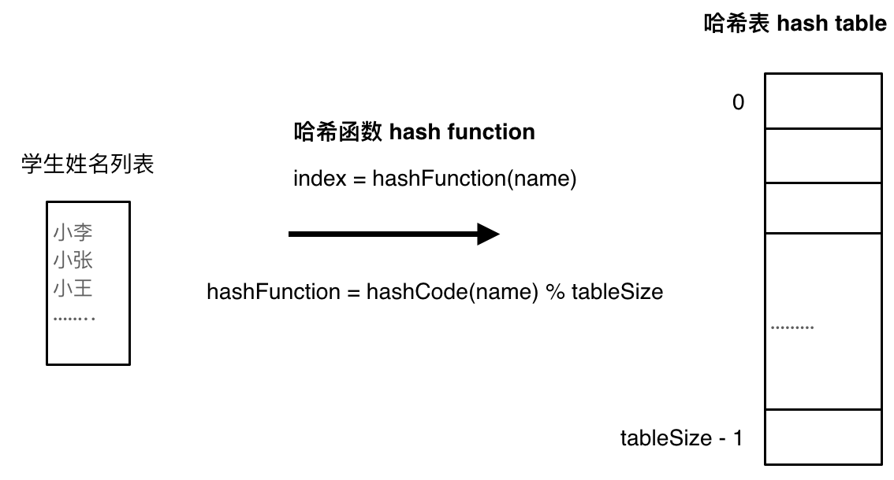

索引计算步骤（以 Java 为例）：

* 哈希函数 `hash()`：哈希值生成与优化
  * 调用 Key 自带的 `hashCode()` 方法得到原始整数
  * （可选但常见）进行**扰动处理**（高位异或低位）以混合比特位

* 索引映射：为了保证映射出来的索引数值都落在哈希表上，需要根据表长特性，执行**取模 (`%`)** 或者**位与 (`&`)** 运算，得到最终索引。处理**负数**问题通常隐含在这一步
  * **传统方法**：`index = hash % tableSize`
    - 缺点：CPU 做除法/取模运算比较慢（需要几十个时钟周期）
  * **位运算方法**：`index = hash & (tableSize - 1)`
    - **前提**：`tableSize` 必须是 **2 的幂**
    - 优点：CPU 做位与（AND）运算极快（只需 1 个时钟周期）
  * **数学等价性**：当 N 是 2 的幂时，`x % N` 等价于 `x & (N - 1)`

不同编程语言的内置哈希值计算函数的定义和方法不同。

> **常见哈希算法**
>
> - MD5 和 SHA-1 已多次被成功攻击，因此它们被各类安全应用弃用
> - SHA-2 系列中的 SHA-256 是最安全的哈希算法之一，仍未出现成功的攻击案例，因此常用在各类安全应用与协议中
> - SHA-3 相较 SHA-2 的实现开销更低、计算效率更高，但目前使用覆盖度不如 SHA-2 系列

#### 哈希碰撞/冲突

如果**数据规模dataSize**（学生的数量）大于**哈希表的大小tableSize**，此时就算哈希函数计算的再均匀，也避免不了会有几位学生的名字映射到哈希表同一个索引下标的位置，这时就发生了**哈希碰撞**

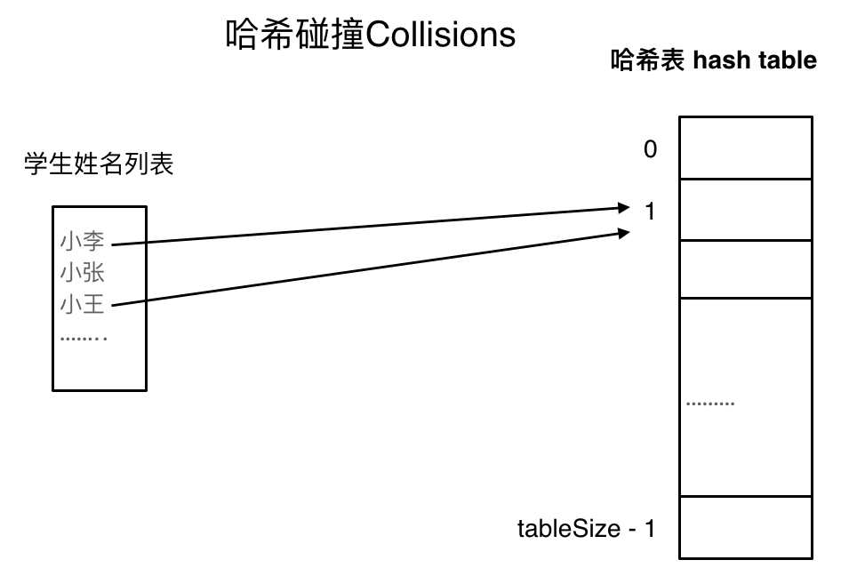

哈希碰撞不可避免，有两种解决方法，拉链法和线性探测法

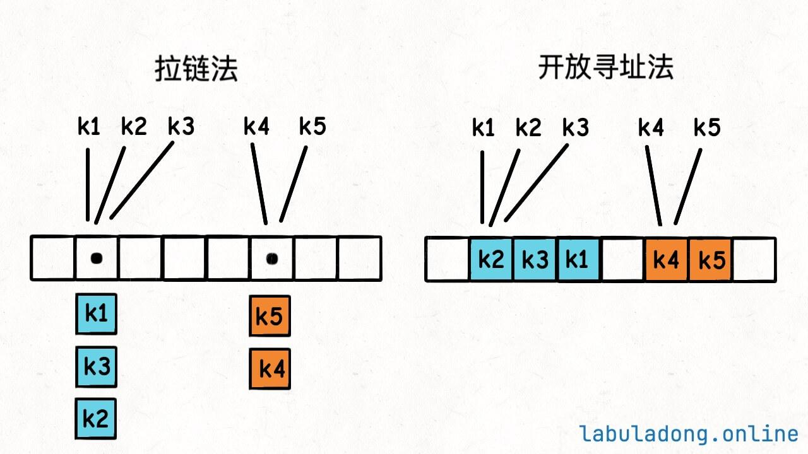

**1、拉链法**

刚刚小李和小王在索引1的位置发生了冲突，发生冲突的元素都被存储在链表中，这样就可以通过索引找到小李和小王了

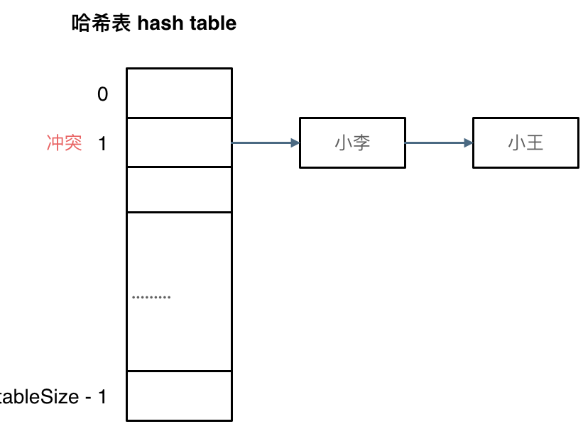

当链表变得很长时，查找效率也会变低，此时可以考虑结合其他的数据结构来提升效率。比如当链表长度达到8时，自动转换为一棵平衡二叉树或是红黑树，这样就可以在一定程度上缓解查找的压力了

**2、线性探测法（开放寻址法）**

一个 `key` 发现算出来的 `index` 值已经被别的 `key` 占了，那么它就去 `index + 1` 的位置看看，如果还是被占了，就继续往后找，直到找到一个空的位置为止

使用线性探测法，一定要保证tableSize大于dataSize，因为需要依靠哈希表中的空位来解决碰撞问题

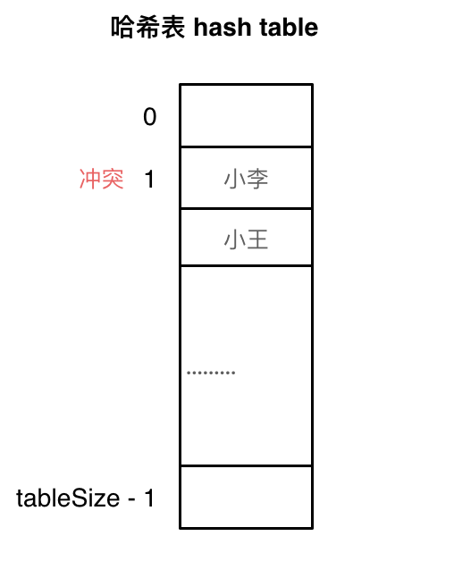

> - Python 采用开放寻址。字典 `dict` 使用伪随机数进行探测。
> - Java 采用链式地址。自 JDK 1.8 以来，当 `HashMap` 内数组长度达到 64 且链表长度达到 8 时，链表会转换为红黑树以提升查找性能。
> - Go 采用链式地址。Go 规定每个桶最多存储 8 个键值对，超出容量则连接一个溢出桶；当溢出桶过多时，会执行一次特殊的等量扩容操作，以确保性能。

#### 扩容和负载因子

拉链法和线性探查法虽然能解决哈希冲突的问题，但是它们会导致性能下降。比如拉链法需要遍历链表，线性探查法需要顺着索引往后找，直到找到一个空的位置或者找到这个 `key` 为止

> **为什么会频繁出现哈希冲突呢？**两个原因
>
> 1、哈希函数设计的不好，导致 `key` 的哈希值分布不均匀，很多 `key` 映射到了同一个索引上
>
> * 编程语言标准库已经帮你设计好了哈希函数
>
> 2、哈希表里面已经装了太多的 `key-value` 对了，这种情况下即使哈希函数再完美，也没办法避免哈希冲突
>
> * 可以控制哈希表不要装太满，这就引出了「负载因子」的概念

负载因子是一个哈希表装满的程度的度量，计算公式为 `size / table.length`。一般来说，负载因子越大，说明哈希表里面存储的 `key-value` 对越多，哈希冲突的概率就越大，哈希表的操作性能就越差

不难发现，用拉链法实现的哈希表，负载因子可以无限大，因为链表可以无限延伸；用线性探查法实现的哈希表，负载因子不会超过 1。像 Java 的 HashMap，允许我们创建哈希表时自定义负载因子，不设置的话默认是 `0.75`

**当哈希表内元素达到负载因子时，哈希表会扩容**。把哈希表底层 `table` 数组的容量扩大，把数据搬移到新的大数组中。`size` 不变，`table.length` 增加，负载因子就减小了

#### 注意

##### 不能依赖哈希表的遍历顺序来编写程序

1. **哈希表的遍历顺序是无序的**

   由于 `hash` 函数要把你的 `key` 进行映射，所以 `key` 在底层 `table` 数组中的分布是随机的，不像数组/链表结构那样有个明确的元素顺序

2. **哈希表的遍历顺序会变化**

   哈希表达到负载因子时会扩容，也就是 `table.length` 会变化，并且需要搬移元素，而搬移数据的过程中，要用 `hash` 函数重新计算 `key` 的哈希值，而这个 `hash` 函数，它计算出的索引值依赖 `table.length`。也就是说，哈希表自动扩缩容后，同一个 `key` 存储在 `table` 的索引可能发生变化，所以遍历结果的顺序就和之前不一样了

##### 不建议在 for 循环中增/删哈希表的 `key`

原因和上面相同，还是扩缩容导致的哈希值变化，这是哈希表的特有行为，但即便排除这个因素，任何其他数据结构，也都不建议在遍历的过程中同时进行增删。

##### `key` 必须是不可变的

**只有那些不可变类型，才能作为哈希表的 `key`**

所谓不可变类型，就是说这个对象一旦创建，它的值就不能再改变了。比如 Java 中的 `String, Integer` 等类型，一旦创建了这些对象，你就只能读取它的值，而不能再修改它的值了

作为对比，Java 中的 `ArrayList`、`LinkedList` 这些对象，它们创建出来之后，可以往里面随意增删元素，所以它们是可变类型

```java
// 可以把不可变类型作为 key
Map<String, AnyOtherType> map1 = new HashMap<>();
Map<Integer, AnyOtherType> map2 = new HashMap<>();

// 不应该把可变类型作为 key
// 注意，这样写并不会产生语法错误，但是代码非常容易出 bug
Map<ArrayList<Integer>, AnyOtherType> map3 = new HashMap<>();
```

**为啥一定要用不可变类型作为哈希表的 `key`**？

因为哈希表的主要操作都依赖于哈希函数计算出来的索引，如果 `key` 的哈希值会变化，会导致键值对意外丢失，产生严重的 bug。

```java
public class Test {
    public static void main(String[] args) {
        // 错误示例
        // 把可变类型作为 HashMap 的 key
        Map<ArrayList<Integer>, Integer> map = new HashMap<>();

        ArrayList<Integer> arr = new ArrayList<>();
        arr.add(1);
        arr.add(2);

        map.put(arr, 999);
        System.out.println(map.containsKey(arr)); // true
        System.out.println(map.get(arr)); // 999

        arr.add(3);
        // 出现严重 bug，键值对丢失
        System.out.println(map.containsKey(arr)); // false
        System.out.println(map.get(arr)); // null

        // 此时 map 底层的 table 中，arr 的键值对数据依然存在
        // 但是由于 arr 的 hashCode 改变了，此键值对无法被查找到
        // 这也会导致内存泄漏，因为这个 arr 变量被 map 引用着，无法被垃圾回收
    }
}
```

### 计数数组实现哈希表

#### [242有效的字母异位词](https://leetcode.cn/problems/valid-anagram/description/)

> 给定两个字符串 `s` 和 `t` ，编写一个函数来判断 `t` 是否是 `s` 的 字母异位词。

定义一个数组record用来记录字符串s里字符出现的次数，大小为26即可，初始化为0，因为字符a到字符z的ASCII也是26个连续的数值，需要把字符映射到数组也就是哈希表的索引下标上，**因为字符a到字符z的ASCII是26个连续的数值，所以字符a映射为下标0，相应的字符z映射为下标25**

要检查字符串t中是否出现了这些字符，同样在遍历字符串t的时候，对t中出现的字符映射哈希表索引上的数值再做-1的操作

最后检查一下，如果record数组所有元素都为零0，说明字符串s和t是字母异位词，return true，反之 return false

操作动画如下：

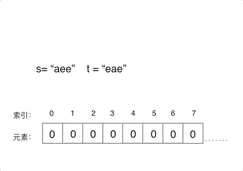

```java
class Solution {
    public boolean isAnagram(String s, String t) {
        int[] record = new int[26];

        for (int i = 0; i < s.length(); i++) {
            record[s.charAt(i) - 'a']++;     // 并不需要记住字符a的ASCII，只要求出一个相对数值就可以了
// String.charAt()返回字符串中指定索引处的 char 值
        }

        for (int i = 0; i < t.length(); i++) {
            record[t.charAt(i) - 'a']--;
        }
        
        for (int count: record) {
            if (count != 0) {               // record数组如果有的元素不为零0，说明字符串s和t 一定是谁多了字符或者谁少了字符。
                return false;
            }
        }
        return true;                        // record数组所有元素都为零0，说明字符串s和t是字母异位词
    }
}
```

#### [383赎金信](https://leetcode.cn/problems/ransom-note/description/)

> 给你两个字符串：`ransomNote` 和 `magazine` ，判断 `ransomNote` 能不能由 `magazine` 里面的字符构成。
>
> 如果可以，返回 `true` ；否则返回 `false` 。
>
> `magazine` 中的每个字符只能在 `ransomNote` 中使用一次。

本题是上一题242的变形，思路一样

```java
class Solution {
    public boolean canConstruct(String ransomNote, String magazine) {
        // 定义一个哈希映射数组
        int[] record = new int[26];

        // 遍历
        for(char c : magazine.toCharArray()){
            record[c - 'a'] += 1;
        }

        for(char c : ransomNote.toCharArray()){
            record[c - 'a'] -= 1;
        }
        
        // 如果数组中存在负数，说明ransomNote字符串中存在magazine中没有的字符
        for(int i : record){
            if(i < 0){
                return false;
            }
        }

        return true;
    }
}
```


### HashSet

#### [349两个数组的交集](https://leetcode.cn/problems/intersection-of-two-arrays/description/)

> 给定两个数组，编写一个函数来计算它们的交集。输出结果中的每个元素一定是**唯一**的。

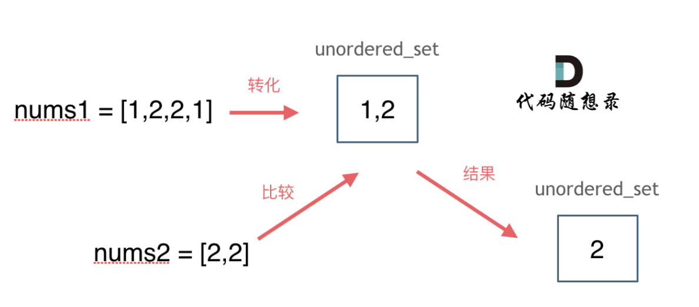

法一、使用 HashSet

```java
// 时间复杂度O(n+m+k) 空间复杂度O(n+k)
// 其中n是数组nums1的长度，m是数组nums2的长度，k是交集元素的个数
import java.util.HashSet;
import java.util.Set;

class Solution {
    public int[] intersection(int[] nums1, int[] nums2) {
        Set<Integer> set1 = new HashSet<>();
        Set<Integer> resSet = new HashSet<>();
        //遍历数组1
        for (int i : nums1) {
            set1.add(i);
        }
        //遍历数组2的过程中判断哈希表中是否存在该元素
        for (int i : nums2) {
            if (set1.contains(i)) {
                resSet.add(i);
            }
        }
      
        //方法1：将结果集合转为数组
        return res.stream().mapToInt(Integer::intValue).toArray();
        /**
         * 将 Set<Integer> 转换为 int[] 数组：
         * 1. stream() : Collection 接口的方法，将集合转换为 Stream<Integer>
         * 2. mapToInt(Integer::intValue) : 
         *    - 中间操作，将 Stream<Integer> 转换为 IntStream
         *    - 使用方法引用 Integer::intValue，将 Integer 对象拆箱为 int 基本类型
         * 3. toArray() : 终端操作，将 IntStream 转换为 int[] 数组。
         */
        
        //方法2：另外申请一个数组存放setRes中的元素,最后返回数组
        int[] arr = new int[resSet.size()];
        int j = 0;
        for(int i : resSet){
            arr[j++] = i;
        }
        
        return arr;
    }
}
```

法二、使用数组

```java
class Solution {
    public int[] intersection(int[] nums1, int[] nums2) {
        int[] hash1 = new int[1002];
        Set<Integer> resSet = new HashSet<>();
        for(int i : nums1){
            hash1[i] = 1;
        }
        for(int i : nums2){
            if(hash1[i] == 1){
                resSet.add(i);
            }
        }

        int index = 0;
        int res[] = new int[resSet.size()];
        for(int i : resSet)
            res[index++] = i;
        return res;
    }
}
```

#### [202快乐数](https://leetcode.cn/problems/happy-number/description/)

> 编写一个算法来判断一个数 n 是不是快乐数。
>
> 「快乐数」定义为：对于一个正整数，每一次将该数替换为它每个位置上的数字的平方和，然后重复这个过程直到这个数变为 1，也可能是无限循环但始终变不到 1。如果可以变为 1，那么这个数就是快乐数。
>
> 如果 n 是快乐数就返回 True；不是，则返回 False。

**关键：**

* 题目中说会**无限循环**，也就是说**求和的过程中，sum会重复出现**

  **当我们遇到了要快速判断一个元素是否出现集合里的时候，就要考虑哈希法了。**所以这道题目使用哈希法，来判断这个sum是否重复出现，如果重复了就 return false， 否则一直找到sum为1为止

* **还有一个难点就是求和的过程**

```java
class Solution {
    public boolean isHappy(int n) {
        Set<Integer> record = new HashSet<Integer>();
        // n 变为 1 或者 n 循环到之前出现的数值时跳出循环
        while(n != 1&& !record.contains(n)){
            record.add(n);
            n = next(n);
        }
        if(n==1) return true;
        else return false;
    }

    private int next(int n){
        int res = 0;
        while(n!=0){
            int temp = n % 10;
            res += temp * temp;
            n/=10;
        }
        return res;
    }
}
```

#### 【🔥中】[128最长连续序列](https://leetcode.cn/problems/longest-consecutive-sequence/solutions/276931/zui-chang-lian-xu-xu-lie-by-leetcode-solution/)

> 给定一个未排序的整数数组 `nums` ，找出数字连续的最长序列（不要求序列元素在原数组中连续）的长度。
>
> 请你设计并实现时间复杂度为 `O(n)` 的算法解决此问题。

**遍历哈希set中的数，判断它是不是连续序列的开头那个数**，判断的方法就是**用哈希表查找这个数前面一个数是否存在**，即num-1在序列中是否存在

* 如果存在，那这个数不是开头，直接跳过

- 如果不存在，就以该数为开头，循环判断后续的数是否存在，维护一个最大长度值，遍历结束返回该值

以题解中的序列举例:**[100，4，200，1，3，4，2]**

去重后的哈希序列为：**[100，4，200，1，3，2]**

按照上面逻辑进行判断：

1. 元素100是开头,因为没有99，且以100开头的序列长度为1
2. 元素4不是开头，因为有3存在，过
3. 元素200是开头，因为没有199，且以200开头的序列长度为1
4. 元素1是开头，因为没有0，且以1开头的序列长度为4，因为依次累加，2，3，4都存在
5. 元素3不是开头，因为2存在，过，
6. 元素2不是开头，因为1存在，过
   完

```java
class Solution {
    public int longestConsecutive(int[] nums) {
        Set<Integer> num_set = new HashSet<>();
        int longestLen = 0;
        for (int num : nums) num_set.add(num);
        for (int num : num_set) {
            if (!num_set.contains(num - 1)) {
                int currentNum = num;
                int currentLen = 1;
                while (num_set.contains(currentNum + 1)) {
                    currentNum += 1;
                    currentLen += 1;
                }
                longestLen = Math.max(longestLen, currentLen);
            }
        }
        return longestLen;
    }
}
```

任何一个元素，被抓起来判断的次数不会超过2次，如果一个元素是开头的，那么只会抓起来一次（由于是set，每个元素不会重复，所以开头元素只会出现1次），如果一个元素不是开头的，那可能会被抓起来2次（一次是遍历到它了，一次是判断它是否在某个连续序列里），所以时间复杂度为 O(n)

### HashMap

#### 【🔥中】[49字母异位词分组](https://leetcode.cn/problems/group-anagrams/)

> 给你一个字符串数组，请你将 字母异位词 组合在一起。可以按任意顺序返回结果列表。

```java
class Solution {
    public List<List<String>> groupAnagrams(String[] strs) {
        // 创建哈希表：Key为排序后的字符串（特征值），Value为原始字符串列表
        Map<String, List<String>> map = new HashMap<>();
        for (String str : strs) {
            // 1. 将字符串转为字符数组并排序，作为区分异位词的“唯一键”
            char[] array = str.toCharArray();
            Arrays.sort(array);
            String key = new String(array);
            
            // 2. 获取该键对应的列表，若不存在则创建新列表
            List<String> list = map.getOrDefault(key, new ArrayList<>());
            
            // 3. 将原始字符串加入列表，并更新回地图（注意：list是引用，其实可省略put，但写上更直观）
            list.add(str);
            map.put(key, list);
        }
        // 返回地图中所有的值（即分组后的列表集合）
        return new ArrayList<>(map.values());
        // map.values() 返回的类型是 Collection<List<String>>
        // 构造函数签名是 public ArrayList(Collection<? extends E> c)
    }
}
```

#### 【🔥中】[146LRU缓存](https://leetcode.cn/problems/lru-cache/description/)（利用LinkedHashMap的keySet按插入顺序排序）

> 请你设计并实现一个满足 [LRU (最近最少使用) 缓存](https://baike.baidu.com/item/LRU) 约束的数据结构。
>
> 实现 `LRUCache` 类：
>
> - `LRUCache(int capacity)` 以 **正整数** 作为容量 `capacity` 初始化 LRU 缓存
> - `int get(int key)` 如果关键字 `key` 存在于缓存中，则返回关键字的值，否则返回 `-1` 。
> - `void put(int key, int value)` 如果关键字 `key` 已经存在，则变更其数据值 `value` ；如果不存在，则向缓存中插入该组 `key-value` 。如果插入操作导致关键字数量超过 `capacity` ，则应该 **逐出** 最久未使用的关键字。
>
> 函数 `get` 和 `put` 必须以 `O(1)` 的平均时间复杂度运行。

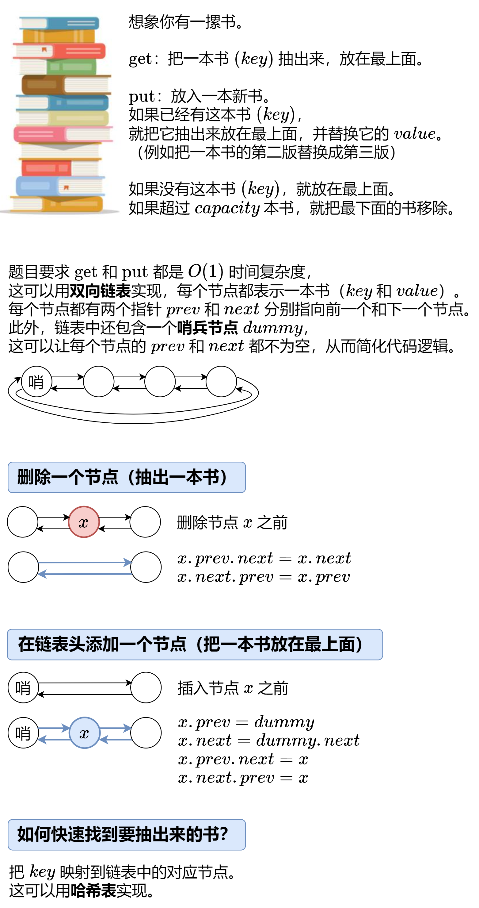

```java
class LRUCache {
    private final int capacity;
    private final Map<Integer, Integer> cache = new LinkedHashMap<>(); // 内置 LRU

    public LRUCache(int capacity) {
        this.capacity = capacity;
    }

    public int get(int key) {
        // 删除 key，并利用返回值判断 key 是否在 cache 中
        Integer value = cache.remove(key);
        if (value != null) { // key 在 cache 中
            cache.put(key, value);
            return value;
        }
        // key 不在 cache 中
        return -1;
    }

    public void put(int key, int value) {
        // 删除 key，并利用返回值判断 key 是否在 cache 中
        if (cache.remove(key) != null) { // key 在 cache 中
            cache.put(key, value);
            return;
        }
        // key 不在 cache 中，那么就把 key 插入 cache，插入前判断 cache 是否满了
        if (cache.size() == capacity) { // cache 满了
            Integer eldestKey = cache.keySet().iterator().next();
            cache.remove(eldestKey); // 移除最久未使用 key
        }
        cache.put(key, value);
    }
}
```

`cache.keySet().iterator().next()`

1. **`cache.keySet()`**：
   获取 Map 中所有键（Key）的集合。在 `LinkedHashMap` 中，这个集合是**有序的**
2. **`.iterator()`**：
   为这个集合创建一个迭代器。对于 `LinkedHashMap`，迭代器遍历的顺序就是**插入顺序**（也就是从最旧到最新）
3. **`.next()`**：
   取出迭代器中的**第一个元素**。因为迭代器是从最旧的开始遍历，所以取出来的这个 Key 就是**在 Map 中存在时间最久、且没有被访问过**的那个 Key

#### 【🔥简】[1两数之和](https://leetcode.cn/problems/two-sum/)（两个数组用HashMap）

> 给定一个整数数组 `nums` 和一个整数目标值 `target`，请你在该数组中找出 **和为目标值** *`target`* 的那 **两个** 整数，并返回它们的数组下标。
>
> 你可以假设每种输入只会对应一个答案，并且你不能使用两次相同的元素。
>
> 你可以按任意顺序返回答案。

显然暴力的解法是两层for循环查找，时间复杂度是O(n^2^)

**关键：**

* **为什么用哈希表**：由于遍历这个数组的过程中，每遍历到一个元素，就要判断他与目标值的差值 complement 是否在之前遍历过，因此可以用哈希表保存之前遍历过的元素

* **为什么用 Map**：**把遍历过的元素放到哈希 Map 中作为 Key**，并且由于需要返回两个元素的下标，因此可以**将下标作为 Value**，所以 map 中的存储结构为 **{key：数据元素，value：数组元素对应的下标}**

* **for 循环内的操作**：如果存在这样一个之前遍历的元素，则将这两个匹配元素的下标放入数组；否则将目前遍历的元素放入哈希 Map 中

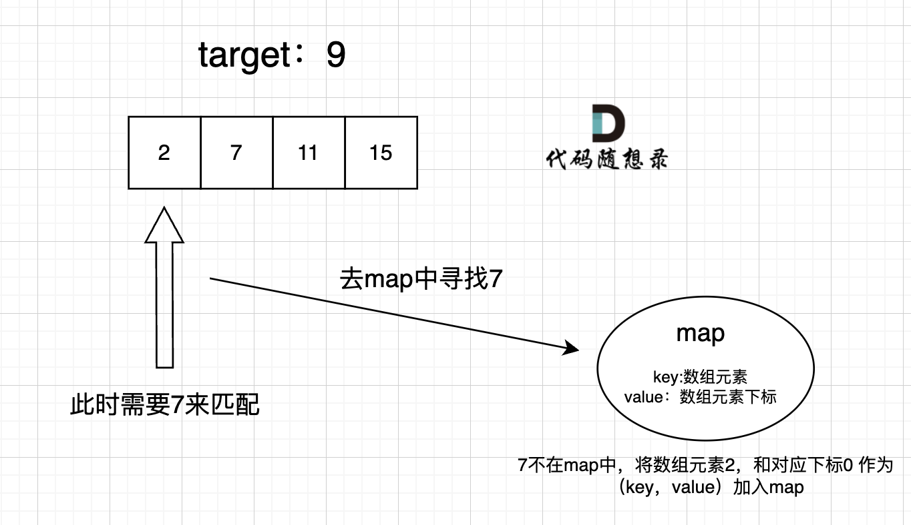

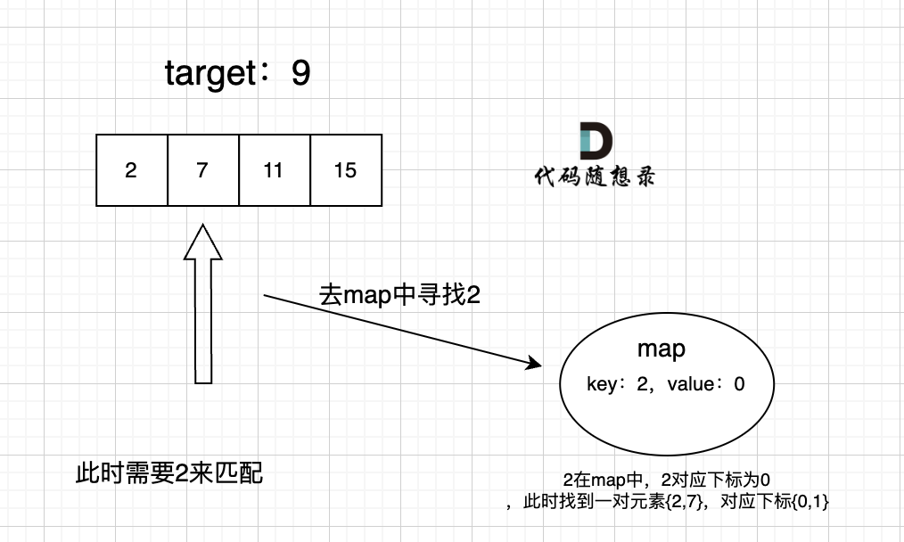

```java
public int[] twoSum(int[] nums, int target) {
    Map<Integer,Integer> recordMap = new HashMap<>();
    // 遍历数组
    for(int i=0;i<nums.length;i++){
        int complement = target-nums[i];
        // 1、查之前存入的 map 中是否有匹配值
        if(recordMap.containsKey(complement)) return new int[]{recordMap.get(complement), i}; // 返回两个数的下标
        // 2、把当前数值和下标存入 map
        recordMap.put(nums[i],i);
    }
    return null;
}
```

如果要返回所有可能的下标对，就需要修改代码，考虑数组中多个元素数值可能相同，需要做三个关键改动：

1. **移除提前返回**：不能找到一组就 `return`，必须遍历完整个数组
2. **改变返回值类型**：从 `int[]` 变成 `List<int[]>` 或 `List<List<Integer>>` 来存储多组结果
3. **修改 Map 的 Value**：因为同一个数字可能出现多次（比如前两个都是 3），Map 的 Value 不能只存一个索引 `Integer`，而要存 **“该数字出现过的所有索引列表”** `List<Integer>`

```java
List<int[]> result = new ArrayList<>();
// Key: 数值, Value: 该数值出现过的所有索引列表
Map<Integer, List<Integer>> map = new HashMap<>();

// 遍历数组
for (int i = 0; i < nums.length; i++) {
    int num = nums[i];
    int complement = target - num;

    // 1、查之前存入的 map 中是否有匹配值
    if (map.containsKey(complement)) {
        // 获取互补值之前出现的所有索引
        List<Integer> prevIndices = map.get(complement);

        // 遍历这些索引，与当前的 i 组成所有可能的对
        for (int prevIndex : prevIndices) {
            // 因为 prevIndex 肯定小于 i (它是之前的)，所以天然满足不重复、不自指
            result.add(new int[]{prevIndex, i});
        }
    }

    // 2、把当前数字和它的索引存入 Map
    // 如果 Key 不存在，先创建一个新列表
    map.putIfAbsent(num, new ArrayList<>());
    // 将当前索引加入列表
    map.get(num).add(i);
}

return result;
```

#### [454四数相加II](https://leetcode.cn/problems/4sum-ii/description/)（四个数组用HashMap）

> 给你四个整数数组 `nums1`、`nums2`、`nums3` 和 `nums4` ，数组长度都是 `n` ，请你计算有多少个元组 `(i, j, k, l)`能满足：
>
> - `0 <= i, j, k, l < n`
> - `nums1[i] + nums2[j] + nums3[k] + nums4[l] == 0`

核心思想是 **“空间换时间”**，将 O(N^4^) 的暴力解法优化为 O(N^2^)

> 1 两数相加 和 454 四数相加II 这两道题的灵魂都是：**“与其暴力遍历所有组合，不如把一部分数据存起来，用 O(1) 的时间去查找互补值”**

**关键：**

* 先让 **A和B** 把**所有可能的和及其频次**存进**哈希表map**
* 再让 **C和D** 计算和并去哈希表中**查找匹配的相反数**，将找到的**频次累加**即为答案

*注意：之所以用 map 是因为不能只记录某个 A+B 的和“是否存在”，而要记录“存在多少次”，即使和相同，对应的下标元组也可能不同*

具体步骤：

1. 首先定义一个map，key放a和b两数之和，value放a和b两数之和出现的次数
2. 遍历大A和大B数组，统计两个数组元素之和，和出现的次数，放到map中
3. 定义int变量count，用来统计 a+b+c+d=0 出现的次数
4. 再遍历大C和大D数组，找到如果 0-(c+d) 在map中出现过的话，就用count把map中key对应的value也就是出现次数统计出来
5. 最后返回统计值 count

```java
class Solution {
    public int fourSumCount(int[] nums1, int[] nums2, int[] nums3, int[] nums4) {
        int res = 0;
        Map<Integer, Integer> map = new HashMap<Integer, Integer>();
        // 1、遍历 A+B 统计两个数组中的元素之和，同时统计出现的次数，放入map
        for (int i : nums1) {
            for (int j : nums2) {
                int sum = i + j;
                map.put(sum, map.getOrDefault(sum, 0) + 1);
            }
        }
        // 2、遍历 C+D 统计剩余的两个元素的和，在map中找是否存在相加为0的情况，同时记录次数
        for (int i : nums3) {
            for (int j : nums4) {
                res += map.getOrDefault(0 - i - j, 0); // 不能直接用 get 方法，get 会返回 null，基本数据类型int不能直接与null进行加法运算
            }
        }
        return res;
    }
}
```

*算法中使用 `map.getOrDefault(x, 0)`，避免了因返回 `null` 导致的后续空指针异常*

### 一个数组n数之和—双指针

#### 【🔥中】[15三数之和](https://leetcode.cn/problems/3sum/)<a id="15"></a>

> 给你一个整数数组 `nums` ，判断是否存在三元组 `[nums[i], nums[j], nums[k]]` 满足 `i != j`、`i != k` 且 `j != k` ，同时还满足 `nums[i] + nums[j] + nums[k] == 0` 。请你返回所有和为 `0` 且不重复的三元组。
>

参考1两数之和用哈希法思路是：两层循环固定 a 和 b，然后在哈希表中查找 c=−(a+b)，但是1两数之和是求数组下标的二元组，而本题是求数组元素值的三元组，实现去重很麻烦，这里采用双指针法

*两数之和不能使用双指针法，因为1两数之和要求返回的是索引下标， 而双指针法一定要排序，一旦排序之后原数组的索引就被改变了*

**1、双指针法核心思路**：一层for循环num[i]为确定值，然后循环内有left和right下标作为双指针，找到 `nums[i] + nums[left] + nums[right] == 0`

* 首先将数组排序
* 然后有一层 for 循环遍历三元组第一个元素a，a的下标i从0开始，同时定位b在下标 left，初始 i+1 位置，定位c在下标 right，初始数组结尾位置，我们要在数组中找到 abc 使得 a+b+c=0，即 nums[i]+nums[left]+nums[right]=0
* 接下来在 while 循环条件 left<right 下（不是<=，因为三元组不能有两个元素是同一个位置的），判断如何移动 left 和 right

  * 如果 nums[i]+nums[left]+nums[right] > 0 就说明此时三数之和大了，因为数组已排序，所以right下标就应该向左移动，这样才能让三数之和小一些

  * 如果 nums[i]+nums[left]+nums[right] < 0 说明此时三数之和小了，left 下标就向右移动，才能让三数之和大一些，直到left与right相遇为止
  
  * 如果 =0 说明找到了三元组，将其放入提前定义好的两层数组 result 中

**2、去重操作**

* **在for循环的开始** ，去重a，例如 [-1,-1,0,1] 的情况

  `i > 0 && nums[i] == nums[i - 1]`	

  * 因为数组已经排序了，只要判断相邻的两个元素是否相等就行 `nums[i] == nums[i - 1]`

    *注意⚠️：不是 `nums[i] == nums[i + 1]`，这种条件会把三元组中出现重复元素的情况pass掉，例如{-1, -1 ,2}这组数据，当遍历到第一个-1的时候，判断下一个也是-1，那这组数据就pass了*

    **我们要做的是不能有重复的三元组，但三元组内的元素是可以重复的！**

  * 当 i = 0 时，i - 1等于 -1，为了防止 `ArrayIndexOutOfBoundsException` 数组越界，还需添加 `i>0` 的条件

* **找到一个三元组之后**，去重b和c，例如 [-1,0,0,1,1] 的情况

  `while(left < right && right[i] == right[i-1]) right--;`

  * 这里的right指向的1与下一步的1重复，所以可以多移一步跳过重复的1
  * 同时由于可能有多个重复的1，比如 [-1,0,0,1,1,1]，所以需要循环这个操作直到移动到一个不同的值

  left同理，`while(left < right && left[i] == left[i+1] left++;)`

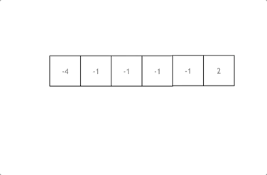

```java
// 时间复杂度：O(n^2)
class Solution {
    public List<List<Integer>> threeSum(int[] nums) {
        List<List<Integer>> result = new ArrayList<>();
        Arrays.sort(nums);
        // 找出a + b + c = 0
        // a = nums[i], b = nums[left], c = nums[right]
        for (int i = 0; i < nums.length-2; i++) {
	          // 剪枝
            // 排序之后如果第一个元素已经大于零，那么无论如何组合都不可能凑成三元组，直接返回结果就可以了
            if (nums[i] > 0) { 
                return result;
            }

            // 去重a
            if (i > 0 && nums[i] == nums[i - 1]) {
                continue;
            }

            int left = i + 1;
            int right = nums.length - 1;
            while (left < right) {// left=right 不符合三元组要求
                int sum = nums[i] + nums[left] + nums[right];
                if (sum > 0) {
                    right--;
                } else if (sum < 0) {
                    left++;
                } else {
                    // 放入符合条件的三元组
                    result.add(Arrays.asList(nums[i], nums[left], nums[right]));
		                // 对b和c去重的逻辑放在找到一个三元组之后
                    while (left < right && nums[right] == nums[right - 1]) right--;
                    while (left < right && nums[left] == nums[left + 1]) left++;
                    
                    right--; 
                    left++;
                }
            }
        }
        return result;
    }
}
```

#### [18四数之和](https://leetcode.cn/problems/ransom-note/description/)<a id="18"></a>

> 给你一个由 `n` 个整数组成的数组 `nums` ，和一个目标值 `target` 。请你找出并返回满足下述全部条件且**不重复**的四元组 `[nums[a], nums[b], nums[c], nums[d]]` （若两个四元组元素一一对应，则认为两个四元组重复）：
>
> - `0 <= a, b, c, d < n`
> - `a`、`b`、`c` 和 `d` **互不相同**
> - `nums[a] + nums[b] + nums[c] + nums[d] == target`
>
> 你可以按 **任意顺序** 返回答案 。

454四数相加II 是四个独立的数组，只要找到A[i] + B[j] + C[k] + D[l] = 0即可，不用考虑有重复的四个元素相加等于0的情况，所以相对于本题还是简单了不少

本题思路整体和三数之和一样，都是双指针，但写的时候有很多细节需要注意

**核心思路：**两层for循环 `nums[k] + nums[i]` 为确定值，依然是循环内有left和right下标作为双指针，找出 `nums[k] + nums[i] + nums[left] + nums[right] == target` 的情况，三数之和的时间复杂度是O(n^2^)，四数之和的时间复杂度是O(n^3^) 

**细节：**

1. **没有剪枝操作，代码也可以运行。** 剪枝只是为了**提高效率**（减少不必要的计算），只是运行速度会变慢，特别是在数据量较大时可能会超时（Time Limit Exceeded）

2. **直接在 `for` 循环的条件中减去所需的元素个数**：

   - 四数之和：`i < nums.length - 3`
   - 三数之和：`i < nums.length - 2`

   如果 i 的循环限制改为 `i < nums.length`（j 同理），代码会直接抛出 `ArrayIndexOutOfBoundsException`（数组下标越界异常）导致程序崩溃，剪枝无法防止崩溃因为剪枝语句本身就在访问越界的下标

```java
import java.util.*;
public class Solution {
    public List<List<Integer>> fourSum(int[] nums, int target) {
        Arrays.sort(nums);  // 排序数组
        List<List<Integer>> result = new ArrayList<>();  // 结果集
        for (int i = 0; i < nums.length-3; i++) {
            // 剪枝
            if ((long) nums[i] + nums[i + 1] + nums[i + 2] + nums[i + 3] > target) {
                break;
            }
            if ((long) nums[i] + nums[nums.length - 3] + nums[nums.length - 2] + nums[nums.length - 1] < target) {
                continue;
            }
            // 对nums[i]去重
            if (i > 0 && nums[i] == nums[i - 1]) {
                continue;
            }
            for (int j = i + 1; j < nums.length-2; j++) {
                // 剪枝
                if ((long) nums[i] + nums[j] + nums[j + 1] + nums[j + 2] > target) {
                    break;
                }
                if ((long) nums[i] + nums[j] + nums[nums.length - 2] + nums[nums.length - 1] < target) {
                    continue;
                }
                // 对nums[j]去重
                if (j > i + 1 && nums[j] == nums[j - 1]) {
                    continue;
                }
                int left = j + 1;
                int right = nums.length - 1;
                while (left < right) {
                    long sum = (long) nums[i] + nums[j] + nums[left] + nums[right];
                    if (sum > target) right--;
                    else if (sum < target) left++;
                    else {
                        result.add(Arrays.asList(nums[i], nums[j], nums[left], nums[right]));
                        // 对nums[left]和nums[right]去重
                        while (left < right && nums[right] == nums[right - 1]) right--;
                        while (left < right && nums[left] == nums[left + 1]) left++;
                        right--;
                        left++;
                    }
                }
            }
        }
        return result;
    }

    public static void main(String[] args) {
        Solution solution = new Solution();
        int[] nums = {1, 0, -1, 0, -2, 2};
        int target = 0;
        List<List<Integer>> results = solution.fourSum(nums, target);
        for (List<Integer> result : results) {
            System.out.println(result);
        }
    }
}
```

## 四、字符串

### 理论基础

`substring(int beginIndex, int endIndex)` 返回从 `beginIndex` 到 `endIndex - 1` 的子串（**左闭右开** `[start, end)`）

```java
String s = "leetcode";
// 取 "leet" (索引 0 到 3)
String sub = s.substring(0, 4); 

// 取从索引 4 到末尾 "code"
String suffix = s.substring(4); // 等价于 substring(4, s.length())
```

`indexOf(String str)` / `indexOf(int ch)` 返回指定字符或子串**第一次**出现的索引，若不存在返回 `-1`

```java
// 寻找第一个空格
int spaceIndex = s.indexOf(' '); 
// 从索引 5 开始寻找 "abc"
int idx = s.indexOf("abc", 5);
```

`lastIndexOf(String str)` 返回指定字符或子串**最后一次**出现的索引

`contains(CharSequence s)` 判断是否包含某子串

`equals(Object anObject)` & `equalsIgnoreCase(String anotherString)`

`str.isEmpty()` 完全等价于 `str.length() == 0`

**可变字符串：`StringBuilder`**

如果在循环中需要频繁拼接字符串（如反转、构造新串），**绝对不要**使用 `+` 号拼接，否则时间复杂度会退化为 $O(N^2)$。

```java
StringBuilder sb = new StringBuilder();
for (char c : chars) {
    if (Character.isLetter(c)) {
        sb.append(c);
    }
}
return sb.toString();
```

**常用方法**：`append()`, `reverse()`, `deleteCharAt()`, `setCharAt()`.

> 字符判断工具类 `Character`
>
> LeetCode 中常配合 String 使用：
>
> - `Character.isLetter(c)`: 是否字母
> - `Character.isDigit(c)`: 是否数字
> - `Character.isLowerCase(c)`: 是否小写
> - `Character.toUpperCase(c)`: 转大写
> - `c - 'a'`: 将小写字母映射为 0-25 的整数（常用于哈希表/数组计数）

**两种遍历方式：**

* for循环 + 字符串取值 `String.charAt()`

  ```java
  String x = "Java";
  for (int i = 0; i < x.length(); i++) {
      char c = x.charAt(i);
      System.out.println(c);
  }
  ```

* 如果要用增强型for循环，就要先用 `String.toCharArray()` 将其转化为集合

  ```java
  for (char c : x.toCharArray())
  ```

### 【🔥中】[394字符串解码](https://leetcode.cn/problems/decode-string/description/)（递归）

> 给定一个经过编码的字符串，返回它解码后的字符串。
>
> 编码规则为: `k[encoded_string]`，表示其中方括号内部的 `encoded_string` 正好重复 `k` 次。注意 `k` 保证为正整数。
>
> 你可以认为输入字符串总是有效的；输入字符串中没有额外的空格，且输入的方括号总是符合格式要求的。
>
> 此外，你可以认为原始数据不包含数字，所有的数字只表示重复的次数 `k` ，例如不会出现像 `3a` 或 `2[4]` 的输入。
>
> 测试用例保证输出的长度不会超过 `105`。
>
> ```
> 输入：s = "3[a]2[bc]"
> 输出："aaabcbc"
> ```
>
> ```
> 输入：s = "3[a2[c]]"
> 输出："accaccacc"
> ```

把 s 视作若干基础字符串和 k[encoded_string] 的并

以 s=ab2[cd]3[e] 为例说明，将其视作 ab+2[cd]+3[e]。从左到右遍历 s：

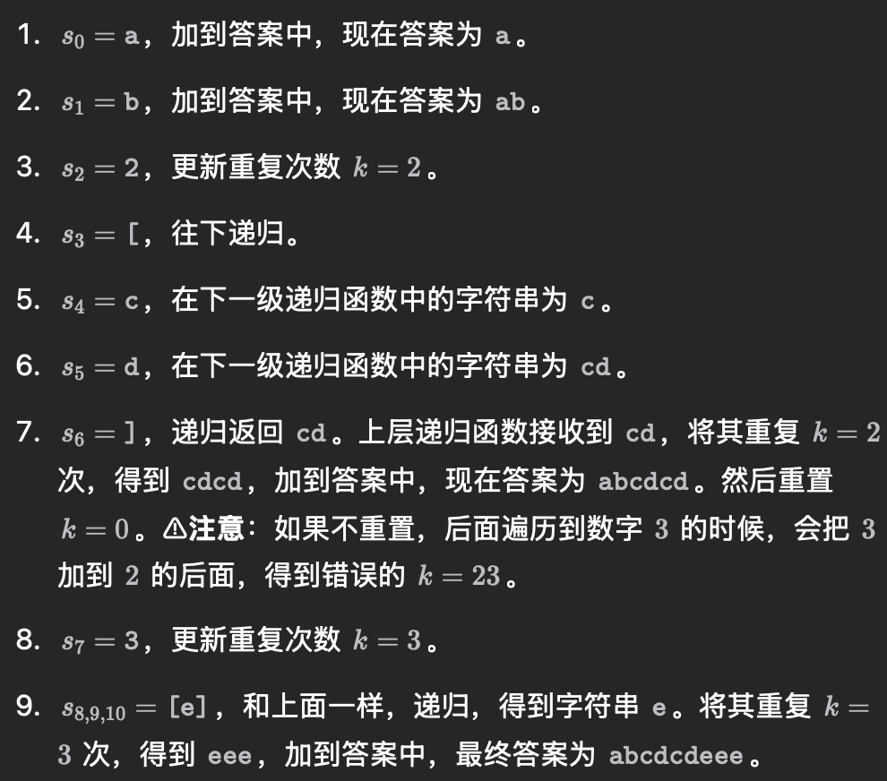

⚠️注意：

1. 递归过程中，怎么知道当前遍历到哪个字符了？

   答：可以用一个在递归函数外的变量 i 表示当前下标，每遍历到一个字符，就把 i 加一

2. 如果 s=123[a]，怎么把字符串 123 变成数字 k=123？

   答：利用式子 k=k⋅10+int(s~i~) 计算

   * 初始化 k=0

   * 更新 k 为 k⋅10+1=0+1=1

   * 更新 k 为 k⋅10+2=10+2=12

   * 更新 k 为 k⋅10+3=120+3=123

```java
class Solution {
    private int i = 0;
    public String decodeString(String s) {
        return decode(s.toCharArray());
    }

    private String decode(char[] s) {
        StringBuilder res = new StringBuilder();
        int k = 0;
        while (i < s.length) {
            char c = s[i];
            i++;
            // 【递前的准备工作】
            if (Character.isLetter(c)) res.append(c);
            else if (Character.isDigit(c)) k = k * 10 + (c - '0');
            // 【递】
            else if (c == '[') {
                String t = decode(s); // 递归调用
                // 【归】
                for (int j = 0; j < k; j++) res.append(t); // 把括号内的字符串重复 k 次
                k = 0; // 重置 k，若不重置，2[a]3[b] 后面的 3 会算出 k = 23
            } else // 【边界条件】c == ']'
                break;
        }
        return res.toString();
    }
}
```

* `Character.isLetter(char ch)`：判断是不是**字母**
* `Character.isDigit()`：判断是不是**数字**

### KMP（未做）

https://www.bilibili.com/video/BV1KQdDYiEgN

## 双指针总结

很多考察数组、链表、字符串等操作的面试题，都使用**双指针法**，**核心思想是：**用两个变量的相对关系（距离、方向、速度）来替代暴力搜索中的嵌套循环或额外空间，**将时间复杂度降一个数量级**

数组篇

* [27移除元素（快慢双指针）](./算法1.md#27)
* [283移动零（快慢双指针）](./算法1.md#283)
* [977有序数组的平方（相向双指针）](./算法1.md#977)
* [11盛最多水的容器（相向双指针）](./算法1.md#11)
* [75颜色分类（同向双指针维护边界）](./算法1.md#75)

链表篇

* [简 876链表的中间节点（快慢双指针）](./算法1.md#876)
* [234回文链表（876链表的中间节点+206反转链表）](./算法1.md#234)
* [141环形链表（快慢双指针）](./算法1.md#141)
* [142环形链表II（快慢双指针+相向双指针）](./算法1.md#142)
* [287寻找重复数（同142）](./算法1.md#287)
* [19删除链表的倒数第N个节点（前后双指针迭代法）](./算法1.md#19)
* [160相交链表（独立双指针迭代拼接链表法）](./算法1.md#160)
* [21合并两个有序链表（独立双指针迭代法）](./算法1.md#21)
* [2两数相加（独立双指针迭代法）](./算法1.md#2)

N数之和

* [15三数之和（一个数组用相向双指针）](#15)
* [18四数之和（一个数组用相向双指针）](#18)

| 题目          | 应用领域 | 指针角色                       | 核心逻辑                                   |
| ------------- | -------- | ------------------------------ | ------------------------------------------ |
| 27. 移除元素  | 数组     | 快指针探路，慢指针记录有效位置 | 快指针找到“好”元素，慢指针负责“收集”       |
| 283. 移动零   | 数组     | 快指针探路，慢指针记录有效位置 | 快指针找到“非零”元素，慢指针负责“收集”     |
| 141. 环形链表 | 链表     | 速度差异（1步 vs 2步）         | 追及问题：快指针追上慢指针则有环           |
| 876. 链表中点 | 链表     | 速度差异（1步 vs 2步）         | 路程问题：快指针走完全程，慢指针恰好在中间 |

### 滑动窗口（子串/子数组问题）

如果用暴力解，需要嵌套 for 循环穷举所有子数组，时间复杂度是 O(N^2^)

```java
for (int i = 0; i < nums.length; i++) {
    for (int j = i; j < nums.length; j++) {
        // nums[i, j] 是一个子数组
    }
}
```

> **对于暴力枚举法，最自然的方式就是「左闭右闭」**，起点是 `i`，终点是 `j`，长度是 `j-i+1`

**滑动窗口算法技巧主要用来解决子串/子数组问题，比如让你寻找符合某个条件的最长/最短子数组**

滑动窗口只用一个for循环，那么这个循环的索引一定是**表示滑动窗口的终止位置**，如果是初始位置，又回到暴力解了

```java
// 滑动窗口算法伪码框架
void slidingWindow(String s) {
    // 根据场景用合适的数据结构记录窗口数据
    // 比如说，我想记录窗口中元素出现的次数，就用 map
    // 如果我想记录窗口中的元素和，就可以只用一个 int
    Object window = ...
    
    // 左闭右开窗口区间，right指向下一个要进来的
    int left = 0, right = 0;
    
    // 结果数据
    Object result = ...
    
    while (right < s.length()) {
        // c 是将移入窗口的字符，更新窗口数据
        char c = s[right];
        window.add(c)
        ...
        
        // 增大窗口
        right++;

        // *** debug 输出的位置 ***
        // 注意在最终的解法代码中不要 print
        // 因为 IO 操作很耗时，可能导致超时
        // printf("window: [%d, %d)\n", left, right);
        // ***********************

        // 判断左侧窗口是否要收缩
        while (left < right && window needs shrink) {
            // d 是将移出窗口的字符，更新窗口数据
            char d = s[left];
            window.remove(d)
            ...
            
            // 缩小窗口
            left++;
        }
    }
    // 返回结果数据
    return result;
}
```

> **滑动窗口框架用了一个嵌套 while 循环，为啥复杂度是 O(N) 呢？**
>
> 这是因为指针 `left, right` 不会回退（只增不减），所以字符串/数组中的每个元素都只会进入窗口一次，然后被移出窗口一次，所以算法的时间复杂度就和字符串/数组的长度成正比
>
> 反观嵌套 for 循环的暴力解法，`j` 会回退，所以某些元素会进入和离开窗口多次，时间复杂度就是 O(N^2^) 了

> **为什么要「左闭右开」区间？**
>
> 滑动窗口算法的核心在于 `left` 和 `right` 像虫子的两头一样动态移动，这时候必须严格定义“指针是指向窗内还是窗外”，否则收缩/扩张时会乱套，而设计为左闭右开区间是最方便处理的
>
> 因为这样初始化 `left = right = 0` 时区间 `[0, 0)` 中没有元素，但只要让 `right` 向右移动（扩大）一位，区间 `[0, 1)` 就包含一个元素 `0` 了
>
> - **左闭右开**：`right` 总是指向**未来**（下一个要进来的）。所以我们可以直接用它做下标取值（取未来的值），取完后把它推到更远的未来，长度公式 `right-left`
> - **左闭右闭**：`right` 总是指向**现在**（当前最后一个）。所以通常需要先移动它，让它变成新的“现在”，然后再取值，长度公式 `right-left+1`
>
> ```java
> // 左闭右闭写法1
> int right = -1; // 初始时 right 在左边界的左侧
> while (right < n - 1) {
>     right++; // 1. 先移动指针，让 right 指向新的有效元素
>     char c = s.charAt(right); // 2. 再取值。此时 right 已经在窗口内了
>     
>     // ... 更新数据 ...
>     
>     // 此时窗口是 [left, right]，right 指向的就是最后一个元素
> }
> ```
>
> ```java
> // 左闭右闭写法2
> for (int right = 0; right < n; right++) {
> }
> ```

**基于这个框架，只需要回答以下问题：**

1. **窗口数据和结果数据的定义**
2. 增大窗口前，**窗口数据的更新**，第一处 `...`
3. **左侧窗口收缩的while循环条件**
   * **当前窗口是“非法”的**（例如：大于所需长度/有重复字符）
   * 或者**虽然合法但可以通过收缩变得更优**（例如：已经覆盖了所有目标字符，尝试缩小看看能不能更短）
4. 缩小窗口前，**窗口数据的更新**，第二处 `...`（与第一处对称）
5. **结果数据的更新**，一般在缩小窗口前更新结果数据，也有可能在第二个while循环后更新结果数据

#### [209. 长度最小的子数组](https://leetcode.cn/problems/minimum-size-subarray-sum/)

> 给定一个含有 `n` 个正整数的数组和一个正整数 `target` **。**
>
> 找出该数组中满足其总和大于等于 `target` 的长度最小的 **子数组** `[numsl, numsl+1, ..., numsr-1, numsr]` ，并返回其长度**。**如果不存在符合条件的子数组，返回 `0` 。

法一、暴力解法当然是两个for循环，然后不断的寻找符合条件的子序列，时间复杂度很明显是O(n^2^)

```c++
class Solution {
    public int minSubArrayLen(int target, int[] nums) {
        int result = INT32_MAX; // 最终的结果
        int sum = 0; // 子序列的数值之和
        for (int left = 0; left < nums.size(); left++) { // 设置子序列起点为i
            sum = 0;
            for (int right = left; right < nums.size(); right++) { // 设置子序列终止位置为right
                sum += nums[right];
                if (sum >= target) { // 一旦发现子序列和超过了s，更新result
                    result = result < right - left + 1 ? result : right - left + 1;
                    break; // 因为我们是找符合条件最短的子序列，所以一旦符合条件就break
                }
            }
        }
        // 如果result没有被赋值的话，就返回0，说明没有符合条件的子序列
        return result == INT32_MAX ? 0 : result;
    }
}
```

法二、**滑动窗口**，就是**根据当前子序列和大小的情况，不断的调节子序列的起始位置和终止位置，从而将O(n^2^)暴力解法降为O(n)**

思路：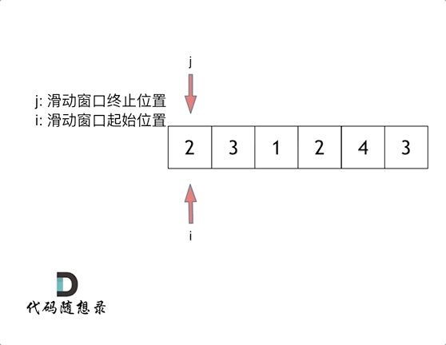

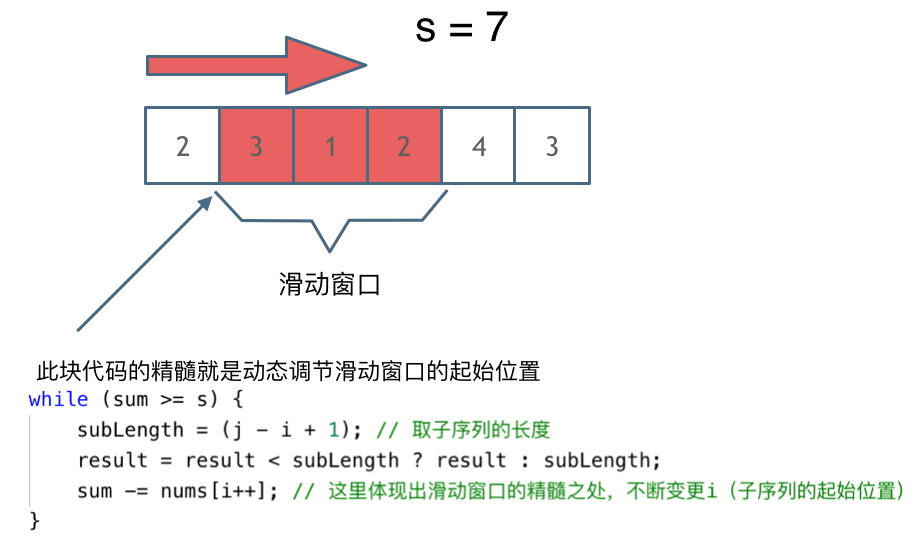

注意：这道题左侧窗口收缩的while循环条件是**虽然合法但可以通过收缩变得更优**，因此窗口数据更新之后，可能不再符合循环条件即题目条件，如果这时再去更新结果，此时记录的可能是一个**已经破坏了的、无效的**状态，因此这道题要把结果数据更新放到窗口数据更新之前

```java
class Solution {
    public int minSubArrayLen(int target, int[] nums) {
        // 记录窗口数据，这里是元素和sum
        int sum = 0;
        // 窗口区间
        int left = 0, right = 0; 
        // 记录结果数据，子数组长度
        int result = Integer.MAX_VALUE;
      
        while(right < nums.length){
            // nums[right]被移入窗口，进行窗口数据更新
            sum += nums[right];
            
            // 增大窗口
            right++;
            
            // 判断左侧窗口是否要收缩
            while(left < right && sum >= target){
                // 更新结果数据
                result = Math.min(result, right-left);
                
                // nums[left]被移出窗口，进行窗口数据更新
                sum -= nums[left];
                
                // 缩小窗口
                left++;
            }
        }
        // 返回结果数据，子数组长度
        return result == Integer.MAX_VALUE ? 0 : result;
    }
}
```

> | 特性            | `Math.max(a, b)`                          | `a > b ? a : b` (三元运算符)                                |
> | --------------- | ----------------------------------------- | ----------------------------------------------------------- |
> | 基础数值类型    | ✅ 支持 (`int`, `long`, `float`, `double`) | ✅ 支持 (需配合比较运算符，如 `>`)                           |
> | 包装类对象      | ❌ 不支持 (直接传对象会报错)               | ✅ 支持 (前提是对象实现了 `Comparable` 或你手动写了比较逻辑) |
> | 字符串 (String) | ❌ 不支持                                  | ✅ 支持 (需用 `.compareTo()`)                                |
> | 自定义对象      | ❌ 不支持                                  | ✅ 支持 (需用自定义的比较逻辑)                               |
> | 不同类型混合    | ❌ 不支持 (必须严格匹配重载方法)           | ⚠️ 有限支持 (如果能找到公共父类或自动提升)                   |
>
> `Math.max` **不支持**基础类型包装类。你能用它传包装类，完全是靠 Java 的**自动拆箱机制**在“强行”转换，一旦遇到 `null` 就会报错
>
> `Math.abs()` 求绝对值

#### 【🔥难】[76. 最小覆盖子串](https://leetcode.cn/problems/minimum-window-substring/)

> 给你一个字符串 `s` 、一个字符串 `t` 。返回 `s` 中涵盖 `t` 所有字符的最小子串。如果 `s` 中不存在涵盖 `t` 所有字符的子串，则返回空字符串 `""` 。

**思路：**

1、在字符串 `S` 中使用双指针中的左右指针技巧，初始化 `left = right = 0`，把索引**左闭右开**区间 `[left, right)` 称为一个「窗口」

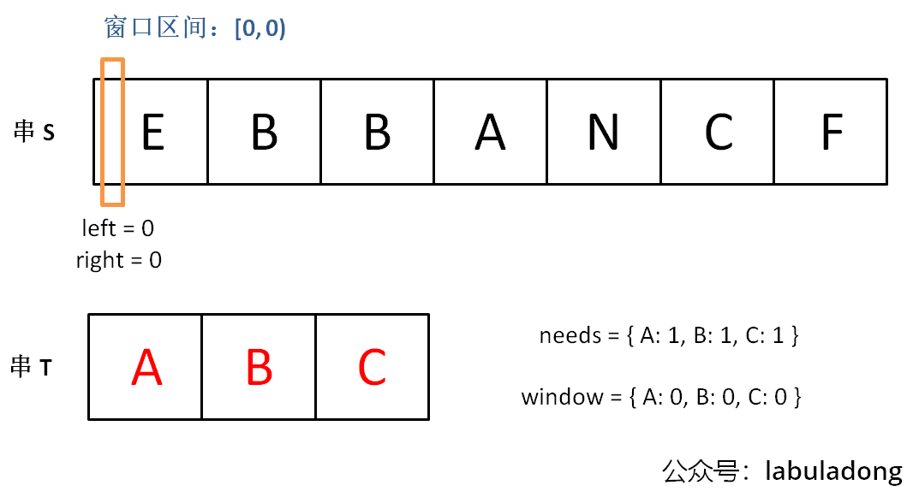

2、先不断地增加 `right` 指针扩大窗口 `[left, right)`，直到窗口中的字符串符合要求（包含了 `T` 中的所有字符）

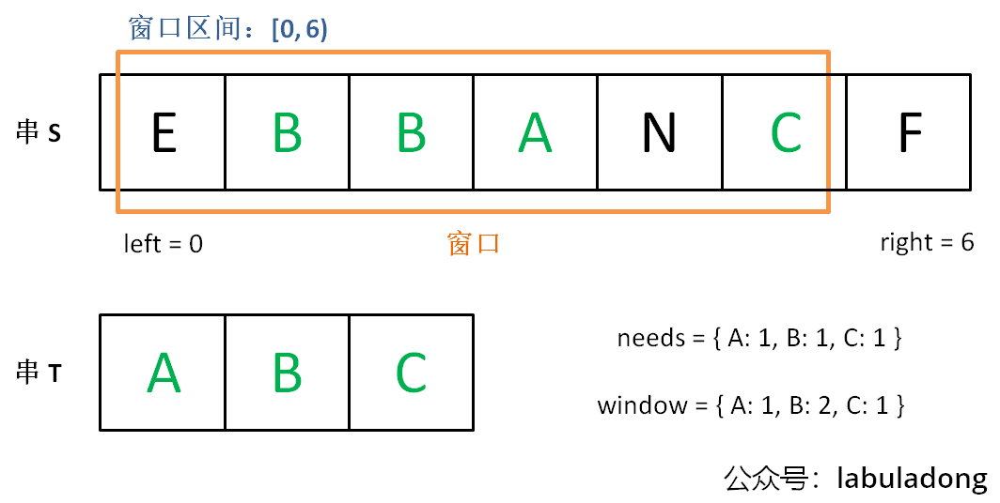

3、此时停止增加 `right`，转而不断增加 `left` 指针缩小窗口 `[left, right)`，直到窗口中的字符串不再符合要求（不包含 `T` 中的所有字符了）。同时，每次增加 `left` 前，都要更新一轮结果

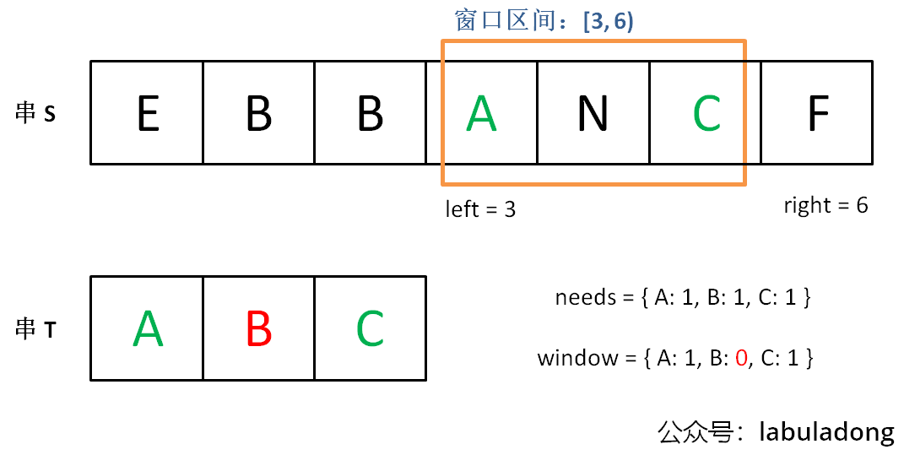

4、重复第 2 和第 3 步，直到 `right` 到达字符串 `S` 的尽头

**第 2 步相当于在寻找一个「可行解」，然后第 3 步在优化这个「可行解」，最终找到最优解**，也就是最短的覆盖子串。左右指针轮流前进，窗口大小增增减减

注意：这道题左侧窗口收缩的while循环条件同样是**虽然合法但可以通过收缩变得更优**，因此要把结果数据更新放到窗口数据更新之前

```java
class Solution {
    public String minWindow(String s, String t) {
        Map<Character, Integer> need = new HashMap<>();
        for (char c : t.toCharArray()) {
            need.put(c, need.getOrDefault(c, 0) + 1);
        }
      
        // 记录窗口数据
        Map<Character, Integer> window = new HashMap<>();
        int valid = 0; // 窗口中满足 need 条件的字符个数，如果 valid=need.size，则说明窗口已满足条件，完全覆盖了串 T

        // 左闭右开窗口区间
        int left = 0, right = 0; 
      
        // 记录结果数据，最小覆盖子串的起始索引及长度
        int start = 0, len = Integer.MAX_VALUE;
        
        while (right < s.length()) {
            // c 是将移入窗口的字符，进行窗口数据更新
            char c = s.charAt(right);
            if (need.containsKey(c)) {
                window.put(c, window.getOrDefault(c, 0) + 1);
                if (window.get(c).equals(need.get(c)))
                    valid++;
            }
            
            // 增大窗口
            right++;
          
            // 判断左侧窗口是否要收缩
            while (valid == need.size()) {
                // 更新结果数据，最小覆盖子串
                if (right - left < len) {
                    start = left;
                    len = right - left;
                }
              
                // d 是将移出窗口的字符，更新窗口数据
                char d = s.charAt(left);
                if (need.containsKey(d)) {
                    if (window.get(d).equals(need.get(d)))
                        valid--;
                    window.put(d, window.get(d) - 1);
                }    
              
                // 缩小窗口
                left++;                
            }
        }
        // 返回结果数据，最小覆盖子串
        return len == Integer.MAX_VALUE ? "" : s.substring(start, start + len);
    }
}
```

> 对 Java 包装类进行比较时要尤为小心，`Integer`，`String` 等类型应该用 `equals` 方法判定相等，而不能直接用等号 `==`，否则会出错。所以在缩小窗口更新数据的时候，不能直接写为 `window.get(d) == need.get(d)`，而要用 `window.get(d).equals(need.get(d))`，之后的题目代码同理

#### [567. 字符串的排列](https://leetcode.cn/problems/permutation-in-string/)

> 给你两个字符串 `s1` 和 `s2` ，写一个函数来判断 `s2` 是否包含 `s1` 的排列。如果是，返回 `true` ；否则，返回 `false` 。
>
> 换句话说，`s1` 的排列之一是 `s2` 的 **子串** 。

```java
class Solution {
    // 判断 s 中是否存在 t 的排列
    public boolean checkInclusion(String t, String s) {
        Map<Character, Integer> need = new HashMap<>();
        for (char c : t.toCharArray()) need.put(c, need.getOrDefault(c, 0) + 1);
        Map<Character, Integer> window = new HashMap<>();
        int left = 0, right = 0;
        int valid = 0;
        while (right < s.length()) {
            char c = s.charAt(right);
            right++;
            // 进行窗口内数据的一系列更新
            if (need.containsKey(c)) {
                window.put(c, window.getOrDefault(c, 0) + 1);
                if (window.get(c).equals(need.get(c)))
                    valid++;
            }

            // 判断左侧窗口是否要收缩
            while (right - left + 1 > t.length()) {
                // 在这里判断是否找到了合法的子串
                if (valid == need.size())
                    return true;
                char d = s.charAt(left);
                left++;
                // 进行窗口内数据的一系列更新
                if (need.containsKey(d)) {
                    if (window.get(d).equals(need.get(d)))
                        valid--;
                    window.put(d, window.get(d) - 1);
                }
            }
        }
        // 未找到符合条件的子串
        return false;
    }
}
```

1、`right - left + 1 > t.length()`

本题移动 `left` 缩小窗口的时机是窗口大小大于 `t.length()` 时，因为显然长度应该是一样的

2、当发现 `valid == need.size()` 时，就说明窗口中就是一个合法的排列，所以立即返回 `true`

#### 【🔥中】[438. 找到字符串中所有字母异位词](https://leetcode.cn/problems/find-all-anagrams-in-a-string/)

> 给定两个字符串 `s` 和 `p`，找到 `s` 中所有 `p` 的 **异位词** 的子串，返回这些子串的起始索引。不考虑答案输出的顺序。
>
> **异位词** 指由相同字母重排列形成的字符串（包括相同的字符串）。

```java
class Solution {
    public List<Integer> findAnagrams(String s, String p) {
        Map<Character, Integer> need = new HashMap<>();
        for (char c : p.toCharArray()) {
            need.put(c, need.getOrDefault(c, 0) + 1);
        }
        Map<Character, Integer> window = new HashMap<>();
        int left = 0, right = 0;
        int valid = 0;
        // 记录结果
        List<Integer> res = new ArrayList<>();
        while (right < s.length()) {
            char c = s.charAt(right);
            // 进行窗口内数据的一系列更新
            if (need.containsKey(c)) {
                window.put(c, window.getOrDefault(c, 0) + 1);
                if (window.get(c).equals(need.get(c))) {
                    valid++;
                }
            }
            right++;
            
            // 判断左侧窗口是否要收缩
            while (right - left + 1 > p.length()) {
                // 当窗口符合条件时，把起始索引加入 res
                if (valid == need.size()) {
                    res.add(left);
                }
                char d = s.charAt(left);
                // 进行窗口内数据的一系列更新
                if (need.containsKey(d)) {
                    if (window.get(d).equals(need.get(d))) {
                        valid--;
                    }
                    window.put(d, window.get(d) - 1);
                }
                left++;
            }
        }
        return res;
    }
}
```

#### 【🔥中】[3. 无重复字符的最长子串](https://leetcode.cn/problems/longest-substring-without-repeating-characters/)

> 给定一个字符串 `s` ，请你找出其中不含有重复字符的 **最长子串** 的长度。

```java
class Solution {
    public int lengthOfLongestSubstring(String s) {
        Map<Character, Integer> window = new HashMap<>();
        int left = 0, right = 0;
        // 记录结果
        int res = 0;
        while (right < s.length()) {
            char c = s.charAt(right);
            right++;
            // 进行窗口内数据的一系列更新
            window.put(c, window.getOrDefault(c, 0) + 1);
            // 判断左侧窗口是否要收缩
            while (window.get(c) > 1) {
                char d = s.charAt(left);
                window.put(d, window.get(d) - 1);
                left++;
            }
            // 在这里更新答案
            res = Math.max(res, right - left);
        }
        return res;
    }
}
```

这里更简单，连 `need` 和 `valid` 都不需要，更新窗口数据只需要更新计数器 `window` 即可

当 `window[c]` 值大于 1 时，说明窗口中存在重复字符，不符合条件，就该移动 `left` 缩小窗口

唯一需要注意的是，要在收缩窗口完成后更新 `res`，因为窗口收缩的 while 条件是存在重复元素，换句话说收缩完成后一定保证窗口中没有重复

## 五、栈与队列

### 理论基础

队列是**先进先出**，栈是**先进后出**

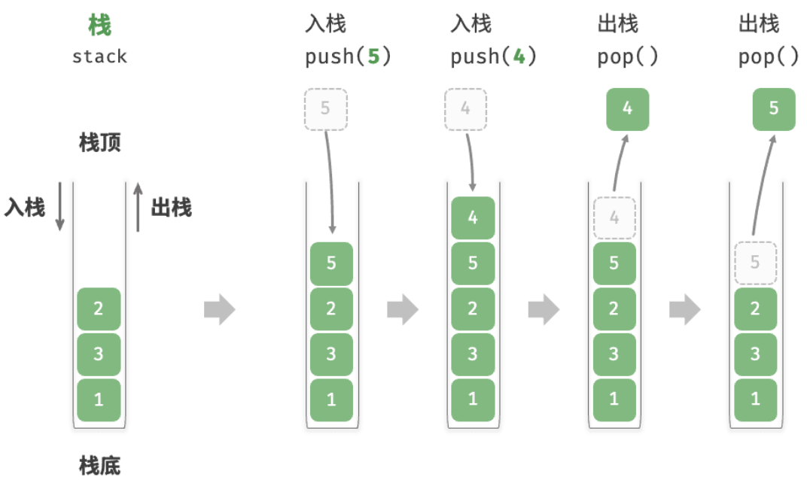

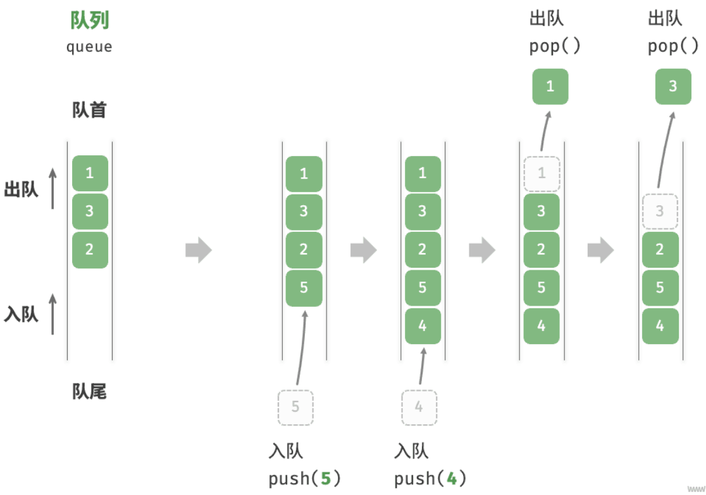


##### 栈的常用操作

```java
/* 初始化栈 */
Stack<Integer> stack = new Stack<>();

/* 元素入栈 */
stack.push(1);
stack.push(3);
stack.push(2);
stack.push(5);
stack.push(4);

/* 访问栈顶元素 */
int peek = stack.peek();

/* 元素出栈 */
int pop = stack.pop();

/* 获取栈的长度 */
int size = stack.size();

/* 判断是否为空 */
boolean isEmpty = stack.isEmpty();

/* 遍历后恢复栈（如果不希望清空栈）*/
Stack<Integer> tempStack = new Stack<>();
while (!stack.isEmpty()) {
    int num = stack.pop();
    System.out.print(num + " "); // 处理逻辑
    tempStack.push(num);         // 存入临时栈
}
// 将元素压回原栈（恢复原状）
while (!tempStack.isEmpty()) {
    stack.push(tempStack.pop());
}
```

##### 栈的实现

**栈可以视为一种受限制的数组或链表**

* 使用链表实现栈时，可以将链表的头节点视为栈顶，尾节点视为栈底。对于入栈操作，只需将元素插入链表头部，这种节点插入方法被称为“头插法”。而对于出栈操作，只需将头节点从链表中删除即可

  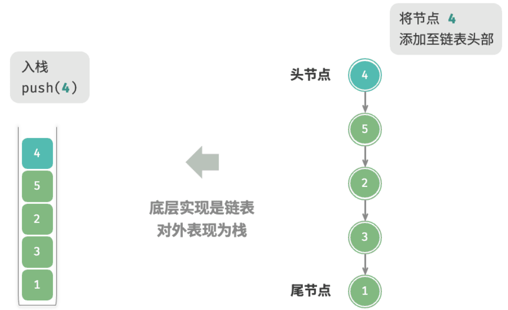

* 使用数组实现栈时，可以将数组的尾部作为栈顶。入栈与出栈操作分别对应在数组尾部添加元素与删除元素，时间复杂度都为 O(1)

  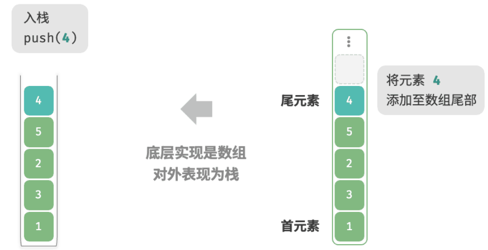

```java
/* 基于链表实现的栈 */
class LinkedListStack {
    private ListNode stackPeek; // 将头节点作为栈顶
    private int stkSize = 0; // 栈的长度

    public LinkedListStack() {
        stackPeek = null;
    }

    /* 获取栈的长度 */
    public int size() {
        return stkSize;
    }

    /* 判断栈是否为空 */
    public boolean isEmpty() {
        return size() == 0;
    }

    /* 入栈 */
    public void push(int num) {
        ListNode node = new ListNode(num);
        node.next = stackPeek;
        stackPeek = node;
        stkSize++;
    }

    /* 出栈 */
    public int pop() {
        int num = peek();
        stackPeek = stackPeek.next;
        stkSize--;
        return num;
    }

    /* 访问栈顶元素 */
    public int peek() {
        if (isEmpty())
            throw new IndexOutOfBoundsException();
        return stackPeek.val;
    }

    /* 将 List 转化为 Array 并返回 */
    public int[] toArray() {
        ListNode node = stackPeek;
        int[] res = new int[size()];
        for (int i = res.length - 1; i >= 0; i--) {
            res[i] = node.val;
            node = node.next;
        }
        return res;
    }
}
```

```java
/* 基于数组实现的栈 */
class ArrayStack {
    private ArrayList<Integer> stack;

    public ArrayStack() {
        // 初始化列表（动态数组）
        stack = new ArrayList<>();
    }

    /* 获取栈的长度 */
    public int size() {
        return stack.size();
    }

    /* 判断栈是否为空 */
    public boolean isEmpty() {
        return size() == 0;
    }

    /* 入栈 */
    public void push(int num) {
        stack.add(num);
    }

    /* 出栈 */
    public int pop() {
        if (isEmpty())
            throw new IndexOutOfBoundsException();
        return stack.remove(size() - 1);
    }

    /* 访问栈顶元素 */
    public int peek() {
        if (isEmpty())
            throw new IndexOutOfBoundsException();
        return stack.get(size() - 1);
    }

    /* 将 List 转化为 Array 并返回 */
    public Object[] toArray() {
        return stack.toArray();
    }
}
```

> **两种实现方式对比**
>
> 1、**支持操作**
>
> 两种实现都支持栈定义中的各项操作。数组实现额外支持随机访问，但这已超出了栈的定义范畴，因此一般不会用到
>
> 2、**时间效率**
>
> 在基于数组的实现中，入栈和出栈操作都在预先分配好的连续内存中进行，具有很好的缓存本地性，因此效率较高。然而，如果入栈时超出数组容量，会触发扩容机制，导致该次入栈操作的时间复杂度变为 
>
> 在基于链表的实现中，链表的扩容非常灵活，不存在上述数组扩容时效率降低的问题。但是，入栈操作需要初始化节点对象并修改指针，因此效率相对较低。不过，如果入栈元素本身就是节点对象，那么可以省去初始化步骤，从而提高效率
>
> 3、**空间效率**
>
> 在初始化列表时，系统会为列表分配“初始容量”，该容量可能超出实际需求；并且，扩容机制通常是按照特定倍率（例如 2 倍）进行扩容的，扩容后的容量也可能超出实际需求。因此，**基于数组实现的栈可能造成一定的空间浪费**
>
> 然而，由于链表节点需要额外存储指针，**因此链表节点占用的空间相对较大**

##### 栈的典型应用

- **浏览器中的后退与前进、软件中的撤销与反撤销**。每当我们打开新的网页，浏览器就会对上一个网页执行入栈，这样我们就可以通过后退操作回到上一个网页。后退操作实际上是在执行出栈。如果要同时支持后退和前进，那么需要两个栈来配合实现
  - 使用两个栈，栈 `A` 用于撤销，栈 `B` 用于反撤销
    1. 每当用户执行一个操作，将这个操作压入栈 `A` ，并清空栈 `B`
    2. 当用户执行“撤销”时，从栈 `A` 中弹出最近的操作，并将其压入栈 `B`
    3. 当用户执行“反撤销”时，从栈 `B` 中弹出最近的操作，并将其压入栈 `A`
- **程序内存管理**。每次调用函数时，系统都会在栈顶添加一个栈帧，用于记录函数的上下文信息。在递归函数中，向下递推阶段会不断执行入栈操作，而向上回溯阶段则会不断执行出栈操作

##### 队列的常用操作

```java
/* 初始化队列 */
// Queue是接口，不能直接 new，要用LinkedList
Queue<Integer> queue = new LinkedList<>();

/* 元素入队 */
queue.offer(1);
queue.offer(3);
queue.offer(2);
queue.offer(5);
queue.offer(4);

/* 访问队首元素 */
int peek = queue.peek();

/* 元素出队 */
int pop = queue.poll();

/* 获取队列的长度 */
int size = queue.size();

/* 判断队列是否为空 */
boolean isEmpty = queue.isEmpty();
```

###### LinkedList

`LinkedList` 在 Java 中是一个非常特殊的类，它同时具备两种身份：

1、**双向链表**：实现了 `List` 接口，与 ArrayList 共享一套方法

- **增：** `add(E e)`, `add(int index, E element)`
- **删：** `remove(int index)`, `remove(Object o)`
- **改：** `set(int index, E element)`
- **查：** `get(int index)`, `indexOf(Object o)`
- **其他：** `size()`, `clear()`, `contains(Object o)`

2、**双端队列**：实现了 `Deque` 接口（`Deque` 继承自 `Queue`），可以作为栈或队列使用

| 功能分类 | 方法签名        | 作用                                 |
| -------- | --------------- | ------------------------------------ |
| 头部操作 | `addFirst(E e)` | 在链表头部插入元素                   |
|          | `getFirst()`    | 获取链表第一个元素                   |
|          | `removeFirst()` | 删除并返回第一个元素                 |
| 尾部操作 | `addLast(E e)`  | 在链表尾部添加元素（等同于 `add()`） |
|          | `getLast()`     | 获取链表最后一个元素                 |
|          | `removeLast()`  | 删除并返回最后一个元素               |
| 栈操作   | `push(E e)`     | 入栈（相当于 `addFirst`）            |
|          | `pop()`         | 出栈（相当于 `removeFirst`）         |
| 队列操作 | `offer(E e)`    | 添加元素（队列专用）                 |
|          | `poll()`        | 获取并删除队头元素                   |
|          | `peek()`        | 获取但不删除队头元素                 |

##### 队列的实现

* 使用链表实现队列时，可以将链表的“头节点”和“尾节点”分别视为“队首”和“队尾”，规定队尾仅可添加节点，队首仅可删除节点

  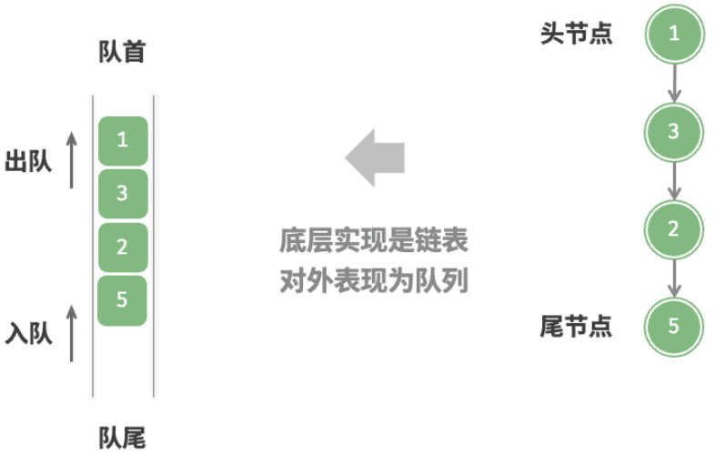

* 使用数组实现队列时，在数组中删除首元素的时间复杂度为 O(n)，这会导致出队操作效率较低。然而，可以采用以下方法来避免这个问题：

  使用一个变量 `front` 指向队首元素的索引，并维护一个变量 `size` 用于记录队列长度。定义 `rear = front + size` ，这个公式计算出的 `rear` 指向队尾元素之后的下一个位置

  基于此设计，**数组中包含元素的有效区间为 `[front, rear - 1]`**

  - 入队操作：将输入元素赋值给 `rear` 索引处，并将 `size` 增加 1 
  - 出队操作：只需将 `front` 增加 1 ，并将 `size` 减少 1 

  可以看到，入队和出队操作都只需进行一次操作，时间复杂度均为 O(1)

  你可能会发现一个问题：在不断进行入队和出队的过程中，`front` 和 `rear` 都在向右移动，**当它们到达数组尾部时就无法继续移动了**。为了解决此问题，我们可以将数组视为首尾相接的“环形数组”。

  对于环形数组，我们需要让 `front` 或 `rear` 在越过数组尾部时，直接回到数组头部继续遍历。这种周期性规律可以通过“取余操作”来实现

  以上实现的队列仍然具有局限性：其长度不可变。然而，这个问题不难解决，我们可以将数组替换为动态数组，从而引入扩容机制

  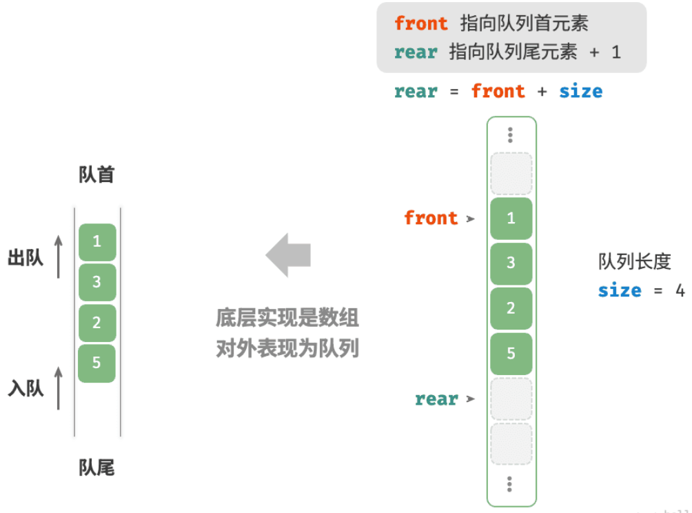

```java
/* 基于链表实现的队列 */
class LinkedListQueue {
    private ListNode front, rear; // 头节点 front ，尾节点 rear
    private int queSize = 0;

    public LinkedListQueue() {
        front = null;
        rear = null;
    }

    /* 获取队列的长度 */
    public int size() {
        return queSize;
    }

    /* 判断队列是否为空 */
    public boolean isEmpty() {
        return size() == 0;
    }

    /* 入队 */
    public void push(int num) {
        // 在尾节点后添加 num
        ListNode node = new ListNode(num);
        // 如果队列为空，则令头、尾节点都指向该节点
        if (front == null) {
            front = node;
            rear = node;
        // 如果队列不为空，则将该节点添加到尾节点后
        } else {
            rear.next = node;
            rear = node;
        }
        queSize++;
    }

    /* 出队 */
    public int pop() {
        int num = peek();
        // 删除头节点
        front = front.next;
        queSize--;
        return num;
    }

    /* 访问队首元素 */
    public int peek() {
        if (isEmpty())
            throw new IndexOutOfBoundsException();
        return front.val;
    }

    /* 将链表转化为 Array 并返回 */
    public int[] toArray() {
        ListNode node = front;
        int[] res = new int[size()];
        for (int i = 0; i < res.length; i++) {
            res[i] = node.val;
            node = node.next;
        }
        return res;
    }
}
```

```java
/* 基于环形数组实现的队列 */
class ArrayQueue {
    private int[] nums; // 用于存储队列元素的数组
    private int front; // 队首指针，指向队首元素
    private int queSize; // 队列长度

    public ArrayQueue(int capacity) {
        nums = new int[capacity];
        front = queSize = 0;
    }

    /* 获取队列的容量 */
    public int capacity() {
        return nums.length;
    }

    /* 获取队列的长度 */
    public int size() {
        return queSize;
    }

    /* 判断队列是否为空 */
    public boolean isEmpty() {
        return queSize == 0;
    }

    /* 入队 */
    public void push(int num) {
        if (queSize == capacity()) {
            System.out.println("队列已满");
            return;
        }
        // 计算队尾指针，指向队尾索引 + 1
        // 通过取余操作实现 rear 越过数组尾部后回到头部
        int rear = (front + queSize) % capacity();
        // 将 num 添加至队尾
        nums[rear] = num;
        queSize++;
    }

    /* 出队 */
    public int pop() {
        int num = peek();
        // 队首指针向后移动一位，若越过尾部，则返回到数组头部
        front = (front + 1) % capacity();
        queSize--;
        return num;
    }

    /* 访问队首元素 */
    public int peek() {
        if (isEmpty())
            throw new IndexOutOfBoundsException();
        return nums[front];
    }

    /* 返回数组 */
    public int[] toArray() {
        // 仅转换有效长度范围内的列表元素
        int[] res = new int[queSize];
        for (int i = 0, j = front; i < queSize; i++, j++) {
            res[i] = nums[j % capacity()];
        }
        return res;
    }
}
```

##### 队列典型应用

- **淘宝订单**。购物者下单后，订单将加入队列中，系统随后会根据顺序处理队列中的订单。在双十一期间，短时间内会产生海量订单，高并发成为工程师们需要重点攻克的问题
- **各类待办事项**。任何需要实现“先来后到”功能的场景，例如打印机的任务队列、餐厅的出餐队列等，队列在这些场景中可以有效地维护处理顺序

##### 双向队列

队列中，我们仅能删除头部元素或在尾部添加元素。双向队列（double-ended queue）提供了更高的灵活性，允许在头部和尾部执行元素的添加或删除操作

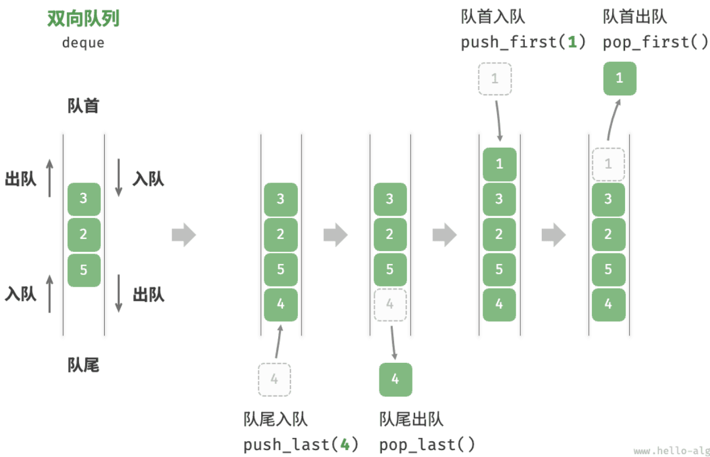

**常用操作：**

```java
/* 初始化双向队列 */
Deque<Integer> deque = new LinkedList<>();

/* 元素入队 */
deque.offerLast(2);   // 添加至队尾
deque.offerLast(5);
deque.offerLast(4);
deque.offerFirst(3);  // 添加至队首
deque.offerFirst(1);

/* 访问元素 */
int peekFirst = deque.peekFirst();  // 队首元素
int peekLast = deque.peekLast();    // 队尾元素

/* 元素出队 */
int popFirst = deque.pollFirst();  // 队首元素出队
int popLast = deque.pollLast();    // 队尾元素出队

/* 获取双向队列的长度 */
int size = deque.size();

/* 判断双向队列是否为空 */
boolean isEmpty = deque.isEmpty();
```

| 角色     | 入口方法 (增)                | 出口方法 (删)              | 查看方法 (查/Peek)         | 操作端   | 典型应用           |
| -------- | ---------------------------- | -------------------------- | -------------------------- | -------- | ------------------ |
| 队列     | `offer()` `offerLast()`      | `poll()` `pollFirst()`     | `peek()` `peekFirst()`     | 尾进头出 | BFS, 打印任务      |
| 栈       | `push()` `offerFirst()`      | `pop()` `pollFirst()`      | `peek()` `peekFirst()`     | 头进头出 | DFS, 递归模拟      |
| 双端队列 | `offerLast()` `offerFirst()` | `pollLast()` `pollFirst()` | `peekLast()` `peekFirst()` | 两头随意 | 单调队列, 滑动窗口 |

**实现：**可以选择**双向链表**或**环形动态数组**作为底层数据结构

**应用：**

双向队列兼具栈与队列的逻辑，**因此它可以实现这两者的所有应用场景，同时提供更高的自由度**

我们知道，软件的“撤销”功能通常使用栈来实现：系统将每次更改操作 `push` 到栈中，然后通过 `pop` 实现撤销。然而，考虑到系统资源的限制，软件通常会限制撤销的步数（例如仅允许保存 步）。当栈的长度超过 时，软件需要在栈底（队首）执行删除操作。**但栈无法实现该功能，此时就需要使用双向队列来替代栈**。请注意，“撤销”的核心逻辑仍然遵循栈的先入后出原则，只是双向队列能够更加灵活地实现一些额外逻辑。

### [232用栈实现队列](https://leetcode.cn/problems/implement-queue-using-stacks/description/)（输入栈+输出栈）

> 请你仅使用两个栈实现先入先出队列。队列应当支持一般队列支持的所有操作（`push`、`pop`、`peek`、`empty`）：
>
> 实现 `MyQueue` 类：
>
> - `void push(int x)` 将元素 x 推到队列的末尾
> - `int pop()` 从队列的开头移除并返回元素
> - `int peek()` 返回队列开头的元素
> - `boolean empty()` 如果队列为空，返回 `true` ；否则，返回 `false`

需要两个栈**一个输入栈，一个输出栈**，这里要注意输入栈和输出栈的关系

执行语句：
queue.push(1);
queue.push(2);
queue.pop(); **注意此时的输出栈的操作**
queue.push(3);
queue.push(4);
queue.pop();
queue.pop();**注意此时的输出栈的操作**
queue.pop();
queue.empty();

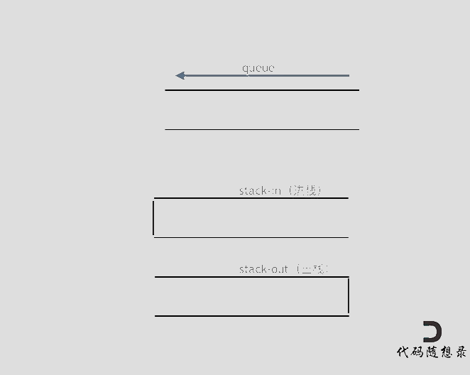

* 在push数据的时候，只要数据放进输入栈就好
* 但在pop的时候，操作就复杂一些
  * 输出栈如果为空，就把进栈数据全部导入进来（注意是全部导入），再从出栈弹出数据
  * 输出栈不为空，则直接从出栈弹出数据就可以了

最后如何判断队列为空呢？**如果进栈和出栈都为空的话，说明模拟的队列为空了**

在代码实现的时候，会发现pop() 和 peek()两个函数功能类似，代码实现上也是类似的，可以抽象一下：

```java
class MyQueue {
    Stack<Integer> stackIn;
    Stack<Integer> stackOut;

    public MyQueue() {
        stackIn = new Stack<>(); // 负责进栈
        stackOut = new Stack<>(); // 负责出栈
    }
    
    public void push(int x) {
        stackIn.push(x);
    }
    
    public int pop() {    
        dumpstackIn();
        return stackOut.pop();
    }
    
    public int peek() {
        dumpstackIn();
        return stackOut.peek();
    }
    
    public boolean empty() {
        return stackIn.isEmpty() && stackOut.isEmpty();
    }

    // 如果stackOut为空，那么将stackIn中的元素全部放到stackOut中
    private void dumpstackIn(){
        if (!stackOut.isEmpty()) return; 
        // 用while循环将进栈全部导入出栈
        while (!stackIn.isEmpty()){
                stackOut.push(stackIn.pop());
        }
    }
}
```

### [225用队列实现栈](https://leetcode.cn/problems/implement-stack-using-queues/description/)（队列+辅助队列/单队列）

> 请你仅使用两个队列实现一个后入先出（LIFO）的栈，并支持普通栈的全部四种操作（`push`、`top`、`pop` 和 `empty`）。
>
> 实现 `MyStack` 类：
>
> - `void push(int x)` 将元素 x 压入栈顶。
> - `int pop()` 移除并返回栈顶元素。
> - `int top()` 返回栈顶元素。
> - `boolean empty()` 如果栈是空的，返回 `true` ；否则，返回 `false` 。

队列执行语句如下：

```java
queue.offer(1);        
queue.offer(2);        
queue.poll();   // 注意弹出的操作       
queue.offer(3);        
queue.offer(4);       
queue.poll();  // 注意弹出的操作    
queue.poll();    
queue.poll();    
queue.isEmpty();    
```

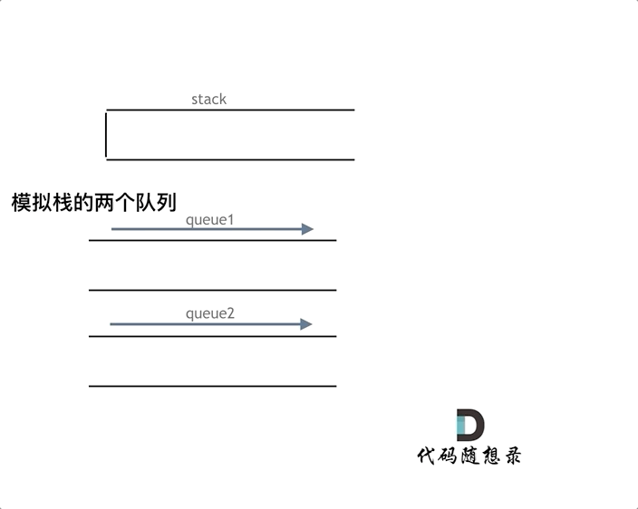

**用两个队列实现：**

```java
import java.util.LinkedList;
import java.util.Queue;

class MyStack {
    private Queue<Integer> que1;
    private Queue<Integer> que2; // 辅助队列，用来备份

    public MyStack() {
        que1 = new LinkedList<>();
        que2 = new LinkedList<>();
    }

    /** Push element x onto stack. */
    public void push(int x) {
        que1.offer(x);
    }

    public int pop() {
        int size = que1.size();
        size--; // 留下最后一个元素
        while (size-- > 0) {
            que2.offer(que1.poll());
        }

        int result = que1.poll(); // 留下的最后一个元素就是要返回的值

        // 将 que2 赋值给 que1
        que1 = que2;
        // 重新初始化 que2 为空队列
        que2 = new LinkedList<>();

        return result;
    }

    public int top() {
        int size = que1.size();
        size--; // 留下最后一个元素
        while (size-- > 0) {
            que2.offer(que1.poll());
        }

        int result = que1.poll(); // 留下的最后一个元素
        que2.offer(result);       // 再把它加回 que2，保持结构不变

        // 交换 que1 和 que2
        que1 = que2;
        que2 = new LinkedList<>();

        return result;
    }

    public boolean empty() {
        return que1.isEmpty();
    }
}
```

**优化：用单个队列实现**

**一个队列在模拟栈弹出元素的时候只要将队列头部的元素（除了最后一个元素外） 重新添加到队列尾部，此时再去弹出元素就是栈的顺序了**

```java
class MyStack {
    Queue<Integer> queue;
    
    public MyStack() {
        queue = new LinkedList<>();
    }
    
    public void push(int x) {
        queue.offer(x);
    }
    
    public int pop() {
        rePosition();
        return queue.poll();
    }
    
    public int top() {
        rePosition();
        int result = queue.poll();
        queue.offer(result);
        return result;
    }
    
    public boolean empty() {
        return queue.isEmpty();
    }

    public void rePosition(){
        int size = queue.size();
        size--;
        while(size-->0)
            queue.offer(queue.poll());
    }
}
```

### 栈的经典匹配问题

#### 【🔥简】[20有效的括号](https://leetcode.cn/problems/valid-parentheses/description/)

> 给定一个只包括 `'('`，`')'`，`'{'`，`'}'`，`'['`，`']'` 的字符串 `s` ，判断字符串是否有效。
>
> 有效字符串需满足：
>
> 1. 左括号必须用相同类型的右括号闭合。
> 2. 左括号必须以正确的顺序闭合。
> 3. 每个右括号都有一个对应的相同类型的左括号。

**括号匹配是使用栈解决的经典问题**

编译器在词法分析的过程中处理括号、花括号等这个符号的逻辑，也是使用了栈这种数据结构

先来分析一下，这里一共有三种不匹配的情况：

1. 字符串里左方向的括号多余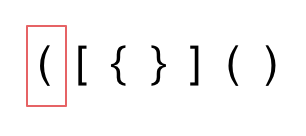
2. 括号没有多余，但是括号的类型没有匹配上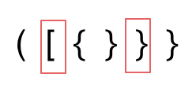
3. 字符串里右方向的括号多余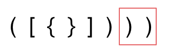

我们的代码只要覆盖了这三种不匹配的情况，就不会出问题

动画如下：

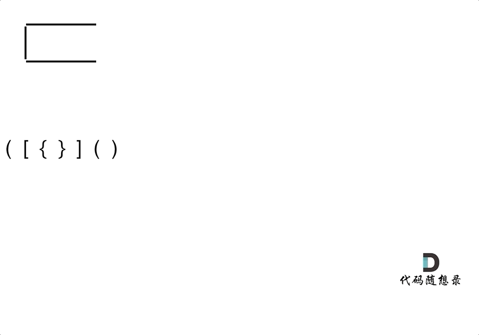

* 第一种情况：已经遍历完了字符串，但是栈不为空，说明有相应的左括号没有右括号来匹配，return false

* 第二种情况：遍历字符串匹配的过程中，发现栈里没有要匹配的字符，return false

* 第三种情况：遍历字符串匹配的过程中，栈已经为空了，没有匹配的字符了，说明右括号没有找到对应的左括号，return false

那么什么时候说明左括号和右括号全都匹配了呢，就是字符串遍历完之后，栈是空的，就说明全都匹配了

**技巧：**在遍历左括号的时候，将其对应的右括号入栈，在遍历到右括号时，就只需要比较当前元素和栈顶相不相等就可以了

```java
class Solution {
    public boolean isValid(String s) {
        Stack<Character> stack = new Stack<>();
        char ch;
        for(int i=0;i<s.length();i++){
            ch = s.charAt(i);
            // 碰到左括号，就把相应的右括号入栈
            if(ch == '(') stack.push(')');
            else if(ch == '{') stack.push('}');
            else if(ch == '[') stack.push(']');
            // 第三种情况或第二种情况
            else if(stack.isEmpty() || ch!=stack.peek()) return false;
            // 只剩是右括号并且和栈顶元素匹配的可能
            else stack.pop();
        }
        // 遍历结束，如果栈为空，则括号全部匹配；如果不为空，第一种情况
        return stack.isEmpty();
    }
}
```

#### [1047删除字符串中的所有相邻重复项](https://leetcode.cn/problems/remove-all-adjacent-duplicates-in-string/)

> 给出由小写字母组成的字符串 `s`，**重复项删除操作**会选择两个相邻且相同的字母，并删除它们。
>
> 在 `s` 上反复执行重复项删除操作，直到无法继续删除。
>
> 在完成所有重复项删除操作后返回最终的字符串。答案保证唯一。

本题和20有效的括号一样也是**匹配问题**，20是匹配左右括号，本题是匹配相邻元素，最后都是做消除的操作

栈为什么适合做这种类似于爱消除的操作？因为栈帮助我们记录了遍历数组当前元素时候，前一个元素是什么

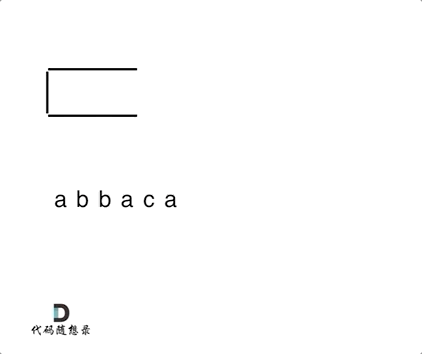

从栈中弹出剩余元素，此时是字符串ac，因为从栈里弹出的元素是倒序的，所以再对字符串进行反转一下，就得到了最终的结果

```java
class Solution {
    public String removeDuplicates(String S) {
        Deque<Character> deque = new ArrayDeque<>();
        char ch;
        for (int i = 0; i < S.length(); i++) {
            ch = S.charAt(i);
            if (deque.isEmpty() || deque.peek() != ch) {
                deque.push(ch);
            } else {
                deque.pop();
            }
        }
        String str = "";
        //剩余的元素即为不重复的元素
        while (!deque.isEmpty()) {
            str = deque.pop() + str;
        }
        return str;
    }
}
```

### 单调队列

#### 【🔥难】[239滑动窗口最大值](https://leetcode.cn/problems/sliding-window-maximum/description/)

> 给你一个整数数组 `nums`，有一个大小为 `k` 的滑动窗口从数组的最左侧移动到数组的最右侧。你只可以看到在滑动窗口内的 `k` 个数字。滑动窗口每次只向右移动一位。
>
> 返回 *滑动窗口中的最大值* 。

暴力方法，遍历一遍的过程中每次从窗口中再找到最大的数值，这样很明显是O(n × k)的算法

更好的方式是使用一个队列，放入窗口内的元素，然后随着窗口的移动，队列也一进一出，调用 `deque.pop(滑动窗口中移除元素的数值)` `deque.push(滑动窗口添加元素的数值)`，每次移动之后，`deque.front()` 返回我们要的最大值

为了得到最大值，这里的队列一定是**有序的**，而且最大值要放在出队口

但如果把窗口里的元素都放进队列里，窗口移动的时候，队列需要弹出元素，那么已经排序之后的队列怎么能把窗口要移除的元素（这个元素可不一定是最大值）弹出呢？

**其实队列没有必要维护窗口里的所有元素，只需要维护有可能成为窗口里最大值的元素就可以了，同时保证队列里的元素数值是由大到小的**

来看一下单调队列如何维护队列里的元素，动画如下：

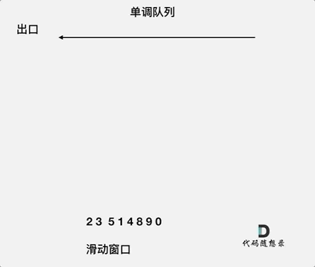

对于窗口里的元素{2, 3, 5, 1 ,4}，单调队列里只维护{5, 4} 就够了，保持单调队列里单调递减，此时队列出口元素就是窗口里最大元素。

此时大家应该怀疑单调队列里维护着{5, 4} 怎么配合窗口进行滑动呢？

单调队列的pop和push操作要按照如下规则：

1. pop(value)：如果窗口移除的元素value等于单调队列的出口元素，那么队列弹出元素；否则不用任何操作
2. push(value)：如果push的元素value大于入口元素的数值，那么就将队列入口的元素弹出，直到push元素的数值小于等于队列入口元素的数值或者队列为空为止，再把push元素数值放入队列

保持如上规则，每次窗口移动的时候，只要用deque.peek()就可以返回当前窗口的最大值

滑动时的动画如下：

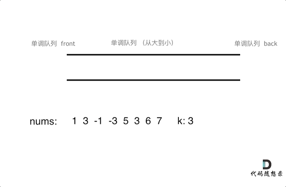

```java
import java.util.ArrayDeque;
import java.util.Deque;

class Solution {
    public int[] maxSlidingWindow(int[] nums, int k) {
        // 使用双端队列直接存储元素值，保持单调递减
        Deque<Integer> deque = new ArrayDeque<>();
        int n = nums.length;
        int[] res = new int[n - k + 1];
        int idx = 0; // 控制结果数组res写入位置的索引指针

        for (int i = 0; i < n; i++) {
            // 1. 处理窗口滑动导致的元素移除 (pop 操作)
            // 当 i >= k 时，窗口开始滑动，需要移除 nums[i-k] 这个元素
            // 如果该元素等于队列头部元素（即当前最大值），则将其弹出
            if (!deque.isEmpty() && i >= k && nums[i - k] == deque.peekFirst()) {
                deque.pollFirst();
            }

            // 2. 维护单调递减性 (push 操作)
            // 如果当前元素大于队尾元素，说明队尾元素不可能是后续窗口的最大值，弹出
            while (!deque.isEmpty() && deque.peekLast() < nums[i]) {
                deque.pollLast();
            }      
            // 将当前元素加入队尾
            deque.offerLast(nums[i]);

            // 3. 记录结果
            // 当形成第一个完整窗口时 (i >= k - 1)，队头即为当前窗口最大值
            if (i >= k - 1) {
                res[idx++] = deque.peekFirst();
            }
        }
        return res;
    }
}
```

### 优先级队列/堆

**大顶堆 (Max Heap)**和**小顶堆 (Min Heap)**是两种特殊的**完全二叉树**结构

- 大顶堆任意节点的值都**大于或等于**其左右孩子节点的值，**堆顶（根节点）最大**
- 小顶堆任意节点的值都**小于或等于**其左右孩子节点的值，**堆顶（根节点）最小**

***注意**：堆只保证父节点和子节点的大小关系，**不保证**左右子节点之间的大小关系，也不保证整棵树是有序数组*

#### 常用操作

**时间复杂度：**

- 插入元素 (`offer`/`add`)：$O(\log N)$
- 删除堆顶元素 (`poll`/`remove`)：$O(\log N)$
- 获取堆顶元素 (`peek`/`element`)：$O(1)$

**不能存入 `null` 元素**：否则会抛出 `NullPointerException`

优先级队列其实**就是一个披着队列外衣的堆**，Java 中对应的核心类是 **`java.util.PriorityQueue`**，默认实现的是**小顶堆**

| 堆类型            | Java 实现方式                                                | 代码示例                                                     |
| ----------------- | ------------------------------------------------------------ | ------------------------------------------------------------ |
| **小顶堆** (默认) | 直接使用 `new PriorityQueue<>()`                             | `PriorityQueue<Integer> minHeap = new PriorityQueue<>();`    |
| **大顶堆**        | 传入自定义比较器 `Collections.reverseOrder()` 或 `(a, b) -> b - a` | `PriorityQueue<Integer> maxHeap = new PriorityQueue<>(Collections.reverseOrder());` |

```java
import java.util.Collections;
import java.util.PriorityQueue;

public class HeapExample {
    public static void main(String[] args) {
        /* 初始化堆 */
        // 初始化小顶堆
        Queue<Integer> minHeap = new PriorityQueue<>();
        // 初始化大顶堆（使用 lambda 表达式修改 Comparator 即可）
        // 方法一：使用 Collections.reverseOrder()
        PriorityQueue<Integer> maxHeap = new PriorityQueue<>(Collections.reverseOrder());
        // 方法二：使用 Lambda 表达式 (a, b) -> b - a
        // PriorityQueue<Integer> maxHeap = new PriorityQueue<>((a, b) -> b - a);

        /* 元素入堆 */
        maxHeap.offer(1);
        maxHeap.offer(3);
        maxHeap.offer(2);

        /* 获取堆顶元素 */
        int peek = maxHeap.peek(); // 3

        /* 堆顶元素出堆 */
        // 出堆元素会形成一个从大到小的序列
        peek = maxHeap.poll(); // 3
        peek = maxHeap.poll(); // 2
        peek = maxHeap.poll(); // 1

        /* 获取堆大小 */
        int size = maxHeap.size();

        /* 判断堆是否为空 */
        boolean isEmpty = maxHeap.isEmpty();

        /* 输入列表并建堆 */
        minHeap = new PriorityQueue<>(Arrays.asList(1, 3, 2, 5, 4));
```

#### 堆的实现

**1、底层结构**

“二叉树”章节讲过，完全二叉树非常适合用数组来表示。由于堆正是一种完全二叉树，**因此采用（动态）数组来存储堆**，它**并不是单调有序的**，而是**仅符合堆的有序条件**

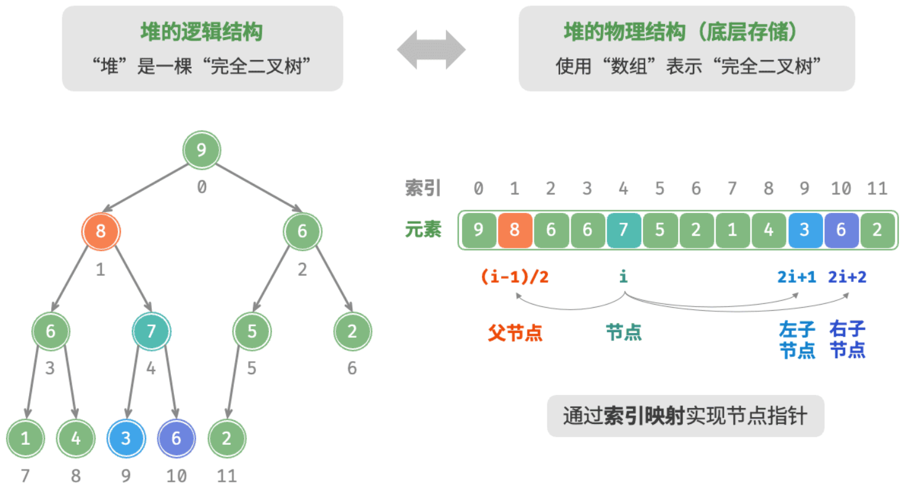

```java
/* 获取左子节点的索引 */
int left(int i) {
    return 2 * i + 1;
}

/* 获取右子节点的索引 */
int right(int i) {
    return 2 * i + 2;
}

/* 获取父节点的索引 */
int parent(int i) {
    return (i - 1) / 2; // 向下整除
}
```

**2、访问堆顶元素**

堆顶元素即为二叉树的根节点，也就是列表的首个元素：

```java
/* 访问堆顶元素 */
int peek() {
    return maxHeap.get(0);
}
```

**3、元素入堆**

优先级队列调用 `add(E e)` 或 `offer(E e)` 方法时的具体插入步骤：

1. **添加到末尾**：对应完全二叉树的最后一个叶子节点位置
2. **执行上浮（Sift Up）**：为了恢复“堆序性”，需要将新元素与其**父节点**进行比较
   - **计算父节点索引**：假设当前节点索引为 `i`，则父节点索引为 `(i - 1) / 2`
   - **比较与交换**：
     - 如果新元素 **大于** 父节点，违反大顶堆规则（小于，违反小顶堆规则），则**交换**这两个元素
     - 将当前索引更新为父节点索引，继续向上比较
   - **终止条件**：
     - 新元素 **小于或等于**（大于或等于） 父节点（满足堆序性）
     - 或者新元素已经到达了根节点（索引为 0）
3. **扩容检查**：如果在添加前数组容量不足，会在添加前触发动态数组的扩容机制

```java
/* 元素入堆 */
void push(int val) {
    maxHeap.add(val); // 添加节点
    siftUp(size() - 1); // 从底至顶堆化
}

/* 从节点 i 开始，从底至顶堆化 */
void siftUp(int i) {
    while (true) {
        int p = parent(i); // 获取节点 i 的父节点
        if (p < 0 || maxHeap.get(i) <= maxHeap.get(p)) break; // 当“越过根节点”或“节点无须修复”时，结束堆化
        swap(i, p); // 交换两节点
        i = p; // 循环向上堆化
    }
}
```

**4、堆顶元素出堆**

堆顶元素是二叉树的根节点，即列表首元素。如果我们直接从列表中删除首元素，那么二叉树中所有节点的索引都会发生变化，这将使得后续使用堆化进行修复变得困难。为了尽量减少元素索引的变动，采用以下操作步骤：

1. 交换堆顶元素与堆底元素（交换根节点与最右叶节点）
2. 交换完成后，将堆底从列表中删除（注意，由于已经交换，因此实际上删除的是原来的堆顶元素）
3. 从根节点开始，**从顶至底执行堆化**

**“从顶至底堆化”的操作方向与“从底至顶堆化”相反**，我们将根节点的值与其两个子节点的值进行比较，将最大（小）的子节点与根节点交换。然后循环执行此操作，直到越过叶节点或遇到无须交换的节点时结束

> 注意：**`siftdown(i)` 只有在 i 节点的左右子树都为堆时才能使以 i 为根节点的树重新满足堆条件**，这也是为什么出堆操作只要进行一次 siftdown，因为其左右子树仍为堆，而建堆操作要循环多次，则是因为原始数组是打乱的

```java
/* 元素出堆 */
int pop() {
    if (isEmpty()) throw new IndexOutOfBoundsException(); // 判空处理
    swap(0, size() - 1); // 交换根节点与最右叶节点（交换首元素与尾元素）
    int val = maxHeap.remove(size() - 1); // 删除节点
    siftDown(0); // 从顶至底堆化
    return val; // 返回堆顶元素
}

/* 从节点 i 开始，从顶至底堆化 */
void siftDown(int i) {
    while (true) {
        // 判断节点 i, l, r 中值最大的节点，记为 ma
        int l = left(i), r = right(i), ma = i;
        if (l < size() && maxHeap.get(l) > maxHeap.get(ma)) ma = l;
        if (r < size() && maxHeap.get(r) > maxHeap.get(ma)) ma = r;
        if (ma == i) break; // 若节点 i 最大或索引 l, r 越界，则无须继续堆化，跳出
        swap(i, ma); // 交换两节点
        i = ma; // 循环向下堆化
    }
}
```

#### 建堆操作*

在某些情况下，我们希望使用一个列表的所有元素来构建一个堆，这个过程被称为“建堆操作”。

**1、借助入堆操作实现**

节点是从顶到底依次被添加进二叉树的，因此堆是“自上而下”构建的，设元素数量为 n，每个元素的入堆操作使用 O(logn) 时间，因此该建堆方法的时间复杂度为 O(nlogn)

**2、通过遍历堆化实现**

1. 将列表所有元素原封不动地添加到堆中，此时堆的性质尚未得到满足
2. 倒序遍历堆（层序遍历的倒序），依次对每个非叶节点执行“从顶至底堆化”

**每当堆化一个节点后，以该节点为根节点的子树就形成一个合法的子堆**。而由于是倒序遍历，因此堆是“自下而上”构建的

之所以选择倒序遍历，是因为这样能够保证当前节点之下的子树已经是合法的子堆，这样堆化当前节点才是有效的

```java
/* 构造方法，根据输入列表建堆 */
MaxHeap(List<Integer> nums) {
    // 将列表元素原封不动添加进堆
    maxHeap = new ArrayList<>(nums);
    // 堆化除叶节点以外的其他所有节点
  	for (int i = nums.length / 2 - 1; i >= 0; i--) siftDown(i);
}
```

**输入列表并建堆的时间复杂度为 O(n)，非常高效**

#### Top K问题

##### 【🔥中】[347前 K 个高频元素](https://leetcode.cn/problems/top-k-frequent-elements/description/)（HashMap+小顶堆）

> 给你一个整数数组 `nums` 和一个整数 `k` ，请你返回其中出现频率前 `k` 高的元素。你可以按 **任意顺序** 返回答案。

可以思考得到有如下三个步骤：

1. 要统计元素出现频率，这一类的问题可以使用map来进行统计
2. 对频率排序，可以使用**优先级队列**
3. 找出前K个高频元素

此时要思考一下，使用小顶堆，还是大顶堆？

| 题目要求                           | 目标     | 应该使用的堆类型  | 堆的大小 | 堆顶的含义                   | 操作逻辑                                            |
| ---------------------------------- | -------- | ----------------- | -------- | ---------------------------- | --------------------------------------------------- |
| 前 K 个最大 (如：高频词、最高分)   | 留大去小 | 小顶堆 (Min Heap) | 固定为 K | 当前 K 个里的最小值 (及格线) | 新元素 > 堆顶？ 是 $ \to $ 换掉堆顶 否 $ \to $ 忽略 |
| 前 K 个最小 (如：最低价、最短时间) | 留小去大 | 大顶堆 (Max Heap) | 固定为 K | 当前 K 个里的最大值 (淘汰线) | 新元素 < 堆顶？ 是 $ \to $ 换掉堆顶 否 $ \to $ 忽略 |

（1）使用大顶堆（将所有元素入堆）

1. **统计频率**：遍历数组，用哈希表统计频率。耗时 O(N)
2. **建堆**：将所有 N 个不同元素放入大顶堆
   - 建堆的时间复杂度是 O(N)
3. **弹出**：执行 K 次 `poll` 操作，取出最大的 K 个
   - 每次弹出调整堆需要 O(log⁡N)
   - K次总共耗时 O(Klog⁡N)
4. **总时间复杂度**： O(N+Klog⁡N)
5. **空间复杂度**： O(N)，因为堆里存了所有元素

```java
/*Comparator接口说明:
 * 返回负数，形参中第一个参数排在前面；返回正数，形参中第二个参数排在前面
 * 队头就是堆顶
 * - 从队头到队尾按从小到大排就是最小堆（小顶堆）
 * - 从队头到队尾按从大到小排就是最大堆（大顶堆）
 * */
class Solution {
    //基于大顶堆实现
    public int[] topKFrequent(int[] nums, int k) {
        Map<Integer, Integer> map = new HashMap<>(); //key为数组元素值,val为对应出现次数
        for (int num : nums) {
            map.put(num, map.getOrDefault(num, 0) + 1);
        }
        //在优先队列中存储二元组(num, cnt),cnt表示元素值num在数组中的出现次数
        //出现次数按从队头到队尾的顺序是从大到小排,出现次数最多的在队头(相当于大顶堆)
        PriorityQueue<int[]> pq = new PriorityQueue<>((pair1, pair2) -> pair2[1] - pair1[1]);
        for (Map.Entry<Integer, Integer> entry : map.entrySet()) {//大顶堆需要对所有元素进行排序
            pq.add(new int[] { entry.getKey(), entry.getValue() });
        }
        int[] res = new int[k];
        for (int i = 0; i < k; i++) { //依次从队头弹出k个,就是出现频率前k高的元素
            res[i] = pq.poll()[0];
        }
        return res;
    }
}
```

（2）使用小顶堆（只维护 K 个元素）

1. **统计频率**：遍历数组，用哈希表统计频率。耗时 O(N)
2. **维护堆**：遍历哈希表中的 M 个元素（M≤N）：
   - 如果堆的大小小于 K，直接放入
   - 如果堆的大小等于 K，比较当前元素频率与堆顶（最小频率）：
     - 若当前元素 > 堆顶：弹出堆顶，放入当前元素
     - 若当前元素 <= 堆顶：跳过
   - 这一步中，堆的大小始终维持在 K。每次插入或替换的操作复杂度是 O(log⁡K)
   - 遍历完所有 M 个元素，总耗时 O(Mlog⁡K)，即 O(Nlog⁡K)
3. **输出**：堆中剩下的 K 个元素即为结果
4. **总时间复杂度**： O(Nlog⁡K)，当 K≪N 时用小顶堆明显更快
5. **空间复杂度**： O(K)，只需要存 K个元素

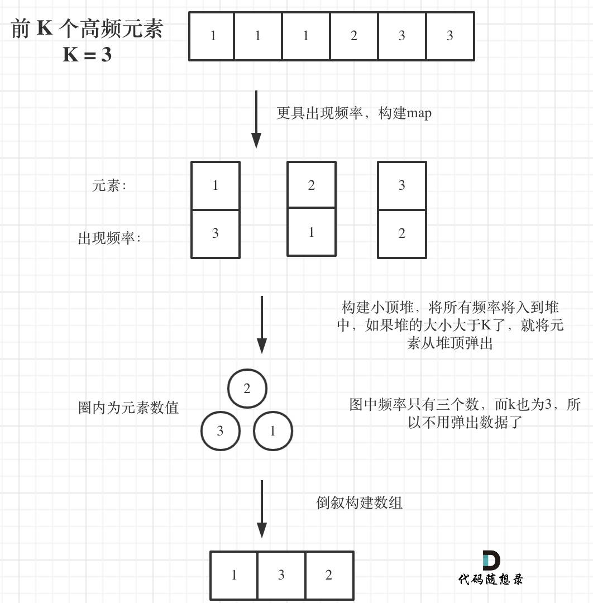

```java
class Solution {
    //基于小顶堆实现
    public int[] topKFrequent(int[] nums, int k) {
        Map<Integer,Integer> map = new HashMap<>(); //key为数组元素值,val为对应出现次数
        for (int num : nums) {
            map.put(num, map.getOrDefault(num, 0) + 1);
        }
        //在优先队列中存储二元组(num, cnt),cnt表示元素值num在数组中的出现次数
        //出现次数按从队头到队尾的顺序是从小到大排,出现次数最低的在队头(相当于小顶堆)
        PriorityQueue<int[]> pq = new PriorityQueue<>((pair1, pair2) -> pair1[1] - pair2[1]);
        for (Map.Entry<Integer, Integer> entry : map.entrySet()) { //小顶堆只需要维持k个元素有序
            if (pq.size() < k) { //小顶堆元素个数小于k个时直接加
                pq.offer(new int[]{entry.getKey(), entry.getValue()});
            } else {
                if (entry.getValue() > pq.peek()[1]) { //当前元素出现次数大于小顶堆的根结点(这k个元素中出现次数最少的那个)
                    pq.poll(); //弹出队头(小顶堆的根结点),即把堆里出现次数最少的那个删除,留下的就是出现次数多的了
                    pq.offer(new int[]{entry.getKey(), entry.getValue()});
                }
            }
        }
        int[] res = new int[k];
        for (int i = k - 1; i >= 0; i--) { //依次弹出小顶堆,先弹出的是堆的根,出现次数少,后面弹出的出现次数多
            res[i] = pq.poll()[0];
        }
        return res;
    }
}
```

注意点：

1. 这里虽然是小顶堆，也要传入自定义的comparator，因为是根据元素数组的第二个值进行逻辑排序
2. `new int[]{...}` 是 Java 创建并初始化一个**匿名整型数组**的语法，可以直接作为参数传入方法

##### 【🔥中】[215数组中的第K个最大元素](https://leetcode.cn/problems/kth-largest-element-in-an-array/description/)（计数数组/大顶堆/小顶堆）

> 给定整数数组 `nums` 和整数 `k`，请返回数组中第 `k` 个最大的元素。
>
> 请注意，你需要找的是数组排序后的第 `k` 个最大的元素，而不是第 `k` 个不同的元素。
>
> 你必须设计并实现时间复杂度为 `O(n)` 的算法解决此问题。

**解法一、计数数组实现哈希表**

```java
class Solution {
    public int findKthLargest(int[] nums, int k) {
        // 偏移量：将负数转为非负索引（原范围[-10000, 10000] → 索引[0, 20000]）
        final int OFFSET = 10000;
        // 计数数组：统计每个元素的出现次数，大小为20001（覆盖所有可能索引）
        int[] num_cnt = new int[20001];
        // 统计每个元素的出现次数
        for (int x : nums) {
            num_cnt[x + OFFSET]++;
        }

        // 从最大值对应的索引开始倒序遍历，寻找第k大元素
        for (int i = 20000; i >= 0; i--) {
            // 跳过未出现的元素
            if (num_cnt[i] == 0)
                continue;
            // k 减去 当前位置元素的出现次数
            k -= num_cnt[i];
            // 当k <= 0时，当前元素即为第k大元素
            // 索引 - 偏移量 → 还原为原元素值
            if (k <= 0)
                return i - OFFSET;
        }
        return 0;
    }
}
```

时间复杂度 O(n + m)，n 为数组长度，m 为数值的取值范围即计数数组的长度

**解法二、调用库的排序函数**

时间复杂度 O(NlogN)

```java
class Solution {
    public int findKthLargest(int[] nums, int k) {
        Arrays.sort(nums);
        return nums[nums.length - k];
    }
}
```

**解法三、调用库的堆容器**，多种写法

写法一，大顶堆，维护所有元素：

- 建立一个大顶堆，维护所有元素（初始化时 n 个元素全部入堆），然后做 k−1 次出堆操作后，堆顶元素（剩余元素的最大值）就是目标

- 时间复杂度 O((n + k) * logn)

写法二，小顶堆，维护所有元素：

- 建立一个小顶堆，维护所有元素（初始化时 n 个元素全部入堆），然后做 n−k 次出堆操作后，堆顶元素（剩余元素的最小值）就是目标

- 时间复杂度 O((2n−k) * logn)

写法三，Top-K 问题，小顶堆，维护 k 个元素：

- 小顶堆，维护 k 个元素（初始化时前 k 个元素入堆），然后遍历剩余所有元素（n-k 个），每次入堆操作后，弹出堆顶元素（先入堆后弹出，执行了 n-k 次）。遍历完成后，堆中元素数量为 k，堆顶是这 k 个元素中的最小值（原数组的第 k 大元素）

- 时间复杂度 O((2n - k) * logk)

```java
// 写法一，大顶堆，维护所有元素
class Solution {
    public int findKthLargest(int[] nums, int k) {
        // Java的PriorityQueue默认是小顶堆，通过Comparator.reverseOrder()实现大顶堆
        PriorityQueue<Integer> maxHeap = new PriorityQueue<>(java.util.Comparator.reverseOrder());
        for (int x : nums) {
            maxHeap.add(x);
        }
        
        for (int i = 0; i < k - 1; i++) {
            maxHeap.poll();
        }
        return maxHeap.peek();
    }
}

// 写法二，小顶堆，维护所有元素
class Solution {
    public int findKthLargest(int[] nums, int k) {
        PriorityQueue<Integer> minHeap = new PriorityQueue<>();
        for (int x : nums) {
            minHeap.add(x);
        }

        for (int i = 0; i < nums.length - k; i++) {
            minHeap.poll();
        }
        return minHeap.peek();
    }
}

// 写法三，Top-K 问题，小顶堆，维护 k 个元素
class Solution {
    public int findKthLargest(int[] nums, int k) {
        PriorityQueue<Integer> minHeap = new PriorityQueue<>();
        for (int x : nums) {
            minHeap.add(x);
            if (minHeap.size() > k) {
                minHeap.poll();
            }
        }
        return minHeap.peek();
    }
}
```

##### 【🔥难】[23合并K个升序链表](https://leetcode.cn/problems/merge-k-sorted-lists/description/)（虚拟头节点+最小堆）

> 给你一个链表数组，每个链表都已经按升序排列。
>
> 请你将所有链表合并到一个升序链表中，返回合并后的链表。

合并后的第一个节点 first，一定是某个链表的头节点（因为链表已按升序排列）

合并后的第二个节点，可能是某个链表的头节点，也可能是 first 的下一个节点

按照这个过程继续思考，每当我们找到一个节点值最小的节点 x，就把节点 x.next 加入「可能是最小节点」的集合中

因此，我们需要一个最小堆，它支持：

* 从数据结构中找到并移除最小节点
* 插入节点

初始把所有链表的头节点入堆，然后不断弹出堆中最小节点 x，如果 x.next 不为空就加入堆中。循环直到堆为空。把弹出的节点按顺序拼接起来，就得到了答案

实现时，可以用**虚拟头节点**简化代码

```java
/**
 * Definition for singly-linked list.
 * public class ListNode {
 *     int val;
 *     ListNode next;
 *     ListNode() {}
 *     ListNode(int val) { this.val = val; }
 *     ListNode(int val, ListNode next) { this.val = val; this.next = next; }
 * }
 */
class Solution {
    public ListNode mergeKLists(ListNode[] lists) {
        PriorityQueue<ListNode> pq = new PriorityQueue<>((a, b) -> a.val - b.val);
        for (ListNode head : lists) {
            if (head != null) {
                pq.offer(head); // 把所有非空链表的头节点入堆
            }
        }

        ListNode dummy = new ListNode(); // 哨兵节点，作为合并后链表头节点的前一个节点
        ListNode cur = dummy;
        while (!pq.isEmpty()) { // 循环直到堆为空
            ListNode node = pq.poll(); // 剩余节点中的最小节点
            if (node.next != null) { // 下一个节点不为空
                pq.offer(node.next); // 下一个节点有可能是最小节点，入堆
            }
            cur.next = node; // 把 node 添加到新链表的末尾
            cur = cur.next; // 准备合并下一个节点
        }
        return dummy.next; // 哨兵节点的下一个节点就是新链表的头节点
    }
}
```

- 时间复杂度：O(Llogm)，其中 m 为 lists 的长度，L 为所有链表的长度之和
- 空间复杂度：O(m)。堆中至多有 m 个元素

##### 【🔥难】[295数据流的中位数](https://leetcode.cn/problems/find-median-from-data-stream/)

> **中位数**是有序整数列表中的中间值。如果列表的大小是偶数，则没有中间值，中位数是两个中间值的平均值。
>
> - 例如 `arr = [2,3,4]` 的中位数是 `3` 。
> - 例如 `arr = [2,3]` 的中位数是 `(2 + 3) / 2 = 2.5` 。
>
> 实现 MedianFinder 类:
>
> - `MedianFinder()` 初始化 `MedianFinder` 对象。
> - `void addNum(int num)` 将数据流中的整数 `num` 添加到数据结构中。
> - `double findMedian()` 返回到目前为止所有元素的中位数。与实际答案相差 `10-5` 以内的答案将被接受。

中位数问题是Top K问题的变形，k=n/2

