[【跳转到上一篇：算法 3（二叉树、图论、回溯算法）】](/blogs/算法笔记/算法-3二叉树图论回溯算法/)

[【跳转到下一篇：算法 5（贪心算法、十大排序、技巧）】](/blogs/算法笔记/算法-5贪心算法十大排序技巧/)

## 九、动态规划

### 初探动态规划—重叠子问题【🔥简】[70爬楼梯](https://leetcode.cn/problems/climbing-stairs/)

动态规划 (dynamic programming) 是一个重要的算法范式，它将一个问题分解为一系列更小的子问题，并**通过存储子问题的解来避免重复计算**，从而大幅提升时间效率

先从一个斐波那契额经典例题入手，给出它的暴力回溯解法，观察其中包含的重叠子问题，再逐步导出更高效的动态规划解法

> 给定一个共有 n 阶的楼梯，你每步可以上 1 阶或者 2 阶，请问有多少种方案可以爬到楼顶？
>
> 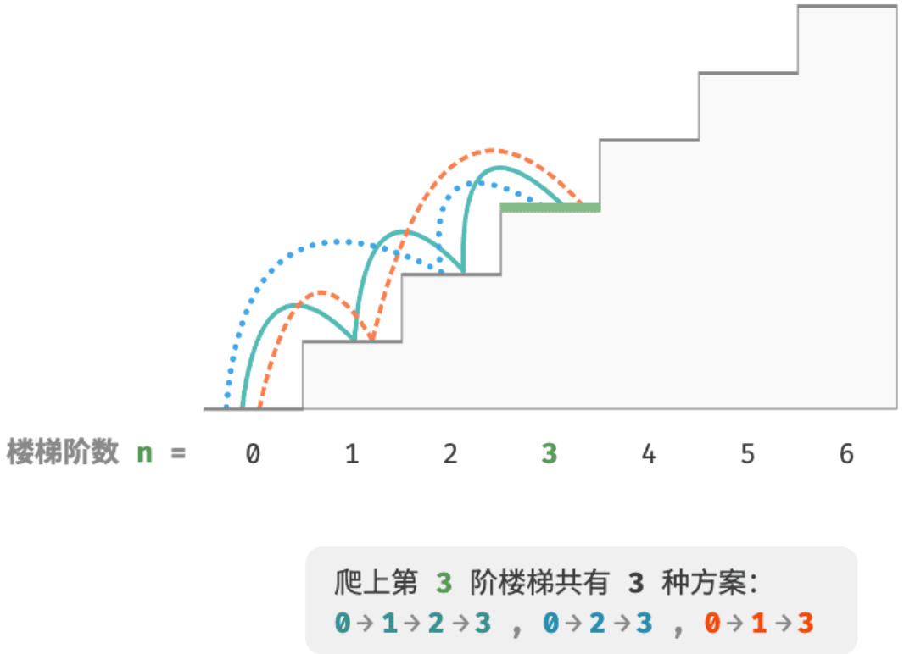

本题的目标是求解方案数量，**可以考虑通过回溯来穷举所有可能性**。具体来说，将爬楼梯想象为一个多轮选择的过程：从地面出发，每轮选择上 1 阶或 2 阶，每当到达楼梯顶部时就将方案数量加 ，当越过楼梯顶部时就将其剪枝

```java
/* 回溯 */
void backtrack(List<Integer> choices, int state, int n, List<Integer> res) {
    // 当爬到第 n 阶时，方案数量加 1
    if (state == n)
        res.set(0, res.get(0) + 1);
    // 遍历所有选择
    for (Integer choice : choices) {
        // 剪枝：不允许越过第 n 阶
        if (state + choice > n)
            continue;
        // 尝试：做出选择，更新状态
        backtrack(choices, state + choice, n, res);
        // 回退
    }
}

/* 爬楼梯：回溯 */
int climbingStairsBacktrack(int n) {
    List<Integer> choices = Arrays.asList(1, 2); // 可选择向上爬 1 阶或 2 阶
    int state = 0; // 从第 0 阶开始爬
    List<Integer> res = new ArrayList<>();
    res.add(0); // 使用 res[0] 记录方案数量
    backtrack(choices, state, n, res);
    return res.get(0);
}
```

法一、**暴力搜索**

回溯算法通常并不显式地对问题进行拆解，而是**将求解问题看作一系列决策步骤，通过试探和剪枝，搜索所有可能的解**

可以尝试从问题分解的角度分析这道题。设爬到第 i 阶共有 dp[i] 种方案，那么 dp[i] 就是原问题，其子问题包括：

​			dp[i-1], dp[i-1], ... , dp[2], dp[1]

由于每轮只能上 1 阶或 2 阶，因此我们**只能从第 n-1 阶或第 n-2 阶迈向第 n 阶**

由此便可得出一个重要推论：**爬到第 n-1 阶的方案数加上爬到第 n-2 阶的方案数就等于爬到第 n 阶的方案数**

​				**dp[i] = dp[i-1] + dp[i-2]**

这意味着在爬楼梯问题中，各个子问题之间存在递推关系，**原问题的解可以由子问题的解构建得来**

可以根据递推公式得到暴力搜索解法。以 dp[n] 为起始点，**递归地将一个较大问题拆解为两个较小问题的和**，直至到达最小子问题 dp[1] 和 dp[2] 时返回。其中，最小子问题的解是已知的，即 dp[1] = 1、dp[2] = 2

它和标准回溯代码都属于深度优先搜索，但更加简洁：

```java
/* 搜索 */
int dfs(int i) {
    // 已知 dp[1] 和 dp[2] ，返回之
    if (i == 1 || i == 2)
        return i;
    // dp[i] = dp[i-1] + dp[i-2]
    int count = dfs(i - 1) + dfs(i - 2);
    return count;
}

/* 爬楼梯：搜索 */
int climbStairsDFS(int n) {
    return dfs(n);
}
```

下图展示了暴力搜索形成的递归树

> 递归算法的时间复杂度怎么计算？——⼦问题个数乘解决⼀个⼦问题需要的时间
>
> * ⼦问题个数：即递归树中节点的总数。显然⼆叉树节点总数为指数级别 O(2^n^)
>
> * 解决⼀个⼦问题的时间：在本算法中，没有循环，只有f(n - 1) + f(n - 2) ⼀个加法操作，时间为 O(1)
>
> 所以该算法时间复杂度为⼆者相乘，即 **O(2^n^) 指数阶**

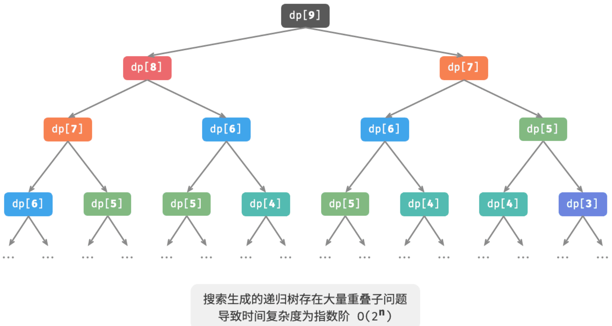

**指数阶的时间复杂度是“重叠子问题”导致的计算资源浪费引起的**。例如 dp[9] 被分解为 dp[8] 和 dp[7]， 被分解为 dp[7] 和 dp[6]，两者都包含子问题 dp[7]。以此类推，子问题中包含更小的重叠子问题，子子孙孙无穷尽也

法二、**记忆化搜索**

为了提升算法效率，**我们希望所有的重叠子问题都只被计算一次**。为此声明一个数组 `mem` 来记录每个子问题的解，并在搜索过程中将重叠子问题剪枝

1. 当首次计算 dp[i] 时，将其记录至 `mem[i]` ，以便之后使用
2. 当再次需要计算 dp[i] 时，便可直接从 `mem[i]` 中获取结果，从而避免重复计算该子问题

```java
/* 记忆化搜索 */
int dfs(int i, int[] mem) {
    // 已知 dp[1] 和 dp[2] ，返回之
    if (i == 1 || i == 2) return i;
    // 若存在记录 dp[i] ，则直接返回之
    if (mem[i] != -1) return mem[i];
    // dp[i] = dp[i-1] + dp[i-2]
    int count = dfs(i - 1, mem) + dfs(i - 2, mem);
    // 记录 dp[i]
    mem[i] = count;
    return count;
}

/* 爬楼梯：记忆化搜索 */
int climbStairsDFSMem(int n) {
    // mem[i] 记录爬到第 i 阶的方案总数，-1 代表无记录
    int[] mem = new int[n + 1];
    Arrays.fill(mem, -1);
    return dfs(n, mem);
}
```

如下图，*经过记忆化处理后，所有重叠子问题都只需计算一次，时间复杂度优化至 O(n)*

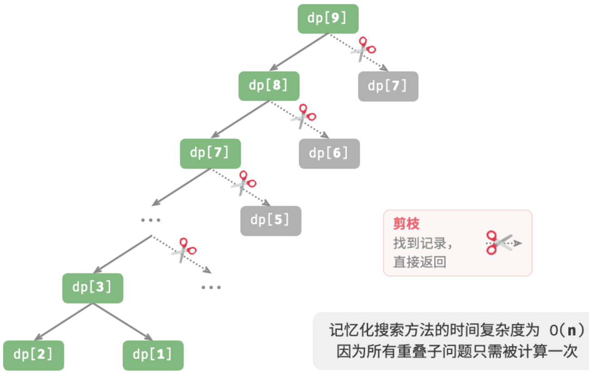

法三、**动态规划**

* **记忆化搜索是一种“从顶至底”的方法**：从原问题（根节点）开始，递归地将较大子问题分解为较小子问题，直至解已知的最小子问题（叶节点）。之后，通过回溯逐层收集子问题的解，构建出原问题的解

* 与之相反，**动态规划是一种“从底至顶”的方法**：从最小子问题的解开始，迭代地构建更大子问题的解，直至得到原问题的解

由于动态规划**不包含回溯过程**，因此**只需使用循环迭代实现，无须使用递归**

```java
/* 爬楼梯：动态规划 */
int climbStairsDP(int n) {
    // 【定义dp表】用于存储子问题的解（这里用 n+2 是为了避免 n=1 时数组 dp 不存在dp[2]报错）
    int[] dp = new int[n + 2];
    // 【边界条件】预设最小子问题的解
    dp[1] = 1;
    dp[2] = 2;
    // 【遍历顺序】从较小子问题逐步求解较大子问题
    for (int i = 3; i <= n; i++) {
        dp[i] = dp[i - 1] + dp[i - 2];
    }
    return dp[n];
}
```

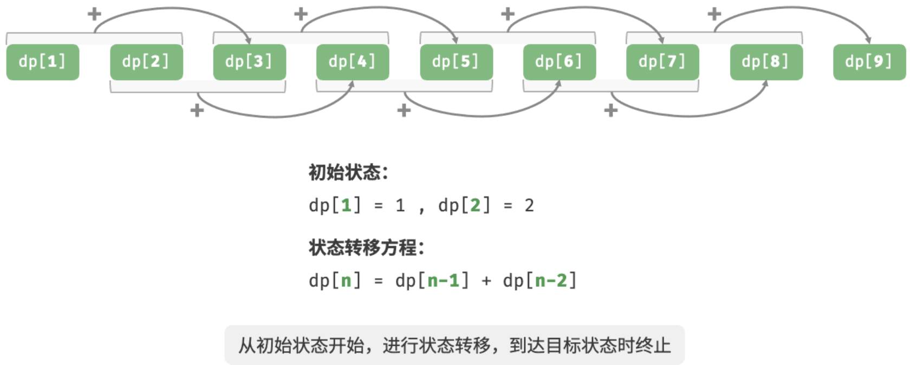

与回溯算法一样，动态规划也使用“状态”概念来表示问题求解的特定阶段，**每个状态都对应一个子问题以及相应的局部最优解**。例如，爬楼梯问题的状态定义为当前所在楼梯阶数 i

根据以上内容，可以总结出动态规划的常用术语：

- 将数组 `dp` 称为 **dp 表**，dp[i] 表示**状态 i 对应子问题的解**
- 将最小子问题对应的状态（第 1 阶和第 2 阶楼梯）称为**初始状态**
- 将递推公式 **dp[i] = dp[i-1] + dp[i-2]** 称为**状态转移方程**

四、**空间优化**：**由于 dp[i] 只与 dp[i-1] 和 dp[i-2] 有关，因此无须使用一个数组 `dp` 来存储所有子问题的解**，而只需两个变量滚动前进即可

```java
/* 爬楼梯：空间优化后的动态规划 */
int climbStairsDPComp(int n) {
    if (n == 1 || n == 2) return n;
    int a = 1, b = 2;
    for (int i = 3; i <= n; i++) {
        int tmp = b;
        b = a + b;
        a = tmp;
    }
    return b;
}
```

*以上代码，由于省去了数组 `dp` 占用的空间，因此空间复杂度从 O(n) 降至 O(1)*

在动态规划问题中，当前状态往往仅与前面有限个状态有关，这时我们可以只保留必要的状态，通过“降维”来节省内存空间。**这种空间优化技巧被称为“滚动变量”或“滚动数组”**

### 动态规划问题特性

实际上，**子问题分解**是一种通用的算法思路，在分治、动态规划、回溯中的侧重点不同

- 分治算法递归地将原问题划分为多个相互独立的子问题，直至最小子问题，并在回溯中合并子问题的解，最终得到原问题的解
- 动态规划也对问题进行递归分解，但与分治算法的主要区别是，动态规划中的子问题是相互依赖的，在分解过程中会出现许多重叠子问题
- 回溯算法在尝试和回退中穷举所有可能的解，并通过剪枝避免不必要的搜索分支。原问题的解由一系列决策步骤构成，我们可以将每个决策步骤之前的子序列看作一个子问题

实际上，动态规划常用来**求解最优化问题**，它们不仅包含**重叠子问题**，还具有另外两大特性：

#### 最优子结构—[简 746使用最小花费爬楼梯](https://leetcode.cn/problems/min-cost-climbing-stairs/description/)

对爬楼梯问题稍作改动，使之更加适合展示最优子结构概念：

> 给你一个整数数组 `cost` ，其中 `cost[i]` 是从楼梯第 `i`个台阶向上爬需要支付的费用。一旦你支付此费用，即可选择向上爬一个或者两个台阶。
>
> 你可以选择从下标为 `0` 或下标为 `1` 的台阶开始爬楼梯。
>
> 请你计算并返回达到楼梯顶部的最低花费。

假设数组 cost 的长度为 n，则 n 个阶梯分别对应下标 0 到 n−1，楼层顶部对应下标 n

创建长度为 n+1 的数组 dp，其中 dp[i] 表示达到下标 i 的最小花费

由于可以选择下标 0 或 1 作为初始阶梯，因此有 dp[0]=dp[1]=0

当 2≤i≤n 时，可以从下标 i−1 使用 cost[i−1] 的花费达到下标 i，或者从下标 i−2 使用 cost[i−2] 的花费达到下标 i。为了使总花费最小，dp[i] 应取上述两项的最小值，因此状态转移方程如下：

**dp[i] = min (dp[i-1] + cost[i-1], dp[i-2] + cost[i-2])**

这便可以引出**最优子结构**的含义：**原问题的最优解是从若干个（每个问题不一样）子问题的最优解构建得来的**

那么，上一节的爬楼梯题目有没有最优子结构呢？它的目标是求解方案数量，看似是一个计数问题，但如果换一种问法：“求解最大方案数量”。可以发现，**虽然题目修改前后是等价的，但最优子结构浮现出来了**：第 n 阶最大方案数量等于第 n-1 阶和第 n-2 阶最大方案数量之和。所以最优子结构的解释方式比较灵活，在不同问题中会有不同的含义

遍历顺序：**新状态来自左侧状态，只需要一层循环**

```java
/* 爬楼梯最小代价：动态规划 */
int minCostClimbingStairs(int[] cost) {
    int n = cost.length;
    // 【初始化 dp 表】用于存储子问题的解
    int[] dp = new int[n + 1];
    // 【边界条件】预设最小子问题的解
    dp[0] = dp[1] = 0;
    // 【状态转移】从较小子问题逐步求解较大子问题
    for (int i = 2; i <= n; i++) {
        dp[i] = Math.min(dp[i - 1] + cost[i-1], dp[i - 2] + cost[i-2]);
    }
    return dp[n];
}
```

#### 无后效性

无后效性是动态规划能够有效解决问题的重要特性之一，其定义为：**给定一个确定的状态，它的未来发展只与当前状态有关，而与过去经历的所有状态无关**

以爬楼梯问题为例，给定状态 i，它会发展出状态 i+1 和状态 i+2，分别对应跳 1 步和跳 2 步。在做出这两种选择时，无须考虑状态 i 之前的状态，它们对状态 i 的未来没有影响

然而，如果给爬楼梯问题添加一个约束，情况就不一样了：

> **带约束爬楼梯**
>
> 给定一个共有 n 阶的楼梯，你每步可以上 1 阶或者 2 阶，**但不能连续两轮跳 1 阶**，请问有多少种方案可以爬到楼顶？

如下图所示，爬上第 3 阶仅剩 2 种可行方案，其中连续三次跳 1 阶的方案不满足约束条件，因此被舍弃

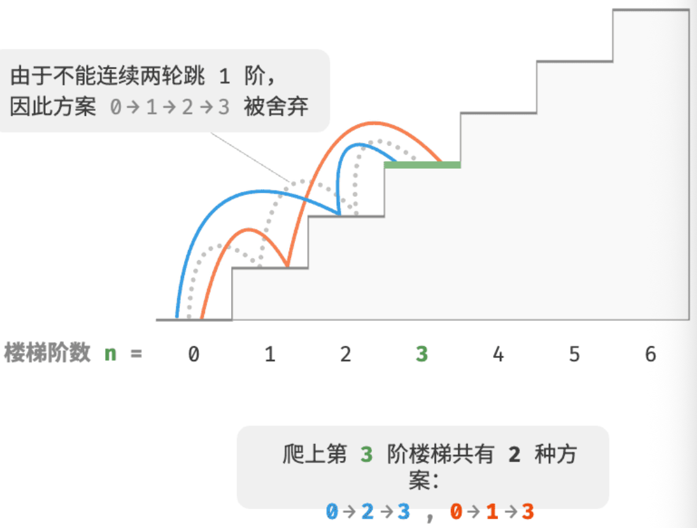

在该问题中，如果上一轮是跳 1 阶上来的，那么下一轮就必须跳 2 阶。这意味着，**下一步选择不能由当前状态（当前所在楼梯阶数）独立决定，还和前一个状态（上一轮所在楼梯阶数）有关**

不难发现，此问题已不满足无后效性，状态转移方程也失效了，因为 dp[i-1] 代表本轮跳 1 阶，但其中包含了许多“上一轮是跳 1 阶上来的”方案，而为了满足约束，我们就不能将 dp[i-1] 直接计入 dp[i] 中

为此，需要扩展状态定义：**状态 [i,j] 表示处在第 i 阶并且上一轮跳了 j 阶**，其中 j∈{1,2} 。此状态定义有效地区分了上一轮跳了 1 阶还是 2 阶，我们可以据此判断当前状态是从何而来的

- 当上一轮跳了 1 阶时，上上一轮只能选择跳 2 阶，即 dp[i,1] 只能从 dp[i-1,2] 转移过来
- 当上一轮跳了 2 阶时，上上一轮可选择跳 1 阶或跳 2 阶，即 dp[i,2] 可以从 dp[i-1,1] 或 dp[i-1,2] 转移过来

如下图所示，在该定义下，dp[i,j] 表示状态 [i,j] 对应的方案数。此时状态转移方程为：

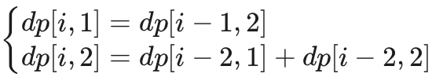

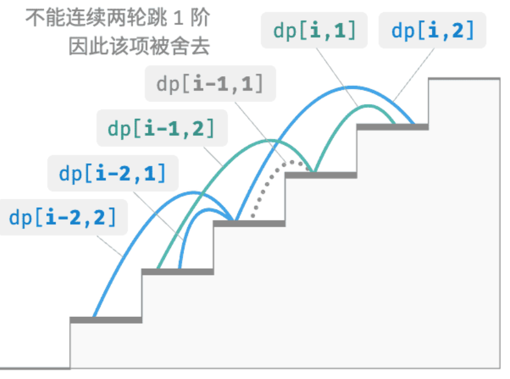

最终，返回 dp[n,1]+dp[n,2] 即可，两者之和代表爬到第 n 阶的方案总数

```java
/* 带约束爬楼梯：动态规划 */
int climbingStairsConstraintDP(int n) {
    if (n == 1 || n == 2) {
        return 1;
    }
    // 【初始化 dp 表】
    int[][] dp = new int[n + 1][3];
    // 【初始状态】预设最小子问题的解
    dp[1][1] = 1;
    dp[1][2] = 0;
    dp[2][1] = 0;
    dp[2][2] = 1;
    // 【状态转移】从较小子问题逐步求解较大子问题
    for (int i = 3; i <= n; i++) {
        dp[i][1] = dp[i - 1][2];
        dp[i][2] = dp[i - 2][1] + dp[i - 2][2];
    }
    return dp[n][1] + dp[n][2];
}
```

在上面的案例中，由于仅需多考虑前面一个状态，因此仍然可以通过扩展状态定义，使得问题重新满足无后效性。然而，某些问题具有非常严重的“有后效性”

> 爬楼梯与障碍生成
>
> 给定一个共有 n 阶的楼梯，你每步可以上 1 阶或者 2 阶。**规定当爬到第 i 阶时，系统自动会在第 2i 阶上放上障碍物，之后所有轮都不允许跳到第 2i 阶上**。例如，前两轮分别跳到了第 2、3 阶上，则之后就不能跳到第 4、6 阶上。请问有多少种方案可以爬到楼顶？

在这个问题中，下次跳跃依赖过去所有的状态，因为每一次跳跃都会在更高的阶梯上设置障碍，并影响未来的跳跃。对于这类问题，动态规划往往难以解决

实际上，许多复杂的组合优化问题（例如旅行商问题）不满足无后效性。对于这类问题，我们通常会选择使用其他方法，例如启发式搜索、遗传算法、强化学习等，从而在有限时间内得到可用的局部最优解

### 动态规划解题思路

上两节介绍了动态规划问题的主要特征

#### 动态规划问题判断

总的来说，如果一个问题包含重叠子问题、最优子结构，并满足无后效性，那么它通常适合用动态规划求解。然而，我们很难从问题描述中直接提取出这些特性。因此通常会放宽条件，**先观察问题是否适合使用回溯（穷举）解决**

**适合用回溯解决的问题通常满足“决策树模型”**，问题中包含明确的决策概念，并且解是通过一系列决策产生的

在此基础上，动态规划问题还有一些判断的“加分项”：

- 问题包含最大（小）或最多（少）等最优化描述
- 问题的状态能够使用一个列表、多维矩阵或树来表示，并且一个状态与其周围的状态存在递推关系

相应地，也存在一些“减分项”：

- 问题的目标是找出所有可能的解决方案，而不是找出最优解
- 问题描述中有明显的排列组合的特征，需要返回具体的多个方案

#### 动态规划求解步骤—【🔥中】[64最小路径和](https://leetcode.cn/problems/minimum-path-sum/)

这里使用经典问题“最小路径和”来举例

> 给定一个 n * m的二维网格 `grid` ，网格中的每个单元格包含一个非负整数，表示该单元格的代价。机器人以左上角单元格为起始点，每次只能向下或者向右移动一步，直至到达右下角单元格。请返回从左上角到右下角的最小路径和。
>
> 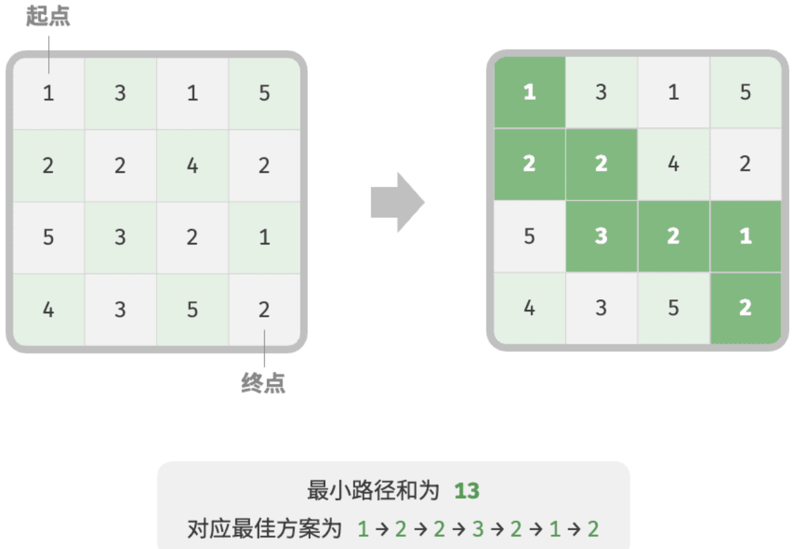

**第一步：思考每轮的决策，找到状态和对应的子问题，从而得到 dp 表**

> 动态规划和回溯过程可以描述为一个决策序列，而状态应当包含描述解题进度的所有变量，其包含了足够的信息，能够用来推导出下一个状态
>
> 每个状态都对应一个子问题，定义一个 dp 表来存储所有子问题的解，状态的每个独立变量都是 dp 表的一个维度。从本质上看，dp 表是状态和子问题的解之间的映射

* 本题的每一轮的决策就是从当前格子向下或向右走一步。设当前格子的行列索引为 [i,j]，则向下或向右走一步后，索引变为 [i+1,j] 或 [i,j+1]
* 因此，状态应包含行索引和列索引两个变量，记为 [i,j]

* 状态 [i,j] 对应的子问题为：从起始点 [0,0] 走到 [i,j] 的最小路径和
* 记为 dp[i,j]，于是可以得到下图所示的二维 dp 矩阵，其尺寸与输入网格 grid 相同

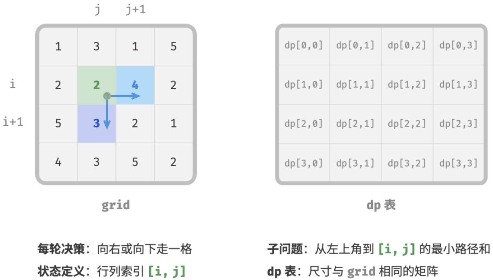

**第二步：找出最优子结构，进而推导出状态转移方程**

> 根据定义好的 dp 表，思考原问题和子问题的关系，找出通过子问题的最优解来构造原问题的最优解的方法，即最优子结构
>
> 一旦我们找到了最优子结构，就可以使用它来构建出状态转移方程

* 对于状态 [i,j]，它只能从上边格子 [i-1,j] 和左边格子 [i,j-1] 转移而来。因此最优子结构为：到达 [i,j] 的最小路径和由 [i,j-1] 的最小路径和与 [i-1,j] 的最小路径和中较小的那一个决定

* 根据以上分析，可推出下图所示的状态转移方程：

  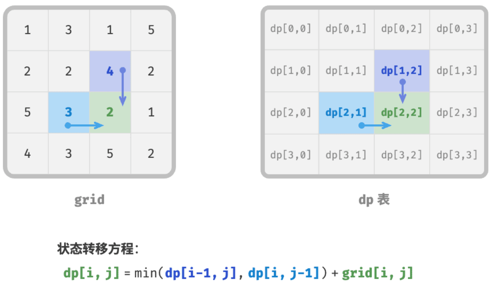

**第三步：确定边界条件（初始化dp表）和状态转移顺序（遍历顺序）**

> 边界条件在动态规划中用于初始化 dp 表，在搜索中用于剪枝
>
> 状态转移顺序的核心是要保证在计算当前问题的解时，所有它依赖的更小子问题的解都已经被正确地计算出来

* 边界条件：本题处在首行的状态只能从其左边的状态得来，处在首列的状态只能从其上边的状态得来，因此首行 i=0 和首列 j=0 是边界条件

* 遍历顺序：如下图所示，由于每个格子是由其左方格子和上方格子转移而来，因此我们使用内外双层循环来遍历矩阵，外循环遍历各行，内循环遍历各列

  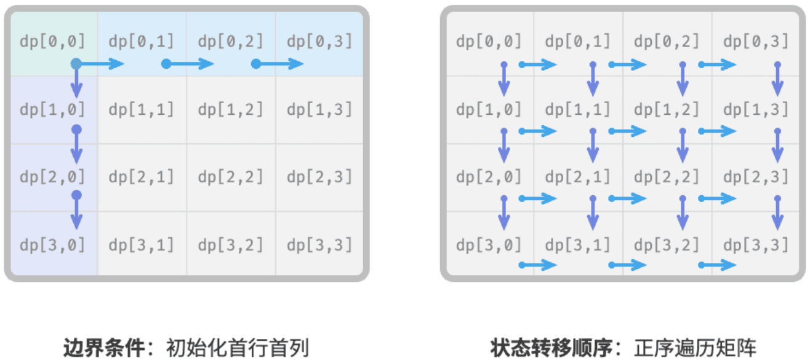

根据以上分析，已经可以直接写出动态规划代码。然而子问题分解是一种从顶至底的思想，因此按照“暴力搜索 - 记忆化搜索 - 动态规划”的顺序实现更加符合思维习惯

法一、**暴力搜索**

从状态 [i,j] 开始搜索，不断分解为更小的状态 [i-1,j] 和 [i,j-1]，递归函数包括以下要素：

- **递归参数**：状态 [i,j]
- **返回值**：从 [0,0] 到 [i,j] 的最小路径和 dp[i,j]
- **终止条件**：当 i=0 且 j=0 时，返回代价 grid[0,0]
- **剪枝**：当 i<0 时或 j<0 时索引越界，此时返回代价 +∞，代表不可行

```java
/* 最小路径和：暴力搜索 */
int minPathSumDFS(int[][] grid, int i, int j) {
    // 【Base Case】若为左上角单元格，则终止搜索
    if (i == 0 && j == 0) {
        return grid[0][0];
    }
    // 【剪枝】若行列索引越界，则返回 +∞ 代价
    if (i < 0 || j < 0) {
        return Integer.MAX_VALUE;
    }
    // 【递归】计算从左上角到 (i-1, j) 和 (i, j-1) 的最小路径代价
    int up = minPathSumDFS(grid, i - 1, j);
    int left = minPathSumDFS(grid, i, j - 1);
    // 【状态转移方程】返回从左上角到 (i, j) 的最小路径代价
    return Math.min(left, up) + grid[i][j];
}
```

下图给出了以 dp[2,1] 为根节点的递归树，其中包含一些重叠子问题，其数量会随着网格 `grid` 的尺寸变大而急剧增多

从本质上看，造成重叠子问题的原因为：**存在多条路径可以从左上角到达某一单元格**

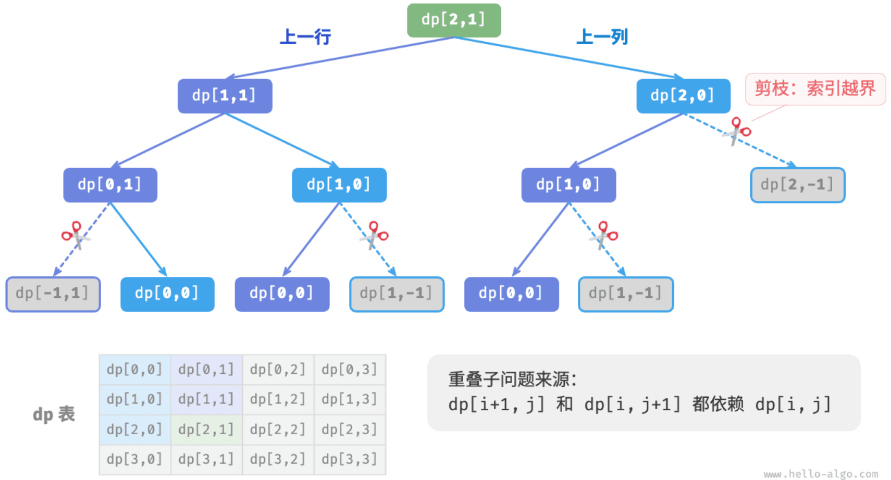

*每个状态都有向下和向右两种选择，从左上角走到右下角总共需要 m+n-2 步，所以最差时间复杂度为 O(2^m+n^)，其中 n 和 m 分别为网格的行数和列数。注意，这种计算方式未考虑临近网格边界的情况，当到达网格边界时只剩下一种选择，因此实际的路径数量会少一些*

法二、**记忆化搜索**

引入一个和网格 `grid` 相同尺寸的记忆列表 `mem` ，用于记录各个子问题的解，并将重叠子问题进行剪枝：

```java
/* 最小路径和：记忆化搜索 */
int minPathSumDFSMem(int[][] grid, int[][] mem, int i, int j) {
    // 【Base Case】若为左上角单元格，则终止搜索
    if (i == 0 && j == 0) {
        return grid[0][0];
    }
    // 【剪枝】若行列索引越界，则返回 +∞ 代价
    if (i < 0 || j < 0) {
        return Integer.MAX_VALUE;
    }
    // 【记忆化搜索】若已有记录，则直接返回
    if (mem[i][j] != -1) {
        return mem[i][j];
    }
    // 【递归】左边和上边单元格的最小路径代价
    int up = minPathSumDFSMem(grid, mem, i - 1, j);
    int left = minPathSumDFSMem(grid, mem, i, j - 1);
    // 【状态转移方程】记录并返回左上角到 (i, j) 的最小路径代价
    mem[i][j] = Math.min(left, up) + grid[i][j];
    return mem[i][j];
}
```

如下图所示，在引入记忆化后，所有子问题的解只需计算一次，因此时间复杂度取决于状态总数，即网格尺寸 O(nm)

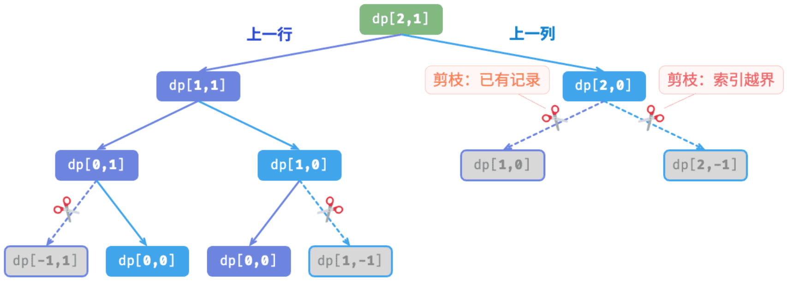

法三、**动态规划**

```java
/* 最小路径和：动态规划 */
int minPathSumDP(int[][] grid) {
    int n = grid.length, m = grid[0].length;
    // 【定义dp表】
    int[][] dp = new int[n][m];
    dp[0][0] = grid[0][0];
    // 【边界条件】首行
    for (int j = 1; j < m; j++) dp[0][j] = dp[0][j - 1] + grid[0][j];
    // 【边界条件】首列
    for (int i = 1; i < n; i++) dp[i][0] = dp[i - 1][0] + grid[i][0];
    // 【遍历顺序】其余行和列
    for (int i = 1; i < n; i++) {
        for (int j = 1; j < m; j++) {
            dp[i][j] = Math.min(dp[i][j - 1], dp[i - 1][j]) + grid[i][j];
        }
    }
    return dp[n - 1][m - 1];
}
```

* 下图展示了最小路径和的状态转移过程，其遍历了整个网格，**因此时间复杂度为 O(nm)** 

* 数组 `dp` 大小为 n*m，**因此空间复杂度为 O(nm)**

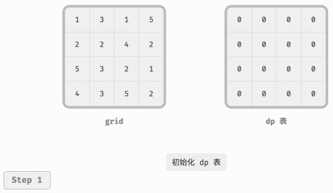

四、**空间优化**

遍历顺序：**由于新状态来自左侧和上方状态，因此从 j=1 到 j=m-1 为正序**

由于每个格子只与其左边和上边的格子有关，因此我们可以只用一个单行数组来实现 dp 表

请注意，因为数组 `dp` 只能表示一行的状态，所以我们无法提前初始化首列状态，而是在遍历每行时更新它：

```java
/* 最小路径和：空间优化后的动态规划 */
int minPathSumDPComp(int[][] grid) {
    int n = grid.length, m = grid[0].length;
    // 【定义dp表】
    int[] dp = new int[m];
    // 【边界条件】首行
    dp[0] = grid[0][0];
    for (int j = 1; j < m; j++) {
        dp[j] = dp[j - 1] + grid[0][j];
    }
    // 【遍历顺序】其余行
    for (int i = 1; i < n; i++) {
        // 【边界条件】首列
        dp[0] = dp[0] + grid[i][0];
        // 其余列
        for (int j = 1; j < m; j++) {
            // 【状态转移方程】
            dp[j] = Math.min(dp[j - 1], dp[j]) + grid[i][j];
        }
    }
    return dp[m - 1];
}
```

##### 【🔥中】[62不同路径](https://leetcode.cn/problems/unique-paths/)

> 一个机器人位于一个 `m x n` 网格的左上角 （起始点在下图中标记为 “Start” ）。
>
> 机器人每次只能向下或者向右移动一步。机器人试图达到网格的右下角（在下图中标记为 “Finish” ）。
>
> 问总共有多少条不同的路径？

```java
public int uniquePaths(int m, int n) {
    int[][] f = new int[m][n];
    for (int i = 0; i < m; ++i) f[i][0] = 1;
    for (int j = 0; j < n; ++j) f[0][j] = 1;
    for (int i = 1; i < m; ++i) {
        for (int j = 1; j < n; ++j) {
            f[i][j] = f[i - 1][j] + f[i][j - 1];
        }
    }
    return f[m - 1][n - 1];
}
```

```java
public int uniquePaths(int m, int n) {
    int[] f = new int[n];
    for (int i = 0; i < n; ++i) f[i] = 1;
    for (int i = 1; i < m; ++i) {
        for (int j = 1; j < n; ++j) {
            f[j] += f[j - 1];
        }
    }
    return f[n - 1];
}
```

#### 【🔥简】[118杨辉三角](https://leetcode.cn/problems/pascals-triangle/description/)

> 给定一个非负整数 *`numRows`，*生成「杨辉三角」的前 *`numRows`* 行。
>
> 在**「杨辉三角」**中，每个数是它左上方和右上方的数的和。
>
> 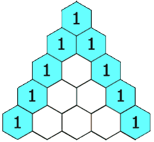

```java
public List<List<Integer>> generate(int numRows) {
    List<List<Integer>> res = new ArrayList<>();
    int[][] matrix = new int[numRows][numRows];
    for (int i = 0; i < numRows; i++) {
        matrix[i][0] = 1;
        matrix[i][i] = 1;
        for (int j = 1; j < i; j++)
            matrix[i][j] = matrix[i - 1][j] + matrix[i - 1][j - 1];
        List<Integer> list = new ArrayList<>();
        for (int j = 0; j <= i; j++)
            list.add(matrix[i][j]);
        res.add(list);
    }
    return res;
}
```

### 背包动态规划

背包问题是动态规划中最常见的问题形式，它处理的是**“在有限资源（容量）约束下，从一组物品中进行选择”**的问题。它的状态通常由“物品的索引”和“剩余容量”两个维度决定（即二维 DP）

具有很多变种，例如 0-1 背包问题、完全背包问题、多重背包问题等

> **背包问题**：
>
> - **求组合数：外层物品、内层容量**。这是标准的“填表”过程，对于每个物品，更新所有容量，如 518 题
>
> - **求排列数：外层容量、内层物品**。这是对于每个容量，尝试放入所有物品，如 377 题
>
> - 这两种方式都能覆盖所有状态，只是物理意义不同
>
>   如果是其他求解目标，则内外循环的对象顺序不影响结果

> **0-1背包 vs 完全背包**：
>
> * **不可复选**：dp 数组为一维时，**指代背包**，对该维度的遍历顺序为**倒序**
>   * 本质上是**新状态来源包括左上方状态**
> * **可以复选**：一维 dp 数组的维度同样**指代背包**，但是对该维度的遍历顺序为**正序**
>   * 本质上是**新状态来自左侧/上方状态**

#### 0-1背包问题（不可复选）

> 给定 n 个物品，第 i 个物品的重量为 wgt[i-1]、价值为 val[i-1]，和一个容量为 cap 的背包。**每个物品只能选择一次**，问在限定背包容量下能放入物品的最大价值。

由于物品编号 i 从 1 开始计数，数组索引从 0 开始计数，因此物品 i 对应重量 wgt[i-1] 和价值 val[i-1]

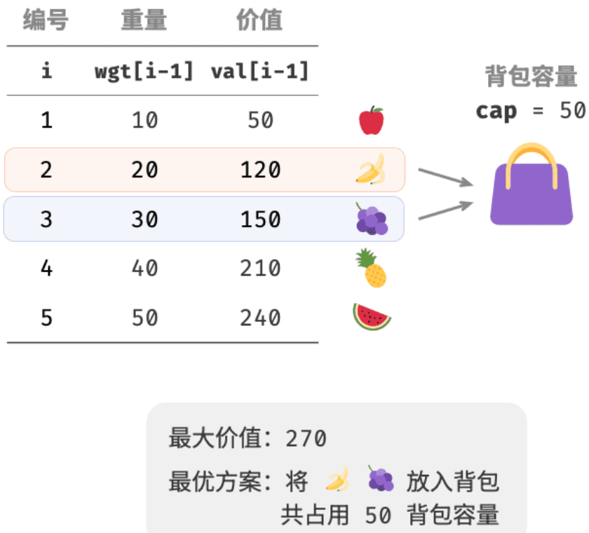

可以将 0-1 背包问题看作一个由 n 轮决策组成的过程，对于每个物体都有不放入和放入两种决策，因此该问题满足决策树模型

该问题的目标是求解“在限定背包容量下能放入物品的最大价值”，因此较大概率是一个动态规划问题

**第一步：思考每轮的决策，找到状态和对应的子问题，从而得到 dp 表**

* 对于每个物品来说，不放入背包，背包容量不变；放入背包，背包容量减小
* 由此可得状态定义：当前物品编号 i 和背包容量 c，记为 [i,c]，状态 [i,c] 对应的子问题为：**前 i 个物品在容量为 c 的背包中的最大价值**，记为 dp[i,c]

* 待求解的是 dp[n,cap]，因此需要一个尺寸为 (n+1)*(cap+1) 的二维 dp 表

**第二步：找出最优子结构，进而推导出状态转移方程**

* 当我们做出物品 i 的决策后，最大价值 dp[i,c] 取决于前 i-1 个物品决策的子问题，物品 i 的决策可分为以下两种情况：

  * **不放入物品 i** ：背包容量、价值都不变，最大价值 dp[i,c] 等于 dp[i-1,c]

  * **放入物品 i** ：背包容量减少 wgt[i-1]，价值增加 val[i-1]，最大价值 dp[i,c] 等于 dp[i-1,c-wgt[i-1]] + val[i-1]

  最优子结构：**最大价值 dp[i,c] 等于不放入物品 i 和放入物品 i 两种方案中价值更大的那一个**

* 状态转移方程：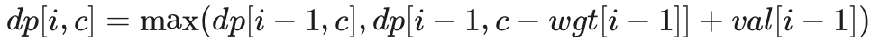

> **注意必须剪枝：`if (wgt[i - 1] > c) dp[i,c] = dp[i-1,c];`**
>
> * **若物品 i 的重量 wgt[i-1] 超出剩余背包容量 c，则只能选择不放入背包**。如果不剪枝，dp 可能出现负索引如 dp[2, -3] 报错

**第三步：确定边界条件（初始化dp表）和状态转移顺序（遍历顺序）**

* 边界条件：当无物品或背包容量为 0 时最大价值为 0，即首列 dp[0,c] 和首行 dp[i,0] 都等于 0

* 遍历顺序：新状态 [i,c] 从上方的状态 [i-1,c] 和左上方的状态 [i-1,c-wgt[i-1]] 转移而来，因此有内外两层循环


法一、**暴力搜索**

搜索代码包含以下要素：

- **递归参数**：状态
- **返回值**：子问题的解
- **终止条件**：当物品编号越界 i=0 或背包剩余容量为 0 时，终止递归并返回价值 0

```java
/* 0-1 背包：暴力搜索 */
int knapsackDFS(int[] wgt, int[] val, int i, int c) {
    // 【Base Case】若已选完所有物品或背包无剩余容量，则返回价值 0
    if (i == 0 || c == 0) return 0;
    // 【剪枝】若超过背包容量，则只能选择不放入背包
    if (wgt[i - 1] > c) return knapsackDFS(wgt, val, i - 1, c);
    // 【递归】计算不放入和放入物品 i 的最大价值
    int no = knapsackDFS(wgt, val, i - 1, c);
    int yes = knapsackDFS(wgt, val, i - 1, c - wgt[i - 1]) + val[i - 1];
    // 【状态转移方程】返回两种方案中价值更大的那一个
    return Math.max(no, yes);
}
```

如下图所示，由于每个物品都会产生不选和选两条搜索分支，因此时间复杂度为 O(2^n^)，存在较多重叠子问题

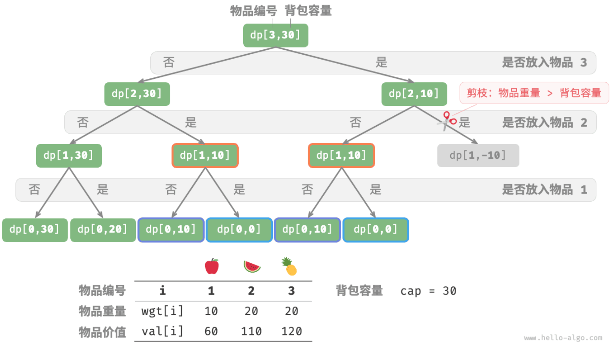

法二、**记忆化搜索**

为了保证重叠子问题只被计算一次，借助记忆列表 `mem` 来记录子问题的解，其中 `mem[i][c]` 对应 `dp[i][c]`

引入记忆化之后，**时间复杂度取决于子问题数量**，也就是 `O(n*cap)`

* **参数 `i` 的范围**：`i` 从 `n` (物品总数) 变化到 `0`，总共有 `n + 1` 种可能的值
* **参数 `c` 的范围**：`c` 从 `cap` (背包总容量) 变化到 `0`，总共有 `cap + 1` 种可能的值

因此，所有**不重复**的子问题总数就是 `(n + 1) * (cap + 1)`

```java
/* 0-1 背包：记忆化搜索 */
int knapsackDFSMem(int[] wgt, int[] val, int[][] mem, int i, int c) {
    // 【Base Case】若已选完所有物品或背包无剩余容量，则返回价值 0
    if (i == 0 || c == 0) return 0;
    // 【记忆化搜索】若已有记录，则直接返回
    if (mem[i][c] != -1) return mem[i][c];
    // 【剪枝】若超过背包容量，则只能选择不放入背包
    if (wgt[i - 1] > c) return knapsackDFSMem(wgt, val, mem, i - 1, c);
    // 【递归】计算不放入和放入物品 i 的最大价值
    int no = knapsackDFSMem(wgt, val, mem, i - 1, c);
    int yes = knapsackDFSMem(wgt, val, mem, i - 1, c - wgt[i - 1]) + val[i - 1];
    // 【状态转移方程】记录并返回两种方案中价值更大的那一个
    mem[i][c] = Math.max(no, yes);
    return mem[i][c];
}
```

下图展示了在记忆化搜索中被剪掉的搜索分支：

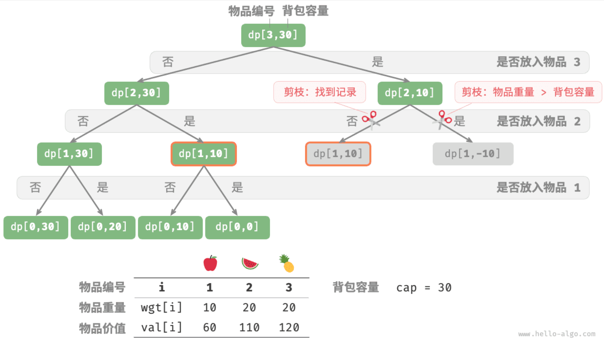

法三、**动态规划**

动态规划实质上就是在状态转移中填充 dp 表的过程，代码如下所示：

```java
/* 0-1 背包：动态规划 */
int knapsackDP(int[] wgt, int[] val, int cap) {
    int n = wgt.length;
    // 【初始化 dp 表】
    int[][] dp = new int[n + 1][cap + 1];
    // 【边界条件】第一行和第一列默认为0
    // 【遍历顺序】
    for (int i = 1; i <= n; i++) {
        for (int c = 1; c <= cap; c++) {
            // 【剪枝】若超过背包容量，则不选物品 i
            if (wgt[i - 1] > c) dp[i][c] = dp[i - 1][c];
            // 【状态转移方程】不选和选物品 i 这两种方案的较大值
            else dp[i][c] = Math.max(dp[i - 1][c], dp[i - 1][c - wgt[i - 1]] + val[i - 1]);
        }
    }
    return dp[n][cap];
}
```

所示，时间复杂度和空间复杂度都由数组 `dp` 大小决定，即 `O(n*cap)`

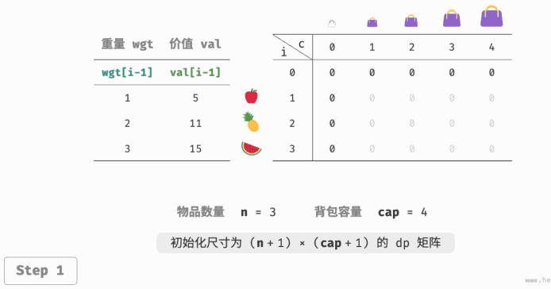

四、**空间优化**

遍历顺序：**由于新状态来自左上方和上方状态，因此从 c=cap 到 c=1 为倒序**

由于每个状态都只与其上一行的状态有关，因此我们可以使用两个数组滚动前进，将空间复杂度从 O(n*cap)  降至 O(cap)

进一步思考，能否仅用一个数组实现空间优化呢？观察可知，每个状态都是由正上方或左上方的格子转移过来的。假设只有一个数组，当开始遍历第 i 行时，该数组存储的仍然是第 i-1 行的状态

- 如果采取正序遍历，那么遍历到 dp[i,j] 时，左上方 dp[i-1, 1] ~ dp[i-1, j-1] 值可能已经被覆盖，此时就无法得到正确的状态转移结果
- 如果采取倒序遍历，则不会发生覆盖问题，状态转移可以正确进行

下图展示了在单个数组下从第 i=1 行转换至第 i=2 行的过程

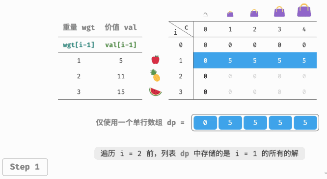

在代码实现中，仅需将数组 `dp` 的第一维 i 直接删除，并且把内循环更改为倒序遍历即可：

```java
/* 0-1 背包：空间优化后的动态规划 */
int knapsackDPComp(int[] wgt, int[] val, int cap) {
    int n = wgt.length;
    // 【定义dp表】
    int[] dp = new int[cap + 1];
    // 【遍历顺序】
    for (int i = 1; i <= n; i++) {
        // 对应背包的一维dp数组倒序遍历
        for (int c = cap; c >= 1; c--) {
            // 【剪枝】若超过背包容量，则保持不变  
            if (wgt[i - 1] > c) continue;
            // 【状态转移方程】
            else dp[c] = Math.max(dp[c], dp[c - wgt[i - 1]] + val[i - 1]);
        }
    }
    return dp[cap];
}
```

##### 【🔥中】[416分割等和子集](https://leetcode.cn/problems/partition-equal-subset-sum/)

> 给你一个 **只包含正整数** 的 **非空** 数组 `nums` 。请你判断是否可以将这个数组分割成两个子集，使得两个子集的元素和相等。

- 背包的体积为 sum / 2
- 背包要放入的商品（集合里的元素）重量为元素的数值，价值也为元素的数值
- 背包正好装满，说明找到了总和为 sum / 2 的子集
- 背包中每一个元素是不可重复放入

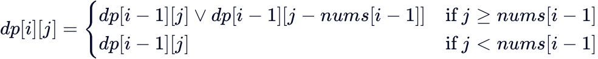

```java
boolean canPartition(int[] nums) {
    // 【定义dp数组】
    // 第一维与物品下标定义一致，从 0 开始到 nums.length-1，下标 0 也对应一个物品；
    // 第二维与背包容量定义一致，从 0 到 sum/2
    int len = nums.length;
    int sum = 0;
    for (int num : nums) sum += num;
    // 特判：如果是奇数，就不符合要求
    if ((sum %2 ) != 0) return false;
    int target = sum / 2; // 目标背包容量
    boolean[][] dp = new boolean[len][target + 1];
    // 【边界条件】第一维数组下标为0，只有一个数，只有当背包容积=该数的值时才能恰好装满，子问题解为 true
    if (nums[0] <= target) dp[0][nums[0]] = true;
    // 这里本身没有意义，是为了确保 i=1 且 j=nums[i] 时，dp[1][nums[i]]=dp[0][0]=true，进而后续 i=2/3/... 且 j=nums[i] 时，dp[i][nums[i]]=dp[i-1][0]
    dp[0][0] = true;
    // 【遍历顺序】再填表格后面几行
    for (int i = 1; i < len; i++) {
        for (int j = 1; j <= target; j++) {
            // 【状态转移方程】
            if(j < nums[i]) dp[i][j] = dp[i-1][j];
            // dp[i - 1][j]表示该物品不放入背包，如果在 [0, i - 1] 这个子区间内已经有一部分元素，使得它们的和为 j ，那么 dp[i][j] = true；
            // dp[i - 1][j - nums[i]]表示该物品放入背包。如果在 [0, i - 1] 这个子区间内就得找到一部分元素，使得它们的和为 j - nums[i]
            else dp[i][j] = dp[i - 1][j] || dp[i - 1][j - nums[i]];
        }
    }
    return dp[len - 1][target];
}
```

遍历顺序：**由于新状态来自左上方和上方状态，因此从 j=target 到 j=1 为倒序**

```java
boolean canPartition(int[] nums) {
    // 【定义dp数组】dp[j] 表示：是否能凑出和为 j
    int sum = 0;
    for (int num : nums) sum += num;
    // 如果是奇数，无法平分
    if ((sum % 2) != 0) return false;
    int target = sum / 2;
    boolean[] dp = new boolean[target + 1];
  	// 【初始化】第一行两个值
    if (nums[0] <= target) dp[nums[0]] = true;
    dp[0] = true;
    // 【遍历顺序】
    // 外层：遍历物品（数组中的每个数字）
    for (int i = 1; i < nums.length; i++) {
        // 内层：倒序遍历背包容量
        for (int j = target; j >= 1; j--) {
            // 【状态转移方程】
            if(j < nums[i]) dp[j] = dp[j];
            else dp[j] = dp[j] || dp[j - nums[i]];
        }
    }
    return dp[target];
}
```

##### 【🔥中】[494目标和问题](https://leetcode.cn/problems/target-sum/)（求组合数）

> 给你一个非负整数数组 `nums` 和一个整数 `target` 。
>
> 向数组中的每个整数前添加 `'+'` 或 `'-'` ，然后串联起所有整数，可以构造一个 **表达式** ：
>
> - 例如，`nums = [2, 1]` ，可以在 `2` 之前添加 `'+'` ，在 `1` 之前添加 `'-'` ，然后串联起来得到表达式 `"+2-1"` 。
>
> 返回可以通过上述方法构造的、运算结果等于 `target` 的不同 **表达式** 的数目。
>
> ```
> 输入：nums = [1,1,1,1,1], target = 3
> 输出：5
> 解释：一共有 5 种方法让最终目标和为 3 。
> -1 + 1 + 1 + 1 + 1 = 3
> +1 - 1 + 1 + 1 + 1 = 3
> +1 + 1 - 1 + 1 + 1 = 3
> +1 + 1 + 1 - 1 + 1 = 3
> +1 + 1 + 1 + 1 - 1 = 3
> ```

虽然题目看起来是在排列符号（`+` 或 `-`），但它实际上在**求组合数**

问题转化与预处理：

* 设正数和为 pos，负数和的绝对值为 neg
  * 则 pos + neg = sum (数组总和)
  * 且 pos - neg = target (目标和)
* 两式相加得：2 * pos = sum + target  =>  pos = (sum + target) / 2
* 因此问题可以转化为：在 nums 中选出若干数，使其和为 pos 的方法数（01背包问题）

```java
int findTargetSumWays(int[] nums, int target) {
    int sum = 0;
    for (int num : nums) sum += num;
    // 特判：如果目标和的绝对值大于总和，无法达成
    if (Math.abs(target) > sum) return 0;
    // 特判：如果 (sum + target) 是奇数，无法算出整数的 pos
    if ((sum + target) % 2 != 0) return 0;
    // 【定义dp数组】
    int pos = (sum + target) / 2; // 目标背包容量
    // 第一维与物品下标定义一致，从 0 到 nums.length-1；
    // 第二维与背包容量定义一致，从 0 到 pos
    int[][] dp = new int[nums.length][pos + 1];
    // 【边界条件：处理第一列 dp[i][0]】前 i+1 个数凑出和为 0 的方法数
    // 只要前面的数字里有 0，那么 0 可以取 +0 或 -0，方案数就会翻倍
    int numZeros = 0;
    for (int i = 0; i < nums.length; i++) {
        if (nums[i] == 0) numZeros++;
        // 2的numZeros次方：每个0都有两种选择（+或-），非0数都不选（只有1种）
        dp[i][0] = (int) Math.pow(2, numZeros);
    }
    // 【边界条件：处理第一行 dp[0][j]】只有一个数 nums[0] 时，只有当背包容量等于该数值时，才有一种方法（选它）
    if (nums[0] != 0 && nums[0] <= pos) dp[0][nums[0]] = 1;
    // 注意：dp[0][0] 已经在上面的第一列循环中被初始化，无需重复赋值
    // 【遍历顺序】
    for (int i = 1; i < nums.length; i++) {
        for (int j = 1; j <= pos; j++) {
            // 【状态转移方程】
            // 当前物品太重，装不下，方法数继承自上一行（不选该物品）
            if (j < nums[i]) dp[i][j] = dp[i - 1][j];
            // 能装下，方法数 = (不选该物品的方法数) + (选该物品的方法数)
            // dp[i-1][j]：不选 nums[i]，看前 i-1 个物品凑成 j 的方法
            // dp[i-1][j-nums[i]]：选 nums[i]，看前 i-1 个物品凑成 j-nums[i] 的方法
            else dp[i][j] = dp[i - 1][j] + dp[i - 1][j - nums[i]];
        }
    }
    return dp[nums.length - 1][pos];
}
```

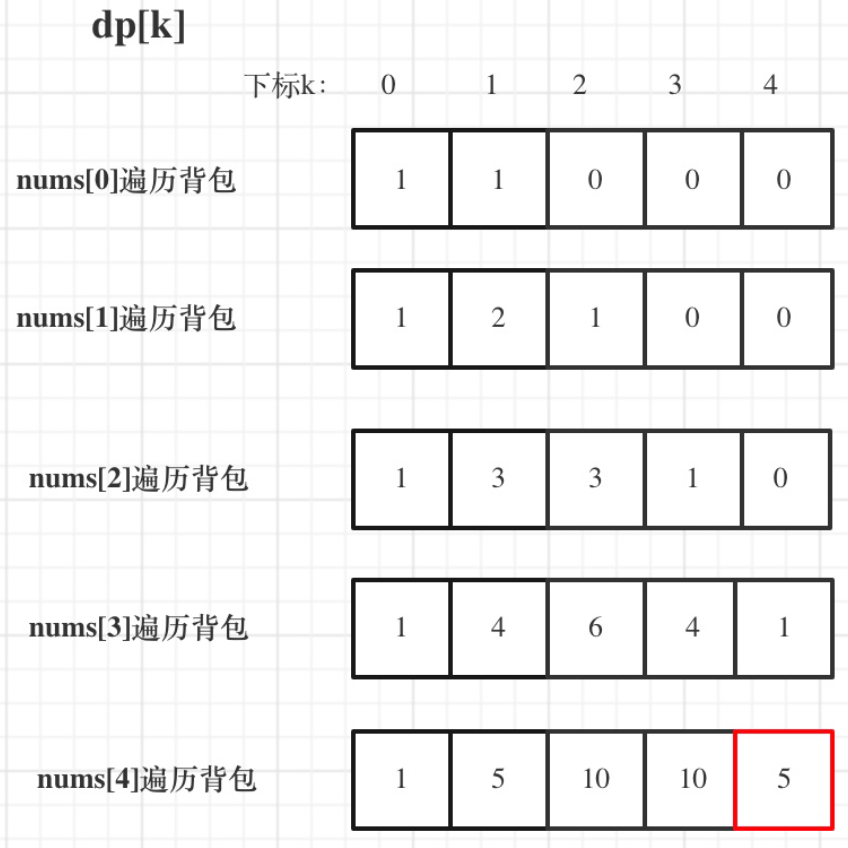

```java
int findTargetSumWays(int[] nums, int target) {
    int sum = 0;
    for (int i = 0; i < nums.length; i++) sum += nums[i];
    // 特判：如果目标和的绝对值大于总和，无法达成
    if (Math.abs(target) > sum) return 0;
    // 特判：如果 (target + sum) 是奇数，无法算出整数的 pos，无解
    if ((target + sum) % 2 == 1) return 0;
    
    int pos = (target + sum) / 2;
    // 【定义dp数组】dp[j] 表示：填满容量为 j 的背包，有 dp[j] 种方法
    int[] dp = new int[pos + 1];
    
    // 【边界条件】dp[0] = 1 表示装满容量为 0 的背包，有 1 种方法（即什么都不选）
    // ⚠️注意：这里不需要像二维数组那样处理 0 的幂次，因为一维递推会自动处理累加
    dp[0] = 1;
    // 【遍历顺序】
    // 外层：遍历物品（数组中的每个数字）
    for (int i = 0; i < nums.length; i++) {
        // 内层：倒序遍历背包容量（01背包）
        // ⚠️注意：这里减到0结束，之前则是从1开始
        for (int j = pos; j >= 0; j--) {
            // 【状态转移方程】
            if(j < nums[i]) continue;
            // dp[j]（等号右边）：不选当前物品 nums[i]，继承之前的方法数
            // dp[j - nums[i]]：选当前物品 nums[i]，加上凑成剩余容量的方法数
            // 两者相加即为当前总方法数
            else dp[j] += dp[j - nums[i]];
        }
    }
    return dp[pos];
}
```

#### 完全背包问题（可以复选）

> 给定 n 个物品，第 i 个物品的重量为 wgt[i-1]、价值为 val[i-1]，和一个容量为 cap 的背包。**每个物品可以重复选取**，问在限定背包容量下能放入物品的最大价值。
>
> 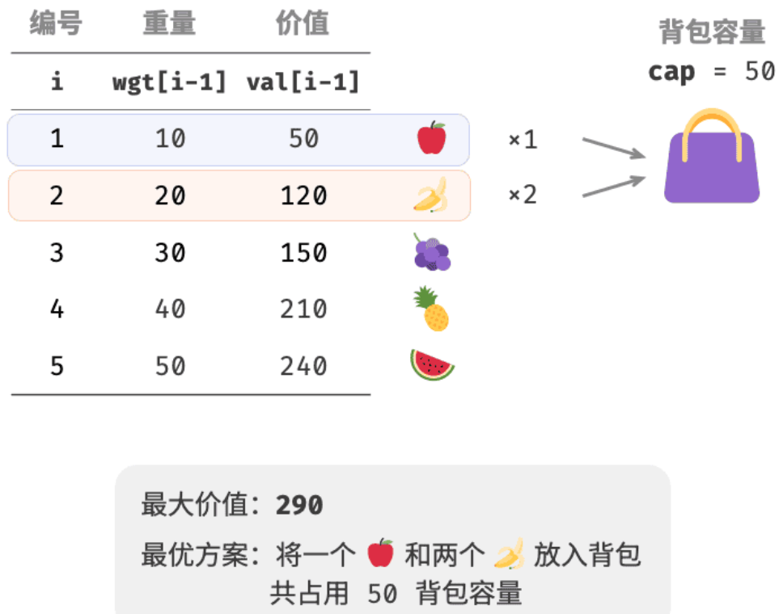

1、**动态规划思路**

- **0-1 背包**：物品只有一个，所以当前状态只能继承自**“上一轮（前 i-1 个物品）”**的剩余容量状态
- **完全背包**：物品无限，所以当前状态既可以继承自**“上一轮”**，也可以继承自**“本轮（当前第 i 个物品）”**已经更新过的状态

在完全背包问题的规定下，状态 [i,c] 的变化分为两种情况：

- **不放入物品** ：与 0-1 背包问题相同，转移至 [i-1,c]
- **放入物品** ：与 0-1 背包问题不同，转移至 [i,c-wgt[i-1]]

从而状态转移方程变为：

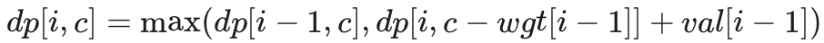

遍历顺序：新状态来自左侧和上方，因此要用内外两层循环

* **状态转移方程是两种子问题最优解最大值不对应循环**

2、**代码实现**：只有一处改动从 i-1 变为 i

```java
/* 完全背包：动态规划 */
int unboundedKnapsackDP(int[] wgt, int[] val, int cap) {
    int n = wgt.length;
    // 【定义dp表】
    int[][] dp = new int[n + 1][cap + 1];
    // 【遍历顺序】
    for (int i = 1; i <= n; i++) {
        for (int c = 1; c <= cap; c++) {
            // 【剪枝】若超过背包容量，则不选物品 i
            if (wgt[i - 1] > c) dp[i][c] = dp[i - 1][c];
            // 【状态转移方程】不选和选物品 i 这两种方案的较大值
            else dp[i][c] = Math.max(dp[i - 1][c], dp[i][c - wgt[i - 1]] + val[i - 1]);
        }
    }
    return dp[n][cap];
}
```

3、**空间优化**

遍历顺序：**由于新状态来自左侧和上方状态，因此从 c=1 到 c=cap 为正序**，与 0-1 背包正好相反

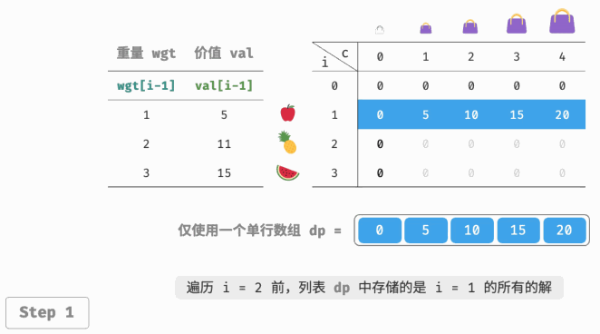

代码实现比较简单，仅需将数组 `dp` 的第一维删除：

```java
/* 完全背包：空间优化后的动态规划 */
int unboundedKnapsackDPComp(int[] wgt, int[] val, int cap) {
    int n = wgt.length;
    // 【定义dp表】
    int[] dp = new int[cap + 1];
    // 【遍历顺序】
    for (int i = 1; i <= n; i++) {
        for (int c = 1; c <= cap; c++) {
            // 【剪枝】
            if (wgt[i - 1] >= c) continue;
            // 【状态转移方程】
            else dp[c] = Math.max(dp[c], dp[c - wgt[i - 1]] + val[i - 1]);
        }
    }
    return dp[cap];
}
```

##### 【🔥中】[322零钱兑换](https://leetcode.cn/problems/coin-change/)

背包问题拥有很多变种，例如**零钱兑换问题**

> 给定 n 种硬币，第 i 种硬币的面值为 coins[i-1]，目标金额为 amt，**每种硬币可以重复选取**，问能够凑出目标金额的最少硬币数量。如果无法凑出目标金额，则返回 -1。
>
> 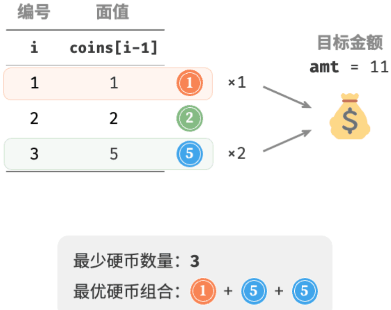

1、**动态规划思路**

**零钱兑换可以看作完全背包问题的一种特殊情况**，两者具有以下联系与不同点：

- 两道题可以相互转换，“物品”对应“硬币”、“物品重量”对应“硬币面值”、“背包容量”对应“目标金额”
- 优化目标相反，完全背包问题是要最大化物品价值，零钱兑换问题是要最小化硬币数量
- 完全背包问题是求“不超过”背包容量下的解，零钱兑换是求“恰好”凑到目标金额的解

**第一步：思考每轮的决策，找到状态和对应的子问题，从而得到 dp 表**

* 状态 [i, a] 对应的子问题为：**前 i 种硬币能够凑出金额 a 的最少硬币数量**，记为 dp[i, a]

* 二维 dp 表的尺寸为 `(n+1) * (amt+1)`

**第二步：找出最优子结构，进而推导出状态转移方程**

本题与完全背包问题的状态转移方程存在以下两点差异：

- 本题要求最小值，因此需将运算符 max() 更改为 min()
- 优化主体是硬币数量而非商品价值，因此在选中硬币时执行 +1 即可

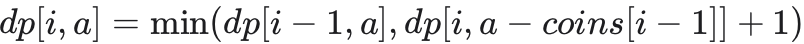

**第三步：确定边界条件（初始化dp表）和状态转移顺序（遍历顺序）**

* 边界条件：
  * 当目标金额为 0 时，凑出它的最少硬币数量为 0，即首列所有 dp[i, 0] 都等于 0
  * 当无硬币时，**无法凑出任意 >0 的目标金额**，即是无效解。为使状态转移方程中的 min() 函数能够识别并过滤无效解，我们考虑使用 +∞ 来表示它们，即令首行所有 dp[0, a] 都等于 +∞

* 遍历顺序：新状态来自左侧和上方，因此要用内外两层循环
  * **状态转移方程是两种子问题的最小值不对应循环**


2、**代码实现**

大多数编程语言并未提供 +∞ 变量，只能使用整型 `int` 的最大值来代替。而这又会导致大数越界：状态转移方程中的 +1 操作可能发生溢出

为此采用数字 amt+1 来表示无效解，因为凑出 amt 的硬币数量最多为 amt。最后返回前，判断 dp[n, amt] 是否等于 amt+1，若是则返回 -1，代表无法凑出目标金额

```java
/* 零钱兑换：动态规划 */
int coinChangeDP(int[] coins, int amt) {
    int n = coins.length;
    int MAX = amt + 1;
    // 【定义dp表】
    int[][] dp = new int[n + 1][amt + 1];
    // 【边界条件】首行首列
    for (int a = 1; a <= amt; a++) {
        dp[0][a] = MAX;
    }
    // 【遍历顺序】其余行和列
    for (int i = 1; i <= n; i++) {
        for (int a = 1; a <= amt; a++) {
            // 【剪枝】若超过目标金额，则不选硬币 i
            if (coins[i - 1] > a) dp[i][a] = dp[i - 1][a];
            // 【状态转移方程】不选和选硬币 i 这两种方案的较小值
            else dp[i][a] = Math.min(dp[i - 1][a], dp[i][a - coins[i - 1]] + 1);
        }
    }
    return dp[n][amt] != MAX ? dp[n][amt] : -1;
}
```

下图展示了零钱兑换的动态规划过程，和完全背包问题非常相似：

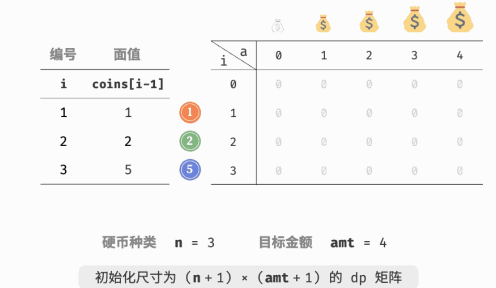

3、**空间优化**

遍历顺序：**由于新状态来自左侧和上方状态，因此从 a=1 到 a=amt 为正序**

```java
/* 零钱兑换：空间优化后的动态规划 */
int coinChangeDPComp(int[] coins, int amt) {
    int n = coins.length;
    int MAX = amt + 1;
    // 【定义dp表】
    int[] dp = new int[amt + 1];
    // 【边界条件】
    Arrays.fill(dp, MAX);
    dp[0] = 0;
    // 【遍历顺序】
    for (int i = 1; i <= n; i++) {
        for (int a = 1; a <= amt; a++) {
            // 【剪枝】若超过目标金额，则不选硬币 i
            if (coins[i - 1] > a) dp[a] = dp[a];
            // 【状态转移方程】
            else dp[a] = Math.min(dp[a], dp[a - coins[i - 1]] + 1);
        }
    }
    return dp[amt] != MAX ? dp[amt] : -1;
}
```

##### [中 518零钱兑换 II](https://leetcode.cn/problems/coin-change-ii/description/)（求组合数）

> 给定 n 种硬币，第 i 种硬币的面值为 coins[i-1]，目标金额为 amt，**每种硬币可以重复选取**，**问凑出目标金额的硬币组合数量**。
>
> 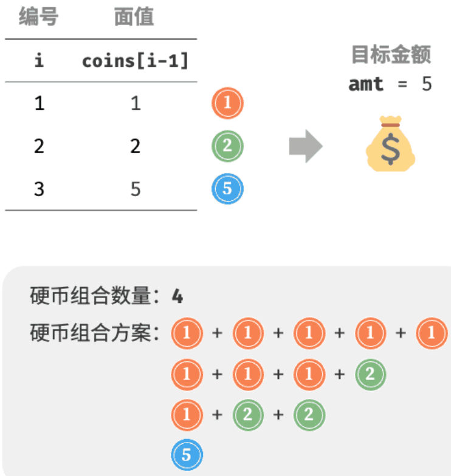

1、**动态规划思路**

* 相比于上一题，本题目标是求组合数量，因此子问题变为：**前 i 种硬币能够凑出金额 a 的组合数量**。而 dp 表仍然是尺寸为 (n+1) * (amt+1) 的二维矩阵
* 当前状态的组合数量等于不选当前硬币与选当前硬币这两种决策的组合数量之和。状态转移方程为：

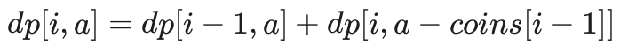

* 边界条件：当目标金额为 0 时，无须选择任何硬币即可凑出目标金额，因此应将首列所有 dp[i,0] 都初始化为 1。当无硬币时，无法凑出任何 >0 的目标金额，因此首行所有 dp[0,a] 都等于 0
* 遍历顺序：**新状态来自左侧和上方，因此要用内外两层循环**
  * **状态转移方程是两种子问题最优解之和不对应循环**

2、**代码实现**

```java
/* 零钱兑换 II：动态规划 */
int coinChangeIIDP(int[] coins, int amt) {
    int n = coins.length;
    // 【定义dp表】
    int[][] dp = new int[n + 1][amt + 1];
    // 【边界条件】初始化首列
    for (int i = 0; i <= n; i++) {
        dp[i][0] = 1;
    }
    // 【遍历顺序】
    for (int i = 1; i <= n; i++) {
        for (int a = 1; a <= amt; a++) {
            // 【剪枝】若超过目标金额，则不选硬币 i
            if (coins[i - 1] > a) dp[i][a] = dp[i - 1][a];
            // 【状态转移方程】不选和选硬币 i 这两种方案之和
            else dp[i][a] = dp[i - 1][a] + dp[i][a - coins[i - 1]];
            }
        }
    }
    return dp[n][amt];
}
```

3、**空间优化**

遍历顺序：**由于新状态来自左侧和上方状态，因此从 a=1 到 a=amt 为正序**

```java
/* 零钱兑换 II：空间优化后的动态规划 */
int coinChangeIIDPComp(int[] coins, int amt) {
    int n = coins.length;
    // 【定义dp表】
    int[] dp = new int[amt + 1];
    // 【边界条件】
    dp[0] = 1;
    // 【遍历顺序】
    for (int i = 1; i <= n; i++) {
        // 不选和选硬币 i 这两种方案之和
        for (int a = 1; a <= amt; a++) {
            // 【剪枝】若超过目标金额，则不选硬币 i
            if (coins[i - 1] > a) dp[a] = dp[a];
            // 【状态转移方程】
            else dp[a] = dp[a] + dp[a - coins[i - 1]];
            }
        }
    }
    return dp[amt];
}
```

##### [中 377组合总和 Ⅳ](https://leetcode.cn/problems/combination-sum-iv/)（求排列数）

> 给你一个由 **不同** 整数组成的数组 `nums` ，和一个目标整数 `target` 。请你从 `nums` 中找出并返回总和为 `target` 的元素排列的个数。
>
> 题目数据保证答案符合 32 位整数范围。
>
> ```
> 输入：nums = [1,2,3], target = 4
> 输出：7
> 解释：
> 所有可能的组合为：
> (1, 1, 1, 1)
> (1, 1, 2)
> (1, 2, 1)
> (1, 3)
> (2, 1, 1)
> (2, 2)
> (3, 1)
> 请注意，顺序不同的序列被视作不同的组合
> ```

* 子问题：dp[i] 表示**凑成总和为 `i` 的排列个数**

  为了求 `dp[target]`，我们需要先求出所有小于 `target` 的状态，即 `dp[1]`, `dp[2]`, ..., `dp[target-1]`，因此 dp表为 `new int[target + 1]`

* 最优子结构：凑成总和 `i` 的排列数，等于所有可能的**最后一步**选取的数字 `num` 所对应的子问题解之和，因此状态转移方程为：

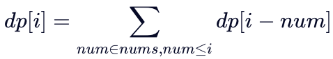

* 边界条件：dp[0] 本来应该不存在，因为题目给定了 `1 <= target <= 1000`，但是考虑可能的 `i=nums[j]` 的情况，此时属于一种排列，因此要加 1，所以设定 `dp[0]=1`

* 遍历顺序：**由于新状态来自左侧和上方状态，因此从 i=0 到 i=target 为正序**
  * 本题与 518零钱兑换 II 对应，虽然名字里带有“组合”，但是是**求排列数**，因此内外层遍历对象与 518零钱兑换 II 相反，外层是背包，内层是物品

```java
int combinationSum(int[] nums, int target) {
    int[] dp = new int[target + 1];
    dp[0] = 1;
    for (int i = 0; i <= target; i++) {
        for (int j = 0; j < nums.length; j++) {
            // 【状态转移方程】
            if (i >= nums[j]) dp[i] += dp[i - nums[j]];
        }
    }
    return dp[target];
}
```

##### 【🔥中】[279完全平方数](https://leetcode.cn/problems/perfect-squares/)

> 给你一个整数 `n` ，返回 *和为 `n` 的完全平方数的最少数量* 。
>
> **完全平方数** 是一个整数，其值等于另一个整数的平方；换句话说，其值等于一个整数自乘的积。例如，`1`、`4`、`9` 和 `16` 都是完全平方数，而 `3` 和 `11` 不是。
>
> ```
> 输入：n = 12
> 输出：3
> 解释：12 = 4 + 4 + 4
> ```

**把题目翻译一下：完全平方数就是物品（可以无限件使用），凑个正整数n就是背包，问凑满这个背包最少有多少物品？**

**第一步：思考每轮的决策，找到状态和对应的子问题，从而得到 dp 表**

- 决策：对于目标和 `n`，我们可以选择任意一个不超过 `n` 的完全平方数（如 1, 4, 9, 16, ...）作为其中一个加数
- 状态 [i] 对应的子问题为：**组成正整数 `i` 所需的最少完全平方数的个数**
- dp 表含义：`dp[0...n]`，其中 `dp[i]` 是我们要计算的最小数量

**第二步：找出最优子结构，进而推导出状态转移方程**

- 最优子结构：要得到和为 i 的最少个数 `dp[i]`，需要尝试所有小于等于 `i`的完全平方数 `j*j`（其中 `j*j <= i`），然后**考虑所有 j 的取值下 `dp[i - j*j]` 的最优解**，再加上 j 这个完全平方数（即 +1）
- 状态转移方程：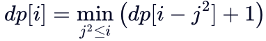，其中 `j` 从 1 到 `floor(sqrt(i))`

**第三步：确定边界条件（初始化dp表）和状态转移顺序（遍历顺序）**

- 边界条件：
  - `dp[0] = 0`：和为 0 时，不需要任何完全平方数（空和）
  - 对于 `i > 0`，初始时可设 `dp[i] = i`（最坏情况：全部用 1 相加，共 i 个）
- 遍历顺序：**由于新状态来自左侧和上方状态，因此从 i=j*j 到 i=n 为正序**

```java
int numSquares(int n) {
    // 【定义dp表】dp[i]表示组成整数i所需的最少完全平方数个数
    int[] dp = new int[n + 1];
    // 【边界条件】
    // dp[0] = 0 已经在数组创建时默认初始化
    // 其他位置初始化为最坏情况：全部用1相加，即i个
    for (int i = 1; i <= n; i++) {
        dp[i] = i; 
    }
    // 【遍历顺序】外层遍历物品
    // 这里的物品是 1*1, 2*2, 3*3 ... 直到 sqrt(n)
    for (int j = 1; j * j <= n; j++) {
        // 内层正序遍历背包容量（金额）
        for (int i = j*j; i <= n; i++) {
            // 【状态转移方程】
            dp[i] = Math.min(dp[i], dp[i - j*j] + 1);
        }
    }
    return dp[n];
}
```

##### 【🔥中】[139单词拆分](https://leetcode.cn/problems/word-break/)

> 给你一个字符串 `s` 和一个字符串列表 `wordDict` 作为字典。如果可以利用字典中出现的一个或多个单词拼接出 `s` 则返回 `true`。
>
> **注意：**不要求字典中出现的单词全部都使用，并且字典中的单词可以重复使用。

单词就是物品，字符串s就是背包，单词能否组成字符串s，就是问物品能不能把背包装满，拆分时可以重复使用字典中的单词，说明是一个完全背包

**dp[i] : 字符串长度为 i 的话，dp[i] 为 true，表示可以拆分为一个或多个在字典中出现的单词**

状态转移方程：

* 如果确定 dp[j] (j < i) 是 true，且 [j, i] 这个区间的子串出现在字典里，那么 dp[i] 一定是 true
* 所以递推公式是：`if([j, i](j从0到i-1) 在字典里 && dp[j] == true) dp[i] = true;`

边界条件：从递推公式中可以看出，dp[i] 的状态依靠 dp[j] 是否为true，那么 dp[0] 就是递推的根基，必须为 true，否则递推下去后面都都是 false

遍历顺序：**状态转移方程来自多个左侧状态，因此从 i=1 到 i=s.length() 为正序**

```java
public boolean wordBreak(String s, List<String> wordDict) {
    // 将 List 转换为 HashSet，实现 O(1) 的快速查找
    Set<String> wordSet = new HashSet<>(wordDict);
    // 【定义dp数组】dp[i] 表示字符串 s 的前 i 个字符（即 s.substring(0, i)）能否被拆分
    boolean[] dp = new boolean[s.length() + 1];
    // 【边界条件】空字符串默认为 true，这是递推的基础
    dp[0] = true;
    //【遍历顺序】外层循环：遍历背包（字符串长度，从 1 到 s.length()）
    for (int i = 1; i <= s.length(); i++) {
        // 内层循环：遍历物品（分割点，从 0 到 i-1）
        for (int j = 0; j < i; j++) {
            // 截取子串：从下标 j 开始，长度为 i-j
            String word = s.substring(j, i);
            // 【状态转移方程】如果 s[0...j-1] 可以拆分（dp[j] 为 true）并且子串 s[j...i-1] 在字典里，那么 s[0...i-1] 就可以拆分
            if (wordSet.contains(word) && dp[j]) {
                dp[i] = true;
                break; // 既然已经确定可以拆分，就不需要继续尝试其他分割点了
            }
        }
    }
    return dp[s.length()];
}
```

### 线性动态规划

是最基础、最常见的一类，状态沿着一个线性的序列（如数组、字符串）推进。`dp[i]` 通常只依赖于 `i` 之前的状态（如 `i-1`, `i-2`）

#### [中 343整数拆分](https://leetcode.cn/problems/integer-break/description/)

> 给定一个正整数 `n` ，将其拆分为 `k` 个 **正整数** 的和（ `k >= 2` ），并使这些整数的乘积最大化。
>
> 返回 *你可以获得的最大乘积* 。
>
> ```
> 输入: 10
> 输出: 36
> 解释: 10 = 3 + 3 + 4, 3 × 3 × 4 = 36
> ```

本题并不是背包问题，因此虽然求的是最大乘积，但是内外循环根据状态转移方程的逻辑有各自固定的对象，**先 i 后 j，不能调换**

核心在于：**对于每一个拆分出来的数，我们需要决定是“继续拆分它”还是“直接使用它”**

**第一步：思考每轮的决策，找到状态和对应的子问题，从而得到 dp 表**

对于数字 `i`，我们需要做出一系列决策：

1. **切分**：首先，必须把 `i` 切分成两部分，比如 `j` 和 `i-j`（其中 `1 <= j < i`）
2. **后续选择**：对于切分出来的第二部分 `i-j`，我们面临两个选择：**不再拆分**和**继续拆分**

子问题 dp[i] 为**将正整数 `i` 拆分为至少两个正整数的和之后，这些整数的最大乘积**

**第二步：找出最优子结构，进而推导出状态转移方程**

我们需要遍历 `i` 的所有可能的“第一刀”拆分位置 `j`（`1 <= j < i`），将 `i` 拆分为 `j` 和 `i-j`。此时，对于剩下的部分 `i-j`，我们有两种选择：

1. **不继续拆分 `i-j`**：

   此时乘积为两部分直接相乘：`j * (i - j)`

2. **继续拆分 `i-j`**：
   此时 `i-j` 部分的最大乘积为 `dp[i-j]`，总乘积为：`j * dp[i - j]`

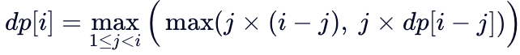

```java
dp[i] = Math.max(dp[i], Math.max(j * (i - j), j * dp[i - j]));
```

**第三步：确定边界条件（初始化dp表）和状态转移顺序（遍历顺序）**

遍历顺序：**由于新状态来自左侧和上方状态，因此从 i=3 到 i=n 为正序**

```java
int integerBreak(int n) {
    // 【定义dp数组】dp[i] 为正整数 i 拆分后的结果的最大乘积
    int[] dp = new int[n+1];
    // 【边界条件】
    dp[2] = 1;
    for(int i = 3; i <= n; i++) {
        for(int j = 1; j <= i-j; j++) {
            // 这里的 j 其实最大值为 i-j,再大只不过是重复而已，
            // 并且，在本题中，我们分析 dp[0], dp[1]都是无意义的，
            // j 最大到 i-j,就不会用到 dp[0]与dp[1]
            // 【状态转移方程】
            dp[i] = Math.max(dp[i], Math.max(j*(i-j), j*dp[i-j]));
            // j * (i - j) 是单纯的把整数 i 拆分为两个数 也就是 i,i-j ，再相乘
            // 而 j * dp[i - j] 是将 i 拆分成两个以及两个以上的个数,再相乘
        }
    }
    return dp[n];
}
```

#### 打家劫舍问题

**198 打家劫舍 I**：最基础的线性动态规划

**213 打家劫舍 II**：将环形问题**拆解**为两个线性子问题，然后取最大值

- 情况一：偷第一间房，则不能偷最后一间。问题变为求解 `[0, n-2]` 范围
- 情况二：不偷第一间房，则可以偷最后一间。问题变为求解 `[1, n-1]` 范围
- 最终结果是 `max(情况一的结果, 情况二的结果)`

**337 打家劫舍 III**：将线性DP的思想迁移到树形结构上，通常使用**树形DP**或**后序遍历+递归**。对于每个节点，返回一个包含两种状态（偷/不偷当前节点）的数组，将子节点的状态传递给父节点进行决策

##### [中 198打家劫舍](https://leetcode.cn/problems/house-robber/description/)

> 你是一个专业的小偷，计划偷窃沿街的房屋。每间房内都藏有一定的现金，影响你偷窃的唯一制约因素就是相邻的房屋装有相互连通的防盗系统，**如果两间相邻的房屋在同一晚上被小偷闯入，系统会自动报警**。
>
> 给定一个代表每个房屋存放金额的非负整数数组，计算你**不触动警报装置的情况下** ，一夜之内能够偷窃到的最高金额。
>
> ```
> 输入：[2,7,9,3,1]
> 输出：12 
> 解释：偷窃 1 号房屋 (金额 = 2), 偷窃 3 号房屋 (金额 = 9)，接着偷窃 5 号房屋 (金额 = 1)。  偷窃到的最高金额 = 2 + 9 + 1 = 12 
> ```

dp[i]：**考虑下标i（包括i）以内的房屋，最多可以偷窃的金额**

决定 dp[i] 的因素就是第i房间偷还是不偷

* 如果偷第 i 房间，那么 dp[i] = dp[i - 2] + nums[i]，即第 i-1 房一定不偷，找出下标 i-2（包括 i-2）以内的房屋最多可以偷窃的金额
* 如果不偷，那么 dp[i] = dp[i - 1]，即考虑 i-1 房（**注意这里是考虑，并不是一定要偷**）

然后 dp[i] 取最大值，即 dp[i] = max(dp[i - 2] + nums[i], dp[i - 1])

```java
public int rob(int[] nums) {
    if (nums == null || nums.length == 0) return 0;
  	if (nums.length == 1) return nums[0];
    int[] dp = new int[nums.length];
    dp[0] = nums[0];
    dp[1] = Math.max(dp[0], nums[1]);
    for (int i = 2; i < nums.length; i++) {
      	dp[i] = Math.max(dp[i - 1], dp[i - 2] + nums[i]);
    }
    return dp[nums.length - 1];
}
```

分析本题可以发现，所求结果仅依赖于前两种状态，此时可以使用滚动数组思想将空间复杂度降低

```java
public int rob(int[] nums) {
    if (nums.length == 1)  {
        return nums[0];
    }
    // 优化空间 dp数组只用2格空间 只记录与当前计算相关的前两个结果
    int[] dp = new int[2];
    dp[0] = nums[0];
    dp[1] = Math.max(nums[0],nums[1]);
    int res = 0;
    for (int i = 2; i < nums.length; i++) {
        res = Math.max((dp[0] + nums[i]) , dp[1] );
        dp[0] = dp[1];
        dp[1] = res;
    }
    return dp[1];
}
```

##### [中 213打家劫舍 II](https://leetcode.cn/problems/house-robber-ii/description/)

> 你是一个专业的小偷，计划偷窃沿街的房屋，每间房内都藏有一定的现金。这个地方所有的房屋都**围成一圈** ，这意味着第一个房屋和最后一个房屋是紧挨着的。同时，相邻的房屋装有相互连通的防盗系统，**如果两间相邻的房屋在同一晚上被小偷闯入，系统会自动报警** 。
>
> 给定一个代表每个房屋存放金额的非负整数数组，计算你 **在不触动警报装置的情况下** ，今晚能够偷窃到的最高金额。

第一个房间偷或者不偷。偷的话，只能从第一间累积到第n-1间房子；不偷的话，从第二间累积到最后一间。比较两种情况大小即可

```java
public int rob(int[] nums) {
    if (nums.length == 1) return nums[0];
    // 【初始化两个 DP 数组】
    int[] dp1 = new int[nums.length], dp2 = new int[nums.length];
    // dp1: 考虑范围 [0, nums.length-2] (即偷第一间，不偷最后一间)
    dp1[0] = nums[0];
    dp1[1] = nums[0];
    // dp2: 考虑范围 [1, nums.length-1] (即不偷第一间)
    dp2[1] = nums[1]; // 在第二轮中，从第1间房开始偷

    for (int i = 2; i < nums.length; i++) {
        // 【状态转移方程】max(偷当前, 不偷当前)
        dp1[i] = Math.max(dp1[i - 2] + nums[i], dp1[i - 1]);
        dp2[i] = Math.max(dp2[i - 2] + nums[i], dp2[i - 1]);
    }
    // 结果：
    // dp1 计算到了 nums.length-2 位置（因为最后一间房不能偷，所以取 dp1[nums.length-2]）
    // dp2 计算到了 nums.length-1 位置（最后一间房可以偷，所以取 dp2[nums.length-1]）
    return Math.max(dp1[nums.length - 2], dp2[nums.length - 1]);
}
```

##### [中 337打家劫舍 III](https://leetcode.cn/problems/house-robber-iii/description/)（树形DP）

> 小偷又发现了一个新的可行窃的地区。这个地区只有一个入口，我们称之为 `root` 。
>
> 除了 `root` 之外，每栋房子有且只有一个“父“房子与之相连。一番侦察之后，聪明的小偷意识到“这个地方的所有房屋的排列类似于一棵二叉树”。 如果 **两个直接相连的房子在同一天晚上被打劫** ，房屋将自动报警。
>
> 给定二叉树的 `root` 。返回 ***在不触动警报的情况下** ，小偷能够盗取的最高金额* 。
>
>
> 
>
> ```
> 输入: root = [3,4,5,1,3,null,1]
> 输出: 9
> 解释: 小偷一晚能够盗取的最高金额 4 + 5 = 9
> ```

在普通的线性DP（如打家劫舍I）中，`dp[i]` 是一个表格，记录了从第0个位置到第 `i` 个位置的所有历史结果

但在树形DP中，**没有全局的大表格**。这里的 `int[2]` 数组是**局部的、临时的**，它代表的是**“以当前节点为根的子树”的两种特定状态下的最优解**

对于树上的任意一个节点 `node`，`robInternal(node)` 返回的数组 `result` 包含两个值，分别代表**在这个子树范围内**，针对当前 `node` 的两种决策结果：

- **`result[0]` (不偷当前节点)**：
  - **含义**：假设我**决定不偷**当前这个节点，那么我的左右子树能贡献的最大金额是多少？
  - **逻辑**：既然我不偷当前节点，那么我的**孩子节点**是自由的，它们想偷就偷，不想偷就不偷（取最大值）。
  - **公式**：`Math.max(左孩子偷, 左孩子不偷) + Math.max(右孩子偷, 右孩子不偷)`
- **`result[1]` (偷当前节点)**：
  - **含义**：假设我**决定要偷**当前这个节点，那么我的左右子树能贡献的最大金额是多少？
  - **逻辑**：既然我偷了当前节点，根据规则，**孩子节点绝对不能偷**。所以我只能拿走孩子节点“不偷”时的收益。
  - **公式**：`当前节点金额 + 左孩子不偷 + 右孩子不偷`

```java
public int rob(TreeNode root) {
    int[] result = robInternal(root);
    return Math.max(result[0], result[1]);
}
public int[] robInternal(TreeNode root) {
    if (root == null) return new int[2];
    int[] result = new int[2];

    // 递归调用
    int[] left = robInternal(root.left);
    int[] right = robInternal(root.right);
    
    // 递归调用后的语句
    // 这里的代码是在“回溯”阶段执行的，但它不是在“撤销选择”，而是在“汇总信息”
    result[0] = Math.max(left[0], left[1]) + Math.max(right[0], right[1]);
    result[1] = left[0] + right[0] + root.val;

    return result;
}
```

### 股票问题—状态机动态规划

在股票问题中，每一天你的账户都处于某种特定的**状态**。你的决策（买入、卖出、不动）会导致状态之间的**转移**，并伴随着现金（利润）的变化

最通用的状态定义通常包含三个维度（虽然可以通过空间优化去掉时间维度）：

- **天数** (`i`)
- **交易次数** (`k`)
- **持有状态** (`s`)：持有股票 (1) 或 不持有股票 (0)

**核心公式（万能模板）：**对于第 `i` 天，

1. **今天持有股票** = `max(昨天就持有，今天刚买入)`
2. **今天不持有股票** = `max(昨天就不持有，今天刚卖出)`

#### [简 121买卖股票的最佳时机](https://leetcode.cn/problems/best-time-to-buy-and-sell-stock/)（只能买卖一次）

> 给定一个数组 `prices` ，它的第 `i` 个元素 `prices[i]` 表示一支给定股票第 `i` 天的价格。
>
> 你只能选择 **某一天** 买入这只股票，并选择在 **未来的某一个不同的日子** 卖出该股票。设计一个算法来计算你所能获取的最大利润。
>
> 返回你可以从这笔交易中获取的最大利润。如果你不能获取任何利润，返回 `0` 。
>
> ```
> 输入：[7,1,5,3,6,4]
> 输出：5
> 解释：在第 2 天（股票价格 = 1）的时候买入，在第 5 天（股票价格 = 6）的时候卖出，最大利润 = 5 。注意利润不能是 7-1 = 6, 因为卖出价格需要大于买入价格；同时，你不能在买入前卖出股票。
> ```

* dp[i] [0] 表示第 i 天持有股票所得最多现金（一开始现金是0，那么加入第 i 天买入股票现金就是 -prices[i]， 这是一个负数）
* dp[i] [1] 表示第 i 天不持有股票所得最多现金（**注意是“持有”，不代表当天买入，也可能是昨天买入，今天保持持有**）

状态转移方程：

* 如果第 i 天持有股票即 dp[i] [0]， 那么可以由两个状态推出来

  - 第 i-1 天就持有股票，那么就保持现状，所得现金就是昨天持有股票的所得现金，即 dp[i - 1] [0]

  - 第 i 天买入股票，所得现金就是买入今天的股票后所得现金，即 -prices[i]

  所以 `dp[i][0] = max(dp[i - 1][0], -prices[i])`

* 如果第 i 天不持有股票即 dp[i] [1]， 也可以由两个状态推出来

  - 第 i-1 天就不持有股票，所得现金就是昨天不持有股票的所得现金，即 dp[i - 1] [1]

  - 第 i 天卖出股票，所得现金就是按照今天股票价格卖出后所得现金，即 prices[i] + dp[i - 1] [0]

  所以 `dp[i][1] = max(dp[i - 1][1], prices[i] + dp[i - 1][0])`

边界条件：

* dp[0] [0]表示第0天持有股票，此时的持有股票就一定是买入股票，所以`dp[0] [0] -= prices[0];`

* dp[0] [1]表示第0天不持有股票，不持有股票那么现金就是0

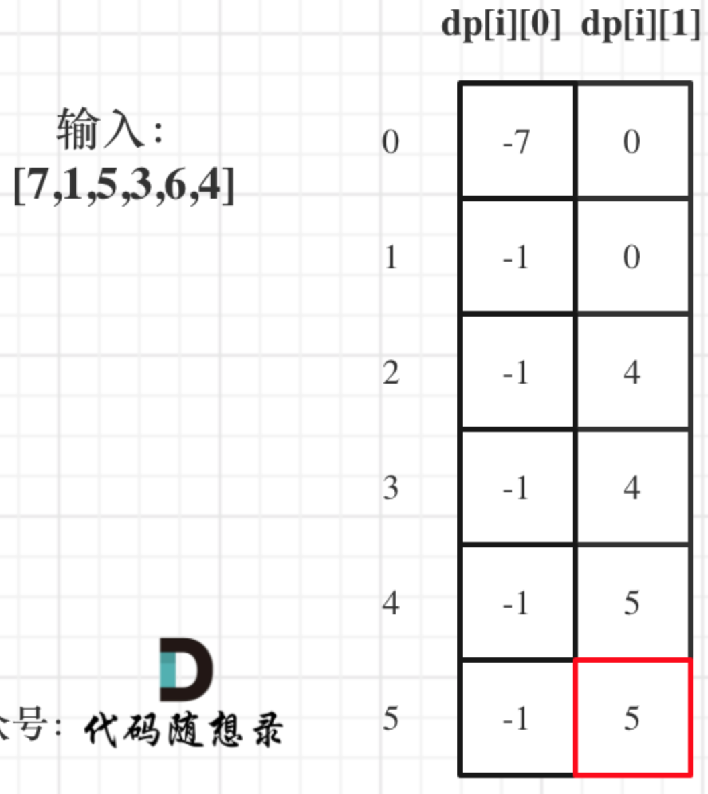

```java
public int maxProfit(int[] prices) {
    int length = prices.length;
    // dp[i][0]代表第i天持有股票的最大收益
    // dp[i][1]代表第i天不持有股票的最大收益
    int[][] dp = new int[length][2];
    dp[0][0] = -prices[0];
    dp[0][1] = 0;
    for (int i = 1; i < length; i++) {
        dp[i][0] = Math.max(dp[i - 1][0], -prices[i]);
        dp[i][1] = Math.max(dp[i - 1][0] + prices[i], dp[i - 1][1]);
    }
    return dp[length - 1][1];
}
```

空间优化：

```java
public int maxProfit(int[] prices) {
    int[] dp = new int[2];
    dp[0] = -prices[0];
    dp[1] = 0;
    for (int i = 1; i < prices.length; i++) {
        dp[1] = Math.max(dp[1], dp[0] + prices[i]);
        dp[0] = Math.max(dp[0], -prices[i]);
    }
    return dp[1];
}
```

#### [中 122买卖股票的最佳时机 II](https://leetcode.cn/problems/best-time-to-buy-and-sell-stock-ii/)（可以买卖多次）

> 给你一个整数数组 `prices` ，其中 `prices[i]` 表示某支股票第 `i`天的价格。
>
> 在每一天，你可以决定是否购买和/或出售股票。你在任何时候 **最多** 只能持有 **一股** 股票。然而，你可以在 **同一天** 多次买卖该股票，但要确保你持有的股票不超过一股。
>
> 返回 *你能获得的 **最大** 利润* 。

状态转移方程的变化：`dp[i][0] = max(dp[i-1][0], dp[i-1][1] - prices[i])`

可以发现，买入时是 `dp[i-1][1] - prices[i]`。这意味着你可以用**昨天卖出赚到的钱**来买今天的股票（利滚利）

- **对比**：这与只能交易一次不同，一次交易买入时通常是 `-prices[i]`（相当于初始资金为0，借债买股）

```java
public int maxProfit(int[] prices) {
    int length = prices.length;
    int[][] dp = new int[length][2];
    dp[0][0] = -prices[0];
    dp[0][1] = 0;
    for (int i = 1; i < length; i++) {
        dp[i][0] = Math.max(dp[i - 1][0], dp[i-1][1] - prices[i]);
        dp[i][1] = Math.max(dp[i - 1][0] + prices[i], dp[i - 1][1]);
    }
    return dp[length - 1][1];
}
```

空间优化：

```java
public int maxProfit(int[] prices) {
    int[] dp = new int[2];
    dp[0] = -prices[0];
    dp[1] = 0;
    for (int i = 1; i < prices.length; i++) {
        int tmp = dp[0];
      	dp[0] = Math.max(tmp, dp[1] - prices[i]);
      	dp[1] = Math.max(dp[1], tmp + prices[i]);
    }
    return dp[1];
}
```

#### [难 123买卖股票的最佳时机 III](https://leetcode.cn/problems/best-time-to-buy-and-sell-stock-iii/)（最多买卖两次）

> 给定一个数组，它的第 `i` 个元素是一支给定的股票在第 `i` 天的价格。
>
> 设计一个算法来计算你所能获取的最大利润。你最多可以完成 **两笔** 交易。
>
> **注意：**你不能同时参与多笔交易（你必须在再次购买前出售掉之前的股票）。

由于最多可以完成两笔交易，因此在任意一天结束之后，我们会处于以下五个状态中的一种：

0. 未进行过任何操作
1. 第一次持有股票
2. 第一次不持有股票
3. 第二次持有股票
4. 第二次不持有股票

dp[i] [j] 中 i 表示第 i 天，j 为 [0 - 4] 五个状态，dp[i] [j] 表示第 i 天状态 j 所剩最大现金

状态转移方程：

* 达到 dp[i] [1] 状态，有两个具体操作：

  - 操作一：第 i 天买入股票了，那么 dp[i] [1] = dp[i-1] [0] - prices[i]

  - 操作二：第 i 天没有操作，而是沿用前一天买入的状态，即 dp[i] [1] = dp[i - 1] [1]

  所以 `dp[i][1] = max(dp[i-1][0] - prices[i], dp[i - 1][1])`

* 同理 dp[i] [2] 也有两个操作：

  - 操作一：第 i 天卖出股票了，那么 `dp[i][2] = dp[i - 1][1] + prices[i]`
  - 操作二：第 i 天没有操作，沿用前一天卖出股票的状态，即 `dp[i][2] = dp[i - 1][2]`

  所以 `dp[i][2] = max(dp[i - 1][1] + prices[i], dp[i - 1][2])`

* 同理可推出剩下状态部分：

  `dp[i][3] = max(dp[i - 1][3], dp[i - 1][2] - prices[i])`

  `dp[i][4] = max(dp[i - 1][4], dp[i - 1][3] + prices[i])`

边界条件：

* 第0天没有操作，就是0
* 第0天做第一次买入的操作，dp[0] [1] = -prices[0]

* 第0天做第一次卖出的操作，可以理解为当天买入，当天卖出，所以 dp[0] [2] = 0

* 第0天第二次买入操作，dp[0] [3] = -prices[0]

* 同理第二次卖出，dp[0] [4] = 0

| 天数 (i) | 股价 | 状态1: 第1次持有 | 状态2: 第1次卖出 | 状态3: 第2次持有 | 状态4: 第2次卖出 | 备注 (最优操作路径)                      |
| -------- | ---- | ---------------- | ---------------- | ---------------- | ---------------- | ---------------------------------------- |
| 0        | 1    | -1               | 0                | -1               | 0                | 初始化：买入成本-1，第二次买入也预设为-1 |
| 1        | 3    | -1               | 2                | 1                | 2                | 第1次卖赚2；用这2块钱买第2次，手头剩1    |
| 2        | 7    | -1               | 6                | 5                | 6                | 第1次卖赚6；用这6块钱买第2次，手头剩5    |
| 3        | 5    | -1               | 6                | 5                | 10               | 关键点：第2次卖达到10 (5+5)              |
| 4        | 2    | -1               | 6                | 5                | 10               | 股价跌了，不操作，维持最大值             |

```java
public int maxProfit(int[] prices) {
    int len = prices.length;
    // 定义 5 种状态: 0: 没有操作, 1: 第一次买入, 2: 第一次卖出, 3: 第二次买入, 4: 第二次卖出
    int[][] dp = new int[len][5];
    dp[0][1] = -prices[0];
    dp[0][3] = -prices[0];
    for (int i = 1; i < len; i++) {
        dp[i][1] = Math.max(dp[i - 1][1], -prices[i]);
        dp[i][2] = Math.max(dp[i - 1][2], dp[i - 1][1] + prices[i]);
        dp[i][3] = Math.max(dp[i - 1][3], dp[i - 1][2] - prices[i]);
        dp[i][4] = Math.max(dp[i - 1][4], dp[i - 1][3] + prices[i]);
    }
    return dp[len - 1][4];
}
```

空间优化：

```java
public int maxProfit(int[] prices) {
    int[] dp = new int[4]; 
    // 存储两次交易的状态就行
    // dp[0]代表第一次交易的买入
    dp[0] = -prices[0];
    // dp[1]代表第一次交易的卖出
    dp[1] = 0;
    // dp[2]代表第二次交易的买入
    dp[2] = -prices[0];
    // dp[3]代表第二次交易的卖出
    dp[3] = 0;
    for(int i = 1; i <= prices.length; i++){
        int tmp1 = dp[0];
        int tmp2 = dp[1];
        int tmp3 = dp[2];
        // 要么保持不变，要么没有就买，有了就卖
        dp[0] = Math.max(tmp1, -prices[i-1]);
        dp[1] = Math.max(tmp2, tmp1+prices[i-1]);
        // 这已经是第二次交易了，所以得加上前一次交易卖出去的收获
        dp[2] = Math.max(tmp3, tmp2-prices[i-1]);
        dp[3] = Math.max(dp[3], tmp3+ prices[i-1]);
    }
    return dp[3];
}
```

#### [难 188买卖股票的最佳时机 IV](https://leetcode.cn/problems/best-time-to-buy-and-sell-stock-iv/description/)（最多买卖K次）

> 给你一个整数数组 `prices` 和一个整数 `k` ，其中 `prices[i]` 是某支给定的股票在第 `i` 天的价格。
>
> 设计一个算法来计算你所能获取的最大利润。你最多可以完成 `k` 笔交易。也就是说，你最多可以买 `k` 次，卖 `k` 次。
>
> **注意：**你不能同时参与多笔交易（你必须在再次购买前出售掉之前的股票）。

使用二维数组 dp[i] [j] ：第i天的状态为 j，所剩下的最大现金是 dp[i] [j]

j 的状态表示为：

- 0 表示不操作
- 1 第一次买入
- 2 第一次卖出
- 3 第二次买入
- 4 第二次卖出
- .....

**可以发现，除了0以外，偶数就是卖出，奇数就是买入**

题目要求至多有K笔交易，那么j的范围就定义为 2 * k + 1 即可

状态转移方程：

* 达到 dp[i] [1] 状态，有两个具体操作：

  - 操作一：第 i 天买入股票了，那么 dp[i] [1] = dp[i - 1] [0] - prices[i]

  - 操作二：第 i 天没有操作，而是沿用前一天买入的状态，即 dp[i] [1] = dp[i - 1] [1]

  所以 `dp[i][1] = max(dp[i - 1][0] - prices[i], dp[i - 1][1])`

* 同理 dp[i] [2] 也有两个操作：

  - 操作一：第 i 天卖出股票了，那么 dp[i] [2] = dp[i - 1] [1] + prices[i]

  - 操作二：第 i 天没有操作，沿用前一天卖出股票的状态，即 dp[i] [2] = dp[i - 1] [2]

  所以 `dp[i][2] = max(dp[i - 1][1] + prices[i], dp[i - 1][2])`

* 同理可以类比剩下的状态，代码如下：

  ```java
  for (int j = 1; j <= 2 * k; j ++) {
      if(j % 2 == 1) dp[i][j] = max(dp[i - 1][j], dp[i - 1][j - 1] - prices[i]);
      else dp[i][j] = max(dp[i - 1][j], dp[i - 1][j - 1] + prices[i]);
  }
  ```

边界条件：**同理可以推出 dp[0] [j] 当 j 为奇数的时候都初始化为 -prices[0]**

```java
for (int m = 1; m <= 2 * k; m += 2) {
    dp[0][m] = -prices[0];
}
```

```java
public int maxProfit(int k, int[] prices) {
    int len = prices.length;
    int[][] dp = new int[len][k * 2 + 1];
    for (int m = 1; m <= k * 2; m +=2) dp[0][m] = -prices[0];
    for (int i = 1; i < len; i++) {
        // ⚠️注意：从1开始遍历，因为状态0恒为0，不需要计算，且防止数组下标j-1变成-1
        for (int j = 1; j <= 2 * k; j++) {
            if(j % 2 == 1) dp[i][j] = Math.max(dp[i - 1][j], dp[i - 1][j - 1] - prices[i]);
            else dp[i][j] = Math.max(dp[i - 1][j], dp[i - 1][j - 1] + prices[i]);
        }
    }
    return dp[len - 1][k * 2];
}
```

```java
public int maxProfit(int k, int[] prices) {        
    int dp[] = new int [k * 2 + 1];
    for(int m = 1; m <= 2 * k; m += 2) dp[m] = -prices[0];
    for(int i = 1; i < prices.length; i++){
        for(int j = 1; j <= 2 * k; j++){
            if(j % 2 == 1) dp[j] = Math.max(dp[j], dp[j - 1] - prices[i]);
            else dp[j] = Math.max(dp[j], dp[j - 1] + prices[i]);
        }
    }
    return dp[2 * k];
}
```

#### [中 309买卖股票的最佳时机含冷冻期](https://leetcode.cn/problems/best-time-to-buy-and-sell-stock-with-cooldown/)（可以买卖多次，卖出有一天冷冻期）

> 给定一个整数数组 `prices`，其中第 `prices[i]` 表示第 `i` 天的股票价格 。
>
> 设计一个算法计算出最大利润。在满足以下约束条件下，你可以尽可能地完成更多的交易（多次买卖一支股票）:
>
> - 卖出股票后，你无法在第二天买入股票 (即冷冻期为 1 天)。
>
> **注意：**你不能同时参与多笔交易（你必须在再次购买前出售掉之前的股票）。

相对于122题，本题加上了一个冷冻期

dp[i] [j]，第 i 天状态为 j，所剩的最多现金为 dp[i] [j]

j 的状态为：

- 0：持有股票状态（今天买入股票，或者是之前就买入了股票然后没有操作，一直持有）
- 不持有股票状态，有两种
  - 1：保持卖出股票的状态（两天前就卖出了股票，度过一天冷冻期；或者是前一天就是卖出股票状态，一直没操作）
  - 2：今天卖出股票
- 3：今天为冷冻期状态，但冷冻期状态不可持续，只有一天！

状态转移方程：

* **达到持有股票 dp[i] [0] 状态**，有两个具体操作：

  - 操作一：前一天就是持有股票状态，dp[i] [0] = dp[i - 1] [0]

  - 操作二：今天买入了，有两种情况
    - 前一天是冷冻期，dp[i - 1] [3] - prices[i]
    - 前一天是保持卖出股票的状态，dp[i - 1] [1] - prices[i]

  所以 `dp[i][0] = max(dp[i - 1][0], dp[i - 1][3] - prices[i], dp[i - 1][1] - prices[i])`

* **达到保持卖出股票 dp[i] [1] 状态**，有两个具体操作：

  - 操作一：前一天就是保持卖出股票的状态，dp[i - 1] [1]

  - 操作二：前一天是冷冻期，dp[i - 1] [3]

  所以 `dp[i][1] = max(dp[i - 1][1], dp[i - 1][3])`

* **达到今天就卖出股票 dp[i] [2] 状态**，只有一个操作：昨天一定是持有股票状态

  所以 `dp[i][2] = dp[i - 1][0] + prices[i]`

* **达到冷冻期 dp[i] [3] 状态**，只有一个操作：昨天卖出了股票

  所以 `dp[i][3] = dp[i - 1][2]`

```java
dp[i][0] = max(dp[i - 1][0], max(dp[i - 1][3], dp[i - 1][1]) - prices[i]);
dp[i][1] = max(dp[i - 1][1], dp[i - 1][3]);
dp[i][2] = dp[i - 1][0] + prices[i];
dp[i][3] = dp[i - 1][2];
```

边界条件：

* 如果是持有股票状态，那么 `dp[0][0] = -prices[0]`，一定是当天买入股票

* 保持卖出股票状态，从定义来说很难明确应该初始多少，这种情况就看递推公式需要给他初始成什么数值
  * 如果 i 为 1，第1天买入股票，那么递归公式中需要计算 `dp[i - 1][1] - prices[i]`，即 `dp[0][1] - prices[1]`，那么 dp[0] [1] 只能初始为0
* 今天卖出了股票，同上分析，dp[0] [2] 初始化为0，dp[0] [3] 也初始为0。

```java
public int maxProfit(int[] prices) {
    int n = prices.length;
    int[][] dp = new int[n][4];
    // 初始化第 0 天
    dp[0][0] = -prices[0];
    // 其他状态默认为 0
    for (int i = 1; i < n; i++) {
        dp[i][0] = Math.max(dp[i - 1][0], Math.max(dp[i - 1][1] - prices[i], dp[i - 1][3] - prices[i]));
        dp[i][1] = Math.max(dp[i - 1][1], dp[i - 1][3]);
        dp[i][2] = dp[i - 1][0] + prices[i];
        dp[i][3] = dp[i - 1][2];
    }        
    // 最后一天，最大收益肯定是不持有股票的状态
    // 可能是保持卖出、今天卖出、或者刚好是冷冻期
    return Math.max(dp[n - 1][3], Math.max(dp[n - 1][1], dp[n - 1][2]));
}
```

```java
public int maxProfit(int[] prices) {
    int[] dp=new int[4];
    dp[0] = -prices[0];
    for(int i = 1; i < prices.length; i++){
        // 使用临时变量来保存dp[0], dp[2]
        // 因为马上dp[0]和dp[2]的数据都会变 
        int tmp = dp[0];
        int tmp1 = dp[2];
        dp[0] = Math.max(dp[0], Math.max(dp[3], dp[1]) - prices[i]);
        dp[1] = Math.max(dp[1], dp[3]);
        dp[2] = tmp + prices[i];
        dp[3] = tmp1;
    }
    return Math.max(dp[3],Math.max(dp[1],dp[2]));
}
```

#### [中 714买卖股票的最佳时机含手续费](https://leetcode.cn/problems/best-time-to-buy-and-sell-stock-with-transaction-fee/)（可以买卖多次，每次有手续费）

> 给定一个整数数组 `prices`，其中 `prices[i]`表示第 `i` 天的股票价格 ；整数 `fee` 代表了交易股票的手续费用。
>
> 你可以无限次地完成交易，但是你每笔交易都需要付手续费。如果你已经购买了一个股票，在卖出它之前你就不能再继续购买股票了。
>
> 返回获得利润的最大值。
>
> **注意：**这里的一笔交易指买入持有并卖出股票的整个过程，每笔交易你只需要为支付一次手续费。

相对于122题，本题只需要在计算卖出操作时减去手续费

```java
public int maxProfit(int[] prices, int fee) {
    int len = prices.length;
    int[][] dp = new int[len][2];
    dp[0][0] = -prices[0];
    for (int i = 1; i < len; i++) {
        dp[i][0] = Math.max(dp[i - 1][0], dp[i - 1][1] - prices[i]);
        dp[i][1] = Math.max(dp[i - 1][0] + prices[i] - fee, dp[i - 1][1]);
    }
    return Math.max(dp[len - 1][0], dp[len - 1][1]);
}
```

```java
public int maxProfit(int[] prices, int fee) {
    int[] dp = new int[2];
    dp[0] = -prices[0];
    dp[1] = 0;
    for (int i = 1; i <= prices.length; i++) {
        int tmp = dp[0];
        dp[0] = Math.max(tmp, dp[1] - prices[i - 1]);
        dp[1] = Math.max(dp[1], tmp + prices[i - 1] - fee);
    }
    return dp[1];
}
```

### 子序列问题

#### 单串线性子序列（最长/计数）

- 状态 `dp[i]` 通常定义为**“以第 `i` 个元素结尾”**的某种最优解
- **核心逻辑**：对于当前位置 `i`，我要不要把它接在前面的某个位置 `j` 后面？

##### 【🔥中】[300最长递增子序列](https://leetcode.cn/problems/longest-increasing-subsequence/)（递增相对顺序子序列最大长度）

> 给你一个整数数组 `nums` ，找到其中最长严格递增子序列的长度。
>
> **子序列** 是由数组派生而来的序列，删除（或不删除）数组中的元素而不改变其余元素的顺序。例如，`[3,6,2,7]` 是数组 `[0,3,1,6,2,2,7]` 的子序列。

**状态定义**：dp[i] 的值代表 nums 以 nums[i] 结尾的最长子序列长度

**转移方程**： `dp[i] = max(dp[i], dp[j] + 1) for j in [0, i)`

设 j∈[0,i)，考虑每轮计算新 dp[i] 时，遍历 [0,i) 列表区间，做以下判断：

* 当 nums[i]>nums[j] 时：nums[i] 可以接在 nums[j] 之后（此题要求严格递增），此情况下最长上升子序列长度为 dp[j]+1
* 当 nums[i]<=nums[j] 时：nums[i] 无法接在 nums[j] 之后，此情况上升子序列不成立，跳过

**边界条件**：dp[i] 所有元素置 1，含义是每个元素都至少可以单独成为子序列，此时长度都为 1

**返回值**：返回 dp 列表最大值，即可得到全局最长上升子序列长度

```java
public int lengthOfLIS(int[] nums) {
    int[] dp = new int[nums.length];
    int res = 0;
    Arrays.fill(dp, 1);
    for(int i = 0; i < nums.length; i++) {
        for(int j = 0; j < i; j++) {
            if(nums[j] < nums[i]) dp[i] = Math.max(dp[i], dp[j] + 1);
        }
        res = Math.max(res, dp[i]);
    }
    return res;
}
```

##### [简 674最长连续递增序列](https://leetcode.cn/problems/longest-continuous-increasing-subsequence/)（递增连续子序列最大长度）

> 给定一个未经排序的整数数组，找到最长且 **连续递增的子序列**，并返回该序列的长度。

相对于300题，最大的区别在于“连续”，300题的依赖对象包括所有 j<i 的 dp[j]，而本题的依赖对象只有 dp[i-1]，因此**只需要单层循环**

```java
public int findLengthOfLCIS(int[] nums) {
    int result = 1;
    int[] dp = new int[nums.length];
		Arrays.fill(dp, 1);
    for (int i = 1; i < nums.length; i++) {
        if (nums[i] > nums[i - 1]) dp[i] = dp[i - 1] + 1;
        // 更新最大值
        result = dp[i]>result ? dp[i] : result;
    }
    return result;
}
```

##### 【🔥中】[53最大子数组和](https://leetcode.cn/problems/maximum-subarray/description/)（连续子序列最大和-Kadane算法）

> 给你一个整数数组 `nums` ，请你找出一个具有最大和的连续子数组（子数组最少包含一个元素），返回其最大和。
>
> **子数组** 是数组中的一个连续部分。
>
> ```
> 输入：nums = [-2,1,-3,4,-1,2,1,-5,4]
> 输出：6
> 解释：连续子数组 [4,-1,2,1] 的和最大，为 6 。
> ```

定义 f[i] 表示以 nums[i] 结尾的最大子数组和

分类讨论：

* nums[i] 单独组成一个子数组，那么 f[i]=nums[i]
* nums[i] 和前面的子数组拼起来，也就是在以 nums[i−1] 结尾的最大子数组和之后添加 nums[i]，那么 f[i]=f[i−1]+nums[i]

两种情况取最大值，得

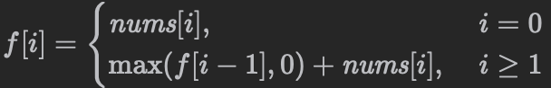

如果 *nums*[*i*] 左边的子数组元素和是负的，就不用和左边的子数组拼在一起了

答案为 max(*f*)

```java
public int maxSubArray(int[] nums) {
    int[] f = new int[nums.length];
    f[0] = nums[0];
    int res = f[0];
    for (int i = 1; i < nums.length; i++) {
        f[i] = Math.max(f[i - 1], 0) + nums[i];
        res = Math.max(res, f[i]);
    }
    return res;
}
```

##### 【🔥中】[152乘积最大子数组](https://leetcode.cn/problems/maximum-product-subarray/)（连续子序列最大乘积）

> 给你一个整数数组 `nums` ，请你找出数组中乘积最大的非空连续 子数组（该子数组中至少包含一个数字），并返回该子数组所对应的乘积。

例如 nums=[−2,1,−3,4]，讨论右端点为 nums[3]=4 的子数组的最大乘积：

* 4 单独组成一个子数组
* 4 和前面的子数组拼起来，也就是在右端点为 nums[2]=−3 的乘积最大子数组之后添加 4

又例如 nums=[−2,1,−3,−4]，讨论右端点为 nums[3]=−4 的子数组的最大乘积：

* −4 单独组成一个子数组
* −4 和前面的子数组拼起来，由于 −4 是负数，要想得到最大的乘积，根据负负得正，我们可以在右端点为 nums[2]=−3 的乘积最小子数组之后添加 −4

上面两个例子启发我们，需要在遍历 nums 的同时，维护两个信息：

* 右端点下标为 i 的子数组的最大乘积，记作 f~max~[i]
* 右端点下标为 i 的子数组的最小乘积，记作 f~min~[i]

设 x=nums[i]，分类讨论：

* x 单独组成一个子数组，那么 f~max~[i]=x
* x 和前面的子数组拼起来，也就是在右端点下标为 i−1 的乘积最大子数组之后添加 x，那么 f~max~[i]=f~max~[i−1]⋅x；也可以在右端点下标为 i−1 的乘积最小子数组之后添加 x，那么 f~max~[i]=f~min~[i−1]⋅x。把这两种都算一下，这样我们就无需判断 x 到底是正还是负了

三种情况取最大值，得

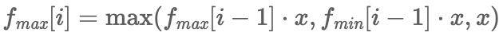

同理得

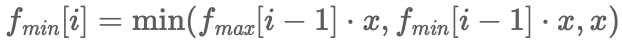

由于以 *nums*[0] 为右端点的子数组乘积只能是 *nums*[0]，所以初始值为 f~max~[0]=f~min~[0]=nums[0]

```java
public int maxProduct(int[] nums) {
    int n = nums.length;
    int[] fMax = new int[n];
    int[] fMin = new int[n];
    fMax[0] = fMin[0] = nums[0];
    for (int i = 1; i < n; i++) {
        int x = nums[i];
        // 把 x 加到右端点为 i-1 的（乘积最大/最小）子数组后面，
        // 或者单独组成一个子数组，只有 x 一个元素
        fMax[i] = Math.max(Math.max(fMax[i - 1] * x, fMin[i - 1] * x), x);
        fMin[i] = Math.min(Math.min(fMax[i - 1] * x, fMin[i - 1] * x), x);
    }
    return Arrays.stream(fMax).max().getAsInt();
}
```

由于计算 f~max~[i] 和 f~min~[i] 只会用到 f~max~[i−1] 和 f~min~[i−1]，不会用到更早的状态，所以可以用两个变量 f~max~ 和 f~min~ 滚动计算

状态转移方程简化为：

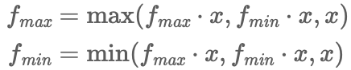

*注意这两个式子要同时计算，因此需要用 tmp 保留 f~max~ 的值*

```java
public int maxProduct(int[] nums) {
    int res = nums[0]; // 注意答案可能是负数
    int fMax = nums[0];
    int fMin = nums[0];
    for (int i=1 ; i<nums.length ; i++) {
        int x = nums[i];
        int tmp = fMax;
        fMax = Math.max(Math.max(fMax * x, fMin * x), x);
        fMin = Math.min(Math.min(tmp * x, fMin * x), x);
        res = Math.max(res, fMax);
    }
    return res;
}
```

##### 【🔥难】[32最长有效括号](https://leetcode.cn/problems/longest-valid-parentheses/)

> 给你一个只包含 `'('` 和 `')'` 的字符串，找出最长有效（格式正确且连续）括号 子串 的长度。
>
> 左右括号匹配，即每个左括号都有对应的右括号将其闭合的字符串是格式正确的，比如 `"(()())"`。
>
> ```
> 输入：s = ")()())"
> 输出：4
> 解释：最长有效括号子串是 "()()"
> ```

定义 `dp[i]` 为：**以字符 `s[i]` 结尾的最长有效括号子串的长度**

**两种匹配情况：**

1. **简单的配对：`...()`**
   - **场景**：当前字符是 `)`，前一个字符是 `(`
   - **逻辑**：这就凑成了一对 `()`
   - **公式**：`dp[i] = dp[i-2] + 2`
   - **解释**：当前这一对长度为 2，再加上这对括号**之前**已经存在的有效长度（`dp[i-2]`）
2. **复杂的嵌套/连续：`...))`**
   - **场景**：当前字符是 `)`，前一个字符也是 `)`
   - **逻辑**：既然前一个 `)` 是有效的，说明它肯定匹配了前面的某个 `(`。我们要看**前一个 `)` 所在有效子串**的**前面**是不是还有一个 `(`
   - **寻找匹配点**：
     - 前一个位置 `i-1` 结尾的有效长度是 `dp[i-1]`。
     - 那么那段有效子串的起始位置是 `i - dp[i-1]`。
     - 我们要找的是这个起始位置的前一个字符：`preIndex = i - dp[i-1] - 1`。
   - **判断**：如果 `s[preIndex] == '('`，说明当前的 `)` 可以和这个 `(` 匹配！
   - **公式**：`dp[i] = dp[i-1] + 2 + dp[preIndex-1]`。
   - **解释**：
     - `dp[i-1]`：中间夹着的有效长度（比如 `( ... )` 里的 `...`）。
     - `2`：当前新匹配的一对 `()`。
     - `dp[preIndex-1]`：**关键一步！** 如果这个新匹配的 `(` 前面还有有效括号（比如 `()(())`），要把它们也连起来。

```java
public int longestValidParentheses(String s) {
    int maxres = 0;
    // dp[i] 的定义：以 s.charAt(i) 结尾的最长有效括号子串的长度
    int[] dp = new int[s.length()];
    // 从下标 1 开始遍历，因为单个字符肯定构不成有效括号
    for (int i = 1; i < s.length(); i++) {
        // 只有遇到 ')' 才有可能构成有效括号的结尾
        if (s.charAt(i) == ')') {
            int preIndex = i - dp[i - 1] - 1;
            // 情况一：当前是 "....()" 的形式
            if (s.charAt(i - 1) == '(') dp[i] = (i >= 2 ? dp[i - 2] : 0) + 2;
            // 情况二：当前是 "....))" 的形式
            else if (preIndex >= 0 && s.charAt(preIndex) == '(') dp[i] = dp[i - 1] + ((i - dp[i - 1]) >= 2 ? dp[preIndex-1] : 0) + 2;
            // 更新全局最大值
            maxres = Math.max(maxres, dp[i]);
        }
    }
    return maxres;
}
```

#### 双串/网格子序列（匹配类）

这类问题涉及**两个**序列，是二维 DP 的主战场

- 状态 `dp[i][j]` 表示**序列 A 的前 `i` 个字符**和**序列 B 的前 `j` 个字符**的匹配结果
- **核心逻辑**：
  - 如果 `A[i] == B[j]`：匹配成功，`dp[i][j] = dp[i-1][j-1] + 1`
  - 如果 `A[i] != B[j]`：匹配失败，继承之前的状态（如 `max(dp[i-1][j], dp[i][j-1])`）
- **典型问题**：
  - **最长公共子序列**：求两个字符串共有的最长子序列
  - **编辑距离**：把一个字符串变成另一个所需的最少操作（增删改）

##### [中 718最长重复子数组](https://leetcode.cn/problems/maximum-length-of-repeated-subarray/description/)（连续公共子序列最大长度）

> 给两个整数数组 `nums1` 和 `nums2` ，返回 *两个数组中 **公共的** 、长度最长的子数组的长度* 。

注意题目中说的子数组，其实就是连续子序列

```java
public int findLength(int[] nums1, int[] nums2) {
    // 【定义dp数组】dp[i][j]：表示 nums1 的前 i 个元素 和 nums2 的前 j 个元素中，以 nums1[i-1] 和 nums2[j-1] 结尾的最长公共子数组长度
    int[][] dp = new int[nums1.length+1][nums2.length+1];
    int result = 0;
    // 【遍历顺序】从 i=1, j=1 开始
    for (int i = 1; i <= nums1.length; i++) {
        for (int j = 1; j <= nums2.length; j++) {
            // 【状态转移方程】如果当前元素相等，则长度 = 前一个位置(i-1, j-1)的长度 + 1
            if (nums1[i-1] == nums2[j-1]) {
                dp[i][j] = dp[i - 1][j - 1] + 1;
            }
            // 如果不相等，dp[i][j] 默认为 0
            result = dp[i][j]>result ? dp[i][j] : result;
        }
    }
    return result;
}
```

##### 【🔥中】[1143最长公共子序列](https://leetcode.cn/problems/longest-common-subsequence/)（相对顺序公共子序列最大长度）

> 给定两个字符串 `text1` 和 `text2`，返回这两个字符串的最长 **公共子序列** 的长度。如果不存在 **公共子序列** ，返回 `0` 。
>
> 一个字符串的 **子序列** 是指这样一个新的字符串：它是由原字符串在不改变字符的相对顺序的情况下删除某些字符（也可以不删除任何字符）后组成的新字符串。
>
> - 例如，`"ace"` 是 `"abcde"` 的子序列，但 `"aec"` 不是 `"abcde"` 的子序列。
>
> 两个字符串的 **公共子序列** 是这两个字符串所共同拥有的子序列。

本题和718题的区别在于这里不要求连续，但要有相对顺序

```java
public int longestCommonSubsequence(String text1, String text2) {
    // dp[i][j] 表示 text1 的前 i 个字符和 text2 的前 j 个字符的最长公共子序列长度
    int[][] dp = new int[text1.length() + 1][text2.length() + 1];
    for (int i = 1; i <= text1.length(); i++) {
        for (int j = 1; j <= text2.length(); j++) {
            // 【状态转移方程】
            // 字符相同，长度加 1
            if (text1.charAt(i - 1) == text2.charAt(j - 1)) dp[i][j] = dp[i - 1][j - 1] + 1;
            // 字符不同，取左边或上边的最大值
            else dp[i][j] = Math.max(dp[i - 1][j], dp[i][j - 1]);
        }
    }
    return dp[text1.length()][text2.length()];
}
```

###### [中 1035不相交的线](https://leetcode.cn/problems/uncrossed-lines/description/)

> 在两条独立的水平线上按给定的顺序写下 `nums1` 和 `nums2`中的整数。
>
> 现在，可以绘制一些连接两个数字 `nums1[i]` 和 `nums2[j]` 的直线，这些直线需要同时满足：
>
> -  `nums1[i] == nums2[j]`
> - 且绘制的直线不与任何其他连线（非水平线）相交。
>
> 请注意，连线即使在端点也不能相交：每个数字只能属于一条连线。
>
> 以这种方法绘制线条，并返回可以绘制的最大连线数。
>
> 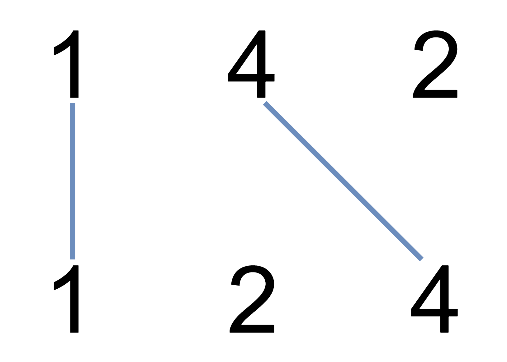

绘制连接两个数字 `nums1[i]` == `nums2[j]` 的直线，且直线不能相交，就是找有相对顺序的公共子序列，与1143题一样，代码中字符串改成数组就行

```java
public int maxUncrossedLines(int[] nums1, int[] nums2) {
    int[][] dp = new int[nums1.length + 1][nums2.length + 1];
    for (int i = 1; i <= nums1.length; i++) {
        for (int j = 1; j <= nums2.length; j++) {
            if (nums1[i - 1] == nums2[j - 1])
                dp[i][j] = dp[i - 1][j - 1] + 1;
            else
                dp[i][j] = Math.max(dp[i - 1][j], dp[i][j - 1]);
        }
    }
    return dp[nums1.length][nums2.length];
}
```

##### 【🔥中】[72编辑距离](https://leetcode.cn/problems/edit-distance/)

编辑距离，也称 Levenshtein 距离，指两个字符串之间互相转换的最少修改次数，通常用于在信息检索和自然语言处理中度量两个序列的相似度

> 给你两个单词 `word1` 和 `word2`， 请返回将 `word1` 转换成 `word2` 所使用的最少操作数。
>
> 你可以对一个单词进行如下三种操作：
>
> - 插入一个字符
> - 删除一个字符
> - 替换一个字符

如下图所示，将 `kitten` 转换为 `sitting` 需要编辑 3 步，包括 2 次替换操作与 1 次添加操作；将 `hello` 转换为 `algo` 需要 3 步，包括 2 次替换操作和 1 次删除操作

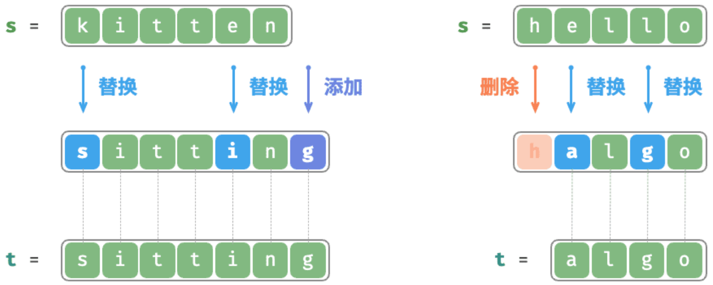

**编辑距离问题可以很自然地用决策树模型来解释**。字符串对应树节点，一轮决策（一次编辑操作）对应树的一条边

如下图所示，在不限制操作的情况下，每个节点都可以派生出许多条边，每条边对应一种操作，这意味着从 `hello` 转换到 `algo` 有许多种可能的路径

从决策树的角度看，本题的目标是求解节点 `hello` 和节点 `algo` 之间的最短路径

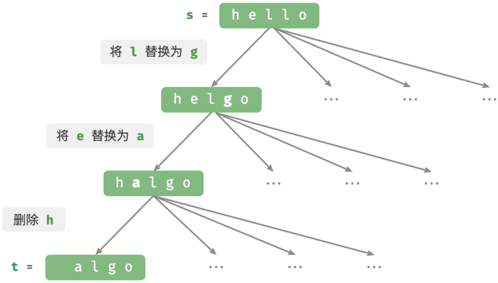

1、**动态规划思路**

**第一步：思考每轮的决策，找到状态和对应的子问题，从而得到 dp 表**

每一轮的决策是对字符串 `word1` 进行一次编辑操作

我们希望在编辑操作的过程中，问题的规模逐渐缩小，这样才能构建子问题。设字符串 `word1` 和 `word2` 的长度分别为 n 和 m，**先考虑两字符串尾部的字符 `word1[n-1]` 和 `word2[m-1]`**

- 若 `word1[n-1]` 和 `word2[m-1]` 相同，可以跳过它们，直接考虑 `word1[n-2]` 和 `word2[m-2]`
- 若 `word1[n-1]` 和 `word2[m-1]` 不同，需要对 `word1` 进行一次编辑（插入、删除、替换），使得两字符串尾部的字符相同，从而可以跳过它们，考虑规模更小的问题

也就是说，我们在字符串 `word1` 中进行的每一轮决策（编辑操作），都会使得 `word1` 和 `word2` 中剩余的待匹配字符发生变化。因此，状态为当前在 `word1` 和 `word2` 中考虑的第 i 和第 j 个字符，记为 [i, j]

状态 [i, j] 对应的子问题：**将 word1 的前 i 个字符更改为 word2 的前 j 个字符所需的最少编辑步数**

至此，得到一个尺寸为 `(i+1)*(j+1)` 的二维 dp 表

**第二步：找出最优子结构，进而推导出状态转移方程**

考虑子问题 dp[i, j]，其对应的两个字符串的尾部字符为 word1[i-1] 和 word2[j-1]，可根据不同编辑操作分为下图所示的三种情况：

1. 在 word1[i-1] 之后添加 word2[j-1]，则剩余子问题 dp[i, j-1]
2. 删除 word1[i-1]，则剩余子问题 dp[i-1, j]
3. 将 word1[i-1] 替换为 word2[j-1]，则剩余子问题 dp[i-1, j-1]

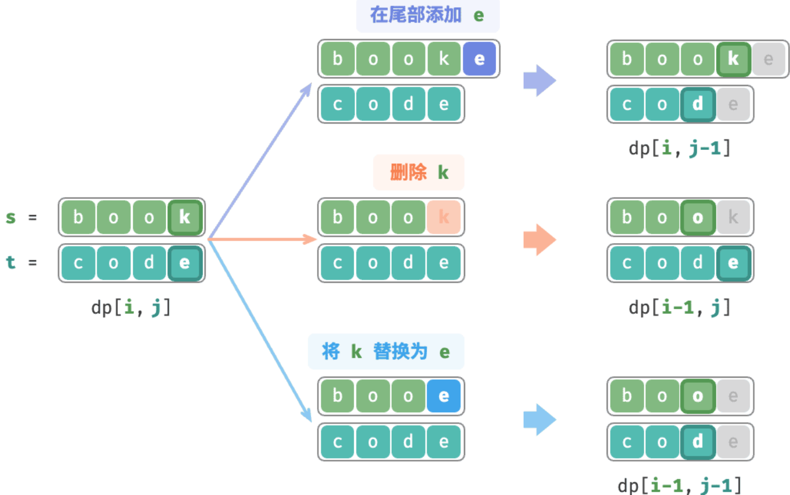

根据以上分析，可得最优子结构：dp[i, j] 的最少编辑步数等于 dp[i, j-1]、dp[i-1, j]、dp[i-1,j-1] 三者中的最少编辑步数，再加上本次的编辑步数 1。对应的状态转移方程为：

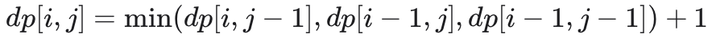

请注意，**当 word1[i-1] 和 word2[j-1] 相同时，无须编辑当前字符**，这种情况下的状态转移方程为：**dp[i, j] = dp[i-1, j-1]**

**第三步：确定边界条件（初始化dp表）和状态转移顺序（遍历顺序）**

边界条件：

* 当两字符串都为空时，编辑步数为 0，即 dp[0, 0] = 0；
* 当 word1 为空但 word2 不为空时，最少编辑步数等于 word2 的长度，即首行 dp[0, j] = j；
* 当 word1 不为空但 word2 为空时，最少编辑步数等于 word1 的长度，即首列 dp[i, 0] = i

遍历顺序：**观察状态转移方程，新状态 dp[i, j] 依赖左方、上方、左上方的状态，因此通过两层循环正序遍历整个 dp 表即可**

2、**代码实现**

```java
/* 编辑距离：动态规划 */
int editDistanceDP(String word1, String word2) {
    int n = word1.length(), m = word2.length();
    // 【定义dp数组】
    int[][] dp = new int[n + 1][m + 1];
    // 【边界条件】首行首列
    for (int i = 1; i <= n; i++) {
        dp[i][0] = i;
    }
    for (int j = 1; j <= m; j++) {
        dp[0][j] = j;
    }
    // 【遍历顺序】其余行和列
    for (int i = 1; i <= n; i++) {
        for (int j = 1; j <= m; j++) {
            // 【状态转移方程】
            // 若两字符相等，则直接跳过此两字符
            if (word1.charAt(i - 1) == word2.charAt(j - 1)) dp[i][j] = dp[i - 1][j - 1];
            // 最少编辑步数 = 插入、删除、替换这三种操作的最少编辑步数 + 1
            else dp[i][j] = Math.min(Math.min(dp[i][j - 1], dp[i - 1][j]), dp[i - 1][j - 1]) + 1;
        }
    }
    return dp[n][m];
}
```

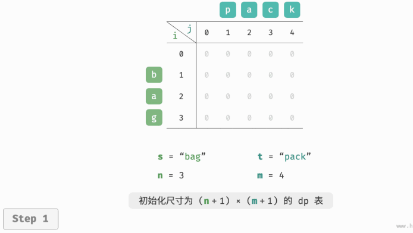

3、**空间优化**

由于 dp[i, j] 是由上方 dp[i-1, j]、左方 dp[i, j-1]、左上方 dp[i-1, j-1] 转移而来的，而正序遍历会丢失左上方 dp[i-1, j-1]，倒序遍历无法提前构建 dp[i, j-1]，因此两种遍历顺序都不可取

可以使用一个变量 `leftup` 来暂存左上方的解 ，从而只需考虑左方和上方的解。此时的情况与完全背包问题相同，可使用正序遍历：

```java
/* 编辑距离：空间优化后的动态规划 */
int editDistanceDPComp(String word1, String word2) {
    // 【定义dp数组】
    int n = word1.length(), m = word2.length();
    int[] dp = new int[m + 1];
    // 【边界条件】首行
    for (int j = 1; j <= m; j++) dp[j] = j;
    // 【遍历顺序】其余行
    for (int i = 1; i <= n; i++) {
        // 【边界条件】首列
        int leftup = dp[0]; // 暂存 dp[i-1, j-1]
        dp[0] = i;
        // 其余列
        for (int j = 1; j <= m; j++) {
            int temp = dp[j];
            // 若两字符相等，则直接跳过此两字符
            if (word1.charAt(i - 1) == word2.charAt(j - 1)) dp[j] = leftup;
            // 最少编辑步数 = 插入、删除、替换这三种操作的最少编辑步数 + 1
            else dp[j] = Math.min(Math.min(dp[j - 1], dp[j]), leftup) + 1;
            leftup = temp; // 更新为下一轮的 dp[i-1, j-1]
        }
    }
    return dp[m];
}
```

#### 回文子序列（区间类）

这类问题通常要求子序列具有对称性

- 状态 `dp[i][j]` 表示**区间 `[i, j]` 内**的最优解。
- **核心逻辑**：看两头（`i` 和 `j`），如果两头相等，就向中间收缩；如果不等，就尝试去掉一头

##### [中 647回文子串](https://leetcode.cn/problems/palindromic-substrings/description/)（连续回文子序列数目）

> 给你一个字符串 `s` ，请你统计并返回这个字符串中 **回文子串** 的数目。
>
> **回文字符串** 是正着读和倒过来读一样的字符串。
>
> **子字符串** 是字符串中的由连续字符组成的一个序列。
>
> ```
> 输入：s = "abc"
> 输出：3
> 解释：三个回文子串: "a", "b", "c"
> ```
>
> ```
> 输入：s = "aaa"
> 输出：6
> 解释：6个回文子串: "a", "a", "a", "aa", "aa", "aaa"
> ```

**回文子串是连续的，回文子序列不一定是连续的**

布尔类型的dp[i] [j]：表示区间范围 [i,j] （注意是左闭右闭）的子串是否是回文子串

状态转移方程：在确定递推公式时，要分析两种情况，

* 当 s[i] 与 s[j] 不相等，dp[i] [j] 一定是false，继续遍历

* 当 s[i] 与 s[j] 相等，有如下三种情况，

  - 情况一：下标 i 与 j 相同，同一个字符例如 a，当然是回文子串

  - 情况二：下标 i 与 j 相差1，例如 aa，也是回文子串

  - 情况三：下标 i 与 j 相差大于1，例如 cabac，此时就看 aba 是不是回文，也就是 i+1 到 j-1区间是不是回文

边界条件：dp[i] [j] 初始化为false

遍历顺序：从递推公式中可以看出，情况三是根据 dp[i + 1] [j - 1] 是否为 true，再对 dp[i] [j] 进行赋值，dp[i + 1] [j - 1] 在 dp[i] [j] 的左下角，如图：

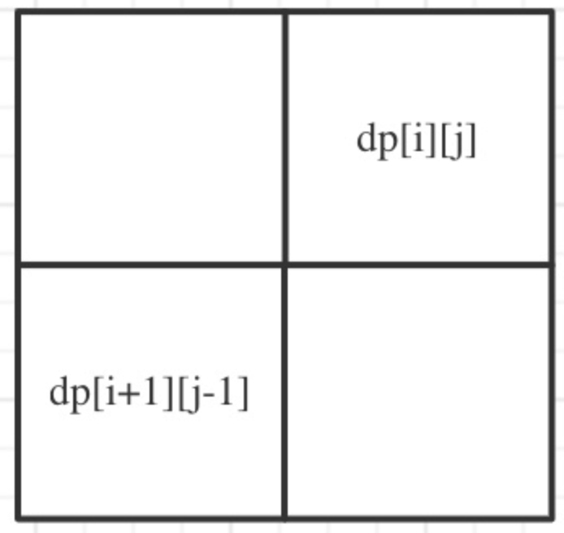

**所以一定要从下到上，从左到右遍历，保证 dp[i + 1] [j - 1] 都是经过计算的**

```java
public int countSubstrings(String s) {
    char[] chars = s.toCharArray();
    int len = chars.length;
    boolean[][] dp = new boolean[len][len];
    int result = 0;
    for (int i = len - 1; i >= 0; i--) { // 从下到上
        for (int j = i; j < len; j++) { // 从左到右
            if (chars[i] == chars[j]) {
                if (j - i <= 1) { // 情况一和情况二
                    result++;
                    dp[i][j] = true;
                } else if (dp[i + 1][j - 1]) { //情况三
                    result++;
                    dp[i][j] = true;
                }
            }
        }
    }
    return result;
}
```

```java
public int countSubstrings(String s) {
    boolean[][] dp = new boolean[s.length()][s.length()];
    int res = 0;
    for (int i = s.length() - 1; i >= 0; i--) {
        for (int j = i; j < s.length(); j++) {
            // 简化代码
            if (s.charAt(i) == s.charAt(j) && (j - i <= 1 || dp[i + 1][j - 1])) {
                res++;
                dp[i][j] = true;
            }
        }
    }
    return res;
}
```

##### 【🔥中】[5最长回文子串](https://leetcode.cn/problems/longest-palindromic-substring/)（最长连续回文子序列）

> 给你一个字符串 `s`，找到 `s` 中最长的 回文子串。
>
> ```
> 输入：s = "babad"
> 输出："bab"
> 解释："aba" 同样是符合题意的答案。
> ```

```java
public String longestPalindrome(String s) {
    int len = s.length();
    // 【定义dp数组】dp[i][j] 表示 s[i...j] 是否是回文串
    boolean[][] dp = new boolean[len][len];
    int maxLen = 1; // 记录最长回文子串的长度
    int begin = 0;  // 记录最长回文子串的起始下标
    // 【遍历顺序】
    // i 从后往前，j 从 i 往后，保证计算 dp[i][j] 时，dp[i+1][j-1] 已经计算过
    for (int i = len - 1; i >= 0; i--) {
        for (int j = i ; j < len; j++) {
            // 如果两端字符相等
            if (s.charAt(i) == s.charAt(j)) {
                // 情况一和情况二
                if (j - i <= 1) dp[i][j] = true;
                // 情况三
                else dp[i][j] = dp[i + 1][j - 1];
            }
            // 如果两端字符不相等，默认为 false（这是与子序列最大的区别）
          	
            // 【记录结果】只要 s[i...j] 是回文，且长度更长，就更新结果
            if (dp[i][j] && (j - i + 1) > maxLen) {
                maxLen = j - i + 1;
                begin = i;
            }
        }
    }
    return s.substring(begin, begin + maxLen);
}
```

##### [中 516最长回文子序列](https://leetcode.cn/problems/longest-palindromic-subsequence/description/)

> 给你一个字符串 `s` ，找出其中最长的回文子序列，并返回该序列的长度。
>
> 子序列定义为：不改变剩余字符顺序的情况下，删除某些字符或者不删除任何字符形成的一个序列。

```java
public int longestPalindromeSubseq(String s) {
    int len = s.length();
    int[][] dp = new int[len][len];
    for (int i = 0; i < len; i++) dp[i][i] = 1;
    for (int i = len - 1; i >= 0; i--) {
        for (int j = i + 1; j < len; j++) {
            // j-i=1的情况隐含在里面，长度为0+2
            if (s.charAt(i) == s.charAt(j)) dp[i][j] = dp[i + 1][j - 1] + 2;
            else dp[i][j] = Math.max(dp[i + 1][j], Math.max(dp[i][j], dp[i][j - 1]));
        }
    }
    return dp[0][len - 1];
}
```


