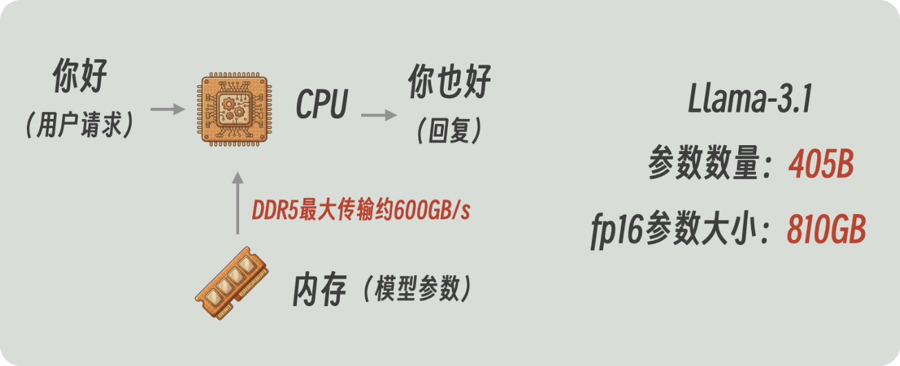
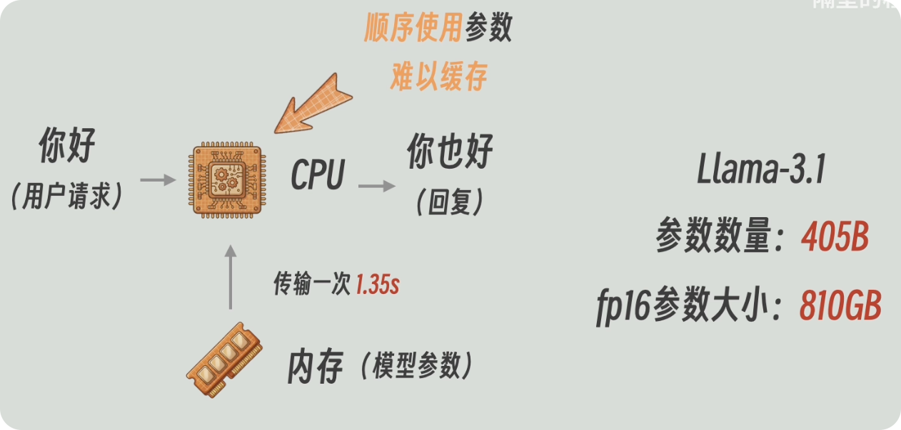
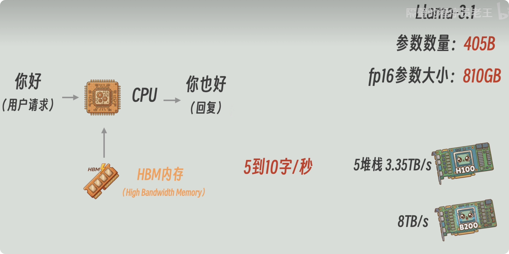
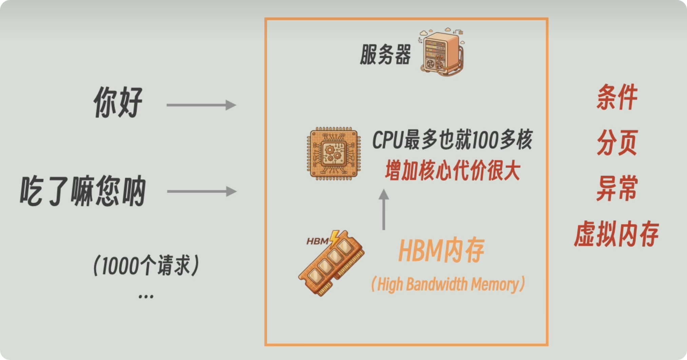
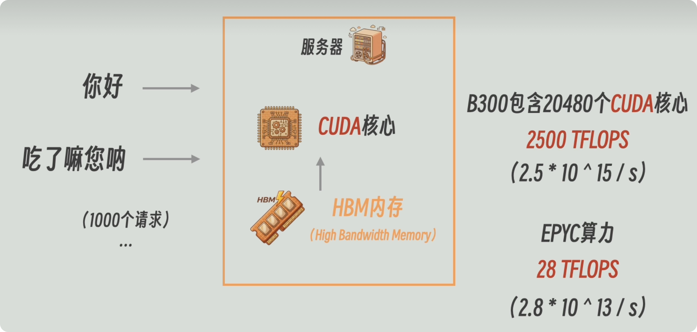
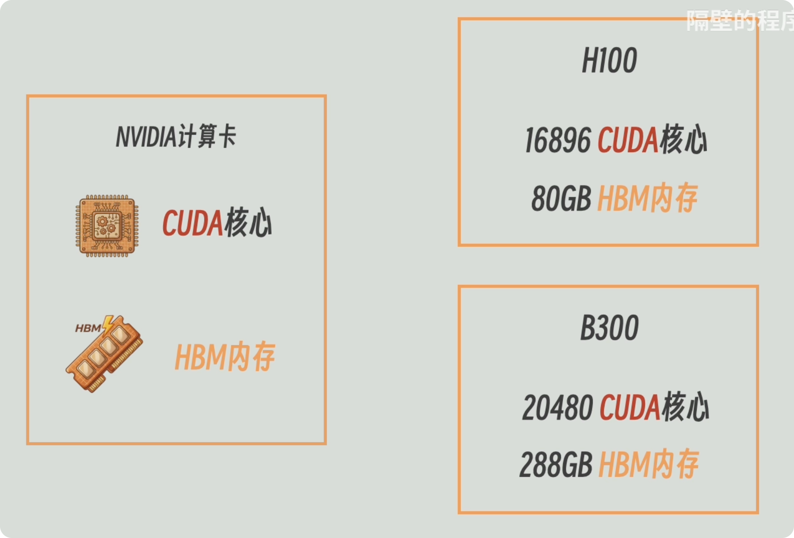
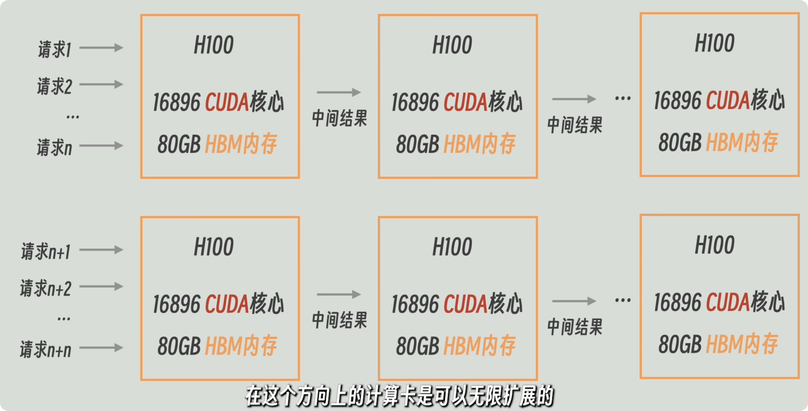
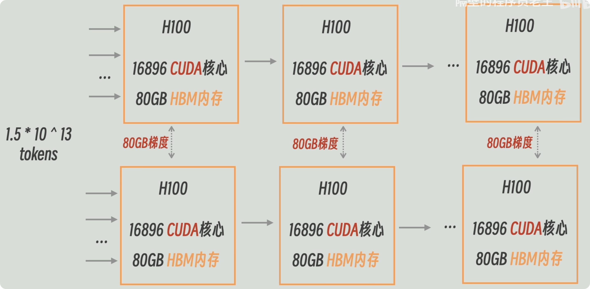
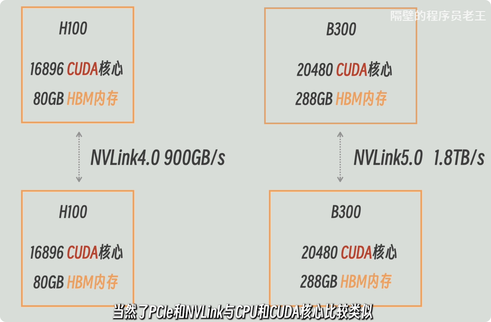
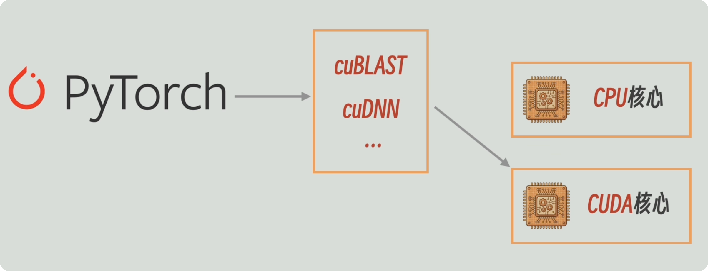

# 英伟达的护城河究竟是什么——从硬件 GPU 到软件库

> 参考视频：[BV1MjN16oE84](https://www.bilibili.com/video/BV1MjN16oE84/)

## 结论

大模型的计算，CPU 也会做。真正的瓶颈在别处：单请求生成时，每产出一个 token 都要把所有参数从内存里读一遍——算力绰绰有余，带宽不够。

所以计算卡的第一个动作不是堆核心，而是把高带宽内存（HBM）和大量并行算术单元封在同一块板上，先把「读得动」解决掉；再解决「算得动」——同时处理很多请求，或一批训练数据。一张卡放不下模型时，推理按层切到多张卡、按请求复制多组卡；训练还要在这些卡之间传梯度。

到今天，CUDA 核心、HBM 容量、卡间带宽这三层硬件都已经有同量级的对手。难替代的是 PyTorch 底下那层由 cuBLAS、cuDNN、NCCL 等组成的软件——框架的默认快路径长在这上面，别人得重新走一遍。

## 一、一次推理，瓶颈在带宽不在算力

以 Llama 3.1 405B、FP16 为例。4050 亿个参数、每个 2 字节，权重一共 810 GB。生成每个 token 时这些参数至少各参加一次乘加，所以每步约 \(8.1 \times 10^{11}\) 次浮点运算。

**先看算力够不够。** AMD EPYC 9965 有 192 核、2.25 GHz，FP32 理论峰值

\[
192 \times 2.25 \times 32 = 13.8 \text{ TFLOPS}
\]

除以每 token 的计算量，约 17 token/秒。算力不是瓶颈。

**再看读一遍参数要多久。** EPYC 平台是 12 通道 DDR5，理论峰值约

\[
6400 \times 8 \times 12 = 614 \text{ GB/s}
\]

于是 \(810 / 614 \approx 1.35\) 秒——还没有算任何计算时间，对应约 0.74 token/秒。实测的 0.7 token/秒就是这个除法的结果。

缓存救不了这个差距。生成一个 token 时，参数是按模型结构顺序使用的，同一个 token 内几乎不复用；而 CPU 缓存只有几百 MB（EPYC 9965 的 L3 是 384 MB），比 810 GB 小三个数量级。**每生成 1 个 token，就要把 810 GB 再读一遍——这是整条链路的起点。**

> 单位提醒：模型处理的是 token，不是「字」。一个汉字可能是 1 个 token，也可能是 2 到 3 个。看到「字/秒」一律按 token/秒 理解。

### * 参数用什么格式存

浮点数的位分成三段：符号、指数、尾数。指数决定能表示多大的范围，尾数决定在这个范围里能分辨多细。

FP16 是 1 位符号 + 5 位指数 + 10 位尾数，有效数字只有三四位十进制，代价是范围小——训练时梯度容易溢出或下溢。BF16 同样是 16 位，但指数位加满到 8 位、尾数减到 7 位：范围接近 FP32，精度更低，所以训练里更常用。两者都是 2 字节，810 GB 这个账对它们都成立（FP32 要 1620 GB，读一遍 2.7 秒）。

继续往下减字节就是 FP8、INT8、INT4：同样的带宽每秒能读更多参数，同样的显存能装下更大的模型或更长的上下文，代价是误差更大，必须配缩放因子把真实小数映射进这几个位。

| 名称 | 位数 | 符号+指数+尾数 | 大致范围 | 大致十进制精度 | 在这条链路里的位置 |
|---|---:|---|---|---|---|
| FP64 | 64 | 1+11+52 | \(\pm 1.8 \times 10^{308}\) | 15–17 位 | 科学计算。模型训练和推理通常不拿它当主力 |
| FP32 | 32 | 1+8+23 | \(\pm 3.4 \times 10^{38}\) | 约 7 位 | 传统默认格式，也常用来存训练的主权重 |
| TF32 | 计算时 19 位 | 1+8+10 | 同 FP32 的范围 | 接近 FP16 | 英伟达 Tensor Core 的矩阵计算格式，不改变参数存储体积 |
| FP16 | 16 | 1+5+10 | 约 \(\pm 65504\) | 3–4 位 | 算 810 GB 用的格式。推理常用，训练要配 FP32 主权重 |
| BF16 | 16 | 1+8+7 | 接近 FP32 | 2–3 位 | 训练里很常见，范围够，精度更低 |
| FP8 E4M3 | 8 | 1+4+3 | 约 \(\pm 448\) | 1–2 位 | 更省带宽，精度相对高一点，范围更小 |
| FP8 E5M2 | 8 | 1+5+2 | 约 \(\pm 57344\) | 约 1 位 | 范围更大，常用于梯度一类需要范围的数 |
| INT8 | 8 | 整数，不是浮点 | 有符号时 -128 到 127 | 由缩放决定 | 量化推理。真实小数约等于缩放因子乘以整数 |
| INT4 | 4 | 整数 | 有符号时 -8 到 7 | 很低 | 大模型权重量化 |
| NF4 | 4 | 4 位、间距不均匀的浮点 | 16 个离散值 | 很低 | QLoRA 用来存 4 位权重 |

记住三件事就够了：**存储体积只看每个参数几个字节**；**训练看指数位够不够（BF16 比 FP16 稳）**；**所有 TFLOPS 都必须带精度讲**。

## 二、带宽不够，换的是内存不是核心

既然卡在「读 810 GB」，下一步就该提高参数旁边那条带宽。

HBM 比 DDR5 高一个数量级：H100 SXM 是 3.35 TB/s，B200 / B300 是 8 TB/s。套上同一个除法，单请求的上限从 0.74 token/秒 变成

\[
3.35 \text{ TB/s} / 810 \text{ GB} \approx 4 \text{ token/秒}, \qquad
8 \text{ TB/s} / 810 \text{ GB} \approx 10 \text{ token/秒}
\]

HBM 的代价是它走不远：为了维持这个带宽，存储和计算单元之间的线路必须很短，所以 HBM 和计算芯片封在同一块板上，不能像内存条那样插到主板上。**这才是「从 CPU 走到计算卡」的实质——不是核心变多了，而是参数旁边换成了贴在芯片边上的高带宽内存。** 核心数要解决的是下一类问题。

## 三、多个请求：把一次读取摊给很多 token

一个请求时，每个 token 都要把 810 GB 读一遍，而读完只用一次。多个互不相关的请求可以共享同一次读取：把一段参数送进计算单元，同时算很多个请求，再读下一段。读完 810 GB 得到的是 N 个 token，每个请求分摊的读取成本降到 1/N。

瓶颈也随之前移：同一段参数要在被替换掉之前完成 N 份乘加，于是需要大量能同时做乘加的单元。CPU 不适合干这个——它的核心不只是一颗乘法器，还要做条件判断、分页、异常、虚拟内存管理，这些是它跑操作系统和普通程序的前提，而矩阵乘法用不到。**这就是 GPU 的由来：保留大量并行算术单元，砍掉通用控制。** 2006 年的 GeForce 8800 GTX 上已经有了 CUDA，比大模型早得多——是大模型后来把带宽、核心数和卡间互联同时用满，不是 GPU 为大模型而生。

### 那本地只有一个请求，多核不就浪费了

不浪费，分三层看。

**一个 token 内部就有大矩阵。** 405B 的隐藏维度是 16384，一层里就是上万乘上万这一级的乘加，这些乘加可以同时算——核心先切的是这块计算，不是用户数。

**解码和预填充是两件事。** 解码逐个产出 token，受「读权重」限制，核心再多也压不短读权重的时间，这一步靠的是 HBM 的高带宽；预填充把用户输入的整段 prompt 一次算完，很多 token 同时参与、矩阵更大，核心和 Tensor Core 这时才真正吃满。本地一次对话同样有预填充。

**多请求批处理提高的是整机吞吐**，不是单请求能用 GPU 的前提。本地同时跑几个程序也能形成小 batch；只有一个对话时，别指望核心数按倍数生效。

### 显存不只放参数：KV cache

推理还要留下已经算过的 token 的状态。405B 在 FP16 下每个 token 约 0.5 MB，上下文到 128K 时单条请求约 66 GB。所以一个长对话就能把一张卡占满，和并发的请求数无关。

## 四、CUDA 核心和 Tensor Core：两个不同的数

先看结论：一张卡的算力宣传里，**核心数和 TFLOPS 分属两个单元，不能互相换算**。

**Tensor Core 是专做矩阵乘加的单元。** 神经网络里真正吃时间的是大矩阵乘加，这种活整块地算最划算，所以英伟达从 2017 年的 Volta 起，在通用并行核心之外单独放了这套单元——一条指令直接完成一小块矩阵的乘加。宣传里的算力指的就是它：B300 满配 640 个第五代 Tensor Core，按官方口径，FP8 密集 5 PFLOPS、稀疏翻倍到 10 PFLOPS，NVFP4 密集 15 PFLOPS；FP16 不单独标，通常按 FP8 的一半算，即 2.5 PFLOPS，也就是 2500 TFLOPS。

**CUDA 核心是通用的并行算术单元。** 逐元素乘、激活、归一化、索引这些活归它们，一个核心一次处理少量数。B300 满配 160 个 SM、每个 SM 128 个核心，合计 20480 个。

于是有两条用法：

- **核心数不能和 TFLOPS 相除。** 拿 2500 TFLOPS 去除 CPU 的向量峰值，会得到「快 90 倍」这类数——分子是矩阵单元、分母是 CPU 向量单元，精度也不同。能说的只有：做大矩阵乘加时 Tensor Core 远快于 CPU；要报具体倍数，必须连精度、密集还是稀疏一起写。
- **核心数不是算力的代理。** H100 有 16896 个 CUDA 核心，和 B300 的 20480 只差 1.2 倍，矩阵吞吐却差得远。**看算力，先找 Tensor Core 和精度，不要先看核心数。**

| | CUDA 核心 | Tensor Core | 显存 | HBM 带宽 | 卡间互联 |
|---|---|---|---|---|---|
| H100 SXM | 16896 | — | 80 GB | 3.35 TB/s | NVLink 4.0，900 GB/s |
| B300 满配 | 20480 | 640（第五代） | 288 GB HBM3E | 8 TB/s | NVLink 5.0，1.8 TB/s |

## 五、一张卡放不下：推理怎么拆

权重在推理时是分段使用的，所以可以切开。

**流水线并行**：按层切到多张卡，算完一层把激活交给下一张。单 token 的激活很小（405B 的隐藏维度 16384，FP16 下就是 32 KB），走 PCIe 也可以忽略。**张量并行**：把同一层的矩阵切开，每层都要交换部分结果，通信频繁得多。

关键一点：**多卡不是让一个请求快 N 倍。** 同一个 token 必须依次过第 1 张、第 2 张卡，总读取时间仍是「全部权重 / 单卡带宽」——多卡解决的是「放得下」。要让多张卡的带宽同时用上，得靠多个请求或多个 token 在不同层上重叠。

**副本扩展**是另一个方向：一组卡服务一批请求，再复制一组服务另一批，副本之间没有每 token 的数据依赖，所以可以跨机。但并非无限——电力、机房、用户侧网络、每条请求自己的 KV cache 都会先到上限。

## 六、训练：为什么梯度要走网络

训练不是把 15 trillion token 一次并行喂进去，而是反复「取一批 → 算梯度 → 更新一次」。

Llama 3.1 405B 的预训练数据超过 15 trillion token，这表示训练全程见过的总量；一次能进卡的只有一批（大模型的全局 batch 是几十万到几百万 token 这一级）。一个训练步是这样：

1. 取一批数据，分到各卡；
2. 各卡用当前参数做前向和反向，算出自己那部分数据的梯度——**这一步不改参数**；
3. 汇总求平均，优化器用它更新一次参数；
4. 各卡参数重新一致，取下一批。

**梯度不是参数**，它只说明参数该往哪边改、改多少。**一个 batch 更新一次参数，不是每个 token 更新一次。** 总 token 数除以 batch 就是步数（15 trillion / 400 万 ≈ 375 万步）；数据被反复看到，模型才学得动。

单卡也是同一套流程，只是 batch 小（16 条、32 条），显存不够时用**梯度累积**：攒够几个小批的梯度再更新一次。全局 batch = 每卡 batch × GPU 数 × 累积步数。

单卡放不下模型时才有**模型并行**：张量并行切矩阵，流水线并行切层。实际训练常常两种一起用——横向按层串联，纵向复制几组跑不同数据。

**梯度汇总就是卡间通信的来源。** 每张卡要交出的，是自己那份参数对应的梯度：FP16 参数配 FP16 梯度时，这一份和它手上的参数一样大，H100 上就是 80 GB。常用的 all-reduce 在环上做，每张卡实际搬运量约为自己那份的 2 倍。大模型训练用同步更新——等所有卡到齐再更新；异步更新会产生「你的梯度基于旧参数、而参数已被别人改过」的过期梯度，收敛更不稳。

## 七、卡间用什么传：PCIe 与 NVLink

普通显卡之间走 PCIe 5.0，单向 64 GB/s。按每卡 80 GB 梯度算，一次传输约 1.25 秒，算上 all-reduce 的 2 倍仍是秒级——对希望计算与通信重叠的训练来说，这个速度不够。

NVLink 是英伟达的 GPU 间互联：H100 的 NVLink 4.0 是 900 GB/s，B300 的 NVLink 5.0 是 1.8 TB/s。80 GB 走 900 GB/s 只要 0.09 秒，比 PCIe 快一个数量级，「每步汇总一次梯度」才变得可以接受。

但 **NVLink 不是 AI 计算的必经接口**。它解决的是「卡间搬参数级数据」这一步：训练里的梯度汇总、张量并行里的层内交换。推理副本之间不需要它，流水线传几十 KB 激活时 PCIe 也够。

至于「PCIe 像 CPU、NVLink 像 CUDA 核心」这个类比，差距是真的，原因不是「通用所以带了一堆用不上的功能」。PCIe 要兼容各种设备、走更长的插槽和主板线路，链路宽度和协议都按通用外设设计。比较两者时，写明带宽、方向和要搬的数据量就够了。

## 八、硬件追得上，软件换不掉

**硬件这一层确实追上了。** MI355X：16384 个流处理器（对标 CUDA 核心）、1024 个 matrix core，FP16 密集约 2.52 PFLOPS；288 GB HBM3E、8 TB/s，和 B300 同档；Infinity Fabric 聚合带宽约 1075 GB/s，低于 NVLink 5 的 1.8 TB/s；价格比 B300 低。

重点是「算力打平」只在 FP16 密集这个口径下成立。B300 的主推口径是 FP8 5 PFLOPS、NVFP4 15 PFLOPS，MI355X 对应约 5.03 和 10.07 PFLOPS：FP8 接近，4 位格式有差距。**同一张芯片在不同精度、密集或稀疏下数字能差几倍，跨厂商比算力必须先对齐口径。** 而硬件接近、价格更低却卖不动，原因只能在软件。

**软件这一层才是难点。**

PyTorch 写模型结构，张量默认能在 CPU 上算；放到 CUDA 设备上之后，对应的算子才走 GPU——一次训练或推理通常是整张网在 GPU 上，不是「遇到大矩阵才临时丢给 GPU」。这层中间件是英伟达的库：cuBLAS 管基础线性代数，cuDNN 管卷积、归一化这类算子，NCCL 管多卡通信（训练那一步 all-reduce 就是它），再加上 CUTLASS、TensorRT；CPU 路径用的是另一套（oneDNN、MKL、OpenBLAS）。

**这层软件近 20 年积累出的效果是：深度学习框架的默认快路径优先接英伟达这套库，新算法也往往先有 CUDA 实现。** 硬件选择因此被框架的默认路径锁定。这不是某一张卡的性能，是时间。

对手都在处理同一个问题。AMD 的 ROCm 要让对着 CUDA 写的程序尽量能跑，兼容性仍是明显短板。华为昇腾既要另建软件栈或兼容层，又受制程限制，是软件与制程两个约束叠加，不是只差一个驱动。Google TPU 干脆不兼容 CUDA：硬件上 MXU 对标 Tensor Core、ICI 对标 NVLink 的角色，软件上走 OpenXLA 编译栈（JAX / XLA / PyTorch-XLA），代价是能用的框架和芯片更窄——目前主要服务自家 TPU，Gemini 就是用 TPU 训练的，TPU 也不单卖，只在云上租。这条路绕开了「必须兼容 cuDNN」，也放弃了现成的生态。

## Sources

- [Inside NVIDIA Blackwell Ultra](https://developer.nvidia.com/blog/inside-nvidia-blackwell-ultra-the-chip-powering-the-ai-factory-era/)
- [NVIDIA H100](https://www.nvidia.com/en-us/data-center/h100/)
- [NVIDIA Hopper Architecture In-Depth](https://developer.nvidia.com/blog/nvidia-hopper-architecture-in-depth/)
- [AMD：第五代 EPYC 的理论 TFLOPS 算法](https://www.amd.com/en/blogs/2025/leadership-hpc-performance-with-5th-generation-amd.html)
- [AMD EPYC 9965](https://www.amd.com/en/products/processors/server/epyc/9005-series/amd-epyc-9965.html)
- [AMD Instinct MI355X](https://www.amd.com/en/products/accelerators/instinct/mi350/mi355x.html)
- [MI355X 规格页（流处理器、Infinity Fabric 链路）](https://boston.co.uk/content-hub/amd-instinct-mi355x-accelerator/)
- [Meta：Llama 3.1](https://ai.meta.com/blog/meta-llama-3-1/)
