[我的b站追番/追剧](https://space.bilibili.com/521627597/bangumi)

正在看：

:::card{title="FX战士久留美" href="https://zh.wikipedia.org/wiki/FX战士久留美" score="4" label="日漫"}

正在看。
:::

:::card{title="凡人修仙传" href="https://zh.wikipedia.org/wiki/凡人修仙传" score="5" label="国漫"}

正在看。
:::

:::card{title="牧神记" href="https://www.bilibili.com/bangumi/play/ss45969" score="4.5" label="国漫"}

正在看。
:::

准备看的：

:::card{title="葬送的芙莉莲" href="https://zh.wikipedia.org/wiki/葬送的芙莉莲" label="日漫"}

准备看。
:::

:::card{title="进击的巨人" href="https://zh.wikipedia.org/wiki/進擊的巨人" label="日漫"}

准备看。
:::

:::card{title="Charlotte" href="https://zh.wikipedia.org/wiki/Charlotte_(動畫)" label="日漫"}
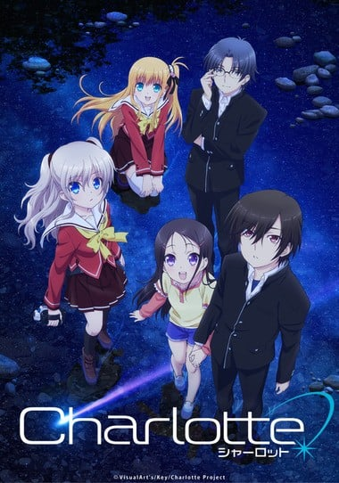

准备看。
:::

:::card{title="无职转生" href="https://zh.wikipedia.org/wiki/無職轉生～到了異世界就拿出真本事～" label="日漫"}
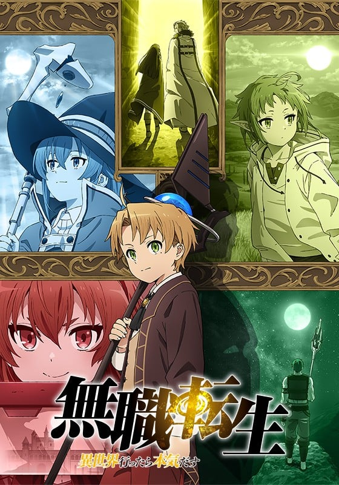

准备看。
:::

:::card{title="命运石之门" href="https://zh.wikipedia.org/wiki/命運石之門" label="日漫"}
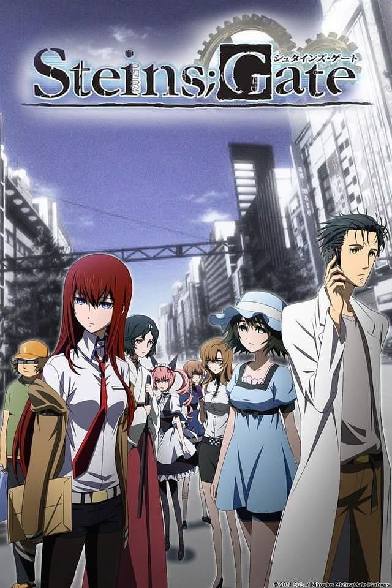

准备看。
:::

:::card{title="东京喰种" href="https://zh.wikipedia.org/wiki/東京喰種" label="日漫"}
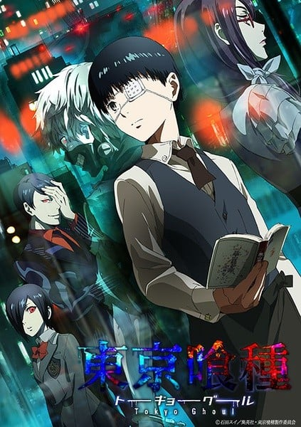

准备看。
:::

:::card{title="咒术回战" href="https://zh.wikipedia.org/wiki/咒術迴戰" label="日漫"}
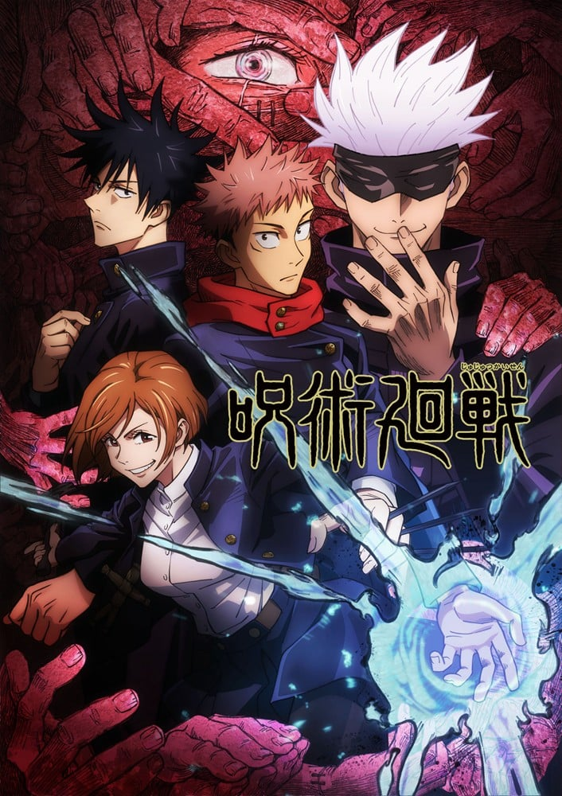

准备看。
:::

:::card{title="中二病也要谈恋爱" href="https://zh.wikipedia.org/wiki/中二病也想談戀愛！" label="日漫"}
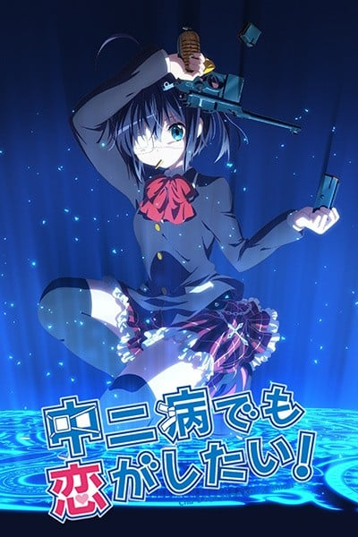

准备看。
:::

:::card{title="月刊少女野崎君" href="https://zh.wikipedia.org/wiki/月刊少女野崎同學" label="日漫"}
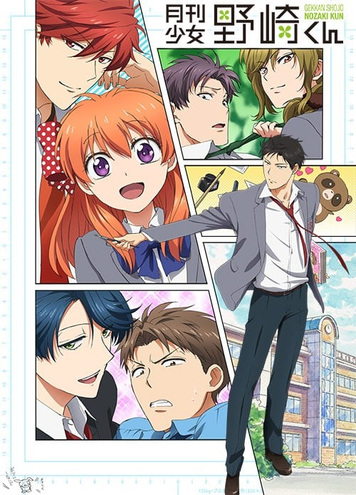

准备看。
:::

:::card{title="奇幻世界舅舅" href="https://zh.wikipedia.org/wiki/異世界歸來的舅舅" label="日漫"}
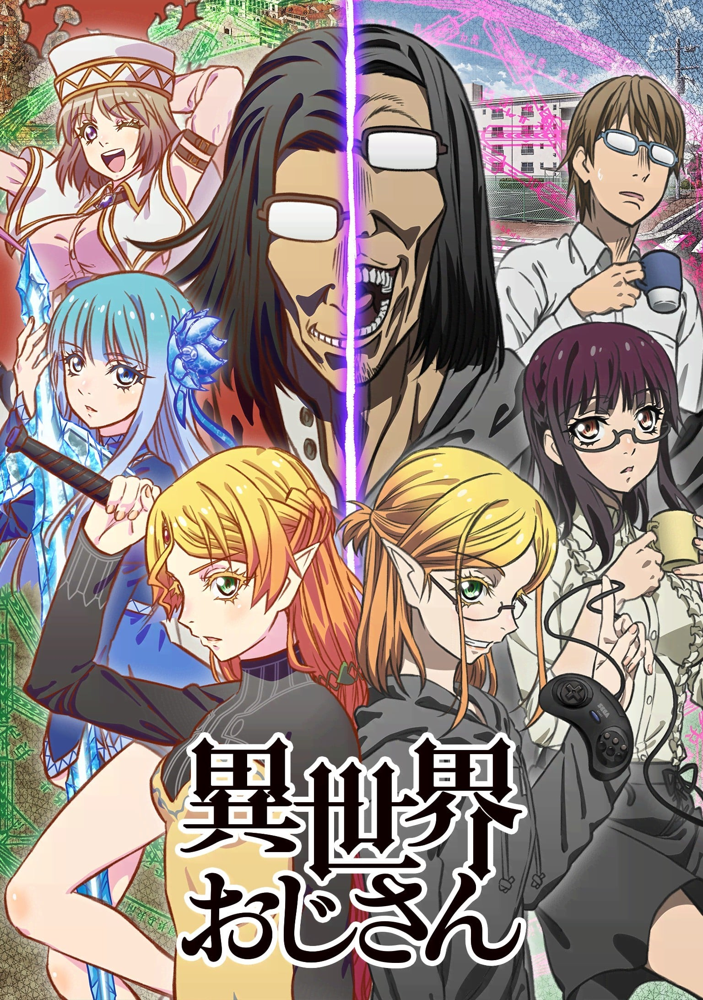

准备看。
:::

:::card{title="男子高中生的日常" href="https://zh.wikipedia.org/wiki/男子高中生的日常" label="日漫"}
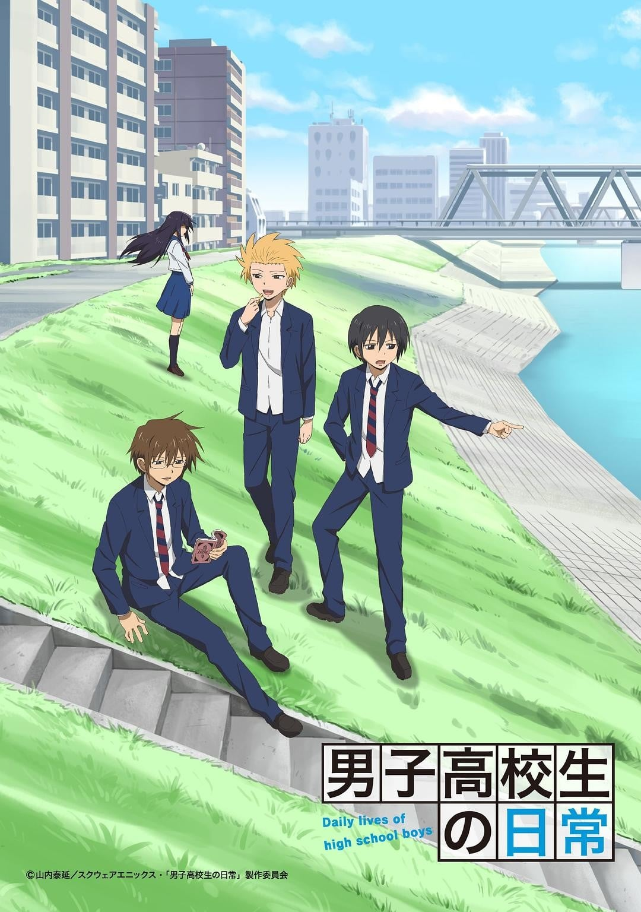

准备看。
:::

:::card{title="灵能百分百" href="https://zh.wikipedia.org/wiki/路人超能100" label="日漫"}
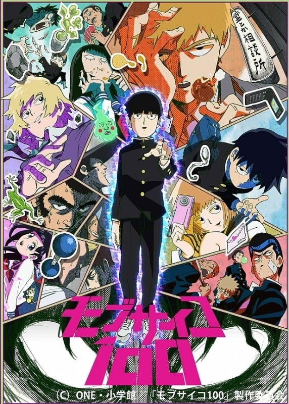

准备看。
:::

日漫：

:::card{title="EVA 新世纪福音战士" href="https://zh.wikipedia.org/wiki/新世纪福音战士" score="5" label="日漫"}
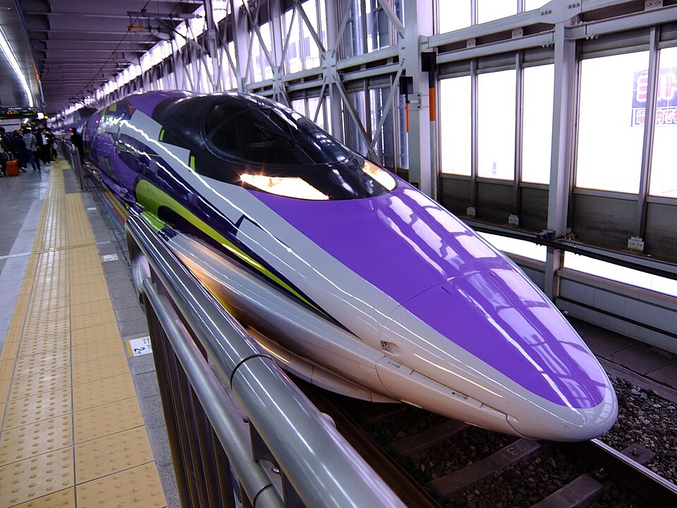

少年开机甲，真正难的是驾驶舱里的人。补完和电视结局可以分开看，都刺。
:::

:::card{title="冰菓" href="https://zh.wikipedia.org/wiki/冰菓" score="5" label="日漫"}

古籍研究会接一些很小的谜。青春片，但推理收得干净。
:::

:::card{title="赛马娘" href="https://zh.wikipedia.org/wiki/赛马娘_Pretty_Derby" score="5" label="日漫"}
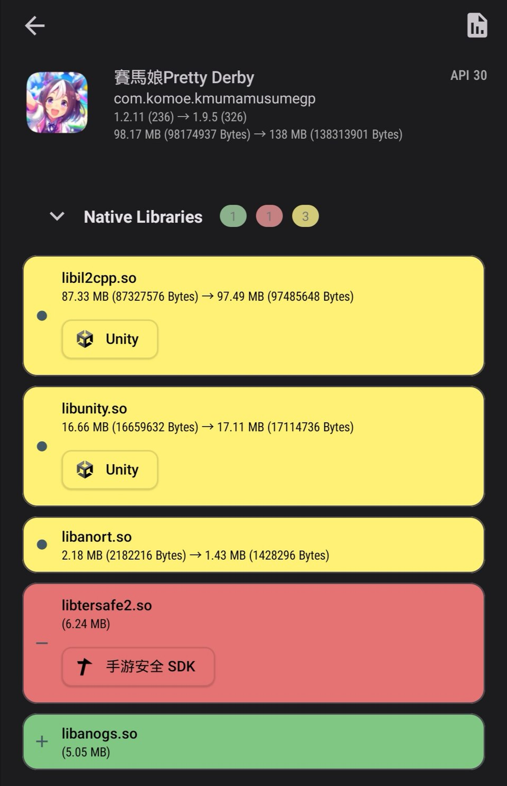

马娘训练、比赛、再训练。热血得很直，赢的那场还是会吼出来。
:::

:::card{title="某科学的超电磁炮" href="https://zh.wikipedia.org/wiki/某科学的超电磁炮" score="5" label="日漫"}
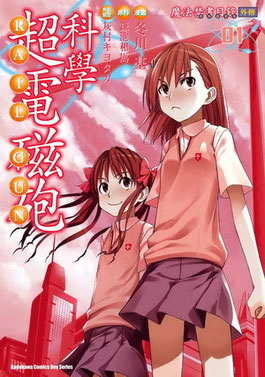

学园都市里御坂美琴的日常和能力战斗。比本篇更轻松，打架仍然好看。
:::

:::card{title="魔法禁书目录" href="https://zh.wikipedia.org/wiki/魔法禁书目录" score="5" label="日漫"}
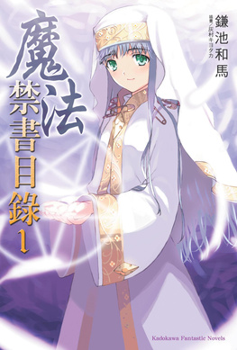

当麻右手专门抓魔法。设定很多，学园都市的乱劲也是看点。
:::

:::card{title="紫罗兰永恒花园" href="https://zh.wikipedia.org/wiki/紫罗兰永恒花园" score="5" label="日漫"}

自动手记人偶替人写信。每集一个委托人，画面和「爱」这个词一起慢慢懂。
:::

:::card{title="青春猪头少年不会梦到兔女郎学姐" href="https://zh.wikipedia.org/wiki/青春猪头少年不会梦到兔女郎学姐" score="5" label="日漫"}
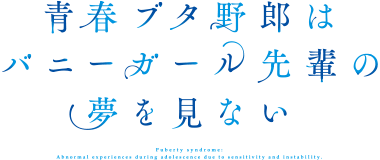

我的入门番。青春期症候群把心事变成看得见的异常，樱岛学姐那条线很完整。
:::

:::card{title="我独自升级" href="https://zh.wikipedia.org/wiki/我独自升级" score="4" label="日漫"}
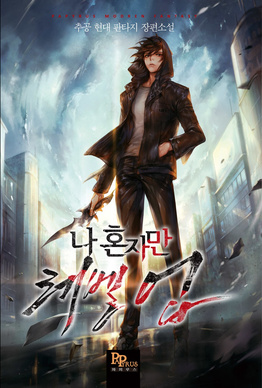

最弱猎人进副本升级。打怪很爽，系统提示也干脆。
:::

:::card{title="ReLIFE" href="https://zh.wikipedia.org/wiki/ReLIFE" score="4.5" label="日漫"}
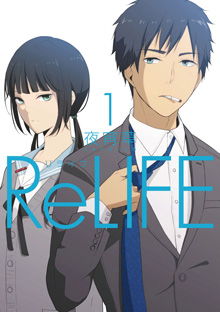

失败的大人吃了药回到高中。重来一次不是开挂，是把当时没说的话说出来。
:::

:::card{title="来自深渊" href="https://zh.wikipedia.org/wiki/来自深渊" score="4.5" label="日漫"}
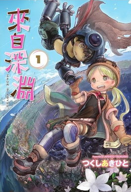

深渊往下越来越好看，也越来越狠。可爱画风和后面的代价反差很大。
:::

:::card{title="月色真美" href="https://zh.wikipedia.org/wiki/月色真美" score="5" label="日漫"}
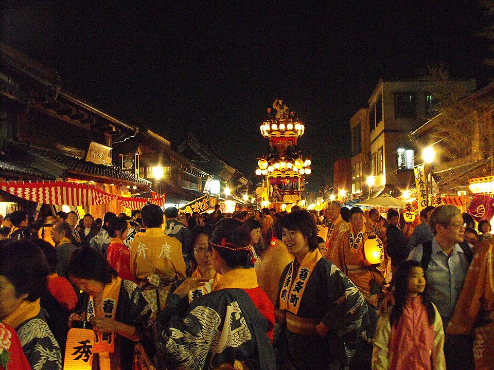

很安静的校园恋爱。告白之后的日子比告白本身写得细。
:::

:::card{title="孤独摇滚" href="https://zh.wikipedia.org/wiki/孤獨搖滾！" score="4" label="日漫"}
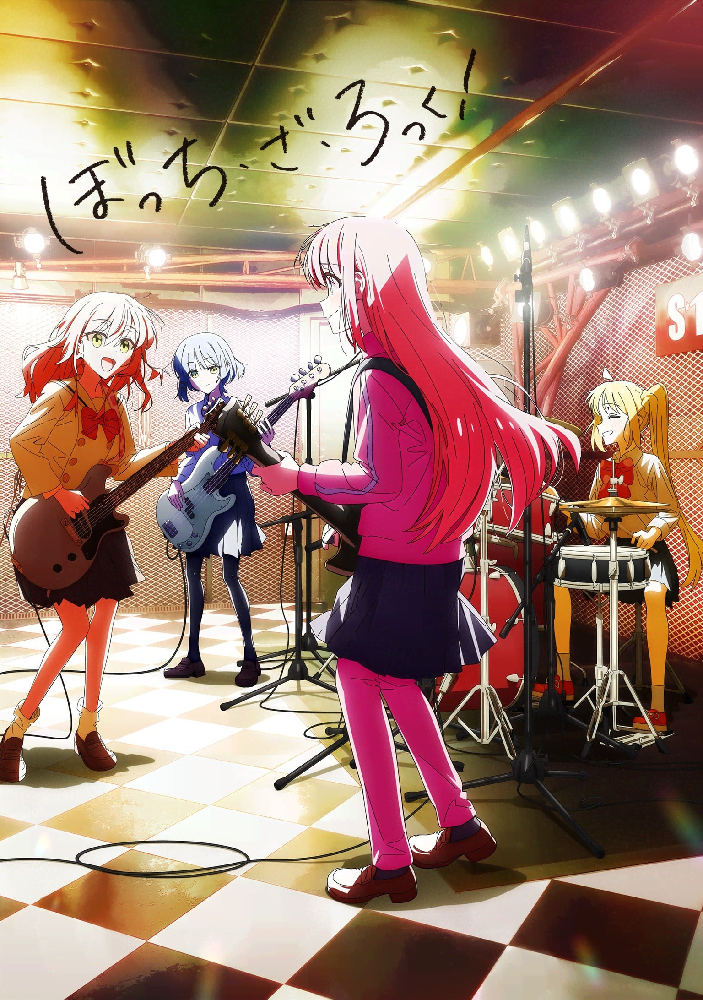

社恐吉他手被拉进乐队。演出和内心戏都好，笑点也密。
:::

:::card{title="未闻花名" href="https://zh.wikipedia.org/wiki/我們仍未知道那天所看見的花名" score="4" label="日漫"}
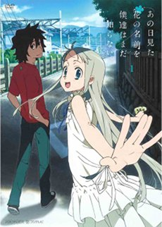

一群小时候的朋友，和那个已经不在的人。超自然是引子，后悔才是正文。
:::

:::card{title="路人女主的养成方法" href="https://zh.wikipedia.org/wiki/路人女主的養成方法" score="4" label="日漫"}
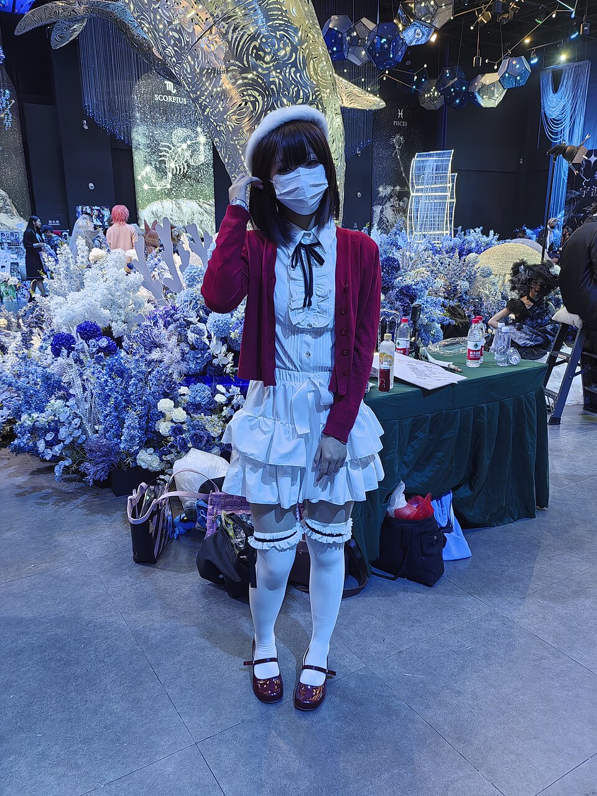

用游戏攻略的方式追校园剧女主。后宫壳，创作和选择还有一点真东西。
:::

:::card{title="异世界迷宫黑心企业" href="https://www.bilibili.com/bangumi/play/ss38934" score="4.5" label="日漫"}
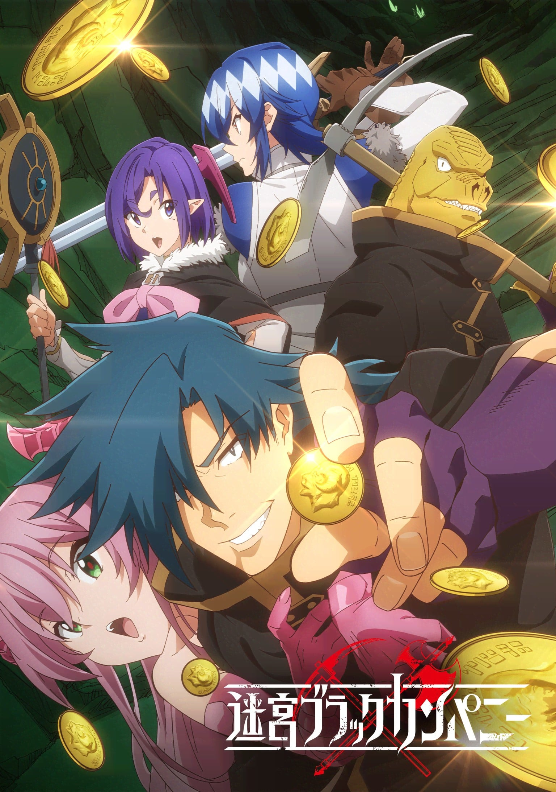

标题很糟糕，里面其实在骂黑心公司和加班。迷宫是下班之后的事。
:::

:::card{title="判处勇者刑" href="https://www.bilibili.com/bangumi/play/ss127870" score="4" label="日漫"}
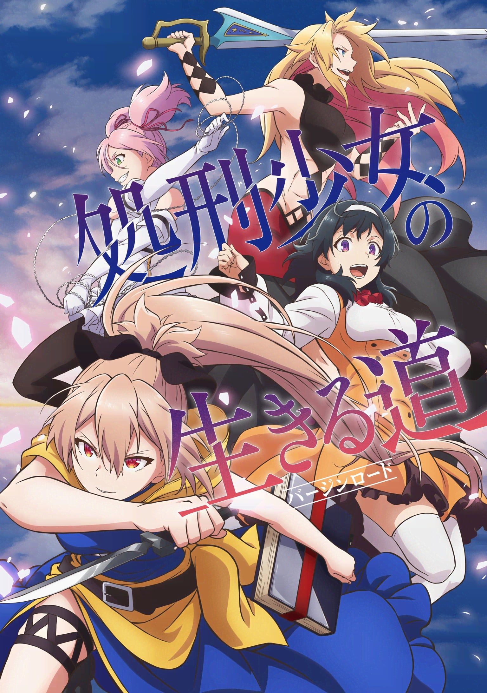

罪犯被判处“勇者刑”，被迫在前线战斗，死后仍会复活继续服刑。
:::

:::card{title="夏日重现" href="https://zh.wikipedia.org/wiki/夏日重現" score="4" label="日漫"}

回到有影子的夏天，同一段时间反复走。悬疑比恋爱重。
:::

:::card{title="我的青春恋爱物语果然有问题" href="https://zh.wikipedia.org/wiki/我的青春恋爱物语果然有问题" score="4" label="日漫"}
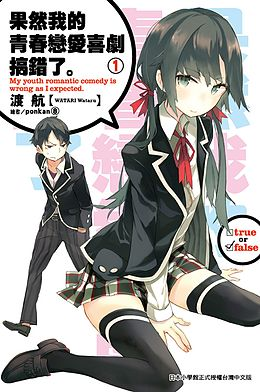

比企谷不想加入那种闪亮的青春。对话刺，但三个人的关系是真的。
:::

:::card{title="我们的重制人生" href="https://www.bilibili.com/bangumi/play/ss38865" score="3" label="日漫"}

重来一次的青春群像。想法有，执行比较平。
:::

:::card{title="堀与宫村" href="https://zh.wikipedia.org/wiki/堀與宮村" score="3" label="日漫"}
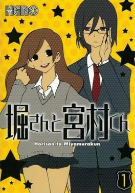

外表和家里完全两样的两个人。甜，剧情比较直。
:::

:::card{title="总之就是非常可爱" href="https://zh.wikipedia.org/wiki/總之就是非常可愛" score="3.5" label="日漫"}
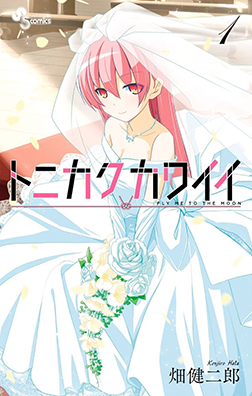

情侣日常，每集一个小场面。可爱是目的，别的不多。
:::

:::card{title="平家物语" href="https://zh.wikipedia.org/wiki/平家物语" score="4" label="日漫"}
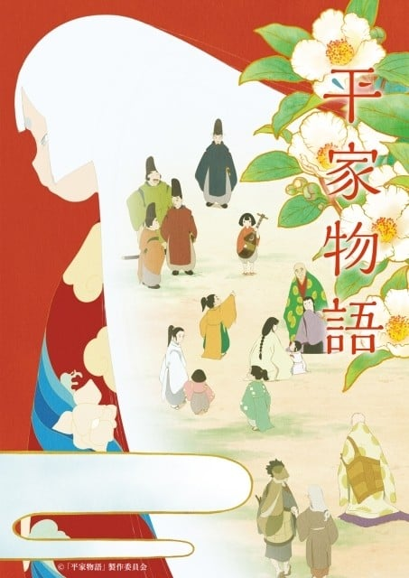

山田尚子拍平家衰落。史诗被收成一个人眼里的季节。
:::

:::card{title="转生成蜘蛛又怎样" href="https://zh.wikipedia.org/wiki/轉生成蜘蛛又怎樣！" score="4" label="日漫"}
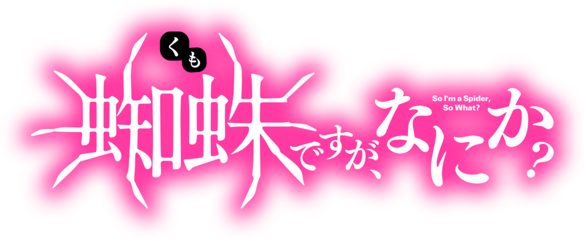

转生成迷宫里的蜘蛛，先活下来再说。升级和吐槽比剧情好用。
:::

:::card{title="赛博朋克边缘行者" href="https://zh.wikipedia.org/wiki/赛博浪客" score="5" label="日漫"}
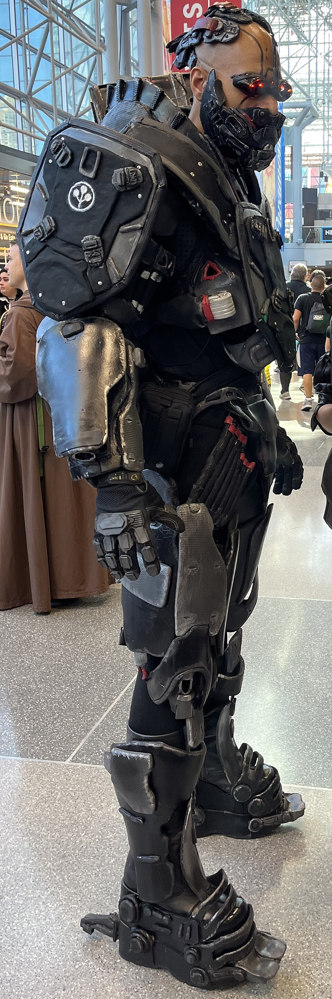

夜之城边缘的一小队人。很短，戴维和露西那条线收得很狠。
:::

:::card{title="86 不存在的战区" href="https://zh.wikipedia.org/wiki/86—不存在的戰區—" score="4.5" label="日漫"}

墙外的人和墙内的指挥。战争、种族和那台机甲都没有轻松写。
:::

:::card{title="电锯人" href="https://zh.wikipedia.org/wiki/鏈鋸人" score="4" label="日漫"}
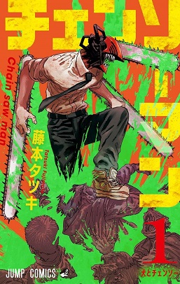

恶魔猎人电次想过普通生活。暴力和感情都很冲。
:::

:::card{title="败犬女主太多了" href="https://zh.wikipedia.org/wiki/敗犬女主太多了！" score="4" label="日漫"}

明知自己不是女主，还是要说完那句话。恋爱喜剧里少见地把输赢写清楚。
:::

:::card{title="我推的孩子" href="https://zh.wikipedia.org/wiki/【我推的孩子】" score="4" label="日漫"}
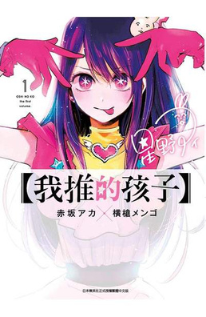

偶像产业的光和后面的案子。第一集的反转撑起了后面。
:::

:::card{title="Re：从零开始的异世界生活" href="https://zh.wikipedia.org/wiki/Re:從零開始的異世界生活" score="4" label="日漫"}
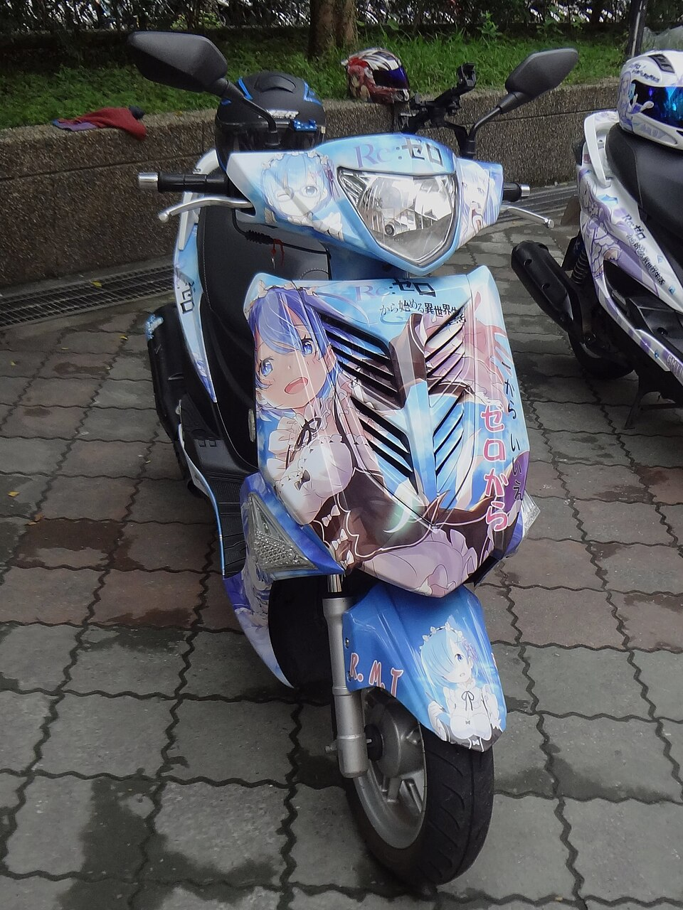

死亡回溯。菜月昴每次重来都要再痛一次，不是无代价的外挂。
:::

:::card{title="尼古喵喵" href="https://zh.wikipedia.org/wiki/尼古喵喵" score="4" label="日漫"}
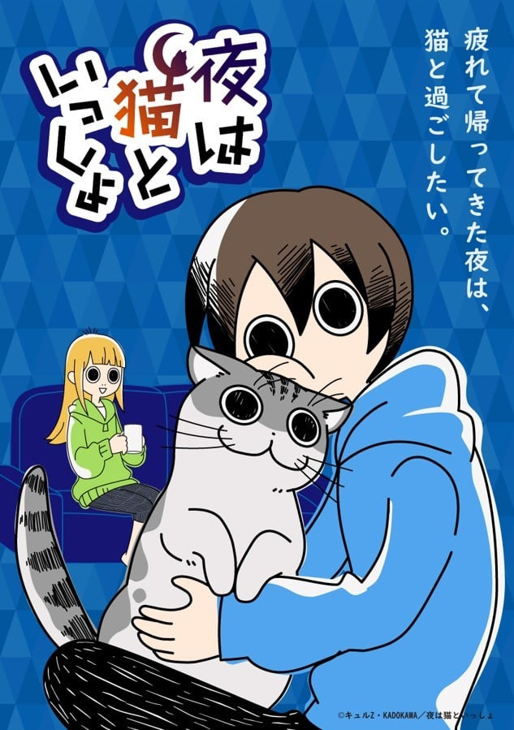

很短的猫咪日常。没有剧情负担，就看那只猫怎么占住夜晚。
:::

国漫：

:::card{title="灵笼" href="https://zh.wikipedia.org/wiki/灵笼" score="5" label="国漫"}
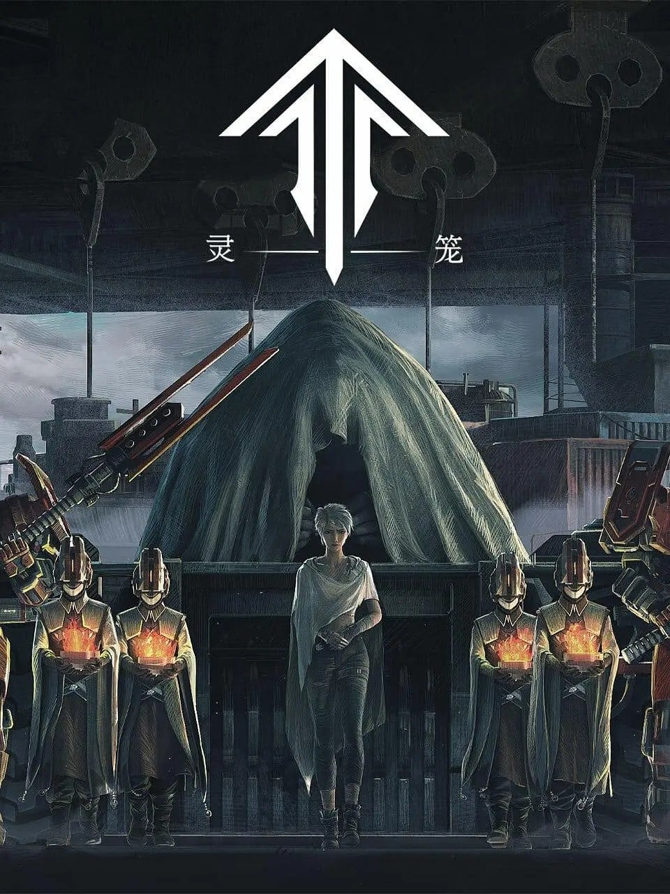

灯塔外面是怪物，里面是阶级。设定和人祸绑在一起，不是只好看。
:::

:::card{title="大道朝天" href="https://www.bilibili.com/bangumi/play/ss43369" score="4.5" label="国漫"}
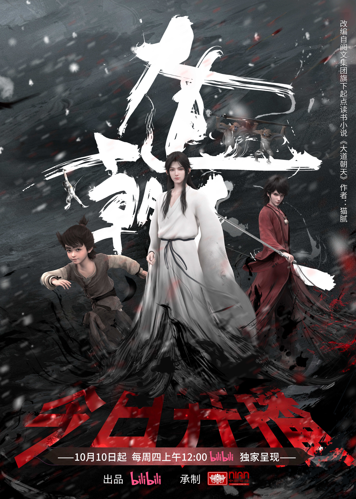

猫腻那条线上的修行故事。世界观大，人还是在问自己要走哪条路。
:::

:::card{title="镇魂街" href="https://zh.wikipedia.org/wiki/镇魂街" score="4.5" label="国漫"}
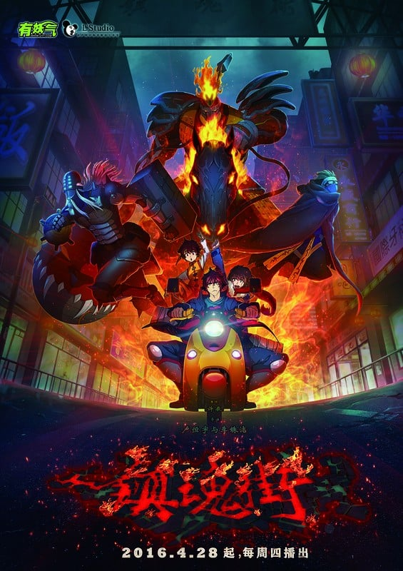

守护灵和镇魂将。热血打戏直给，人设也记得住。
:::

:::card{title="雾山五行" href="https://zh.wikipedia.org/wiki/雾山五行" score="5" label="国漫"}
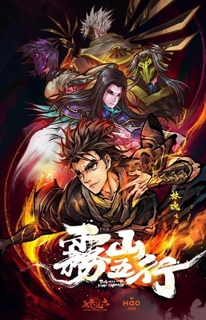

水墨打戏。几乎不靠台词，动作本身就把五行讲完了。
:::

:::card{title="刺客伍六七" href="https://zh.wikipedia.org/wiki/刺客伍六七" score="4.5" label="国漫"}
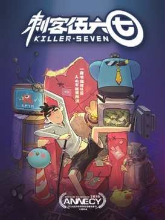

理发师兼刺客。前两季笑话密，后面感情重了一点。
:::

:::card{title="大理寺日志" href="https://www.bilibili.com/bangumi/play/ss32321" score="5" label="国漫"}
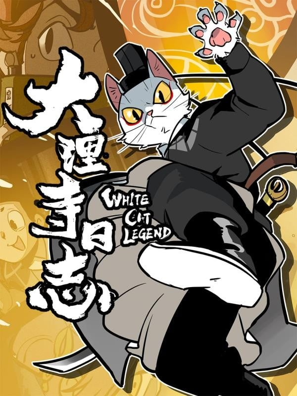

白猫和少卿查案。唐风市井画得很松，案子也不傻。
:::

:::card{title="罗小黑战记" href="https://zh.wikipedia.org/wiki/罗小黑战记" score="5" label="国漫"}
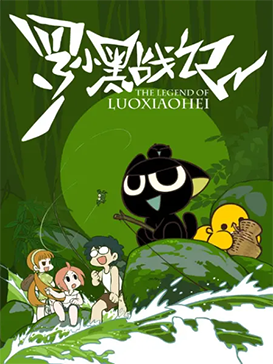

妖精、人类和那只黑猫。电影和番都安静，冲突却是真的。
:::

:::card{title="中国惊奇先生" href="https://zh.wikipedia.org/wiki/中国惊奇先生" score="5" label="国漫"}
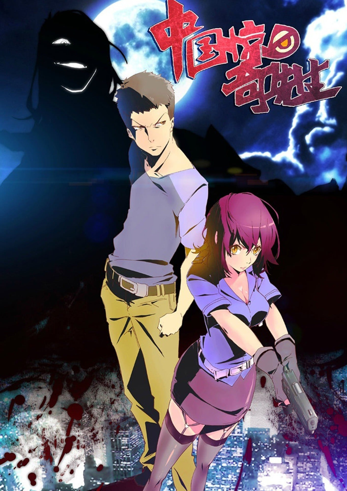

民间怪谈一条条讲。气氛和包袱都在，适合当长一点的志怪。
:::

:::card{title="仙王的日常生活" href="https://zh.wikipedia.org/wiki/仙王的日常生活" score="3.5" label="国漫"}
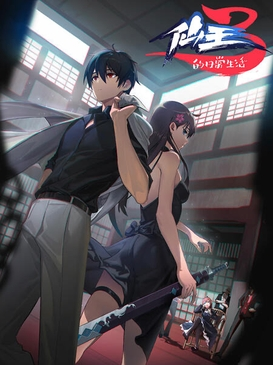

大能重生去上学。日常段子为主，主线比较散。
:::

:::card{title="咸鱼哥" href="https://www.bilibili.com/bangumi/play/ss43341" score="4" label="国漫"}
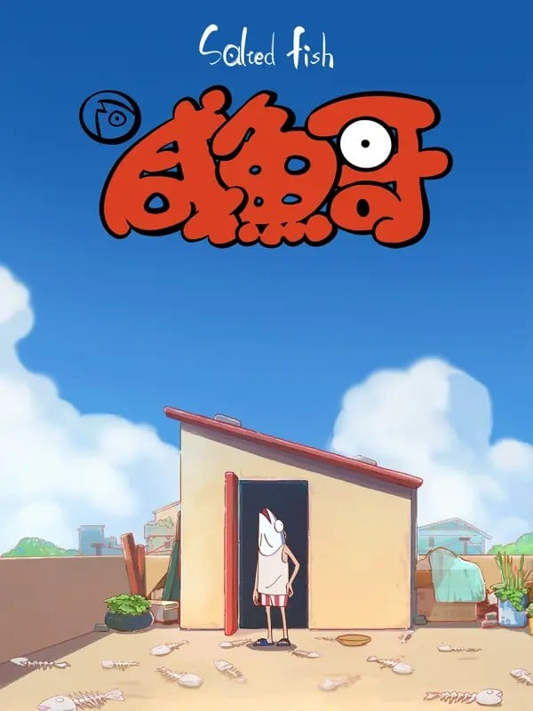

想躺平的人被卷进各种事。笑话接地气，不端着。
:::

动漫电影：

:::card{title="你的名字" href="https://zh.wikipedia.org/wiki/你的名字。" score="5" label="动画电影"}

新海诚的身体交换。彗星和那条时间差，仍然是最完整的一部。
:::

:::card{title="天气之子" href="https://zh.wikipedia.org/wiki/天气之子" score="5" label="动画电影"}

少年遇上能改变天气的女孩。东京的雨下得很满，选择也很绝。
:::

:::card{title="声之形" href="https://zh.wikipedia.org/wiki/声之形" score="5" label="动画电影"}
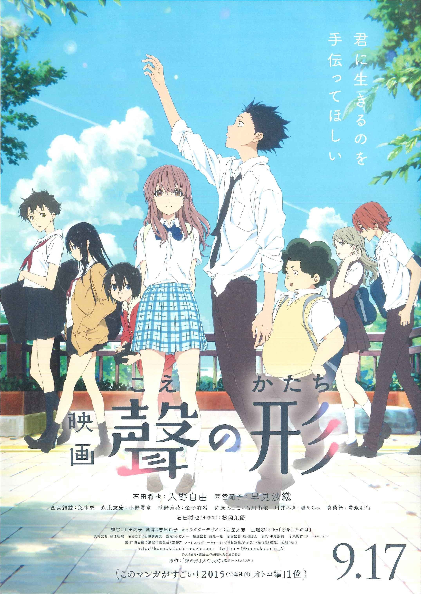

霸凌过的人回来道歉。不好看的地方它不躲，所以才成立。
:::

:::card{title="言语如苏打般涌现" href="https://www.bilibili.com/bangumi/play/ss39136" score="4" label="动画电影"}
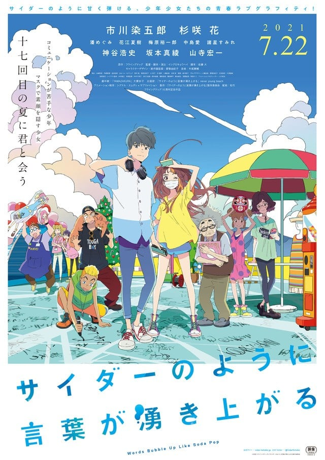

樱井和樱桃的对话像汽水。很轻，但把「说出来」这件事写疼了。
:::

:::card{title="风之谷" href="https://zh.wikipedia.org/wiki/風之谷" score="5" label="动画电影"}
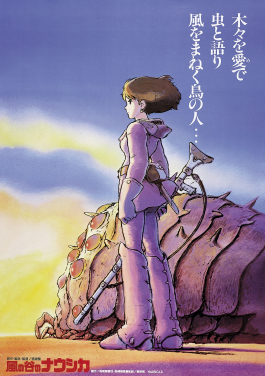

宫崎骏早期的生态寓言。娜乌西卡走进腐海，比后来的很多片更硬。
:::

:::card{title="哈尔的移动城堡" href="https://zh.wikipedia.org/wiki/哈爾移動城堡" score="5" label="动画电影"}
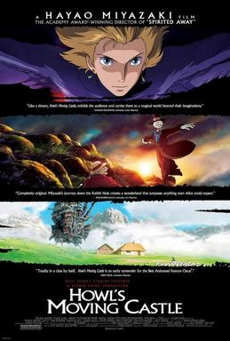

城堡在荒野上走。苏菲和哈尔的关系不吵完，屋子也不会稳。
:::

:::card{title="千与千寻" href="https://zh.wikipedia.org/wiki/千與千尋" score="5" label="动画电影"}
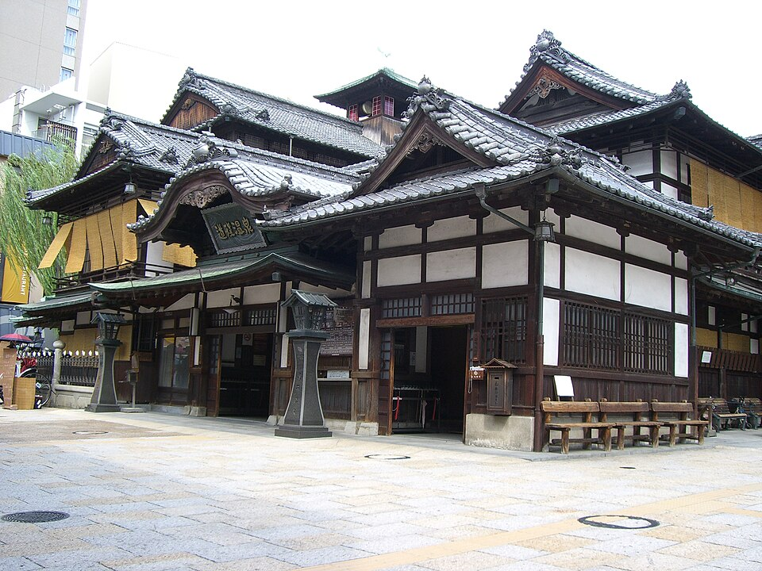

女孩在神隐的浴场打工。规则奇怪，成长却很具体。
:::

:::card{title="红猪" href="https://zh.wikipedia.org/wiki/紅豬" score="5" label="动画电影"}

不愿再做人的飞行员。天空、情敌和那点厌世都轻，也都不假。
:::

:::card{title="天空之城" href="https://zh.wikipedia.org/wiki/天空之城" score="5" label="动画电影"}

漂浮的拉普达。冒险片的骨架，飞行和毁灭都还记得住。
:::

:::card{title="幽灵公主" href="https://zh.wikipedia.org/wiki/魔法公主" score="5" label="动画电影"}

人和森林没有简单的对错。阿席达卡夹在中间，结局也不哄人。
:::

:::card{title="秒速五厘米" href="https://zh.wikipedia.org/wiki/秒速5公分" score="5" label="动画电影"}
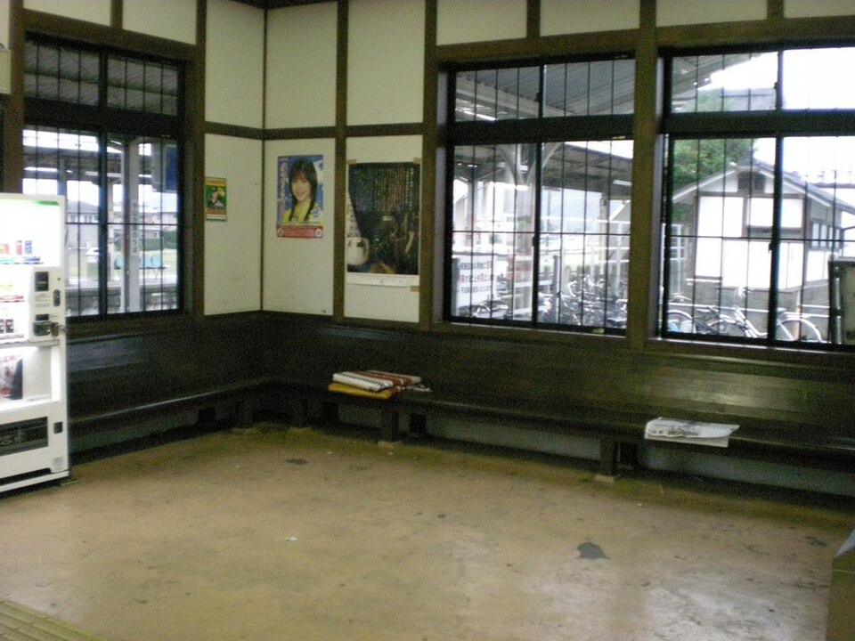

新海诚早期的错过。火车、樱花和一封没送到的信。
:::

:::card{title="八仙" href="https://zh.wikipedia.org/wiki/八仙！" score="4" label="动画电影"}
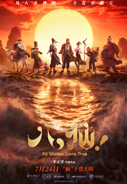

把八仙做成公路片。神仙也会吵架、也会把事情搞砸。
:::
