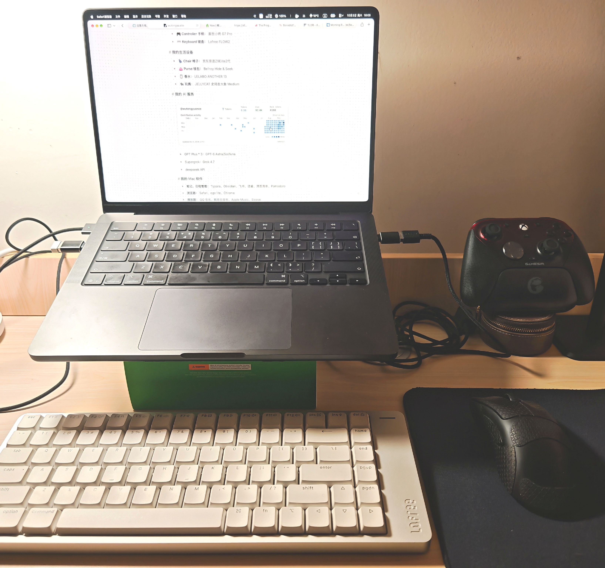
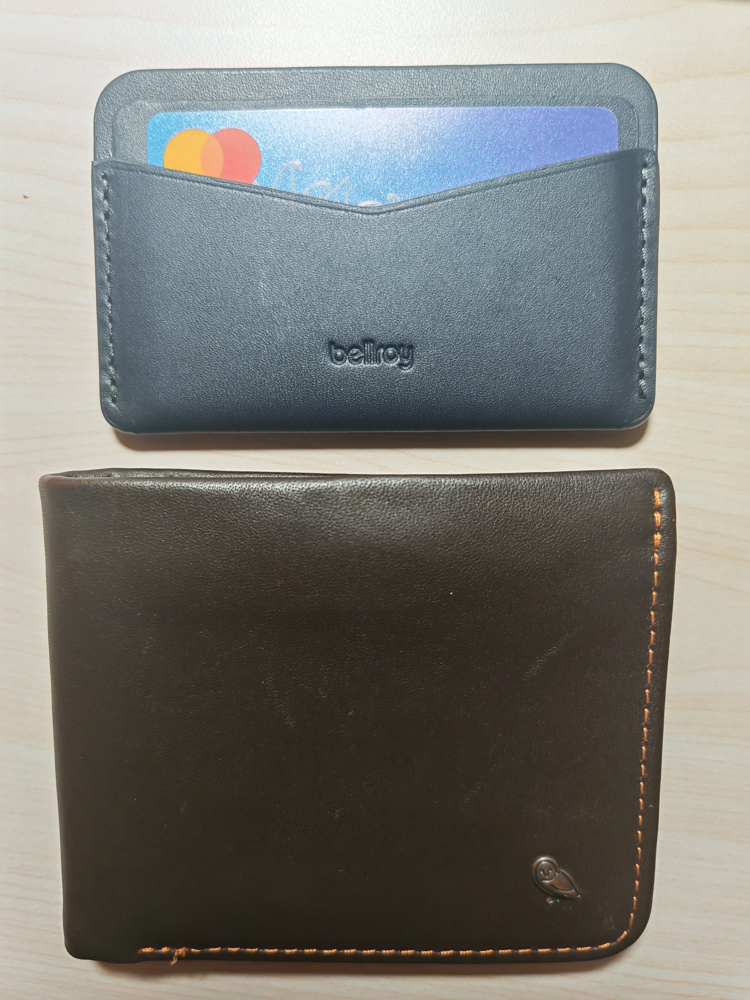
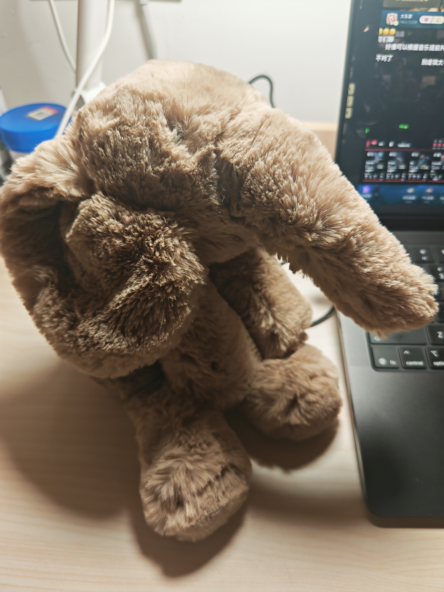
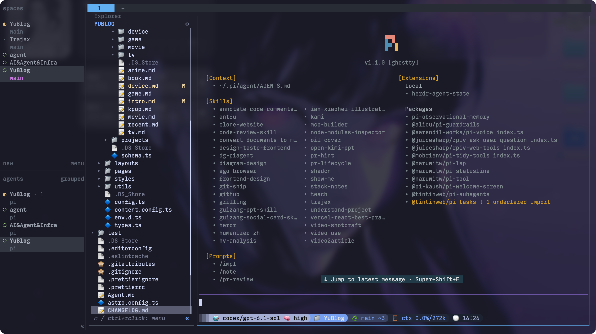

### 我的电子设备

- **💻 PC 电脑：** Macbook Pro M5 24+512、天选4 r9 4070 16+1T（AX210 网卡）、Samsung T7 固态 1T
- **🖥 显示器：** SANC 盛色 S65 24.5 英寸 2K320Hz FastIPS
- **📱 Phone 手机：** Honor Magic7 24+512、小米金沙江磁吸充电宝
- **🎧 Headphones 耳机 / Audio 音响：** Airpods Pro 2、ARPTICAL 拉斐尔 + EPZ TP35 Pro、Sony SRS-XB100
- **🖱️ Mouse 鼠标：** Razer V3pro、Logi M650
- **⬛️ Mouse Pad 鼠标垫：** D-GLOW【究】
- **🎮 Controller 手柄：** 盖世小鸡 G7 Pro
- **⌨️ Keyboard 键盘：** Lofree FLOW2

### 我的生活设备

- **💺 Chair 椅子：** 京东京造Z9Elite2代

- **👛 Purse 钱包：** Bellroy Hide & Seek 深咖色、Bellroy Card Slip 海军蓝

  

- **🫙 香水：** LELABO ANOTHER 13

- **🐘 玩偶：** JELLYCAT 史玛吉大象 Medium

  

### 我的 AI 服务

* GPT Plus * 3：GPT-6-Astra、GPT-6.1-Sol、GPT-6-luna

* Supergrok：Grok-4.7

* Deepseek API：Deepseek V4.1 Flash

### 会员订阅

* qq 音乐
* apple music
* b 站年会
* vpn
* netflix：已停

### 我的 Mac 软件

- **AI&Agent：** [ChatGPT](https://chatgpt.com/)、
  - [Paseo](https://paseo.sh/)、[Memoh](https://memoh.ai/)
  - [Ghostty](https://ghostty.org/) + [herdr](https://github.com/herdrdev/herdr)（插件：[herdr-sidebar](https://github.com/alexarthurs/herdr-sidebar)） + [pi](https://github.com/earendil-works/pi)（插件：[我的 pi-extensions](https://github.com/wutongyuonce/pi-extensions)）
    
  - [Magpie](https://usemagpie.ai/)（模型路由）、[Nowdex](https://nowdex.app/)（token 额度统计）、[Trajex](https://github.com/wutongyuonce/Trajex)、[cockpit tools](https://github.com/jlcodes99/cockpit-tools)
- **代码：** 
  - 编辑器：[Zed](https://zed.dev/)、[VS Code](https://code.visualstudio.com/)
  - 数据库：[Navicat](https://www.navicat.com/)、[DBX](https://dbxio.com/cn)
  - [Bruno](https://www.usebruno.com/)、[Apifox](https://apifox.com/)、[Postman](https://www.postman.com/)、[Docker](https://www.docker.com/)、[WhatThePort](https://whattheport.dev/)（端口查看器）
- **笔记、日程管理：** [Typora](https://typora.io/)、[飞书](https://www.feishu.cn/)、[语雀](https://www.yuque.com/)、[滴答清单](https://dida365.com/)、[iPromise](https://apps.apple.com/us/app/ipromise-your-ai-focus-buddy/id6756086425)（AI 番茄钟，尝试使用中）
  - [Obsidian](https://obsidian.md/)（插件：Git、Excalidraw、Advanced Tables、Adjustable Media）
- **浏览器：** [Safari](https://www.apple.com/safari/)、[ego lite](https://lite.ego.app/)、[Chrome](https://www.google.com/chrome/)
- **播放器：** [QQ 音乐](https://y.qq.com/)、[网易云音乐](https://music.163.com/)、[Apple Music](https://www.apple.com/apple-music/) + [Sleeve](https://replay.software/sleeve)、[Lyrimuse](https://yudaotor.github.io/lyrimuse/zh/)
- **社交工作：** [Telegram](https://telegram.org/)、[Discord](https://discord.com/)、 [钉钉](https://www.dingtalk.com/)、[腾讯会议](https://meeting.tencent.com/)
- **邮箱：** [网易邮箱大师](https://dashi.163.com/)
- **媒体、信息：** [Folo](https://folo.is/) + [NetNewsWire](https://netnewswire.com/)（RSS 订阅器）、[Readest](https://readest.com/)（阅读器）、[OBS](https://obsproject.com/)、[剪映专业版](https://www.capcut.cn/)（剪辑）、[ArcTime Pro](https://arctime.cn/arctime-pro.html)（字幕）、[IINA](https://iina.io/)（视频播放器）、[Downie4](https://software.charliemonroe.net/downie/)（视频下载器）、[小宇宙](https://www.xiaoyuzhoufm.com/)（播客）、[Cap](https://cap.so/)（录屏剪辑）
- **其他工具：** [RunCatNeo](https://github.com/runcat-dev/RunCatNeo)（Mac 监控）、[Deck](https://deckclip.app/)（最好用的 Mac 剪切板历史）、[PixPin](https://pixpin.com/)（截图）、[Pearcleaner](https://github.com/alienator88/Pearcleaner) / [App Cleaner](https://freemacsoft.net/appcleaner/) / [mole](https://mole.fit/zh/)（清理卸载）、[Slidepad](https://slidepad.app/)（右侧浏览器）、[TopNotch](https://topnotch.app/)（遮挡刘海）、[FineTune](https://github.com/ronitsingh10/FineTune)（音频控制）、[超级右键](https://www.irightmouse.com/)、[CleanMyKeyboard](https://apps.apple.com/us/app/cleanmykeyboard/id6468120888)、[Mos](https://mos.caldis.me/)（鼠标）、[Bob](https://bobtranslate.com/)（翻译）、[Loop](https://github.com/mrkai77/Loop)（最丝滑的分屏软件）
- **游戏：** [Steam](https://store.steampowered.com/)、[CrossOver](https://www.codeweavers.com/crossover)

### 我的手机软件

* 微信、豆包输入法
* 社交媒体：vx、qq、zfb、wb、X、ins、Substack、Github、telegram、discord、Twitch、Proton Authenticator（密钥）
* 视频影视播客小说：b站、youtube、dy、豆瓣、小宇宙、起点、番茄、LOFTER、POSTYPE、bilibili漫画、知乎、腾讯体育、咪咕、腾讯视频
* 音乐：qq音乐、wyy、apple music、spotify
* 邮箱：qq邮箱、gmail、网易邮箱
* 游戏：steam、小黑盒、oopz
* 梯子：clash verge
* 统计、日程管理：有数、滴答清单、时间日志
* 支付金融：中国/建设/招商/鄞州银行、跨境购、数字人民币、云闪付、同花顺
* 运动健康：Sigma、米家
* 交通：美团、哈啰、小遛、滴滴、曹操、高德地图、腾讯地图、googlemap、12306、12123
* 购物租房电话费快递买车：中国移动、贝壳、闲鱼、淘宝、京东、得物、淘宝闪购、大众点评、kfc、麦当劳、inm、货拉拉、pdd、转转、95分、顺丰、大麦、菜鸟、懂车帝、易车
* 旅行：携程、去哪儿、航旅纵横、爱彼迎、马蜂窝、Booking、华住会
* 学习工作：多邻国、沉浸式翻译、腾讯会议、leetcode、指南者留学、百度网盘、飞书、语雀、不背单词、欧陆词典、学信网、扫描全能王
* 就业：boss、offershow、牛牛、领英、智联招聘、脉脉、实习僧
* AI：grok、grok bot、chatgpt、kimi、deepseek、google
