准备玩：

:::card{title="影之刃零" href="https://zh.wikipedia.org/wiki/影之刃零" label="游戏"}
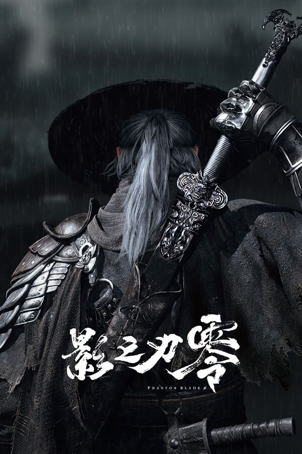

准备玩。
:::

:::card{title="巫师3重制" href="https://zh.wikipedia.org/wiki/巫师3：狂猎" label="游戏"}
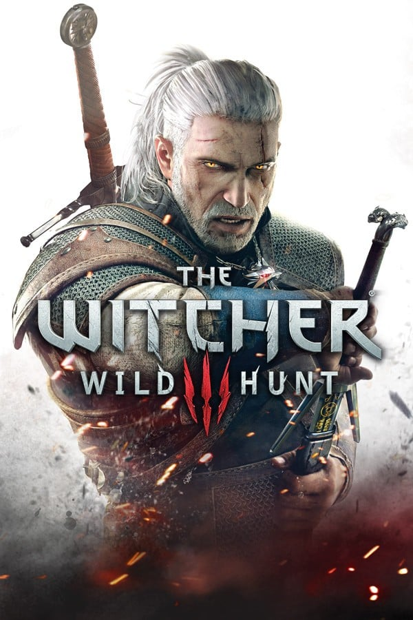

准备玩重制版。
:::

:::card{title="星露谷物语" href="https://zh.wikipedia.org/wiki/星露谷物语" label="游戏"}
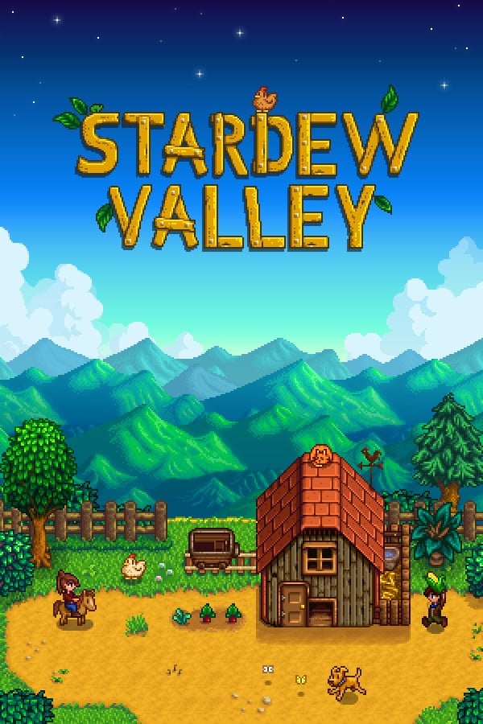

准备玩。
:::

:::card{title="艾尔登法环" href="https://zh.wikipedia.org/wiki/艾爾登法環" label="游戏"}
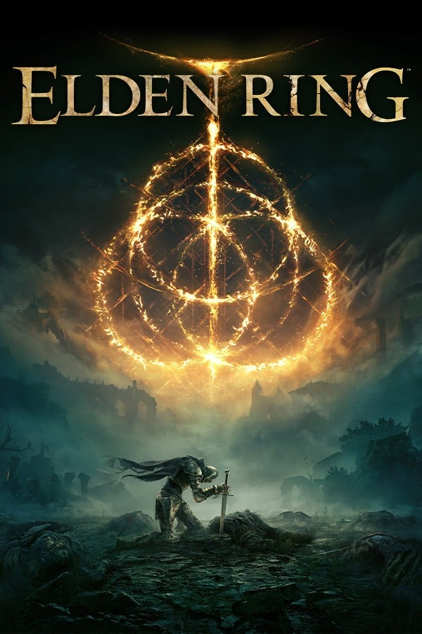

准备玩。
:::

玩过：

:::card{title="无畏契约" href="https://zh.wikipedia.org/wiki/无畏契约" score="5" label="游戏"}

五对五的战术射击。枪法要准，技能和报点也得一起练。
:::

:::card{title="反恐精英：全球攻势" href="https://zh.wikipedia.org/wiki/反恐精英：全球攻势" score="5" label="游戏"}
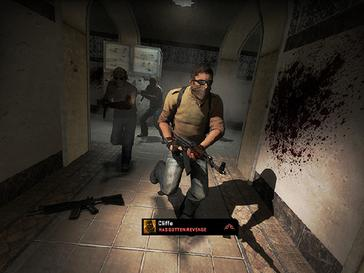

拆包和架枪的老游戏。经济局和那一声脚步仍然最纯粹。
:::

:::card{title="Apex 英雄" href="https://zh.wikipedia.org/wiki/Apex_英雄" score="5" label="游戏"}
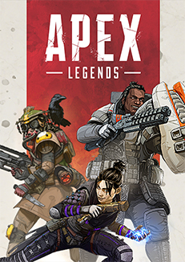

英雄大逃杀。滑铲、复活和三人配合比单人吃鸡更要紧。
:::

:::card{title="赛博朋克 2077" href="https://zh.wikipedia.org/wiki/賽博朋克2077" score="5" label="游戏"}
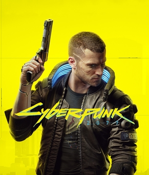

夜之城可以逛很久。主线有坑，城市和人物还是值回票。
:::

:::card{title="黑神话：悟空" href="https://zh.wikipedia.org/wiki/黑神话：悟空" score="5" label="游戏"}
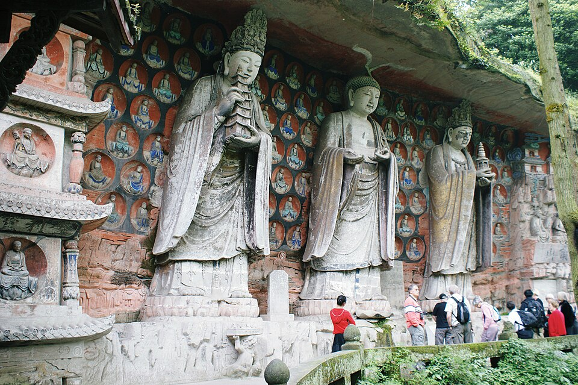

取经路上的动作游戏。场景和棍子都狠，boss 也真的要学。
:::

:::card{title="小小梦魇 2" href="https://zh.wikipedia.org/wiki/小小梦魇2" score="5" label="游戏"}
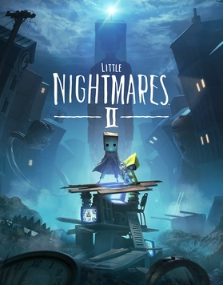

两个小孩穿过一张张坏掉的画。吓人，但同伴那只手是暖的。
:::

:::card{title="荒野大镖客：救赎 2" href="https://zh.wikipedia.org/wiki/荒野大镖客：救赎2" score="5" label="游戏"}
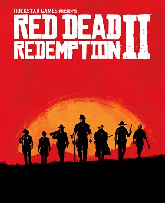

一个帮派在西部的最后几年。骑马慢，亚瑟的结局不慢。
:::

:::card{title="幽灵行者" href="https://zh.wikipedia.org/wiki/幽灵行者" score="4" label="游戏"}
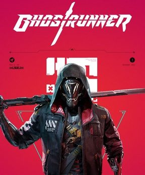

太难了，至今未通关。赛博摩托车和刀很快，死了就再来，关卡不让你糊弄。
:::

:::card{title="欧洲卡车模拟 2" href="https://zh.wikipedia.org/wiki/欧洲卡车模拟2" score="4" label="游戏"}

按时把货送到。风景和电台比刺激重要，开长途会静下来。
:::

:::card{title="生化危机 2" href="https://zh.wikipedia.org/wiki/生化危机2" score="4" label="游戏"}
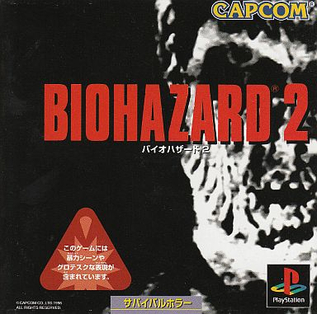

重制后的浣熊市。警察局那一圈仍然紧，弹药也仍然不够。
:::

:::card{title="生化危机 3" href="https://zh.wikipedia.org/wiki/生化危机3_重制版" score="4" label="游戏"}
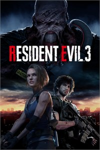

追踪者追着吉尔跑。比 2 短，追逐的压力是真的。
:::

:::card{title="生化危机 4" href="https://zh.wikipedia.org/wiki/生化危机4" score="5" label="游戏"}
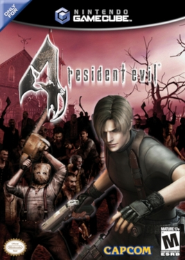

里昂去救总统女儿。村子、城堡和那套超肩射击到现在还好用。
:::

:::card{title="生化危机 7" href="https://zh.wikipedia.org/wiki/生化危机7" score="4" label="游戏"}
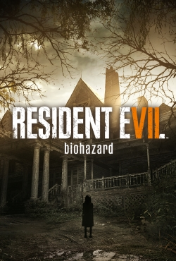

第一人称走进贝克家。恐怖从枪战改成屋子里的家人。
:::

:::card{title="极限竞速：地平线 4" href="https://zh.wikipedia.org/wiki/极限竞速_地平线4" score="5" label="游戏"}
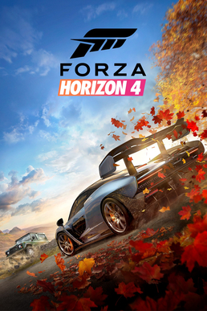

英国四季都在变。节日赛和开放地图，开车本身就够玩。
:::

:::card{title="极限竞速：地平线 5" href="https://zh.wikipedia.org/wiki/极限竞速_地平线5" score="5" label="游戏"}
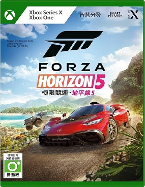

换到墨西哥。地图更大，车仍然好开，探索比赢比赛爽。
:::

:::card{title="双人成行" href="https://zh.wikipedia.org/wiki/双人成行" score="4" label="游戏"}
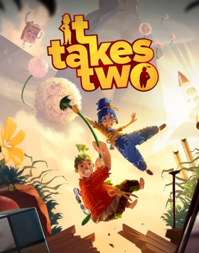

必须两个人一起玩。每一关换一种关系，吵架和配合都算内容。
:::
