:::card{title="生化危机：爆发夜" href="https://zh.wikipedia.org/wiki/恶灵古堡：爆发夜" score="3" label="电影"}
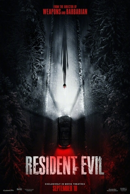

2026 年重启的生化危机。看到最后快被气死了 hhh
:::

:::card{title="疯狂的石头" href="https://zh.wikipedia.org/wiki/疯狂的石头" score=" 4.5" label="电影"}
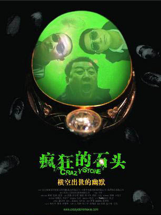

宁浩 2006 年的黑色喜剧。一块翡翠把厂长、小偷和骗子卷进同一场互相算计，台词和巧合都收得很紧。
:::

:::card{title="给阿嬷的情书" href="https://zh.wikipedia.org/wiki/给阿嬷的情书" score="5" label="电影"}

蓝鸿春 2026 年的电影，讲潮汕侨批和一封写给阿嬷的信，素人主演，拍的是下南洋那一代人留下的家书。
:::

:::card{title="唐人街探案" href="https://zh.wikipedia.org/wiki/唐人街探案" score="5" label="电影"}
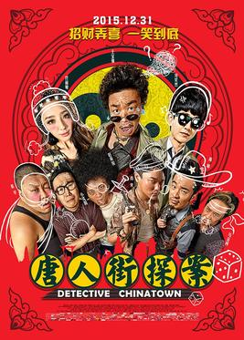

陈思诚的喜剧探案。秦风靠观察和脑补拆案，笑点和案情绑在一起，节奏很快。
:::

:::card{title="我不是药神" href="https://zh.wikipedia.org/wiki/我不是药神" score="5" label="电影"}
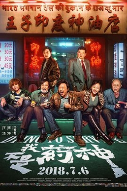

徐峥饰演的神油店老板代购仿制药。前半段是市井喜剧，后半段把救命药的价钱压到人身上。
:::

:::card{title="小偷家族" href="https://zh.wikipedia.org/wiki/小偷家族" score="4.5" label="电影"}

是枝裕和拍的一组没有血缘、却靠彼此过活的人。家里很挤，关系却比许多正规家庭更真。
:::

:::card{title="寄生虫" href="https://zh.wikipedia.org/wiki/寄生上流" score="4" label="电影"}

奉俊昊的阶级寓言。穷人家整户潜入富豪宅邸，前半像骗局喜剧，后半彻底翻面。
:::

:::card{title="分手的决心" href="https://zh.wikipedia.org/wiki/分手的决心" score="4" label="电影"}
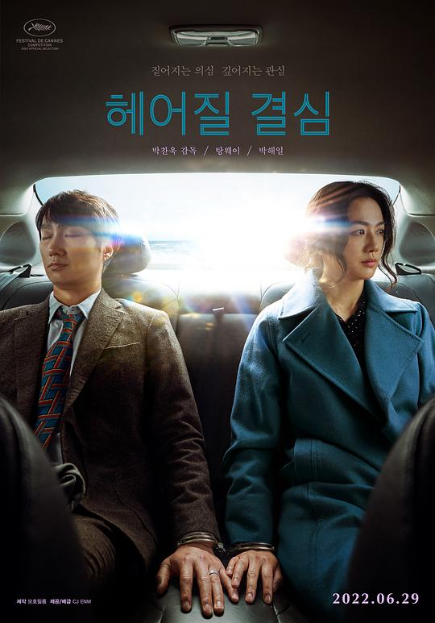

朴赞郁的爱情悬疑。刑警爱上嫌疑人，画面冷，感情却缠得很紧。
:::

:::card{title="如花束般的恋爱" href="https://zh.wikipedia.org/wiki/她和他的戀愛花期" score="4" label="电影"}

一对从学生时代走到职场的恋人。花束期很甜，后面是生活把两个人慢慢拉开。
:::

:::card{title="惊天魔盗团" href="https://zh.wikipedia.org/wiki/出神入化" score="4" label="电影"}
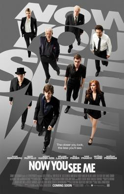

一群魔术师用大型魔术抢劫。机关和反转是主菜，看的就是「刚才那一下怎么做到的」。
:::

:::card{title="这个杀手不太冷" href="https://zh.wikipedia.org/wiki/这个杀手不太冷" score="4" label="电影"}
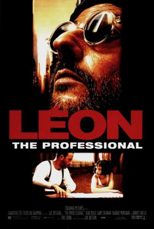

莱昂和邻居小女孩的故事。杀手戏冷，两个人的相处却很暖。
:::

:::card{title="环太平洋" href="https://zh.wikipedia.org/wiki/环太平洋_(电影)" score="4" label="电影"}
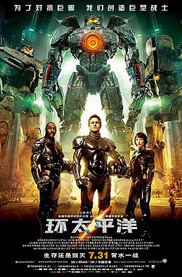

巨型机甲打海怪。剧情不复杂，驾驶舱里两个人同步出拳的场面很过瘾。
:::

:::card{title="奥德赛" href="https://zh.wikipedia.org/wiki/奥德赛_(电影)" score="5" label="电影"}
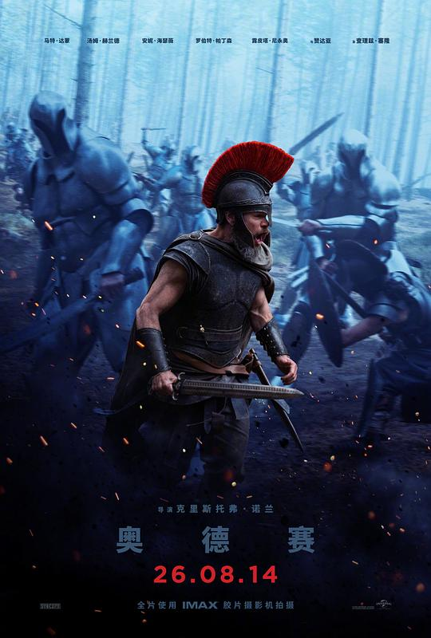

按荷马史诗拍的远征。航程、神意和回家的执念压在一起，场面很大。
:::

:::card{title="奥本海默" href="https://zh.wikipedia.org/wiki/奥本海默_(电影)" score="5" label="电影"}

诺兰拍原子弹之父。听证会和试验场来回切，人被自己造出来的东西压住。
:::

:::card{title="阿凡达" href="https://zh.wikipedia.org/wiki/阿凡达" score="4.5" label="电影"}
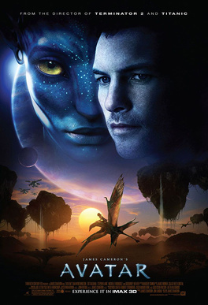

卡梅隆的潘多拉。故事是老桥段，森林、飞行和尺度仍然值得进影厅。
:::

:::card{title="沙丘" href="https://zh.wikipedia.org/wiki/沙丘_(2021年電影)" score="4.5" label="电影"}

维伦纽瓦的沙丘。声音和沙漠都很大，命运压在一个还没准备好的人身上。
:::

:::card{title="F1：狂飙飞车" href="https://zh.wikipedia.org/wiki/F1：狂飙飞车" score="5" label="电影"}
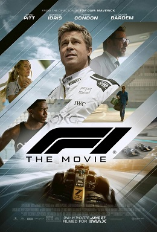

围着一级方程式拍的竞速片。车手、车队和弯道都按真比赛的密度来。
:::

:::card{title="速度与激情" href="https://zh.wikipedia.org/wiki/速度与激情" score="4.5" label="电影"}
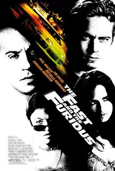

一家人飙车的长系列。第五部最爱，后面越拍越夸张，但还是冲着那股义气去看。
:::

:::card{title="我是谁：没有绝对安全的系统" href="https://zh.wikipedia.org/wiki/我是谁：没有绝对安全的系统" score="4.5" label="电影"}
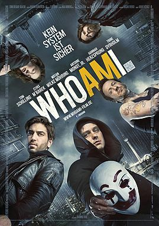

德国黑客片。一个人撞进情报系统，追杀和敲键盘交替，节奏很紧。
:::

:::card{title="蜘蛛侠" href="https://zh.wikipedia.org/wiki/蜘蛛侠" score="4.5" label="电影"}
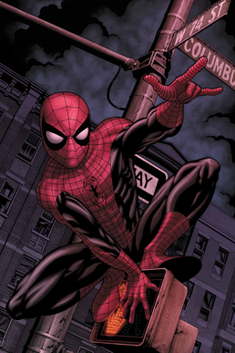

新三部加动画一起算。邻家小子的责任感和几条宇宙线叠在一起，仍然是最想重看的超英。
:::

:::card{title="毒液" href="https://zh.wikipedia.org/wiki/毒液" score="4.5" label="电影"}
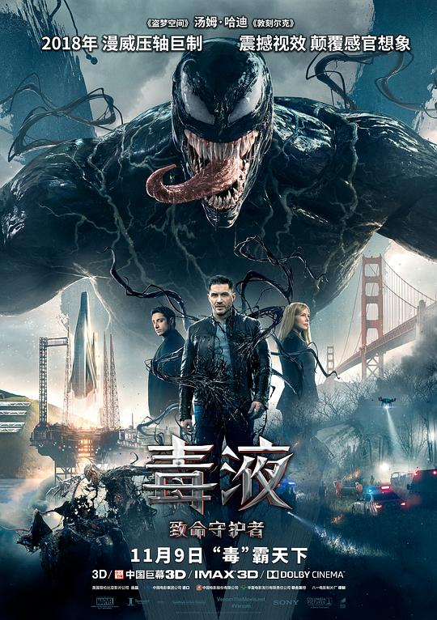

记者和共生体吵着过日子。吓人的部分不多，两个人抢身体的笑点更记得住。
:::

:::card{title="美国队长" href="https://zh.wikipedia.org/wiki/美国队长" score="4" label="电影"}

一个从二战走到现代的士兵。正经，但队形和选择都站得住。
:::

:::card{title="黑豹" href="https://zh.wikipedia.org/wiki/黑豹_(電影)" score="4" label="电影"}
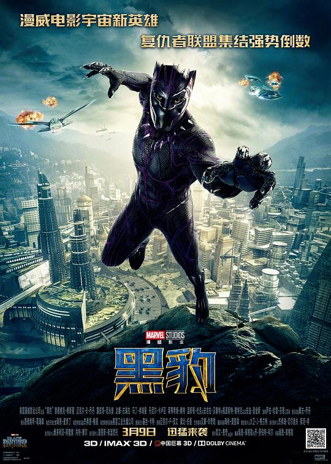

瓦坎达的王位和外界撞在一起。国度的样子比打戏更记得住。
:::

:::card{title="复仇者联盟" href="https://zh.wikipedia.org/wiki/复仇者联盟" score="4.5" label="电影"}
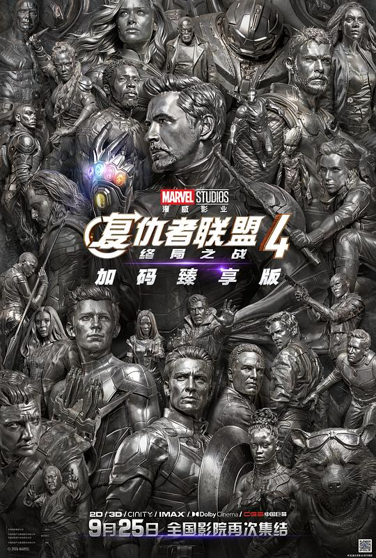

一群人终于站到同一场战役里。看的是集合，不是某一句台词。
:::

:::card{title="雷神" href="https://zh.wikipedia.org/wiki/雷神_(电影)" score="3" label="电影"}

神落到人间再找回锤子。场面有，人物比较直，打完就过去了。
:::

:::card{title="钢铁侠" href="https://zh.wikipedia.org/wiki/钢铁侠" score="5" label="电影"}
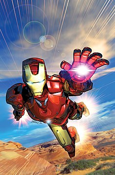

托尼·斯塔克用盔甲把漫威这条线打开。嘴贫，但工坊里那一身盔甲仍然最好看。
:::

:::card{title="奇异博士" href="https://zh.wikipedia.org/wiki/奇异博士" score="3.5" label="电影"}
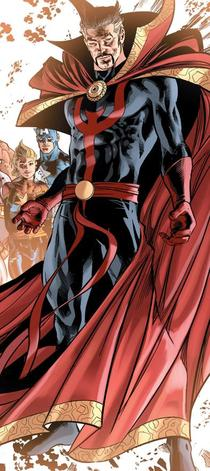

外科医生转去学魔法。视觉在转，故事比较常规。
:::

:::card{title="蚁人" href="https://zh.wikipedia.org/wiki/蚁人" score="4" label="电影"}
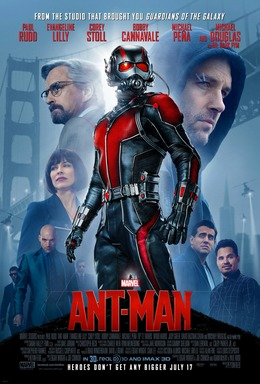

把盗窃片缩进微观世界。笑话和尺寸反差比史诗感更对味。
:::

:::card{title="银河护卫队" href="https://zh.wikipedia.org/wiki/银河护卫队" score="4.5" label="电影"}
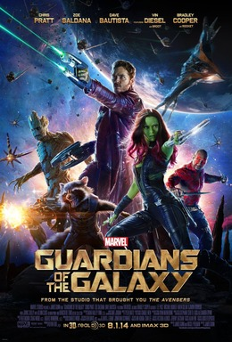

一船不合拍的人靠歌单绑在一起。热闹，也有一点真感情。
:::

:::card{title="死侍" href="https://zh.wikipedia.org/wiki/死侍" score="4" label="电影"}
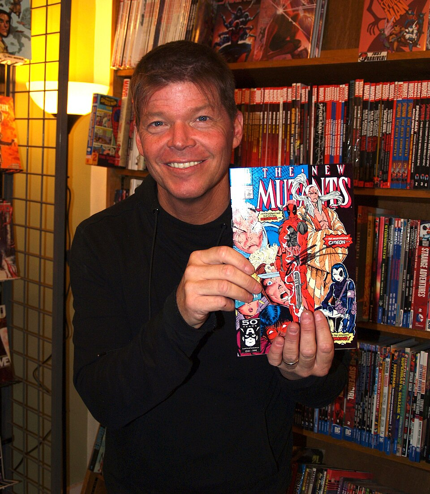

打破第四面墙的佣兵。脏话和自嘲很多，动作也确实利落。
:::
