正在看：

:::card{title="流人第六季" href="https://zh.wikipedia.org/wiki/流人" label="英剧"}

正在看。
:::

准备看：

:::card{title="谜探路德维希" href="https://en.wikipedia.org/wiki/Ludwig_(2024_TV_series)" label="英剧"}
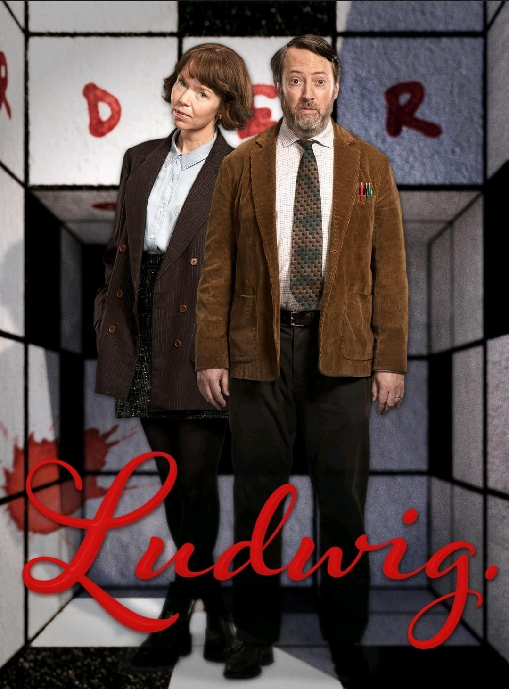

准备看第一季。
:::

:::card{title="曼达洛人" href="https://zh.wikipedia.org/wiki/曼達洛人_(電視劇)" label="美剧"}
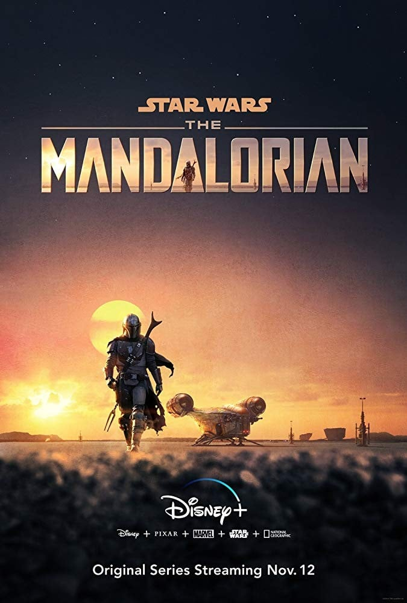

准备看前三季。
:::

:::card{title="洛基" href="https://zh.wikipedia.org/wiki/洛基_(電視劇)" label="美剧"}
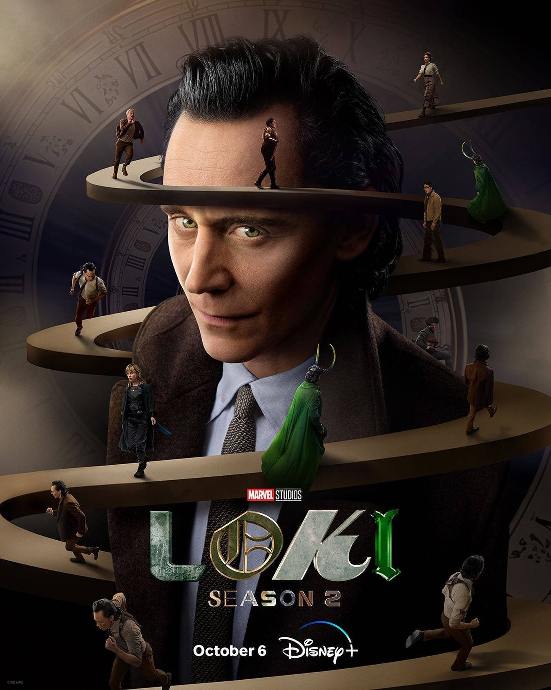

准备看前两季。
:::

:::card{title="匹兹堡医护前线" href="https://en.wikipedia.org/wiki/The_Pitt_(TV_series)" label="美剧"}
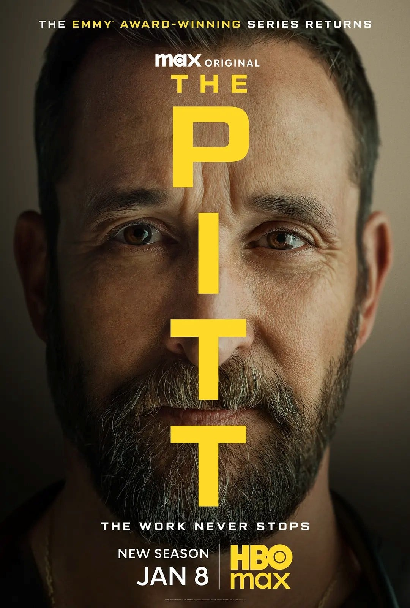

准备看前两季。
:::

美剧：

:::card{title="怪奇物语" href="https://zh.wikipedia.org/wiki/怪奇物語" score="5" label="美剧"}
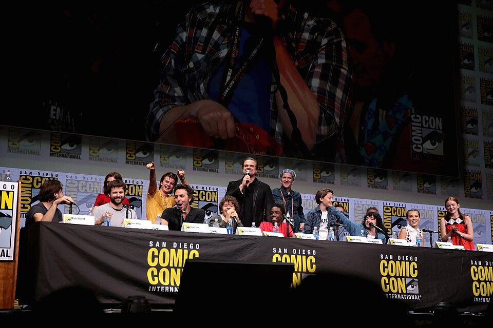

印第安纳小镇底下有另一层世界。小孩破案，大人躲事，怪谈和青春绑在一起。
:::

:::card{title="权力的游戏" href="https://zh.wikipedia.org/wiki/权力的游戏_(电视剧)" score="5" label="美剧"}
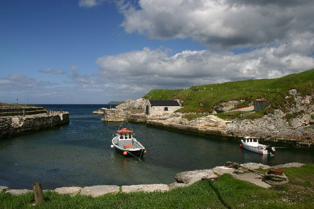

七国王座抢一张椅子。前几季的布局和人物仍然是剧集里很少见的密度。
:::

:::card{title="龙之家族" href="https://zh.wikipedia.org/wiki/龙之家族" score="5" label="美剧"}
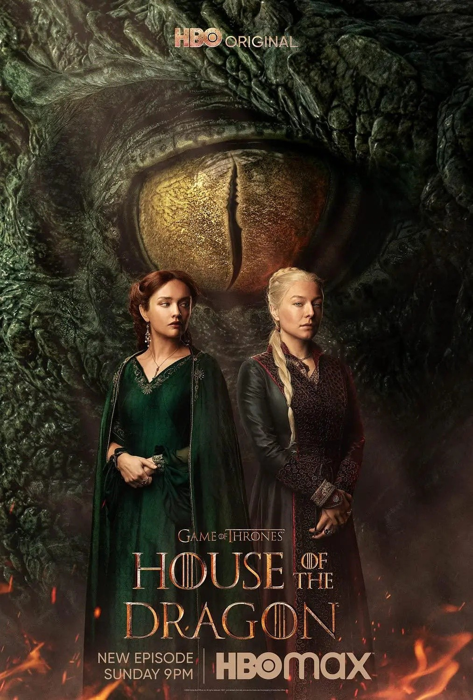

坦格利安家内战的前史。龙、继承和家族会议，场面比后几季的权游更稳。
:::

:::card{title="七王国的骑士" href="https://zh.wikipedia.org/wiki/七王國的騎士_(電視劇)" score="5" label="美剧"}
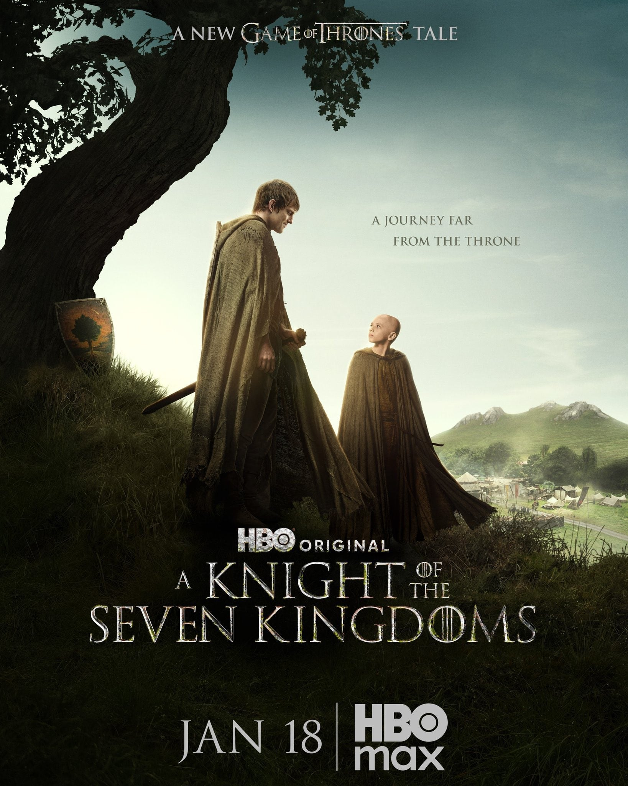

权游世界里更早的一篇骑士故事。比夺权轻一点，比比武和誓言重一点。
:::

:::card{title="绝命毒师" href="https://zh.wikipedia.org/wiki/绝命毒师" score="5" label="美剧"}
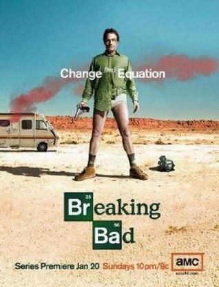

化学老师走进制毒。每季都在把一个还想当好人的人往前推一格，和风骚律师放一起打分。
:::

:::card{title="风骚律师" href="https://zh.wikipedia.org/wiki/风骚律师" score="5" label="美剧"}

绝命毒师的前传。吉米怎么变成索尔，看得比案件本身更清楚。
:::

:::card{title="星期三" href="https://zh.wikipedia.org/wiki/星期三_(电视剧)" score="5" label="美剧"}
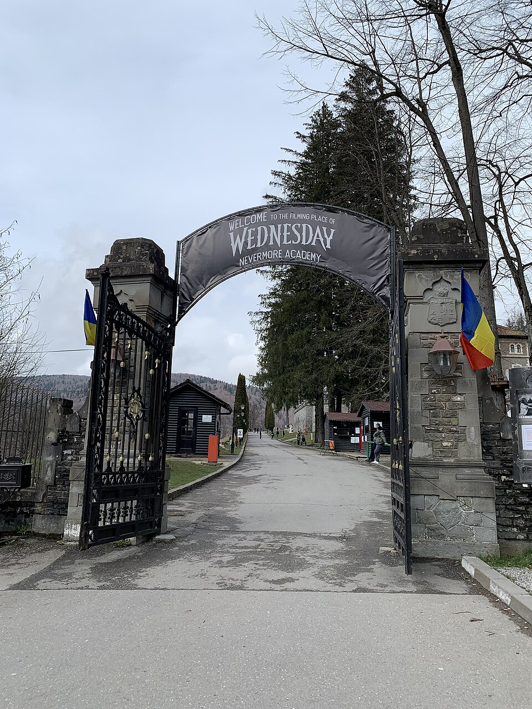

亚当斯家的女儿去怪物学校。冷脸、调查和舞会意外地搭。
:::

:::card{title="纸牌屋" href="https://zh.wikipedia.org/wiki/纸牌屋_(美国剧集)" score="5" label="美剧"}
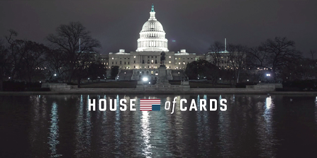

弗兰克对镜头说话，也在国会里拆人。前几季的权术很爽。
:::

:::card{title="亢奋" href="https://zh.wikipedia.org/wiki/亢奋" score="5" label="美剧"}
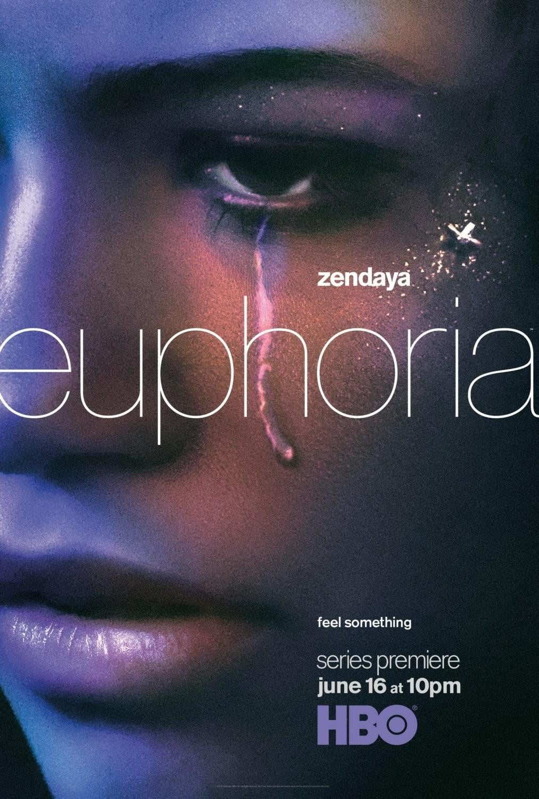

一群高中生的派对、性和焦虑。镜头很冲，人物却不是符号。
:::

:::card{title="毒枭" href="https://zh.wikipedia.org/wiki/毒梟_(電視劇)" score="4" label="美剧"}
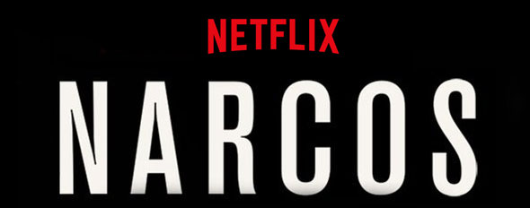

埃斯科瓦尔和后来墨西哥线的贩毒史。暴力直给，人物也立得住。
:::

:::card{title="冰血暴" href="https://zh.wikipedia.org/wiki/冰血暴_(电视剧)" score="4" label="美剧"}
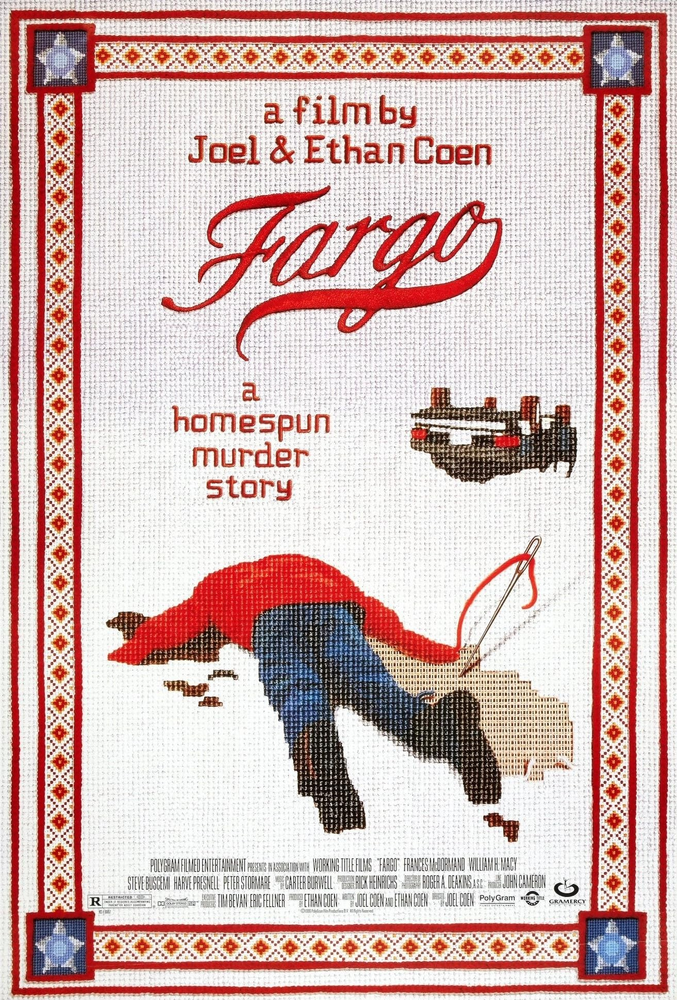

柯恩兄弟味道的犯罪剧。小城、蠢案和突然爆开的暴力。
:::

:::card{title="饥饿游戏" href="https://zh.wikipedia.org/wiki/饥饿游戏" score="4" label="美剧"}
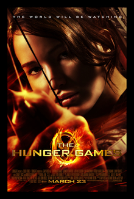

把少年扔进秀场竞技。生存赛是壳，看的是镜头怎么把人变成节目。
:::

:::card{title="爱死机" href="https://zh.wikipedia.org/wiki/愛x死x機器人" score="5" label="美剧"}
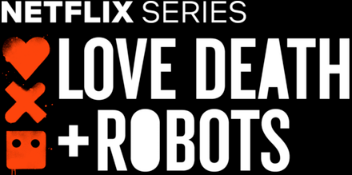

每集一个短篇，科幻、恐怖和冷笑话换着来。有几集会留下来，有几集看完就走。
:::

:::card{title="老友记" href="https://zh.wikipedia.org/wiki/老友记" score="5" label="美剧"}

六个人挤在纽约的咖啡馆和公寓里。笑话老，但那间屋子还是想回去坐坐。
:::

:::card{title="瑞克与莫蒂" href="https://zh.wikipedia.org/wiki/瑞克和莫蒂" score="5" label="美剧"}
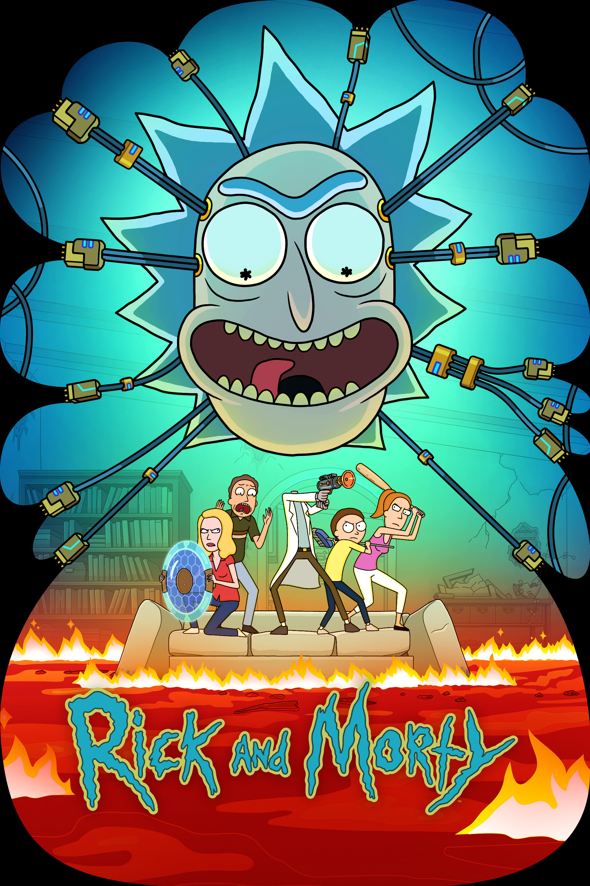

祖父带孙子穿宇宙。段子很密，偶尔会突然认真一下。
:::

:::card{title="最后生还者" href="https://zh.wikipedia.org/wiki/最后生还者" score="4" label="美剧"}
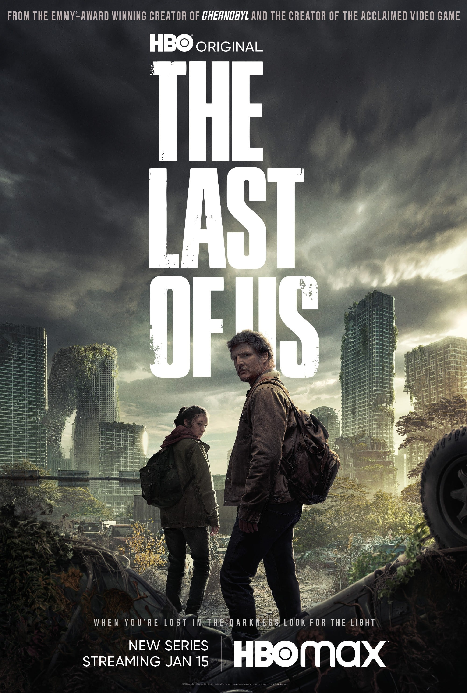

末日里一个男人和一个女孩赶路。感染体是背景，关系才是每集的重量。
:::

:::card{title="东京罪恶" href="https://zh.wikipedia.org/wiki/东京罪恶" score="4" label="美剧"}
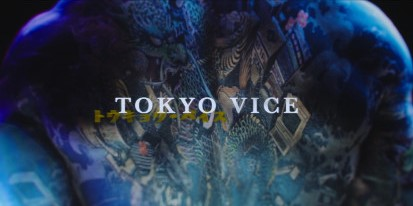

记者撞进东京黑社会。夜色和规矩都冷，追查过程很稳。
:::

英剧：

:::card{title="浴血黑帮" href="https://zh.wikipedia.org/wiki/浴血黑帮" score="5" label="英剧"}
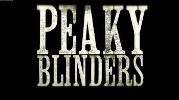

谢尔比家族在伯明翰做生意，也做暴力。剪裁、音乐和那顶帽子都记得住。
:::

:::card{title="豺狼的日子" href="https://zh.wikipedia.org/wiki/豺狼的日子" score="5" label="英剧"}
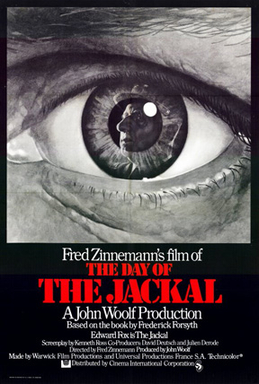

一个职业杀手接下一单几乎不可能的目标。筹备比开枪更紧张。
:::

:::card{title="流人" href="https://zh.wikipedia.org/wiki/流人" score="5" label="英剧"}

一群被流放的情报员还在干活。兰姆的刻薄和每季的案子一样好看。
:::

德剧：

:::card{title="暗黑" href="https://zh.wikipedia.org/wiki/暗黑_(电视剧)" score="5" label="德剧"}
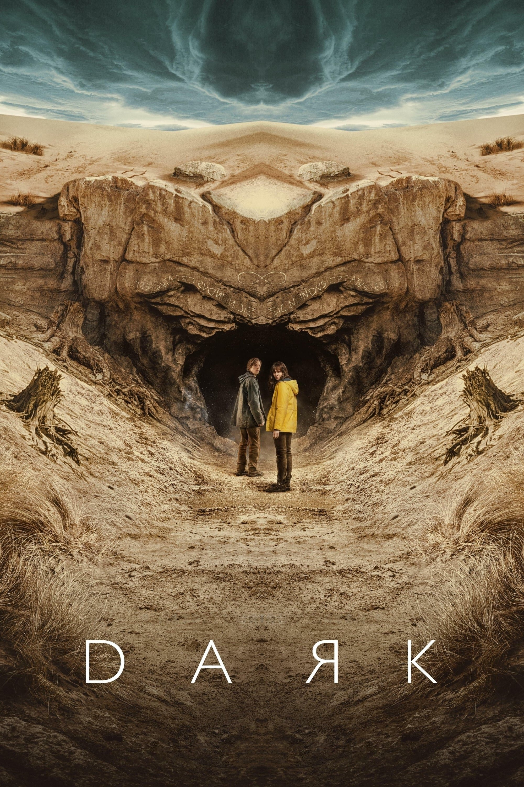

德国小镇的时间循环。家族树比怪物更难，三季收得也很完整。
:::

韩剧：

:::card{title="我的大叔" href="https://zh.wikipedia.org/wiki/我的大叔" score="5" label="韩剧"}
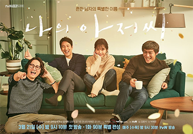

IU 和三个叔叔的生活剧。很静，欠债、加班和一句关心都有重量。
:::

:::card{title="苦尽甘来遇见你" href="https://zh.wikipedia.org/wiki/苦尽柑来遇见你" score="5" label="韩剧"}
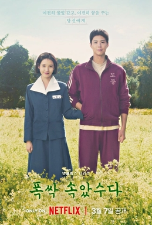

济州岛上几十年的爱和失去。IU 把一个女人的后半生演得很满。
:::

:::card{title="德鲁纳酒店" href="https://zh.wikipedia.org/wiki/德魯納酒店" score="4" label="韩剧"}
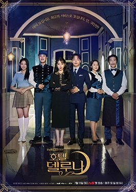

酒店里住着鬼，老板是月神。奇幻壳子，感情线很直。
:::

:::card{title="21世纪大君夫人" href="https://zh.wikipedia.org/wiki/21世紀大君夫人" score="4" label="韩剧"}
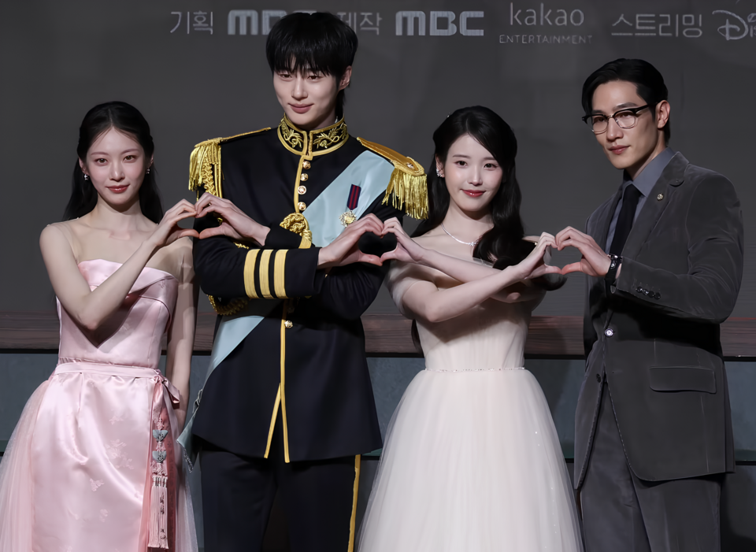

设定在实行君主立宪制的现代韩国，财阀继承人与王室大君的爱情故事。
:::

:::card{title="酒鬼都市女人们" href="https://zh.wikipedia.org/wiki/酒鬼都市女人们" score="5" label="韩剧"}

三个女人喝酒、工作、把日子过下去。对话很活，没有硬煽。
:::

:::card{title="善意的竞争" href="https://zh.wikipedia.org/wiki/善意的競爭" score="4" label="韩剧"}
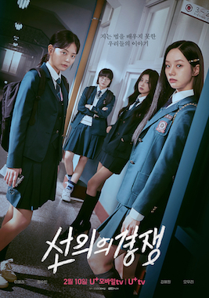

医学院里的友谊和排挤。竞争写得尖，人还没被写成纯坏人。
:::

:::card{title="黑暗荣耀" href="https://zh.wikipedia.org/wiki/黑暗荣耀" score="5" label="韩剧"}
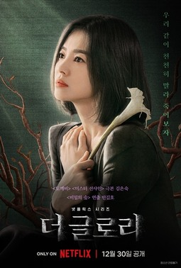

被霸凌的人很多年后回来。复仇很慢，每一季都在还那笔账。
:::

:::card{title="请回答1988" href="https://zh.wikipedia.org/wiki/请回答1988" score="4" label="韩剧"}
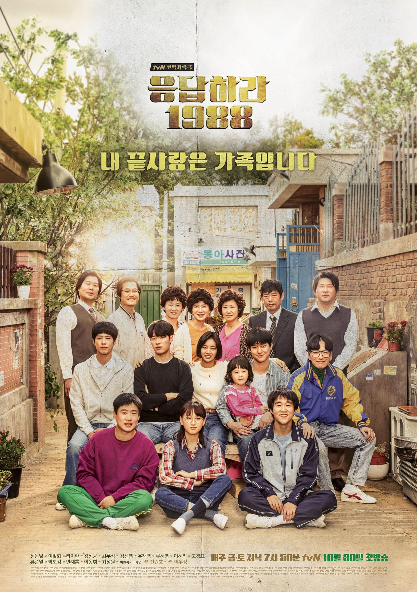

双门洞的一条街。邻居比剧情重要，看完会想回家吃饭。
:::

国产剧：

:::card{title="人世间" href="https://zh.wikipedia.org/wiki/人世间_(电视剧)" score="4" label="国产剧"}
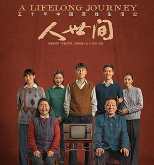

周家三兄妹过了几十年。很长，但把一个家庭怎么被时代推着走写清楚了。
:::

:::card{title="唐人街探案" href="https://zh.wikipedia.org/wiki/唐人街探案_(網絡劇)" score="4" label="国产剧"}
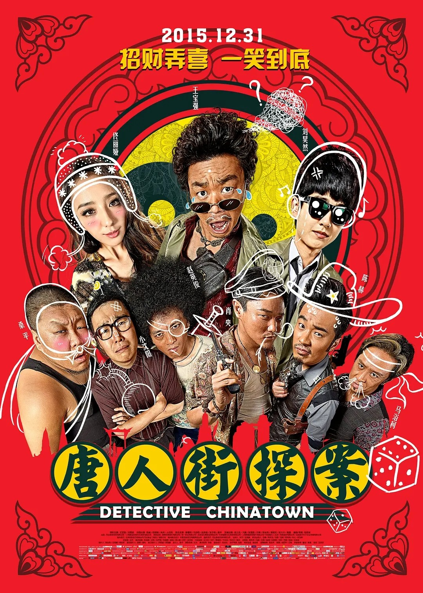

网剧版的秦风探案。案子一桩接一桩，还是靠观察和嘴贫往前推。
:::

:::card{title="人民的名义" href="https://zh.wikipedia.org/wiki/人民的名义" score="5" label="国产剧"}
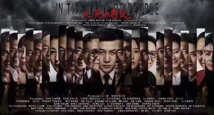

反腐剧里少见地把官场关系写细。侯亮平和那几桌饭都有信息。
:::

:::card{title="觉醒年代" href="https://zh.wikipedia.org/wiki/觉醒年代" score="4" label="国产剧"}
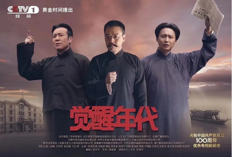

陈独秀、李大钊和青年毛泽东。观念戏多，但人是活的。
:::

:::card{title="繁花" href="https://zh.wikipedia.org/wiki/繁花_(电视剧)" score="5" label="国产剧"}
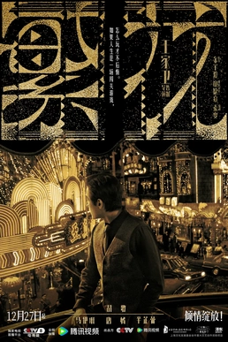

王家卫拍九十年代的上海。黄河路、宝总和一桌子本帮菜，气氛比情节密。
:::

:::card{title="隐秘的角落" href="https://zh.wikipedia.org/wiki/隐秘的角落" score="4" label="国产剧"}
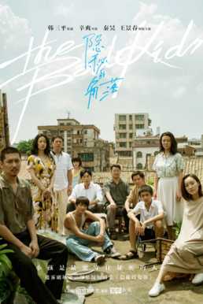

三个孩子撞见一件不该看见的事。海边小镇的悬疑收得很紧。
:::

:::card{title="沉默的真相" href="https://zh.wikipedia.org/wiki/沉默的真相" score="4" label="国产剧"}
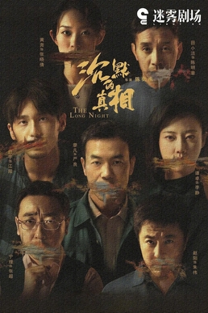

一桩案子被切成三段时间。看的是人怎么把真相一寸寸送出去。
:::

:::card{title="狂飙" href="https://zh.wikipedia.org/wiki/狂飙" score="5" label="国产剧"}
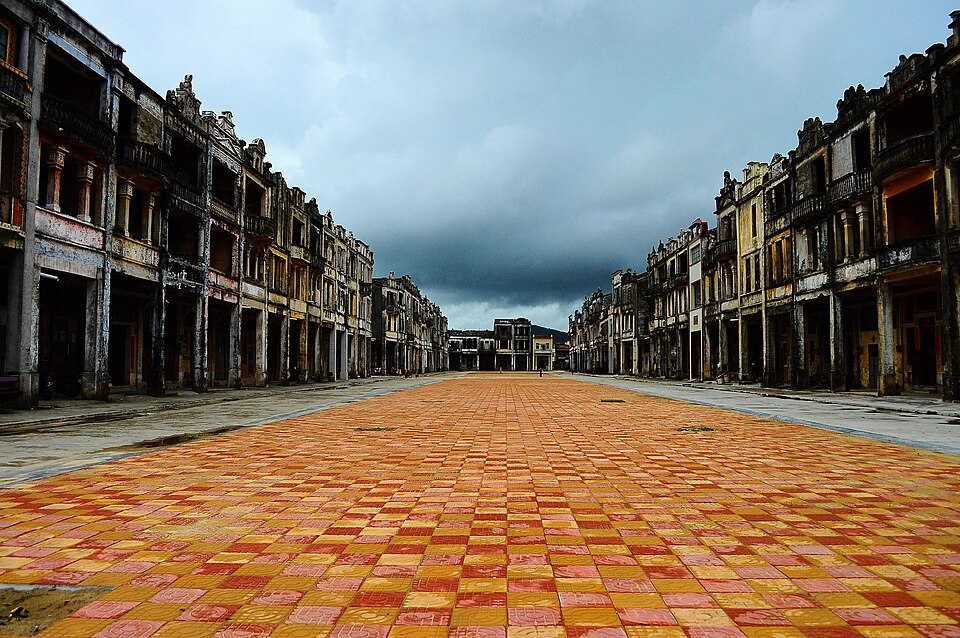

强盛集团和安欣对了二十年。黑白两线都有人，不是只靠一句口号。
:::

:::card{title="大明王朝1566" href="https://zh.wikipedia.org/wiki/大明王朝1566" score="5" label="国产剧"}
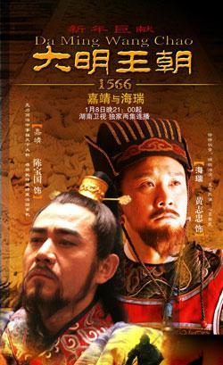

嘉靖朝的政局和丝绸。对话密，权力怎么在奏折里移动看得很清。
:::

:::card{title="梦华录" href="https://zh.wikipedia.org/wiki/梦华录" score="4" label="国产剧"}
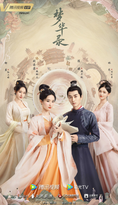

三个女人在东京开茶坊。市井和案子并行，人比朝堂好看。
:::

综艺：

:::card{title="孝利家民宿" href="https://zh.wikipedia.org/wiki/孝利家民宿" score="5" label="综艺"}
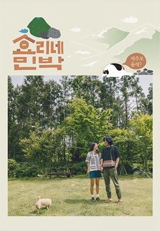

李孝利家的民宿。第一季和第二季放一起打分，客人来了就干活、吃饭、闲聊。
:::

:::card{title="克拉克森的农场" href="https://zh.wikipedia.org/wiki/克拉克森的农场" score="5" label="综艺"}
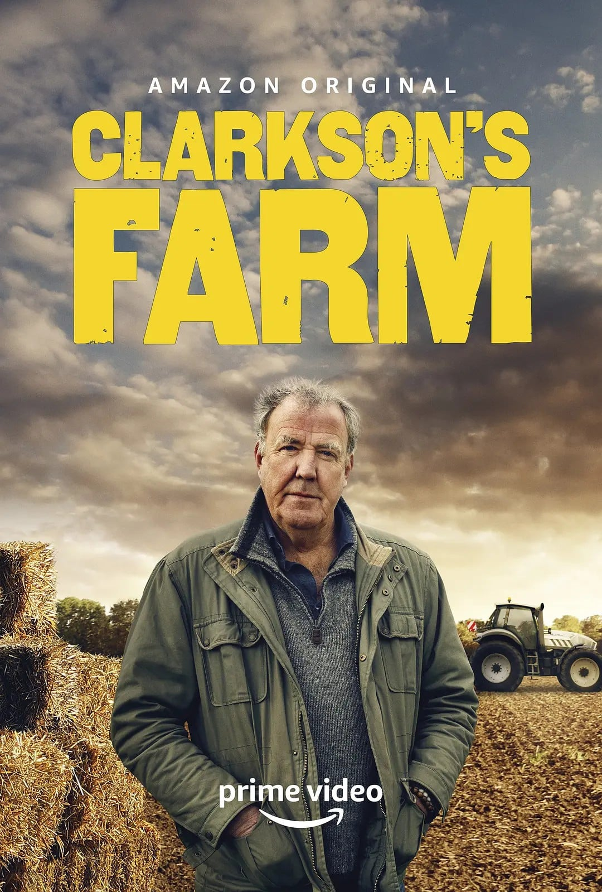

克拉克森真的去种地。拖拉机、天气和邻居比脱口秀更折腾人。
:::
